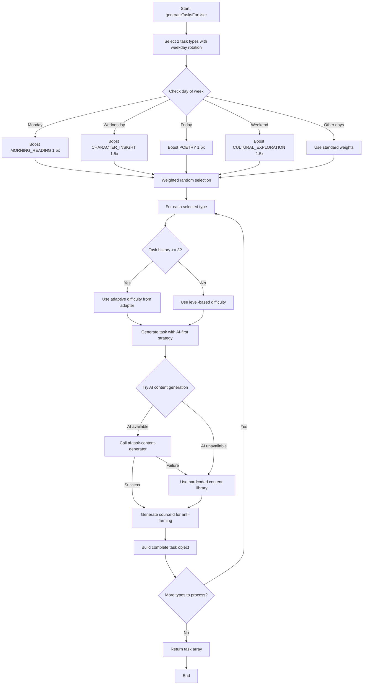
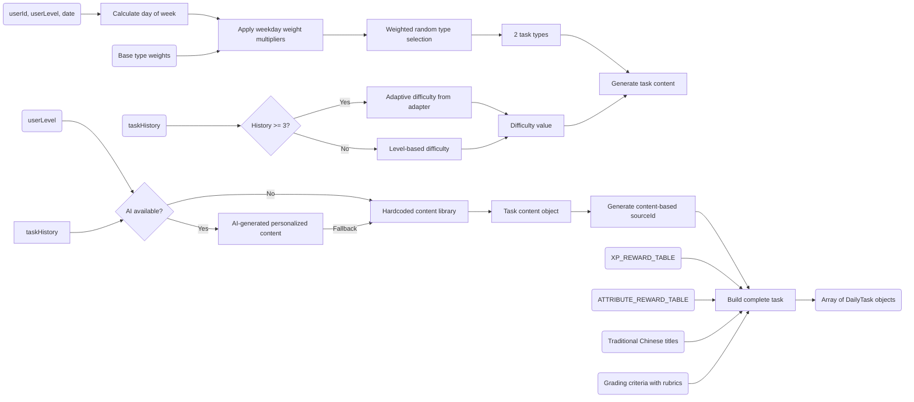

# Module: `task-generator.ts`

## 1. Module Summary

The `task-generator` module is the task content generation library for the daily task system, providing comprehensive task creation with AI-powered dynamic content generation and extensive hardcoded fallback content. This 873-line module orchestrates task type selection with weekday-based rotation (Monday→MORNING_READING, Wednesday→CHARACTER_INSIGHT, Friday→POETRY, Weekend→CULTURAL_EXPLORATION), integrates with task-difficulty-adapter for performance-based difficulty adjustment, attempts AI content generation via ai-task-content-generator, and falls back to a curated Traditional Chinese content library featuring 15 complete task variants (3 morning reading passages from Chapters 3/5/23, 3 classic poems including 葬花吟 and 好了歌, 3 character analysis prompts for Lin Daiyu/Jia Baoyu/Wang Xifeng, 3 cultural exploration quizzes covering etiquette/clothing/architecture, 3 Zhiyanzhai commentary pieces) with sourceId generation for anti-farming protection.

## 2. Module Dependencies

* **Internal Dependencies:**
  * `@/lib/types/daily-task` - Complete type definitions for tasks, content structures (TextPassage, PoemContent, CharacterPrompt, CulturalElement, CommentaryContent), task history.
  * `@/lib/types/user-level` - AttributePoints interface for reward calculations.
  * `@/lib/task-difficulty-adapter` - Adaptive difficulty determination based on performance history.
  * `@/lib/ai-task-content-generator` - GPT-5-Mini powered dynamic content generation with 24-hour caching.
* **External Dependencies:** None. Pure TypeScript logic module with no external package dependencies.

## 3. Public API / Exports

* **Class Exports:**
  * `TaskGenerator` - Main generator class managing task creation and content selection.
* **Instance Exports:**
  * `taskGenerator: TaskGenerator` - Singleton instance for global use.
* **TaskGenerator Methods:**
  * `generateTasksForUser(userId: string, userLevel: number, date: string, recentTaskIds?: string[], taskHistory?: TaskHistoryRecord[]): Promise<DailyTask[]>` - Main entry point generating 2 daily tasks with adaptive difficulty and AI content.

## 4. Code File Breakdown

### 4.1. `task-generator.ts`

* **Purpose:** Provides comprehensive task generation combining intelligent task type selection, adaptive difficulty, AI-powered personalization, and robust hardcoded fallback content. The module's design balances variety, appropriateness, and reliability: (1) **Weekday-based rotation (Phase 4.1.1)** - Applies 1.5x weight boost to specific task types based on day of week (Monday→fresh start with reading, Wednesday→mid-week character reflection, Friday→aesthetic poetry appreciation, Weekend→deeper cultural exploration), encouraging rhythmic learning patterns aligned with weekly schedules; (2) **Adaptive difficulty (Phase 4.1.2)** - Integrates with task-difficulty-adapter when user has 3+ history records, otherwise falls back to simple level-based mapping (0-2→EASY, 3-5→MEDIUM, 6-7→HARD), ensuring appropriate challenge levels; (3) **AI-first content generation (Phase 2.9.2)** - Attempts personalized content via ai-task-content-generator with user context (level, recent chapters, learning history), gracefully falling back to hardcoded content if AI unavailable; (4) **Comprehensive content library** - Maintains 15 carefully curated Traditional Chinese content pieces covering all difficulty levels and task types, ensuring system always delivers quality tasks even without AI; (5) **Anti-farming sourceId** - Generates content-based unique identifiers (e.g., `chapter-3-passage-1-10`, `poem-葬花吟`, `character-daiyu-chapter-3`) to prevent duplicate rewards across daily tasks and reading page; (6) **Rich metadata** - Each task includes Traditional Chinese titles with difficulty levels (初探紅樓/深入紅樓/透析紅樓), descriptions, time estimates (3-10 minutes), XP rewards (6-28 points based on type/difficulty), attribute rewards aligned with task focus, and detailed grading criteria with evaluation prompts.
* **Functions:**
    * `generateTasksForUser(userId: string, userLevel: number, date: string, recentTaskIds?: string[], taskHistory?: TaskHistoryRecord[]): Promise<DailyTask[]>` - **Main task generation orchestrator**. Calls `selectTaskTypes` with recentTaskIds and date for weekday-based type selection (returns 2 types based on `TASK_GENERATION_CONFIG.tasksPerDay`). Iterates selected types. For each type: (1) Determines difficulty - If taskHistory exists and length >= 3, calls `taskDifficultyAdapter.getAdaptiveDifficulty` with userLevel, taskType, history; otherwise calls `determineDifficulty` with simple level mapping. (2) Calls `generateTask` with type, difficulty, date, userLevel, taskHistory. Pushes generated task to array. Returns array of `DailyTask` objects. Entry point called by daily-task-service during task generation.
    * `determineDifficulty(userLevel: number): TaskDifficulty` - **Private simple difficulty mapper**. Returns HARD if level >= 6. Returns MEDIUM if level >= 3. Returns EASY otherwise. Fallback when insufficient history for adaptive difficulty.
    * `selectTaskTypes(recentTaskIds?: string[], date?: string): DailyTaskType[]` - **Weekday-based task type selector (Phase 4.1.1)**. Creates date object from date string or uses current date. Extracts day of week via `getDay()` (0=Sunday, 6=Saturday). Calls `getWeekdayAdjustedWeights` with dayOfWeek. Loops `TASK_GENERATION_CONFIG.tasksPerDay` times (2 iterations). Calls `weightedRandomType` with already-selected types as exclusions and adjusted weights. Pushes selected type to array. Returns array of 2 `DailyTaskType` values ensuring variety (no duplicates if `allowDuplicateTypes=false`).
    * `getWeekdayAdjustedWeights(dayOfWeek: number): Record<DailyTaskType, number>` - **Private weekday weight adjuster**. Clones base weights from `TASK_GENERATION_CONFIG.typeWeights`. Applies 1.5x multiplier based on day: (1) Monday (1) → MORNING_READING * 1.5 (fresh start, easier reentry). (2) Wednesday (3) → CHARACTER_INSIGHT * 1.5 (mid-week reflection). (3) Friday (5) → POETRY * 1.5 (aesthetic appreciation before weekend). (4) Saturday (6) or Sunday (0) → CULTURAL_EXPLORATION * 1.5 (deeper learning with more time). (5) Tuesday (2) and Thursday (4) use standard weights. Returns adjusted weight record. Encourages thematic weekly rhythm.
    * `weightedRandomType(excludeTypes: DailyTaskType[] = [], customWeights?: Record<DailyTaskType, number>): DailyTaskType` - **Private weighted random selector**. Uses customWeights if provided, otherwise base weights. Filters available types excluding already-selected types. Calculates total weight by summing available type weights. Generates random value between 0 and totalWeight. Iterates available types, subtracting weight from random value until random <= 0. Returns matched type or first available type as fallback. Implements probability distribution for task variety.
    * `generateTask(type: DailyTaskType, difficulty: TaskDifficulty, date: string, userLevel?: number, taskHistory?: TaskHistoryRecord[]): Promise<DailyTask>` - **Private single task generator (Phase 2.9.2)**. Generates taskId via `generateTaskId` (format: `${type}_${difficulty}_${date}_${random}_${timestamp}`). Calls `generateTaskContent` with type, difficulty, userLevel, taskHistory (AI-first with fallback). Generates sourceId via `generateSourceId` with type and content (anti-farming). Constructs base task object: id, type, difficulty, title from `getTaskTitle` (Traditional Chinese with difficulty level), description from `getTaskDescription`, timeEstimate from `getTimeEstimate` (3-10 minutes), xpReward from `XP_REWARD_TABLE[type][difficulty]`, attributeRewards from `ATTRIBUTE_REWARD_TABLE[type]`, sourceId, gradingCriteria from `getGradingCriteria` (includes minLength by difficulty, rubric with accuracy/depth/insight/completeness percentages, Traditional Chinese evaluationPrompt). Merges base task with content. Returns complete `DailyTask` object.
    * `generateTaskId(type: DailyTaskType, difficulty: TaskDifficulty, date: string): string` - **Private unique ID generator**. Gets current timestamp. Generates 6-character random string from base36. Returns formatted string: `${type}_${difficulty}_${date}_${random}_${timestamp}`. Example: `morning-reading_medium_2025-01-27_a8f2k9_1738012345678`. Ensures uniqueness for task tracking.
    * `generateSourceId(type: DailyTaskType, content: DailyTask['content']): string` - **Private anti-farming sourceId generator (Phase 4.4)**. Switches on task type: (1) MORNING_READING → Extracts chapter, startLine, endLine from `content.textPassage`, returns `chapter-${chapter}-passage-${startLine}-${endLine}`, fallback `unknown-passage-${timestamp}`. (2) POETRY → Extracts id from `content.poem`, returns `poem-${id}`, fallback `unknown-poem-${timestamp}`. (3) CHARACTER_INSIGHT → Extracts characterId and optional chapter from `content.character`, returns `character-${characterId}${chapterStr}` (chapterStr format: `-chapter-${chapter}` or `-general`), fallback `unknown-character-${timestamp}`. (4) CULTURAL_EXPLORATION → Extracts id from `content.culturalElement`, returns `culture-${id}`, fallback `unknown-cultural-${timestamp}`. (5) COMMENTARY_DECODE → Extracts id from `content.commentary`, returns `commentary-${id}`, fallback `unknown-commentary-${timestamp}`. Returns unique content-based identifier preventing duplicate rewards for same content across daily tasks and reading page.
    * `getTaskTitle(type: DailyTaskType, difficulty: TaskDifficulty): string` - **Private Traditional Chinese title generator**. Returns localized title from nested Record mapping. MORNING_READING: EASY='晨讀時光 - 初探紅樓', MEDIUM='晨讀時光 - 深入紅樓', HARD='晨讀時光 - 透析紅樓'. POETRY: EASY='詩詞韻律 - 吟詠入門', MEDIUM='詩詞韻律 - 韻味品析', HARD='詩詞韻律 - 意境探幽'. CHARACTER_INSIGHT: EASY='人物洞察 - 性格初識', MEDIUM='人物洞察 - 關係剖析', HARD='人物洞察 - 命運探究'. CULTURAL_EXPLORATION: EASY='文化探秘 - 傳統啟蒙', MEDIUM='文化探秘 - 禮儀深究', HARD='文化探秘 - 文化通論'. COMMENTARY_DECODE: EASY='脂批解密 - 批語入門', MEDIUM='脂批解密 - 隱喻解析', HARD='脂批解密 - 玄機探索'. 15 unique titles total.
    * `getTaskDescription(type: DailyTaskType, difficulty: TaskDifficulty): string` - **Private description generator**. Returns Traditional Chinese description by type (difficulty-independent). MORNING_READING: '閱讀《紅樓夢》精選段落，理解文本深意，培養古典文學鑒賞能力。' POETRY: '品讀紅樓詩詞，感受韻律之美，提升文學素養與審美情趣。' CHARACTER_INSIGHT: '分析紅樓人物性格特點與命運走向，洞察人性與社會。' CULTURAL_EXPLORATION: '探索紅樓中的傳統文化元素，了解古代禮儀、服飾、建築等知識。' COMMENTARY_DECODE: '解讀脂硯齋批語，發現隱藏的文本線索與創作意圖。'
    * `getTimeEstimate(type: DailyTaskType): number` - **Private time estimator**. Returns minutes by type. MORNING_READING: 5 minutes. POETRY: 3 minutes. CHARACTER_INSIGHT: 5 minutes. CULTURAL_EXPLORATION: 10 minutes. COMMENTARY_DECODE: 8 minutes. Used for user planning and time management.
    * `getGradingCriteria(type: DailyTaskType, difficulty: TaskDifficulty)` - **Private criteria generator**. Calculates minLength by difficulty: HARD=100 chars, MEDIUM=50 chars, EASY=30 chars. Sets maxLength=500 for all. Switches on type to add type-specific criteria: (1) MORNING_READING → requiredKeywords array (empty), Traditional Chinese evaluationPrompt '評估用戶對文本的理解深度、關鍵情節的把握以及個人見解的獨特性。', rubric {accuracy: 30, depth: 30, insight: 25, completeness: 15}. (2) POETRY → evaluationPrompt '評估用戶對詩詞意境的理解、韻律把握以及情感共鳴的深度。', rubric {accuracy: 25, depth: 25, insight: 30, completeness: 20}. (3) CHARACTER_INSIGHT → evaluationPrompt '評估用戶對人物性格的分析、關係網絡的理解以及命運走向的洞察。', rubric {accuracy: 20, depth: 35, insight: 30, completeness: 15}. (4) CULTURAL_EXPLORATION → evaluationPrompt '評估用戶對文化知識的掌握、歷史背景的理解以及與現代的關聯思考。', rubric {accuracy: 40, depth: 25, insight: 20, completeness: 15}. (5) COMMENTARY_DECODE → evaluationPrompt '評估用戶對脂批含義的解讀、隱喻的發現以及作者意圖的推測。', rubric {accuracy: 25, depth: 30, insight: 35, completeness: 10}. Returns comprehensive criteria object used by evaluation system.
    * `generateTaskContent(type: DailyTaskType, difficulty: TaskDifficulty, userLevel?: number, taskHistory?: TaskHistoryRecord[]): Promise<DailyTask['content']>` - **Private content generator with AI-first strategy (Phase 2.9.2)**. Checks if userLevel defined (indicates AI possible). Calls `tryGenerateAIContent` with type, difficulty, userLevel, taskHistory. If aiContent not null, logs success message and returns AI content. Catches errors, logs warning. Falls back to `generateHardcodedContent` with type and difficulty. Returns content object (structure varies by type: textPassage, poem, character, culturalElement, or commentary).
    * `tryGenerateAIContent(type: DailyTaskType, difficulty: TaskDifficulty, userLevel: number, taskHistory?: TaskHistoryRecord[]): Promise<DailyTask['content'] | null>` - **Private AI content attempt (Phase 2.9.2)**. Initializes empty recentChapters array. If taskHistory provided: Iterates last 5 history records. For records matching current type, extracts sourceId. If sourceId includes 'chapter-', uses regex `/chapter-(\\d+)/` to extract chapter number. Pushes to recentChapters array. Constructs `TaskContentGenerationParams` object: userLevel, taskType=type, difficulty, recentChapters (if any found), learningHistory (if taskHistory exists) with completedTaskTypes array and averageScores via `calculateAverageScores`. Calls `generateAITaskContent` from ai-task-content-generator (returns AI-generated content with 24-hour caching). Returns generated content. Catches errors, logs error message, returns null. Graceful failure allows fallback to hardcoded content.
    * `calculateAverageScores(taskHistory: TaskHistoryRecord[]): Record<DailyTaskType, number>` - **Private score calculator**. Initializes scores object grouping by taskType. Iterates history records, appends score to appropriate taskType array. Iterates score arrays, calculates sum and divides by length for average. Rounds to integer. Returns averages Record mapping each DailyTaskType to average score. Used in AI content generation for personalization based on user performance.
    * `generateHardcodedContent(type: DailyTaskType, difficulty: TaskDifficulty): DailyTask['content']` - **Private fallback content dispatcher**. Switches on type: (1) MORNING_READING → returns `{textPassage: generateMorningReadingContent(difficulty)}`. (2) POETRY → returns `{poem: generatePoetryContent(difficulty)}`. (3) CHARACTER_INSIGHT → returns `{character: generateCharacterContent(difficulty)}`. (4) CULTURAL_EXPLORATION → returns `{culturalElement: generateCulturalContent(difficulty)}`. (5) COMMENTARY_DECODE → returns `{commentary: generateCommentaryContent(difficulty)}`. Default returns empty object. Routes to type-specific content generators.
    * `generateMorningReadingContent(difficulty: TaskDifficulty): TextPassage` - **Private morning reading library**. Returns passage from Record by difficulty. EASY: Chapter 3, lines 1-10, Lin Daiyu arrives at Jia Mansion ('卻說黛玉自那日棄舟登岸時...'), question about her psychological state ('步步留心，時時在意'), hint explaining 'shuangrenhua xia' cautious mindset, expectedKeywords ['謹慎', '小心', '拘謹', '寄人籬下', '步步留心']. MEDIUM: Chapter 5, lines 1-15, Baoyu in Illusory Realm ('賈寶玉在夢中來到了太虛幻境...'), question about Jinghua's comment on Baoyu's 'chiqing', hint about his attitude toward girls, expectedKeywords ['多情', '癡情', '女性', '真摯', '超越世俗']. HARD: Chapter 23, lines 1-20, 'Wangningmei' lyrics ('西廂記妙詞通戲語...'), question analyzing tragic fate imagery (water-moon, mirror-flower, tears), hint about untouchable symbolism and destiny, expectedKeywords ['悲劇', '宿命', '虛幻', '不可得', '眼淚', '意象']. All passages in Traditional Chinese with pedagogical structure.
    * `generatePoetryContent(difficulty: TaskDifficulty): PoemContent` - **Private poetry library**. Returns poem from Record by difficulty. EASY: '葬花吟（節選）' by Lin Daiyu, Chapter 27, 4 lines ('花謝花飛飛滿天，紅消香斷有誰憐？...'), theme '花', difficulty 3. MEDIUM: '秋窗風雨夕' by Lin Daiyu, Chapter 45, 8 lines ('秋花慘淡秋草黃...'), theme '秋', difficulty 6. HARD: '好了歌' by Lame Taoist, Chapter 1, 8 lines about life philosophy ('世人都曉神仙好...'), theme '人生哲理', difficulty 8. Includes id, title, author, content with newlines, chapter, difficulty score, theme.
    * `generateCharacterContent(difficulty: TaskDifficulty): CharacterPrompt` - **Private character analysis library**. Returns prompt from Record by difficulty. EASY: Lin Daiyu, characterId 'daiyu', Chapter 3 context '林黛玉初入賈府', 2 analysisPrompts (personality traits, 'small-mindedness' interpretation). MEDIUM: Jia Baoyu, characterId 'baoyu', Chapter 3 context '寶玉初見黛玉，摔玉', 3 analysisPrompts (attitude toward women vs. society, 'chiqing' and rebellion connection, jade-smashing behavior). HARD: Wang Xifeng, characterId 'xifeng', Chapter 13 context '協理寧國府', 4 analysisPrompts (management abilities, tragic fate causes, 'scheming too cleverly' analysis, marriage reflection on society). Progressively complex analysis tasks.
    * `generateCulturalContent(difficulty: TaskDifficulty): CulturalElement` - **Private cultural exploration library**. Returns element from Record by difficulty. EASY: id 'culture_001', category '禮儀', title '古代見面禮節', description about etiquette hierarchy (Lin Daiyu meeting Grandmother Jia), relatedChapters [3, 4], 1 multiple-choice question about proper greeting (options: 叩拜禮/萬福禮/揖禮/鞠躬禮, correctAnswer '叩拜禮', explanation about kowtow for elders). MEDIUM: id 'culture_002', category '服飾', title '紅樓服飾之美', description about clothing hierarchy and aesthetics, relatedChapters [3, 7, 49], 1 short-answer question about 'queijinqiu' (peacock-feather cloak) materials (correctAnswer ['孔雀毛', '金線'], explanation about precious weaving). HARD: id 'culture_003', category '建築', title '大觀園的建築美學', description about classical garden art ('雖由人作，宛自天開'), relatedChapters [17, 18], 1 short-answer question about design philosophy (correctAnswer ['天人合一', '移步換景', '借景', '對稱', '含蓄'], explanation about traditional aesthetics). Includes quiz questions with typed answers and detailed explanations.
    * `generateCommentaryContent(difficulty: TaskDifficulty): CommentaryContent` - **Private Zhiyanzhai commentary library**. Returns commentary from Record by difficulty. EASY: id 'commentary_001', Chapter 3, originalText '這個妹妹我曾見過的。' (Baoyu's first words to Daiyu), commentaryText '【甲戌側批：這是第一見，卻說曾見，可知前生有緣。】' (marginal note about predestined connection), author '脂硯齋', hint explaining past-life bond. MEDIUM: id 'commentary_002', Chapter 3, originalText about Daiyu saying she just finished Four Books, commentaryText '【甲戌側批：妙！黛玉是極聰明的女兒，卻偏說剛唸完《四書》，蓋恐說多了便露才，反遭人忌。真正聰明。】' (note about Daiyu's wisdom in hiding her education), hint about careful speech in Jia Mansion. HARD: id 'commentary_003', Chapter 1, originalText '滿紙荒唐言，一把辛酸淚。...' (opening poem), commentaryText '【甲戌側批：此是第一首標題詩...壬午除夕，書未成，芹為淚盡而逝。】' (note revealing Cao Xueqin's death and incomplete manuscript), hint about author's suffering and Zhiyanzhai's grief. Progressively reveals deeper textual and biographical secrets.
* **Key Classes / Constants / Variables:**
    * `TASK_GENERATION_CONFIG: const` - Configuration object with 3 main settings: `tasksPerDay: 2` (number of tasks generated per user per day), `allowDuplicateTypes: false` (prevents same type in same day), `varietyWindowDays: 7` (future enhancement for avoiding recent repeats), `typeWeights` Record (probability distribution): MORNING_READING=25, POETRY=20, CHARACTER_INSIGHT=20, CULTURAL_EXPLORATION=20, COMMENTARY_DECODE=15 (total 100), `difficultyByLevel` mapping (currently unused, preserved for reference): EASY=[0,1,2], MEDIUM=[3,4,5], HARD=[6,7].
    * `XP_REWARD_TABLE: const Record<DailyTaskType, Record<TaskDifficulty, number>>` - Two-dimensional XP mapping by type and difficulty (15 entries total). MORNING_READING: EASY=8, MEDIUM=12, HARD=16. POETRY: EASY=6, MEDIUM=10, HARD=14. CHARACTER_INSIGHT: EASY=10, MEDIUM=15, HARD=20. CULTURAL_EXPLORATION: EASY=12, MEDIUM=18, HARD=24. COMMENTARY_DECODE: EASY=14, MEDIUM=21, HARD=28. Higher values for more complex/time-consuming tasks.
    * `ATTRIBUTE_REWARD_TABLE: const Record<DailyTaskType, Partial<AttributePoints>>` - Attribute distribution by task type (5 entries). MORNING_READING: analyticalThinking+1, culturalKnowledge+1. POETRY: poetrySkill+2, culturalKnowledge+1. CHARACTER_INSIGHT: analyticalThinking+2, socialInfluence+1. CULTURAL_EXPLORATION: culturalKnowledge+3. COMMENTARY_DECODE: analyticalThinking+2, culturalKnowledge+2. Rewards align with educational goals per task focus.
    * `TaskGenerator: class` - Main generator class with 15+ private methods managing task creation, type selection, content generation, and hardcoded content libraries. No instance state (stateless generation). Singleton pattern via exported instance.
    * Content libraries: 3 passages (TextPassage) with Traditional Chinese text, questions, hints, keywords. 3 poems (PoemContent) with titles, authors, content, chapter references. 3 character prompts (CharacterPrompt) with characterIds, analysis questions, contexts. 3 cultural elements (CulturalElement) with categories, descriptions, quiz questions. 3 commentaries (CommentaryContent) with original texts, marginal notes, hints. Total 15 carefully curated content pieces covering all task types and difficulty levels.

## 5. System and Data Flow

### 5.1. System Flowchart (Control Flow)



### 5.2. Data Flow Diagram (Data Transformation)



## 6. Usage Example & Testing

* **Usage:**
```typescript
import { taskGenerator, TASK_GENERATION_CONFIG } from '@/lib/task-generator';
import { DailyTaskType, TaskDifficulty, TaskHistoryRecord } from './types/daily-task';

// Generate daily tasks for a user
const tasks = await taskGenerator.generateTasksForUser(
  userId,
  userLevel: 3,
  date: '2025-01-27', // Monday
  undefined, // recentTaskIds (future enhancement)
  taskHistory // Optional for adaptive difficulty
);

console.log(`Generated ${tasks.length} tasks`); // 2 tasks

// Monday should boost MORNING_READING (1.5x weight)
// Expected higher probability of MORNING_READING on Mondays
console.log('Task 1:', tasks[0].type, tasks[0].difficulty);
console.log('Task 2:', tasks[1].type, tasks[1].difficulty);

// Check task details
const task1 = tasks[0];
console.log('Title:', task1.title); // e.g., "晨讀時光 - 深入紅樓" (Traditional Chinese)
console.log('Description:', task1.description); // e.g., "閱讀《紅樓夢》精選段落..."
console.log('Time estimate:', task1.timeEstimate, 'minutes'); // e.g., 5
console.log('XP reward:', task1.xpReward); // e.g., 12 (MORNING_READING + MEDIUM)
console.log('Attribute rewards:', task1.attributeRewards); // e.g., {analyticalThinking: 1, culturalKnowledge: 1}
console.log('Source ID:', task1.sourceId); // e.g., "chapter-3-passage-1-10" (anti-farming)
console.log('Grading criteria:', task1.gradingCriteria);
// {
//   minLength: 50,
//   maxLength: 500,
//   requiredKeywords: [],
//   evaluationPrompt: '評估用戶對文本的理解深度...',
//   rubric: {accuracy: 30, depth: 30, insight: 25, completeness: 15}
// }

// Access content based on type
if (task1.content.textPassage) {
  const passage = task1.content.textPassage;
  console.log('Chapter:', passage.chapter); // e.g., 3
  console.log('Text:', passage.text.substring(0, 50) + '...'); // "卻說黛玉自那日棄舟登岸時..."
  console.log('Question:', passage.question); // "從這段文字中，你認為林黛玉..."
  console.log('Hint:', passage.hint); // "思考提示：注意黛玉的行為描述..."
  console.log('Expected keywords:', passage.expectedKeywords); // ['謹慎', '小心', '拘謹', '寄人籬下', '步步留心']
}

// Weekday rotation examples
const mondayTasks = await taskGenerator.generateTasksForUser(userId, 3, '2025-01-27'); // Monday
// Higher chance of MORNING_READING (25 * 1.5 = 37.5 weight)

const wednesdayTasks = await taskGenerator.generateTasksForUser(userId, 3, '2025-01-29'); // Wednesday
// Higher chance of CHARACTER_INSIGHT (20 * 1.5 = 30 weight)

const fridayTasks = await taskGenerator.generateTasksForUser(userId, 3, '2025-01-31'); // Friday
// Higher chance of POETRY (20 * 1.5 = 30 weight)

const sundayTasks = await taskGenerator.generateTasksForUser(userId, 3, '2025-02-02'); // Sunday
// Higher chance of CULTURAL_EXPLORATION (20 * 1.5 = 30 weight)

// Adaptive difficulty with history (3+ records)
const historyWithGoodPerformance: TaskHistoryRecord[] = [
  { taskType: DailyTaskType.MORNING_READING, score: 90, ... },
  { taskType: DailyTaskType.MORNING_READING, score: 87, ... },
  { taskType: DailyTaskType.MORNING_READING, score: 92, ... },
];
const adaptiveTasks = await taskGenerator.generateTasksForUser(
  userId,
  3, // userLevel (normally MEDIUM)
  '2025-01-27',
  undefined,
  historyWithGoodPerformance // Will increase difficulty for MORNING_READING
);
// task-difficulty-adapter may upgrade to HARD based on high scores

// New user without history (level-based difficulty)
const newUserTasks = await taskGenerator.generateTasksForUser(
  newUserId,
  2, // userLevel 2 → EASY difficulty
  '2025-01-27',
  undefined,
  [] // Empty history
);
console.log('New user difficulty:', newUserTasks[0].difficulty); // EASY (level 0-2)

// Check XP rewards by type and difficulty
console.log('MORNING_READING XP by difficulty:');
console.log('  EASY:', 8);
console.log('  MEDIUM:', 12);
console.log('  HARD:', 16);

console.log('COMMENTARY_DECODE XP by difficulty (highest rewards):');
console.log('  EASY:', 14);
console.log('  MEDIUM:', 21);
console.log('  HARD:', 28);

// Check attribute rewards
console.log('POETRY attributes:', { poetrySkill: 2, culturalKnowledge: 1 });
console.log('CULTURAL_EXPLORATION attributes:', { culturalKnowledge: 3 });

// AI vs. hardcoded content
// With AI available and userLevel provided:
const aiTasks = await taskGenerator.generateTasksForUser(userId, 5, date, undefined, taskHistory);
// Attempts AI content generation first, logs "✅ Using AI-generated content for {type}"

// Without AI or AI failure:
// Falls back to hardcoded library, logs "⚠️ AI content generation failed, using hardcoded content"
// Returns curated Traditional Chinese content (15 variants)

// Access hardcoded poetry example
const poetryTask = tasks.find(t => t.type === DailyTaskType.POETRY);
if (poetryTask?.content.poem) {
  console.log('Poem:', poetryTask.content.poem.title); // e.g., "葬花吟（節選）"
  console.log('Author:', poetryTask.content.poem.author); // "林黛玉"
  console.log('Content:', poetryTask.content.poem.content);
  // "花謝花飛飛滿天，紅消香斷有誰憐？\n游絲軟繫飄春榭，落絮輕沾撲繡簾。"
}

// Access hardcoded cultural element example
const culturalTask = tasks.find(t => t.type === DailyTaskType.CULTURAL_EXPLORATION);
if (culturalTask?.content.culturalElement) {
  const cultural = culturalTask.content.culturalElement;
  console.log('Category:', cultural.category); // e.g., "禮儀"
  console.log('Title:', cultural.title); // e.g., "古代見面禮節"
  console.log('Quiz question:', cultural.questions[0].question);
  console.log('Options:', cultural.questions[0].options); // ['叩拜禮', '萬福禮', '揖禮', '鞠躬禮']
  console.log('Correct answer:', cultural.questions[0].correctAnswer); // "叩拜禮"
  console.log('Explanation:', cultural.questions[0].explanation);
}

// Anti-farming sourceId examples
console.log('Reading passage sourceId:', 'chapter-3-passage-1-10');
console.log('Poem sourceId:', 'poem-001');
console.log('Character sourceId:', 'character-daiyu-chapter-3');
console.log('Cultural sourceId:', 'culture-001');
console.log('Commentary sourceId:', 'commentary-001');
// These prevent duplicate rewards across daily tasks and reading page
```
* **Testing:** Testing strategy focuses on task selection, content generation, and fallback behavior:
  - Test `generateTasksForUser` returns array of 2 tasks
  - Test `generateTasksForUser` applies adaptive difficulty when history >= 3
  - Test `generateTasksForUser` uses level-based difficulty when history < 3
  - Test `selectTaskTypes` returns 2 different types when allowDuplicateTypes=false
  - Test `selectTaskTypes` applies Monday boost (MORNING_READING 1.5x)
  - Test `selectTaskTypes` applies Wednesday boost (CHARACTER_INSIGHT 1.5x)
  - Test `selectTaskTypes` applies Friday boost (POETRY 1.5x)
  - Test `selectTaskTypes` applies weekend boost (CULTURAL_EXPLORATION 1.5x)
  - Test `determineDifficulty` maps level 0-2 to EASY
  - Test `determineDifficulty` maps level 3-5 to MEDIUM
  - Test `determineDifficulty` maps level 6-7 to HARD
  - Test `weightedRandomType` respects probability distribution
  - Test `weightedRandomType` excludes already-selected types
  - Test `generateTask` creates complete task with all required fields
  - Test `generateTask` uses correct XP from XP_REWARD_TABLE
  - Test `generateTask` uses correct attributes from ATTRIBUTE_REWARD_TABLE
  - Test `generateTaskId` generates unique IDs with correct format
  - Test `generateSourceId` creates content-based IDs for each task type
  - Test `generateSourceId` uses chapter-passage format for MORNING_READING
  - Test `generateSourceId` uses poem-id format for POETRY
  - Test `generateSourceId` uses character-id-chapter format for CHARACTER_INSIGHT
  - Test `getTaskTitle` returns correct Traditional Chinese title by type and difficulty
  - Test `getTaskDescription` returns appropriate Traditional Chinese description
  - Test `getTimeEstimate` returns appropriate minutes by type
  - Test `getGradingCriteria` sets minLength by difficulty (30/50/100)
  - Test `getGradingCriteria` includes type-specific rubric and evaluationPrompt
  - Test `generateTaskContent` attempts AI generation when userLevel provided
  - Test `generateTaskContent` falls back to hardcoded on AI failure
  - Test `tryGenerateAIContent` extracts recent chapters from history
  - Test `tryGenerateAIContent` builds correct TaskContentGenerationParams
  - Test `tryGenerateAIContent` returns null on error (graceful failure)
  - Test `calculateAverageScores` groups scores by task type
  - Test `calculateAverageScores` calculates correct averages
  - Test `generateHardcodedContent` returns textPassage for MORNING_READING
  - Test `generateHardcodedContent` returns poem for POETRY
  - Test `generateHardcodedContent` returns character for CHARACTER_INSIGHT
  - Test `generateHardcodedContent` returns culturalElement for CULTURAL_EXPLORATION
  - Test `generateHardcodedContent` returns commentary for COMMENTARY_DECODE
  - Test `generateMorningReadingContent` returns passages by difficulty
  - Test `generateMorningReadingContent` includes Traditional Chinese text, questions, hints
  - Test `generatePoetryContent` returns poems with titles, authors, content
  - Test `generateCharacterContent` returns prompts with character IDs and analysis questions
  - Test `generateCulturalContent` returns elements with quiz questions and explanations
  - Test `generateCommentaryContent` returns commentaries with original text and marginal notes
  - Test all hardcoded content is valid Traditional Chinese
  - Test all content includes appropriate metadata (chapters, themes, contexts)
