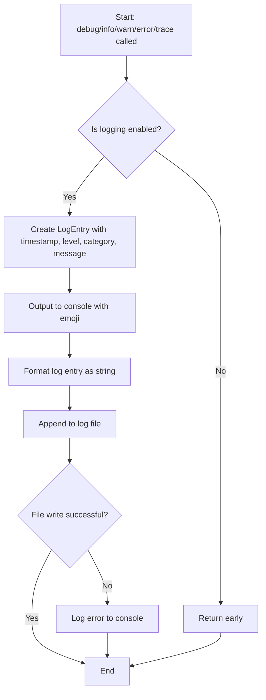

# Module: `terminal-logger.ts`

## 1. Module Summary

The `terminal-logger` module provides enhanced logging capabilities for debugging async generator and streaming issues in the Perplexity QA system. This module writes structured logs to both terminal console and daily log files (`logs/perplexity-debug-YYYY-MM-DD.log`), but does not output to the UI. The logger supports five log levels (DEBUG, INFO, WARN, ERROR, TRACE), specialized async generator debugging methods, and automatic log file rotation by date. Logging is only enabled in development mode or when `ENABLE_DEBUG_LOGGING='true'` environment variable is set.

## 2. Module Dependencies

* **Internal Dependencies:** None.
* **External Dependencies:**
  * `fs/promises` - Node.js file system promises API for async file operations.
  * `path` - Node.js path module for file path manipulation.

## 3. Public API / Exports

* `terminalLogger: TerminalLogger` - Singleton logger instance.
* **Convenience Functions (bound to singleton):**
  * `debugLog(category: string, message: string, data?: any): Promise<void>`
  * `infoLog(category: string, message: string, data?: any): Promise<void>`
  * `warnLog(category: string, message: string, data?: any): Promise<void>`
  * `errorLog(category: string, message: string, error?: any): Promise<void>`
  * `traceLog(category: string, message: string, data?: any): Promise<void>`
* **TerminalLogger Methods:**
  * `debug(category, message, data?): Promise<void>` - Logs debug message with 🐛 emoji.
  * `info(category, message, data?): Promise<void>` - Logs info message with ℹ️ emoji.
  * `warn(category, message, data?): Promise<void>` - Logs warning message with ⚠️ emoji.
  * `error(category, message, error?): Promise<void>` - Logs error message with ❌ emoji and stack trace.
  * `trace(category, message, data?): Promise<void>` - Logs trace message with 🔍 emoji and stack trace.
  * `logAsyncGeneratorStart(category, functionName, input): Promise<void>` - Specialized log for async generator start.
  * `logAsyncGeneratorError(category, functionName, error): Promise<void>` - Specialized log for async generator errors.
  * `logForAwaitStart(category, iterableSource, iterableType): Promise<void>` - Specialized log for for-await loop start.
  * `logFunctionCall(category, functionName, args, returnType?): Promise<void>` - Specialized log for function calls with return type analysis.
  * `getLogFilePath(): string` - Returns current log file path.
  * `setEnabled(enabled: boolean): void` - Enables/disables logging dynamically.
* **Type Exports:**
  * `LogLevel` - Union type: 'DEBUG' | 'INFO' | 'WARN' | 'ERROR' | 'TRACE'.
  * `LogEntry` - Interface for log entry structure.

## 4. Code File Breakdown

### 4.1. `terminal-logger.ts`

* **Purpose:** Provides enhanced debugging capabilities specifically designed for troubleshooting async generator and streaming issues that are difficult to debug with standard console.log. The module's key features include: (1) **Dual output** - Logs appear in terminal AND are persisted to daily log files for historical debugging; (2) **Structured logging** - All logs include timestamp, level, category, message, optional data, and optional stack trace; (3) **Async generator diagnostics** - Specialized methods that log iterator protocol details (`[Symbol.asyncIterator]`, `[Symbol.iterator]`), constructor names, and type information; (4) **Conditional logging** - Only enabled in development or when explicitly configured, avoiding performance impact in production; (5) **Daily log rotation** - Log files are automatically organized by date.
* **Functions:**
    * `constructor()` - Initializes logger with log directory (`logs/` in project root), generates current log file name based on date (`perplexity-debug-YYYY-MM-DD.log`), checks if logging is enabled (development mode or `ENABLE_DEBUG_LOGGING='true'`), and ensures log directory exists by calling `ensureLogDir()`.
    * `ensureLogDir(): Promise<void>` - Creates log directory using `fs.mkdir` with `recursive: true` option. Catches and logs errors if directory creation fails. Called during constructor initialization.
    * `formatLog(entry: LogEntry): string` - Formats log entry for file output. Creates multi-line string: `[timestamp] [level] [category] message`. If data exists, appends `\nDATA: <JSON>`. If stack exists, appends `\nSTACK: <stack>`. Adds trailing newline. Returns formatted string.
    * `writeToFile(logEntry: LogEntry): Promise<void>` - Writes log entry to current log file. Returns early if logging disabled. Formats entry using `formatLog`, appends to log file using `fs.appendFile`. Catches and logs errors if file write fails.
    * `createLogEntry(level: LogLevel, category: string, message: string, data?: any, includeStack = false): LogEntry` - Creates structured log entry object with ISO timestamp, level, category, message, optional data, and optional stack trace (captured via `new Error().stack`).
    * `debug(category, message, data?): Promise<void>` - Logs at DEBUG level. Outputs to console with 🐛 emoji. Writes to file. Used for detailed debugging information.
    * `info(category, message, data?): Promise<void>` - Logs at INFO level. Outputs to console with ℹ️ emoji. Writes to file. Used for general information messages.
    * `warn(category, message, data?): Promise<void>` - Logs at WARN level. Outputs to console.warn with ⚠️ emoji. Writes to file. Used for warning messages that don't stop execution.
    * `error(category, message, error?): Promise<void>` - Logs at ERROR level. Outputs to console.error with ❌ emoji. Includes stack trace. Writes to file. Used for error conditions.
    * `trace(category, message, data?): Promise<void>` - Logs at TRACE level. Outputs to console with 🔍 emoji. Includes stack trace. Writes to file. Used for detailed execution tracing.
    * `logAsyncGeneratorStart(category: string, functionName: string, input: any): Promise<void>` - **Async generator debugging**. Logs start of async generator with: function name, input type, input keys, whether input has `[Symbol.asyncIterator]`. Helps diagnose if generators are being called correctly.
    * `logAsyncGeneratorError(category: string, functionName: string, error: any): Promise<void>` - **Async generator error debugging**. Logs error details: function name, error type (constructor name), error message, whether error is TypeError, stack trace. Critical for debugging "not async iterable" errors.
    * `logForAwaitStart(category: string, iterableSource: string, iterableType: any): Promise<void>` - **For-await loop debugging**. Logs start of for-await loop with: iterable source description, iterable type, whether it has `[Symbol.asyncIterator]`, whether it has `[Symbol.iterator]`, constructor name. Verifies that for-await is iterating over correct async iterable.
    * `logFunctionCall(category: string, functionName: string, args: any[], returnType?: any): Promise<void>` - **Function call debugging**. Logs function invocation with: function name, arguments length, argument types, return type, return constructor name, whether return value has `[Symbol.asyncIterator]`. Tracks async generator return values.
    * `getLogFilePath(): string` - Returns full path to current log file. Useful for displaying log file location to developers.
    * `setEnabled(enabled: boolean): void` - Dynamically enables or disables logging. Allows runtime control of logging behavior without restarting application.
* **Key Classes / Constants / Variables:**
    * `TerminalLogger` - Main logger class. Singleton instance exported as `terminalLogger`. Maintains state: `logDir` (logs directory path), `currentLogFile` (current log file path with date), `isEnabled` (logging enabled flag).
    * `LogLevel: type` - Union type of 5 log levels: 'DEBUG' | 'INFO' | 'WARN' | 'ERROR' | 'TRACE'.
    * `LogEntry: interface` - Structured log entry with 6 fields: `timestamp` (ISO string), `level` (LogLevel), `category` (string for grouping), `message` (log message), `data` (optional structured data), `stack` (optional stack trace).

## 5. System and Data Flow

### 5.1. System Flowchart (Control Flow)



### 5.2. Data Flow Diagram (Data Transformation)

```mermaid
graph LR
    Input1(category, message, data) --> Entry[createLogEntry];
    Entry --> LogEntry(LogEntry object: timestamp, level, category, message, data, stack);
    LogEntry --> Console[console.log/warn/error with emoji];
    LogEntry --> Format[formatLog];
    Format --> String(Formatted string: [timestamp] [level] [category] message...);
    String --> File[fs.appendFile to log file];
```

## 6. Usage Example & Testing

* **Usage:**
```typescript
import { terminalLogger, debugLog, errorLog } from '@/lib/terminal-logger';

// Using convenience functions
await debugLog('PERPLEXITY_CLIENT', 'Starting HTTP request', {
  endpoint: '/chat/completions',
  model: 'sonar-reasoning-pro',
});

await errorLog('PERPLEXITY_CLIENT', 'Request failed', {
  error: error.message,
  statusCode: error.response?.status,
});

// Using singleton instance with specialized methods
await terminalLogger.logAsyncGeneratorStart(
  'API_ROUTE',
  'streamingQAResponse',
  input
);

await terminalLogger.logForAwaitStart(
  'API_ROUTE',
  'client.streamingCompletionRequest(input)',
  streamGenerator
);

await terminalLogger.logFunctionCall(
  'SERVICE',
  'processAnswer',
  [question, context],
  result
);

// Check log file location
console.log('Logs written to:', terminalLogger.getLogFilePath());
// Output: Logs written to: /project-root/logs/perplexity-debug-2025-10-27.log
```
* **Testing:** Testing strategy focuses on log output verification:
  - Mock `fs.appendFile` to capture file writes
  - Mock `console.log/warn/error` to verify console output
  - Test logging is skipped when `isEnabled` is false
  - Test log file path generation includes correct date
  - Test all log levels produce correct emoji and output method
  - Test async generator logging methods capture iterator protocol details
  - Test for-await logging captures async iterable information
  - Test error and trace logging includes stack traces
  - Test log formatting produces correct multi-line output
  - Test `setEnabled` toggles logging behavior
