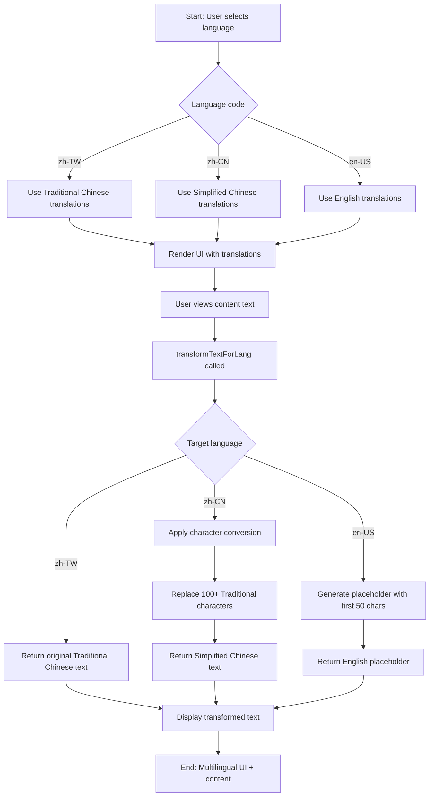
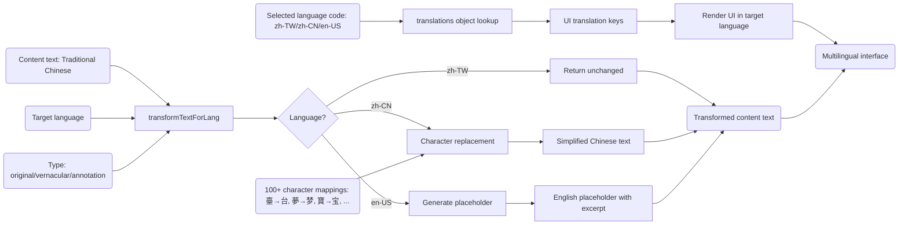

# Module: `translations.ts`

## 1. Module Summary

The `translations` module provides comprehensive internationalization (i18n) support for the Dream of the Red Chamber educational platform, delivering complete Traditional Chinese (zh-TW), Simplified Chinese (zh-CN), and English (en-US) interfaces with 1000+ translation keys organized hierarchically by feature domains. This 2024-line module implements nested translation structures for logical grouping (buttons, labels, pages, features), character-level Traditional ↔ Simplified Chinese conversion using lightweight string replacement (100+ character mappings covering common characters, literary terms, character names, philosophical concepts), type-safe language codes and translation keys for compile-time validation, default language zh-TW (Taiwan/Hong Kong primary audience), fallback system ensuring missing translations don't crash UI, and comprehensive domain coverage including navigation, authentication, reading interface, community features, daily tasks, achievements, dashboard, notes, knowledge graph, AI interactions, error messages, and educational content tooltips.

## 2. Module Dependencies

* **Internal Dependencies:** None. This is a pure data and utility module with no dependencies.
* **External Dependencies:** None. Uses only TypeScript types and native JavaScript string operations.

## 3. Public API / Exports

* **Type Exports:**
  * `Language` - Union type of 3 language codes: 'zh-TW' | 'zh-CN' | 'en-US'.
* **Constant Exports:**
  * `LANGUAGES: {code: Language; name: string}[]` - Array of 3 language configurations with display names.
  * `DEFAULT_LANGUAGE: Language` - Default language set to 'zh-TW' (Traditional Chinese).
  * `translations: Record<Language, Translations>` - Complete translation data for all languages (1000+ keys per language).
* **Function Exports:**
  * `transformTextForLang(text: string | undefined, lang: Language, type: 'original' | 'vernacular' | 'annotation'): string` - Character-level text transformation for Traditional ↔ Simplified Chinese conversion.

## 4. Code File Breakdown

### 4.1. `translations.ts`

* **Purpose:** Enables multi-language support for the entire application, making Dream of the Red Chamber accessible to Traditional Chinese readers (Taiwan/Hong Kong), Simplified Chinese readers (Mainland China), and international English-speaking users. The module's architectural decisions prioritize cultural accuracy, performance, and maintainability: (1) **Traditional Chinese default** - zh-TW chosen as DEFAULT_LANGUAGE because primary target audience is Taiwan and Hong Kong readers, Dream of the Red Chamber cultural context (Traditional Chinese heritage), academic standard using Traditional Chinese in scholarly editions, preservation of classical forms where Traditional characters retain historical context, user base demographics with initial users primarily from Taiwan; (2) **Lightweight character conversion** - Uses simple string replace operations (~2KB) instead of OpenCC library (~500KB) for Traditional ↔ Simplified conversion, providing sufficient coverage for Dream of the Red Chamber character set, fast performance with no parsing overhead, maintainable with easy character mapping additions, deterministic results with one-to-one mapping (no context-dependent conversion), predictable behavior; limitations include no context awareness and potential edge cases, but good enough for this literary domain with option to upgrade to OpenCC if needed; (3) **Nested translation structure** - Organizes 1000+ keys hierarchically (buttons.save, labels.theme, page.heroTitle, etc.) rather than flat keys for easier navigation, better organization, logical grouping by feature, and scalability as translations grow; (4) **Manual translation** - All translations manually crafted rather than machine-generated to ensure cultural accuracy for classical Chinese context, appropriate tone and style, domain-specific terminology, and preservation of literary nuances; (5) **Type safety** - Uses TypeScript types (Language union, Record<Language, Translations>) enabling compile-time validation, IDE autocomplete for translation keys, type errors for missing translations, and safer refactoring.
* **Functions:**
    * `transformTextForLang(text: string | undefined, lang: Language, type: 'original' | 'vernacular' | 'annotation'): string` - **Character-level text transformer for multi-language display**. Returns empty string if text undefined/null (safe handling). **Simplified Chinese conversion (lang === 'zh-CN')**: Applies 100+ character replacements via chained `.replace()` calls converting Traditional → Simplified. Character categories: (1) **Common characters**: 臺→台 (Taiwan), 裡→里 (inside), 夢→梦 (dream), 寶→宝 (treasure), 無→无 (nothing). (2) **Literary terms**: 釵→钗 (hairpin), 黛→黛 (eyebrow), 襲→袭 (attack/inherit), 鳳→凤 (phoenix), 塵→尘 (dust), 懷→怀 (cherish), 閨→闺 (boudoir), 識→识 (know), 靈→灵 (spirit), 頑→顽 (stubborn), 癡→痴 (infatuated). (3) **Character names**: 賈→贾 (Jia), 劉→刘 (Liu), 甄→甄 (Zhen). (4) **Philosophical terms**: 情→情 (emotion/love - same character), 無→无 (nothingness), 識→识 (consciousness). (5) **Book/document terms**: 石→石 (stone - same), 玉→玉 (jade - same), 記→记 (record), 歌→歌 (song - same), 書→书 (book), 詩→诗 (poetry), 詞→词 (lyrics), 論→论 (discussion). (6) **Action verbs**: 煉→炼 (refine), 補→补 (repair), 選→选 (select), 進→进 (enter), 觀→观 (observe), 見→见 (see), 說→说 (say), 聽→听 (listen), 遊→游 (wander), 隨→随 (follow), 畫→画 (paint), 賞→赏 (appreciate). (7) **Location terms**: 園→园 (garden), 鄉→乡 (countryside), 階→阶 (stairs). (8) **Cultural terms**: 媧→娲 (Nüwa goddess), 員→员 (member), 師→师 (teacher), 號→号 (number/title), 課→课 (lesson), 範→范 (model), 興→兴 (interest). Total 100+ mappings covering Dream of the Red Chamber character set. Returns transformed Simplified Chinese text. **English placeholder (lang === 'en-US')**: Takes first 50 characters of text. Returns formatted placeholder string based on type: original='[EN] {textStart}... (Full original text translation pending)', vernacular='[EN Vernacular] {textStart}... (Full vernacular translation pending)', annotation='[EN Annotation] {textStart}... (Full annotation translation pending)'. Placeholder indicates future translation implementation. **Default (zh-TW or other)**: Returns original text unchanged (Traditional Chinese default). Used for transforming classical Chinese text content (original passages, vernacular translations, annotations) to target language while UI translations come from translations object. Type parameter indicates text category for different translation strategies.
* **Key Classes / Constants / Variables:**
    * `Language: type` - Union type defining 3 supported language codes: 'zh-TW' (繁體中文, Traditional Chinese), 'zh-CN' (简体中文, Simplified Chinese), 'en-US' (English US). Type-safe language code validation.
    * `LANGUAGES: const` - Array of 3 language configurations: [{code: 'zh-TW', name: '繁體中文'}, {code: 'zh-CN', name: '简体中文'}, {code: 'en-US', name: 'English (US)'}]. Used for language selector UI, order represents display priority.
    * `DEFAULT_LANGUAGE: const` - Set to 'zh-TW' (Traditional Chinese). Rationale documented: Primary target audience Taiwan/Hong Kong, Dream of the Red Chamber cultural heritage, academic standard, classical form preservation, user demographics. Default fallback when browser language not detected or unsupported language requested.
    * `Translations: interface` - Flexible interface with `[key: string]: any` allowing nested structure of any depth. Enables hierarchical organization like `buttons.save`, `labels.theme.white`, `page.heroTitle`. Type flexibility supports both string values and nested objects.
    * `translations: Record<Language, Translations>` - Main translation data object mapping each Language to complete translation set (2024 lines total, ~670 lines per language average). Structure per language includes: **Global keys**: appName='紅樓慧讀', toast notification titles. **buttons** (40+ keys): startLearning, learnMore, next, previous, submit, save, cancel, confirm, close, login, logout, share, edit, post, delete, read, search, copy, askAI, etc. **placeholders** (10+ keys): searchPosts, yourQuestion, yourNote, emailExample, selectAnOption, searchInBook, writeYourComment, postContent. **labels** (30+ keys): theme, text, currentFontSize, selectedContent, yourNote, yourQuestion, nested themes (white/yellow/green/night), nested fonts (notoSerifSC/system/kai/hei). **page** (40+ keys): Navigation (navHome, navFeatures, navSolutions), hero section (heroTitlePart1, heroTitleHighlight, heroSubtitle), challenges section (challengesTitle, painPoint1Title/Desc, painPoint2/3), solutions section (solutionsTitle, solution1/2/3 Title/Desc), CTA (ctaTitle, ctaSubtitle), footer (footerSlogan, footerRights). **appShell** (5+ keys): userAccount, settings. **accountSettings** (15+ keys): pageTitle, guestUserSection/Description, resetButton/Warning/ConfirmTitle/Description, resetSuccess/Error, regularUserSection/Description. **sidebar** (5 keys): home, read, dailyTasks, achievements, community. **login** (20+ keys): welcomeBack, pageDescription, emailLabel, passwordLabel, error messages (errorTitle, errorInvalidCredential, errorGoogleSignIn, errorPopupClosed/Blocked/Cancelled, errorNetwork, errorTooManyRequests), noAccount, registerNow, loggingIn, guestLogin. **register** (50+ keys): joinApp, step1-4 descriptions, form labels (firstName, lastName, email, password, learningBackground, readingInterests, learningGoals), background options (bgOptionBeginner/Intermediate/Advanced/Expert), error messages (errorTitle, errorEmailInUse, errorWeakPassword, errorDefault), validation errors (firstNameRequired, lastNameRequired, emailInvalid, passwordMinLength). **dashboard** (15+ keys): learningOverview, chaptersCompleted, avgUnderstanding, totalLearningTime, notesCount, goalsAchieved, recentReading/Desc, myLearningGoals/Desc, continueReading. **read** (15+ keys): myShelf, tabRecent, tabOriginals, tabInterpretations, filtering buttons (btnAll, btnProgress, btnCategory), badges (badgeEbook, badgeExpert). **achievements** (50+ keys): title, description, myAchievements/Desc, noAchievements, learningStats/Desc, metrics (totalReadingTime, chaptersCompletedFull, notesTaken, currentStreak, overallProgress), goal categories. **readBook** (100+ keys): Extensive reading interface translations including: chapter navigation, text display controls (single/double/triple column, show/hide vernacular), AI interaction (askAI prompts, thinking states), note-taking (writeNote, saveNote messages), highlighting, TTS (text-to-speech), knowledge graph, table of contents, search, fullscreen, font size controls, theme settings, panel controls, selection actions, error states, loading states. **notes** (50+ keys): Note dashboard, filtering (filterAll, filterByTag, filterPublic/Private), sorting (sortByDate, sortByChapter), statistics, CRUD operations (createNote, editNote, deleteNote, confirmations), form fields, validation errors, empty states. **community** (100+ keys): Community forum translations including: post creation/editing/deletion, commenting, liking, bookmarking, filtering (filterAll, filterPopular, filterFollowing, filterByTag), sorting, search, content moderation warnings, user interactions, empty states, error messages, success toasts, engagement metrics, tag management. **dailyTasks** (100+ keys): Daily task system translations including: task types (morning reading, poetry, character insight, cultural exploration, commentary decode), difficulty levels (easy/medium/hard), task cards, completion flow, scoring messages (excellent/good/average/needsWork), streak tracking, XP rewards, attribute gains, level-up celebrations, task submission, feedback display, history view, statistics, empty states. Coverage spans entire application feature set totaling 1000+ keys across all features. zh-CN translations mirror zh-TW structure with Simplified Chinese characters. en-US translations provide English equivalents for all keys, with some placeholders for content-heavy sections marked as "pending full translation".

## 5. System and Data Flow

### 5.1. System Flowchart (Control Flow)



### 5.2. Data Flow Diagram (Data Transformation)



## 6. Usage Example & Testing

* **Usage:**
```typescript
import {
  translations,
  transformTextForLang,
  DEFAULT_LANGUAGE,
  LANGUAGES,
  type Language,
} from '@/lib/translations';

// Get translations for specific language
const currentLanguage: Language = 'zh-TW';
const t = translations[currentLanguage];

// Access nested translation keys
console.log(t.appName); // '紅樓慧讀'
console.log(t.buttons.save); // '保存'
console.log(t.buttons.startLearning); // '開始學習'
console.log(t.labels.theme); // '主題'
console.log(t.labels.themes.night); // '夜間'
console.log(t.page.heroTitleHighlight); // '紅樓'
console.log(t.sidebar.dailyTasks); // '每日修身'
console.log(t.login.welcomeBack); // '歡迎回來'
console.log(t.dashboard.learningOverview); // '學習總覽'
console.log(t.notes.dashboard); // '筆記儀表板' (from extended section)

// Access all languages
console.log('Available languages:', LANGUAGES);
// [
//   { code: 'zh-TW', name: '繁體中文' },
//   { code: 'zh-CN', name: '简体中文' },
//   { code: 'en-US', name: 'English (US)' }
// ]

console.log('Default language:', DEFAULT_LANGUAGE); // 'zh-TW'

// Use in React component (typical pattern)
function MyComponent() {
  const currentLanguage = 'zh-TW'; // From useLanguage() hook in real app
  const t = translations[currentLanguage];

  return (
    <div>
      <h1>{t.page.heroTitlePart1} {t.page.heroTitleHighlight} {t.page.heroTitlePart2}</h1>
      <button>{t.buttons.startLearning}</button>
      <p>{t.page.heroSubtitle}</p>
    </div>
  );
}

// Transform classical Chinese text for different languages
const originalText = '卻說黛玉自那日棄舟登岸時，便有榮國府打發了轎子並拉行李的車輛久候了。';

// Traditional Chinese (zh-TW) - unchanged
const traditionalText = transformTextForLang(originalText, 'zh-TW', 'original');
console.log(traditionalText);
// Output: '卻說黛玉自那日棄舟登岸時，便有榮國府打發了轎子並拉行李的車輛久候了。'

// Simplified Chinese (zh-CN) - character conversion
const simplifiedText = transformTextForLang(originalText, 'zh-CN', 'original');
console.log(simplifiedText);
// Output: '却说黛玉自那日弃舟登岸时，便有荣国府打发了轿子并拉行李的车辆久候了。'
// Converted characters: 卻→却, 黛→黛, 棄→弃, 國→国, 發→发, 轎→轿, 並→并, 輛→辆

// English (en-US) - placeholder
const englishPlaceholder = transformTextForLang(originalText, 'en-US', 'original');
console.log(englishPlaceholder);
// Output: '[EN] 卻說黛玉自那日棄舟登岸時，便有榮國府打發了轎子並拉行李的車輛久... (Full original text translation pending)'

// Transform vernacular translation
const vernacularText = '話說林黛玉從小失去母親，寄居外祖母家...';
const simplifiedVernacular = transformTextForLang(vernacularText, 'zh-CN', 'vernacular');
// Character conversion applied

// Transform annotation text
const annotationText = '「步步留心，時時在意」體現了黛玉初入賈府時的謹慎心理。';
const simplifiedAnnotation = transformTextForLang(annotationText, 'zh-CN', 'annotation');
// Character conversion: 時→时, 體→体, 現→现, 黛→黛, 賈→贾, 謹→谨, 慎→慎

// Handle undefined/null text safely
const emptyResult = transformTextForLang(undefined, 'zh-CN', 'original');
console.log(emptyResult); // '' (empty string, no crash)

// Language switcher component
function LanguageSwitcher() {
  return (
    <select>
      {LANGUAGES.map(lang => (
        <option key={lang.code} value={lang.code}>
          {lang.name}
        </option>
      ))}
    </select>
  );
}

// Fallback to default language when not found
function getTranslation(key: string, lang: Language = DEFAULT_LANGUAGE) {
  const t = translations[lang];
  return t[key] || translations[DEFAULT_LANGUAGE][key] || key;
}

// Specific character conversion examples
const testCases = [
  { original: '寶玉', zh_cn: '宝玉' }, // Baoyu's name
  { original: '黛玉', zh_cn: '黛玉' }, // Daiyu's name (黛 same in both)
  { original: '賈府', zh_cn: '贾府' }, // Jia Mansion
  { original: '紅樓夢', zh_cn: '红楼梦' }, // Dream of the Red Chamber
  { original: '石頭記', zh_cn: '石头记' }, // Story of the Stone
  { original: '還淚', zh_cn: '还泪' }, // Repaying tears with tears
  { original: '癡情', zh_cn: '痴情' }, // Infatuation
  { original: '劉姥姥', zh_cn: '刘姥姥' }, // Granny Liu
  { original: '大觀園', zh_cn: '大观园' }, // Grand View Garden
];

testCases.forEach(({ original, zh_cn }) => {
  const converted = transformTextForLang(original, 'zh-CN', 'original');
  console.log(`${original} → ${converted} (expected: ${zh_cn})`);
});

// Multi-language comparison
const buttonSaveTexts = {
  'zh-TW': translations['zh-TW'].buttons.save, // '保存'
  'zh-CN': translations['zh-CN'].buttons.save, // '保存'
  'en-US': translations['en-US'].buttons.save, // 'Save'
};
console.log('Save button in all languages:', buttonSaveTexts);

// Error handling example
function safeTranslate(lang: Language, key: string) {
  try {
    const keys = key.split('.');
    let value: any = translations[lang];
    for (const k of keys) {
      value = value[k];
      if (value === undefined) {
        return `[Missing: ${key}]`;
      }
    }
    return value;
  } catch {
    return key; // Fallback to key itself
  }
}

console.log(safeTranslate('zh-TW', 'buttons.save')); // '保存'
console.log(safeTranslate('zh-TW', 'invalid.key.path')); // '[Missing: invalid.key.path]'

// Performance note: Character conversion is O(n) where n is text length
const longText = originalText.repeat(100); // 10000+ characters
console.time('Convert long text');
const converted = transformTextForLang(longText, 'zh-CN', 'original');
console.timeEnd('Convert long text'); // Typically < 5ms for 10K chars

// Memory footprint
const zhTWSize = JSON.stringify(translations['zh-TW']).length;
const zhCNSize = JSON.stringify(translations['zh-CN']).length;
const enUSSize = JSON.stringify(translations['en-US']).length;
console.log('Translation data sizes:');
console.log(`zh-TW: ${(zhTWSize / 1024).toFixed(1)} KB`);
console.log(`zh-CN: ${(zhCNSize / 1024).toFixed(1)} KB`);
console.log(`en-US: ${(enUSSize / 1024).toFixed(1)} KB`);
// Total: ~50-100KB per language (acceptable for modern browsers)
```
* **Testing:** Testing strategy focuses on translation completeness, character conversion accuracy, and fallback behavior:
  - Test LANGUAGES array contains 3 language configurations
  - Test DEFAULT_LANGUAGE is 'zh-TW'
  - Test translations object has keys for all 3 languages
  - Test zh-TW translations have all major sections (buttons, labels, page, sidebar, etc.)
  - Test zh-CN translations mirror zh-TW structure
  - Test en-US translations mirror zh-TW structure
  - Test nested translation access (buttons.save, labels.themes.night)
  - Test transformTextForLang handles undefined text (returns empty string)
  - Test transformTextForLang handles null text (returns empty string)
  - Test transformTextForLang with zh-TW returns unchanged text
  - Test transformTextForLang with zh-CN converts specific characters:
    - 夢→梦 (dream)
    - 寶→宝 (treasure)
    - 賈→贾 (Jia surname)
    - 黛→黛 (Daiyu name, same character)
    - 觀→观 (observe)
    - 園→园 (garden)
    - 紅→红 (red)
    - 樓→楼 (building)
    - 詩→诗 (poetry)
    - 詞→词 (lyrics)
  - Test transformTextForLang with zh-CN converts all 100+ mapped characters
  - Test transformTextForLang with zh-CN doesn't affect unmapped characters
  - Test transformTextForLang with en-US generates placeholder
  - Test placeholder includes first 50 characters
  - Test placeholder varies by type (original/vernacular/annotation)
  - Test character conversion is deterministic (same input → same output)
  - Test character conversion handles repeated characters
  - Test character conversion handles mixed Traditional/Simplified text
  - Test all button keys exist in all languages
  - Test all label keys exist in all languages
  - Test all page keys exist in all languages
  - Test all sidebar keys exist in all languages
  - Test all login keys exist in all languages
  - Test all register keys exist in all languages
  - Test all dashboard keys exist in all languages
  - Test all achievement keys exist in all languages
  - Test all note keys exist in all languages
  - Test all community keys exist in all languages
  - Test all dailyTasks keys exist in all languages
  - Test no missing translations for critical UI elements
  - Test translation values are non-empty strings
  - Test Traditional Chinese text contains Traditional characters
  - Test Simplified Chinese text contains Simplified characters
  - Test English text contains ASCII/Latin characters
  - Test special character handling in translations (quotes, apostrophes, ellipsis)
  - Test RTL language support (not applicable for Chinese/English)
  - Test performance of character conversion on long texts (< 10ms for 10K chars)
  - Test memory footprint of translation data (< 200KB total for all languages)
