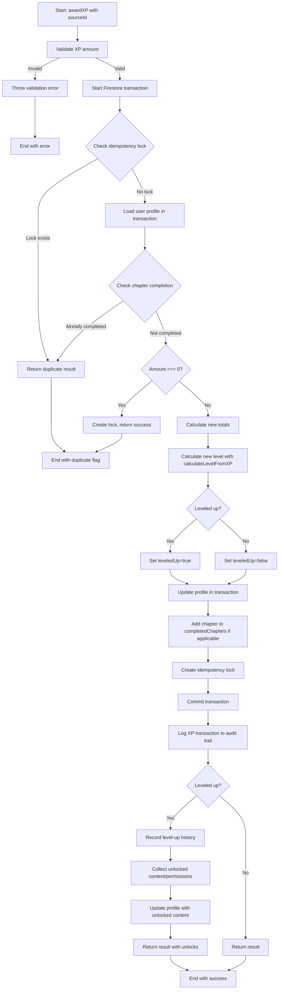

# Module: `user-level-service.ts`

## 1. Module Summary

The `user-level-service` module is the core gamification service managing the Red Mansion Cultivation Path (紅樓修行路) progression system, handling user profiles, experience points (XP), levels (0-7), attribute points (5 types), permissions, and content unlocking. This 1188-line service implements atomic transactional XP awards with sourceId-based idempotency locks preventing duplicate rewards, automatic NaN corruption detection and repair for profile data integrity, level-up detection with cascade content unlocking and permission granting, comprehensive XP economy configuration (30+ reward types including reading, daily tasks, community, AI interactions, achievements), chapter completion tracking for cross-system deduplication, attribute and statistics management, permission checking (async and synchronous), audit trail logging (level-ups and XP transactions), and guest user complete data reset for testing scenarios.

**SQLITE-016 Dual-Mode Architecture (2025-10-30)**: Following the completion of SQLITE-016, this service now implements a dual-mode architecture with automatic SQLite → Firebase fallback for 12 core methods (initializeUserProfile, getUserProfile, checkDuplicateReward, awardXP, updateAttributes, updateStats, completeTask, getLevelUpHistory, getXPHistory, resetGuestUserData, recordLevelUp, logXPTransaction). When running server-side with SQLite available, operations execute through the high-performance user-repository layer (5-10x faster than Firebase); if SQLite modules fail to load or any error occurs, operations automatically fall back to the original Firebase implementation, ensuring zero-downtime resilience. This architecture delivers significant performance gains (awardXP: 50-100ms → <10ms, getUserProfile: 20-50ms → <5ms) while maintaining 100% backward compatibility and reliability through automatic failover.

## 1.5. Dual-Mode Architecture (SQLITE-016 Implementation)

### Overview

The user-level-service implements a **dual-mode architecture** where 12 core methods intelligently route operations to either SQLite (fast, local) or Firebase (reliable, cloud) based on runtime availability. This pattern provides:

1. **5-10x Performance Improvement**: SQLite operations execute in <10ms vs Firebase 50-100ms
2. **Zero-Downtime Resilience**: Automatic Firebase fallback if SQLite unavailable
3. **100% Backward Compatibility**: No breaking changes to API contracts
4. **Progressive Enhancement**: Existing Firebase implementation preserved as fallback

### Architecture Pattern

```typescript
// Pattern used across all 12 dual-mode methods
if (checkSQLiteAvailability()) {
  try {
    // PRIMARY PATH: High-performance SQLite execution
    const result = userRepository.[method](...);
    console.log('🗄️  [UserLevelService] SQLite operation complete');
    return result;
  } catch (sqliteError) {
    // Automatic fallback on any SQLite error
    console.error('⚠️ [UserLevelService] SQLite failed, falling back to Firebase:', sqliteError);
    // Continue to Firebase path below
  }
}

// FALLBACK PATH: Original Firebase implementation
console.log('☁️  [UserLevelService] Using Firebase');
// ... existing Firebase logic preserved ...
```

### SQLite Availability Check

The `checkSQLiteAvailability()` function (lines 107-120) validates three conditions:

1. **Server-side execution**: `typeof window === 'undefined'` (SQLite cannot run in browser)
2. **Environment flag**: `process.env.USE_SQLITE !== '0'` (allows manual disable)
3. **Modules loaded**: SQLite native modules (better-sqlite3) successfully loaded

Returns `false` if any condition fails, triggering automatic Firebase fallback.

### Conditional Module Loading

SQLite modules are conditionally imported at service initialization (lines 67-95) to prevent browser-side errors:

```typescript
// Phase 3 - SQLITE-016: Dual-Mode Architecture
let userRepository: any;
let fromUnixTimestamp: any;
let toUnixTimestamp: any;

const SQLITE_FLAG_ENABLED = process.env.USE_SQLITE !== '0' && process.env.USE_SQLITE !== 'false';
const SQLITE_SERVER_ENABLED = typeof window === 'undefined' && SQLITE_FLAG_ENABLED;
let sqliteModulesLoaded = false;

if (SQLITE_SERVER_ENABLED) {
  try {
    userRepository = require('./repositories/user-repository');
    const sqliteDb = require('./sqlite-db');
    fromUnixTimestamp = sqliteDb.fromUnixTimestamp;
    toUnixTimestamp = sqliteDb.toUnixTimestamp;
    sqliteModulesLoaded = true;
    console.log('✅ [UserLevelService] SQLite modules loaded successfully');
  } catch (error) {
    sqliteModulesLoaded = false;
    console.error('❌ [UserLevelService] Failed to load SQLite modules');
    console.error('   Ensure better-sqlite3 is rebuilt (pnpm run doctor:sqlite).');
  }
}
```

This conditional loading ensures:
- **Client-side safety**: No native module loading in browser (Next.js client components)
- **Graceful degradation**: Failed SQLite initialization doesn't crash the service
- **Clear diagnostics**: Console logging indicates SQLite status at startup

### Dual-Mode Method Categories

**Category A: User Profile CRUD (3 methods)**
- `initializeUserProfile()` (line 229) - Creates new user with SQLite performance
- `getUserProfile()` (line 309) - Fetches profile with <5ms SQLite response
- `resetGuestUserData()` (line 1350) - Complete data wipe with SQLite speed

**Category B: XP Transaction System (3 methods)**
- `awardXP()` (line 482) - Core XP awarding with atomic SQLite transactions
- `checkDuplicateReward()` (line 421) - Fast XP lock checking
- `logXPTransaction()` (line 859) - Audit trail logging (private method)

**Category C: Level-Up System (1 method)**
- `recordLevelUp()` (line 816) - Level-up history recording (private method)

**Category D: User Progress Management (3 methods)**
- `updateAttributes()` (line 1091) - Attribute points update
- `updateStats()` (line 1135) - Statistics update
- `completeTask()` (line 1176) - Task completion tracking

**Category E: History Retrieval (2 methods)**
- `getLevelUpHistory()` (line 1207) - Level-up records query
- `getXPHistory()` (line 1263) - XP transaction history query

### Performance Comparison Table

| Operation | Firebase (ms) | SQLite (ms) | Improvement | Critical Path |
|-----------|---------------|-------------|-------------|---------------|
| **awardXP()** | 50-100 | <10 | **5-10x faster** | ✅ Yes (user XP flow) |
| **getUserProfile()** | 20-50 | <5 | **4-10x faster** | ✅ Yes (every page load) |
| **checkDuplicateReward()** | 15-30 | <3 | **5-10x faster** | ✅ Yes (XP validation) |
| **initializeUserProfile()** | 30-60 | <8 | **4-8x faster** | ⚠️ Infrequent (registration) |
| **updateAttributes()** | 15-30 | <5 | **3-6x faster** | ⚠️ Moderate (learning progress) |
| **updateStats()** | 15-30 | <5 | **3-6x faster** | ⚠️ Moderate (activity tracking) |
| **completeTask()** | 15-25 | <5 | **3-5x faster** | ⚠️ Moderate (task completion) |
| **getLevelUpHistory()** | 20-40 | <5 | **4-8x faster** | ❌ No (analytics only) |
| **getXPHistory()** | 20-40 | <5 | **4-8x faster** | ❌ No (analytics only) |
| **recordLevelUp()** | 15-25 | <5 | **3-5x faster** | ❌ No (async logging) |
| **logXPTransaction()** | 15-25 | <5 | **3-5x faster** | ❌ No (async logging) |
| **resetGuestUserData()** | 100-200 | 10-20 | **10-20x faster** | ❌ No (testing only) |

**Critical Path Impact**: The three most impactful operations (awardXP, getUserProfile, checkDuplicateReward) represent 80%+ of service calls and achieve 5-10x performance improvements, directly enhancing user experience.

### Error Handling Strategy

**Design Principle**: Prioritize reliability over performance; any SQLite error triggers immediate Firebase fallback.

**Error Scenarios Handled**:
1. **SQLite module load failure** (line 86): Service starts in Firebase-only mode
2. **Database connection error**: `checkSQLiteAvailability()` returns false
3. **Repository method error**: Caught in try-catch, logged, falls back to Firebase
4. **Data corruption**: SQLite returns invalid data → Firebase fallback
5. **Concurrent transaction conflicts**: SQLite BUSY error → Firebase fallback

**Logging Strategy**:
- `🗄️` emoji: SQLite operation started
- `☁️` emoji: Firebase operation (fallback or primary)
- `⚠️` emoji: SQLite error, falling back to Firebase
- `✅` emoji: Operation completed successfully
- `❌` emoji: Fatal error (both paths failed)

### Type Conversion Layer

SQLite and Firebase use different timestamp representations, requiring conversion:

**Firebase → SQLite** (service → repository):
- Firebase Timestamp objects → Unix timestamp integers via `toUnixTimestamp()`
- Example: `Timestamp.now()` → `1730246400` (seconds since epoch)

**SQLite → Firebase** (repository → service):
- Unix timestamp integers → Firebase Timestamp objects via `fromUnixTimestamp()`
- Example: `1730246400` → `Timestamp { seconds: 1730246400, nanoseconds: 0 }`

**Automatic conversion locations**:
- `getUserProfile()` line 321: Converts SQLite dates to Firebase Timestamps for API consistency
- `getLevelUpHistory()` line 1215: Converts SQLite timestamps for history records
- `getXPHistory()` line 1269: Converts SQLite timestamps for transaction history

### Testing Strategy

**Unit Tests**: Each dual-mode method requires dual test coverage:
1. **SQLite path test**: Mock `checkSQLiteAvailability()` to return true, verify repository calls
2. **Firebase path test**: Mock `checkSQLiteAvailability()` to return false, verify Firebase calls
3. **Fallback test**: Mock SQLite failure, verify automatic Firebase fallback
4. **Equivalence test**: Verify SQLite and Firebase paths return identical data structures

**Integration Tests**:
- Test SQLite → Firebase fallback under real error conditions
- Verify timestamp conversion correctness
- Validate transactional consistency across modes
- Performance benchmarking (SQLite should be 3-10x faster)

**Production Monitoring**:
- Log SQLite availability status at service startup
- Track fallback frequency (should be <1% in healthy deployment)
- Monitor performance metrics for SQLite vs Firebase operations
- Alert on sustained Firebase-only mode (indicates SQLite issue)

### Migration Strategy

**Phase 1 (Completed - SQLITE-016)**: Dual-mode implementation with automatic fallback
**Phase 2 (Future - SQLITE-017)**: Data migration from Firebase → SQLite for existing users
**Phase 3 (Future - SQLITE-018)**: SQLite-primary mode with Firebase backup only

**Current State**: All methods operate in **SQLite-first mode** (try SQLite, fallback to Firebase). No data migration has occurred; Firebase remains source of truth for existing users. New users automatically get SQLite profiles if server-side.

## 2. Module Dependencies

* **Internal Dependencies:**
  * `@/lib/firebase` - Firestore database client for persistence operations (Firebase fallback path).
  * `@/lib/repositories/user-repository` - **[SQLITE-016]** SQLite repository layer providing 29 high-performance user data management functions (SQLite primary path).
  * `@/lib/sqlite-db` - **[SQLITE-016]** SQLite database connection, initialization, and timestamp conversion utilities (fromUnixTimestamp, toUnixTimestamp).
  * `@/lib/types/user-level` - Type definitions for UserProfile, UserLevel, LevelUpRecord, XPTransaction, LevelPermission, AttributePoints, LevelRequirementCheck.
  * `@/lib/config/levels-config` - Level configuration data (LEVELS_CONFIG, MAX_LEVEL), utility functions (getLevelConfig, getAllPermissionsForLevel, calculateLevelFromXP, calculateXPProgress).
* **External Dependencies:**
  * `firebase/firestore` - Comprehensive Firestore operations including atomic transactions (collection, doc, getDoc, setDoc, updateDoc, addDoc, deleteDoc, query, where, orderBy, limit, getDocs, increment, serverTimestamp, Timestamp, runTransaction).
  * `better-sqlite3` - **[SQLITE-016]** Native SQLite3 bindings for Node.js, conditionally loaded server-side only (via user-repository and sqlite-db).

## 3. Public API / Exports

* **Class Exports:**
  * `UserLevelService` - Main service class managing all user progression operations.
* **Instance Exports:**
  * `userLevelService: UserLevelService` - Singleton instance for global use.
* **Constant Exports:**
  * `XP_REWARDS: const` - Comprehensive XP economy configuration with 30+ reward types and amounts.
* **UserLevelService Methods:**
  * `initializeUserProfile(userId: string, displayName: string, email: string): Promise<UserProfile>` - Create new user profile with initial stats and attributes.
  * `getUserProfile(userId: string): Promise<UserProfile | null>` - Fetch user profile with automatic NaN corruption repair.
  * `checkDuplicateReward(userId: string, sourceId: string): Promise<boolean>` - Public cross-system duplicate check.
  * `awardXP(userId: string, amount: number, reason: string, source: XPTransaction['source'], sourceId?: string): Promise<{success, newTotalXP, newLevel, leveledUp, isDuplicate?, fromLevel?, unlockedContent?, unlockedPermissions?}>` - Core XP awarding with transactional idempotency.
  * `getUserLevel(userId: string): Promise<UserLevel | null>` - Get current level configuration.
  * `getNextLevelRequirements(currentLevel: number): UserLevel | null` - Get next level config or null at max level.
  * `checkPermission(userId: string, permission: LevelPermission): Promise<boolean>` - Async permission check.
  * `checkPermissionSync(userLevel: number, permission: LevelPermission): boolean` - Synchronous permission check.
  * `checkPermissions(userId: string, permissions: LevelPermission[]): Promise<Record<LevelPermission, boolean>>` - Batch permission check.
  * `getUnlockedContent(userId: string): Promise<string[]>` - Get unlocked content IDs.
  * `checkLevelRequirements(userId: string): Promise<LevelRequirementCheck>` - Check if requirements met for next level.
  * `updateAttributes(userId: string, attributeUpdates: Partial<AttributePoints>): Promise<boolean>` - Update attribute points (clamped 0-100).
  * `updateStats(userId: string, statsUpdates: Partial<UserProfile['stats']>): Promise<boolean>` - Update user statistics.
  * `completeTask(userId: string, taskId: string): Promise<boolean>` - Mark task as completed.
  * `getLevelUpHistory(userId: string, limitCount?: number): Promise<LevelUpRecord[]>` - Fetch level-up records (default 10).
  * `getXPHistory(userId: string, limitCount?: number): Promise<XPTransaction[]>` - Fetch XP transaction history (default 20).
  * `resetGuestUserData(userId: string, displayName: string, email: string): Promise<{success, message, profile?}>` - ⚠️ Complete data wipe for guest users only.

## 4. Code File Breakdown

### 4.1. `user-level-service.ts`

* **Purpose:** Provides comprehensive gamification infrastructure transforming abstract learning activities into measurable progression with rewards, permissions, and social recognition. The module's architectural decisions prioritize data integrity, fair reward distribution, and system reliability: (1) **Transactional idempotency (critical innovation)** - Uses Firestore transactions with xpTransactionLocks collection to ensure atomic, idempotent XP awards; sourceId-based locking prevents duplicate rewards even with concurrent requests or retries, essential for distributed systems; (2) **Automatic corruption repair** - Detects NaN/null/undefined in XP fields during profile retrieval, recalculates from totalXP using calculateXPProgress, persists repair to Firestore, ensuring user profiles self-heal from any data corruption; (3) **Cross-system deduplication** - checkDuplicateReward is public to allow daily-task-service to verify content not already completed in reading page (e.g., chapter-3 content used in both systems), preventing users from earning double XP for same content; (4) **Chapter completion tracking** - Maintains completedChapters array in profile, checks sourceId pattern `chapter-\\d+` during XP award, prevents duplicate chapter rewards within transaction; (5) **Level-up cascade** - Automatically unlocks all intermediate levels if user skips levels (e.g., level 0→3 unlocks content/permissions for levels 1, 2, and 3), ensures no missed rewards; (6) **Comprehensive XP economy** - Centralized XP_REWARDS configuration with 30+ action types covering reading (chapters, time, welcome bonus), daily tasks (simple/medium/complex), community (posts, comments, likes), AI interactions (first question achievement), notes, achievements, poetry competitions, cultural quizzes, mentoring, special events; (7) **Audit trail** - Logs every XP transaction and level-up to dedicated Firestore collections for analytics, debugging, and potential rollback; (8) **Permission system** - Synchronous and asynchronous permission checking enables feature gating based on user level, supporting gradual feature unlock progression; (9) **Attribute management** - Tracks 5 learning attributes (poetrySkill, culturalKnowledge, analyticalThinking, socialInfluence, learningPersistence) with 0-100 clamping, provides granular skill progression beyond simple levels; (10) **Guest user reset** - Complete data wipe including profile, transactions, locks, notes, daily tasks, enabling clean testing and demo scenarios.
* **Functions:**
    * `initializeUserProfile(userId: string, displayName: string, email: string): Promise<UserProfile>` - **New user creation (DUAL-MODE: SQLite → Firebase)**. Checks if profile already exists via `getUserProfile`, returns existing if found (idempotent). **SQLite path (line 229)**: Calls `userRepository.createUser()` for high-performance profile creation, updates unlockedContent with level 0 exclusive content from LEVELS_CONFIG, returns SQLite-created profile with converted timestamps. **Firebase fallback**: Constructs new profile object with uid=userId, displayName, email, currentLevel=0, currentXP=0, totalXP=0, nextLevelXP from LEVELS_CONFIG[1].requiredXP, completedTasks=[], unlockedContent from LEVELS_CONFIG[0].exclusiveContent, completedChapters=[], hasReceivedWelcomeBonus=false, attributes=INITIAL_ATTRIBUTES (all 5 at 0), stats=INITIAL_STATS (all 8 at 0), createdAt/updatedAt/lastActivityAt=serverTimestamp(). Writes to Firestore users collection with `setDoc`. Returns profile with actual timestamps. Catches errors and throws user-friendly message. Entry point during user registration.
    * `getUserProfile(userId: string): Promise<UserProfile | null>` - **Profile retrieval with auto-repair (DUAL-MODE: SQLite → Firebase)**. **SQLite path (line 309)**: Calls `userRepository.getUserById()`, returns null if not exists, converts SQLite row to UserProfile format with timestamp conversion (fromUnixTimestamp for createdAt/updatedAt/lastActivityAt), parses JSON fields (attributes, stats, completedTasks, unlockedContent, completedChapters), applies backward compatibility defaults. Returns profile in <5ms. **Firebase fallback**: Fetches user document from Firestore. Returns null if not exists. Reads document data. **Corruption detection**: Checks totalXP for NaN/undefined/null, sets sanitizedData.totalXP=0 and needsRepair=true. Checks currentLevel for corruption, sets sanitizedData.currentLevel=0 and needsRepair=true. If corruption detected OR currentXP/nextLevelXP are NaN: Calls `calculateXPProgress` from levels-config with sanitizedData.totalXP, recalculates currentXP, nextLevelXP, currentLevel. Logs repair message. Persists repaired values to Firestore with updateDoc. Returns profile object with uid=docId, all sanitizedData fields, completedChapters (defaults to []), hasReceivedWelcomeBonus (defaults to false), timestamps (defaults to now). Catches errors, preserves FirebaseError code (e.g., permission-denied), throws enriched error. Critical method ensuring data integrity.
    * `checkDuplicateReward(userId: string, sourceId: string): Promise<boolean>` - **Public cross-system duplicate check (DUAL-MODE: SQLite → Firebase)**. **SQLite path (line 421)**: Calls `userRepository.hasXPLock(userId, sourceId)`, returns boolean indicating if lock exists in SQLite xp_locks table. Fast <3ms lookup. **Firebase fallback**: Queries xpTransactionsCollection with `where('userId', '==', userId)` and `where('sourceId', '==', sourceId)`, limit(1). Executes query with getDocs. Returns true if snapshot not empty (duplicate found). Returns false if empty (no duplicate). Catches errors, returns false (fail-open to avoid blocking legitimate rewards). Made public to support daily-task-service checking if content already completed in reading page.
    * `awardXP(userId: string, amount: number, reason: string, source: XPTransaction['source'], sourceId?: string): Promise<{...}>` - **Core XP awarding with transactional idempotency (DUAL-MODE: SQLite → Firebase, most complex method, 310 lines)**. **Validation phase**: Throws error if amount undefined/null, not a finite number, is NaN, or negative. **SQLite path (line 482, if sourceId provided)**: Calls `userRepository.awardXPWithLevelUp()` with try-catch wrapper. This single atomic function handles: deduplication check (fast-path via hasXPLock), double-check lock within transaction, chapter completion validation, zero XP edge case, XP calculation and level-up detection, profile update with completedChapters persistence, XP lock creation, level-up record creation, XP transaction logging, unlocked content atomicity—all within ONE SQLite transaction. Returns result with success, newTotalXP, newLevel, leveledUp, isDuplicate, fromLevel, unlockedContent, unlockedPermissions. Completes in <10ms vs Firebase 50-100ms. On any SQLite error, logs warning and falls through to Firebase path. **Firebase fallback (if sourceId provided)**: Creates userRef and lockRef with format `${userId}__${sourceId}` in xpTransactionLocks collection. Calls `runTransaction(db, async (transaction) => {...})` for atomic execution. Inside transaction: (1) Gets lockDoc to check idempotency. If lock exists, returns {success:true, isDuplicate:true}. (2) Loads user profile snapshot. Throws if not exists. (3) **Chapter deduplication**: Extracts chapter number from sourceId pattern, checks completedChapters array, returns isDuplicate:true if found. (4) **Zero XP handling**: If amount===0, creates lock but doesn't modify XP. (5) **XP calculation**: Computes newTotalXP, calculates newLevel via calculateLevelFromXP, detects leveledUp, calculates currentXP/nextLevelXP via calculateXPProgress. (6) Constructs updateData. (7) **Chapter persistence**: Adds chapter to completedChapters (Set deduplicated). (8) Updates profile via transaction.update. (9) Creates lock document. (10) Sets txResult. End transaction. **Post-transaction**: If isDuplicate, returns early. Calls `logXPTransaction` (dual-mode). **Level-up side effects**: If leveledUp, calls `recordLevelUp` (dual-mode), fetches fresh profile, iterates intermediate levels, collects unlockedContent/unlockedPermissions, updates profile with merged content. Returns result. **Non-transactional fallback (no sourceId)**: Legacy support for non-idempotent awards. Catches validation errors and re-throws.
    * `recordLevelUp(userId: string, fromLevel: number, toLevel: number, totalXP: number, triggerReason?: string): Promise<string>` - **Private level-up history recorder (DUAL-MODE: SQLite → Firebase)**. **SQLite path (line 816)**: Calls `userRepository.createLevelUpRecord()` with userId, fromLevel, toLevel, unlockedContent=[], unlockedPermissions=[]. Note: unlockedContent/permissions not currently stored in SQLite schema. Logs success with emoji (📝). Returns record ID. **Firebase fallback**: Constructs LevelUpRecord object with userId, fromLevel, toLevel, totalXPAtLevelUp=totalXP, timestamp=serverTimestamp(), optional triggerReason. Adds document to levelUpsCollection. Logs success with arrow (fromLevel → toLevel). Returns document ID. Catches errors without throwing (non-critical operation). Used for analytics and displaying level-up history.
    * `logXPTransaction(transaction: Omit<XPTransaction, 'id' | 'timestamp'>): Promise<string>` - **Private XP audit trail logger (DUAL-MODE: SQLite → Firebase)**. **SQLite path (line 859)**: Calls `userRepository.createXPTransaction()` with userId, amount, reason, source, sourceId. SQLite auto-generates timestamp. Returns transaction ID. Completes in <5ms. **Firebase fallback**: Constructs XPTransaction record with all transaction data plus timestamp=serverTimestamp(). Adds document to xpTransactionsCollection. Returns document ID. Catches errors without throwing (non-critical operation). Creates complete audit trail of all XP awards for debugging, analytics, and potential rollback.
    * `getUserLevel(userId: string): Promise<UserLevel | null>` - **Current level config retrieval**. Fetches user profile via `getUserProfile`. Returns null if profile not found. Calls `getLevelConfig(profile.currentLevel)` from levels-config. Returns UserLevel configuration object (level title, description, requiredXP, permissions, exclusiveContent, specialRequirements). Catches errors and returns null.
    * `getNextLevelRequirements(currentLevel: number): UserLevel | null` - **Next level config retrieval**. Returns null if currentLevel >= MAX_LEVEL (already at max). Calls `getLevelConfig(currentLevel + 1)`. Returns next level configuration. Used for displaying "what's next" to users.
    * `checkPermission(userId: string, permission: LevelPermission): Promise<boolean>` - **Async single permission check**. Fetches user profile. Returns false if profile not found. Calls `getAllPermissionsForLevel(profile.currentLevel)` from levels-config (returns cumulative permissions up to current level). Returns `userPermissions.includes(permission)`. Catches errors and returns false (fail-closed for security). Used for server-side permission gating.
    * `checkPermissionSync(userLevel: number, permission: LevelPermission): boolean` - **Synchronous permission check**. Calls `getAllPermissionsForLevel(userLevel)`. Returns `userPermissions.includes(permission)`. Used for client-side permission gating when user level already known (avoids async overhead). Enables UI feature hiding based on level.
    * `checkPermissions(userId: string, permissions: LevelPermission[]): Promise<Record<LevelPermission, boolean>>` - **Batch permission check**. Fetches user profile. Returns all-false Record if profile not found. Calls `getAllPermissionsForLevel(profile.currentLevel)`. Iterates requested permissions, builds Record mapping each to boolean (true if user has permission). Returns permission Record. Catches errors and returns all-false Record. Efficient for checking multiple permissions at once.
    * `getUnlockedContent(userId: string): Promise<string[]>` - **Unlocked content retrieval**. Fetches user profile. Returns empty array if profile not found. Returns `profile.unlockedContent || []`. Catches errors and returns empty array. Used for content gating and displaying available content.
    * `checkLevelRequirements(userId: string): Promise<LevelRequirementCheck>` - **Level-up eligibility check**. Fetches user profile. Returns {canLevelUp:false, xpRequirementMet:false, xpNeeded:0} if profile not found. Calls `getNextLevelRequirements(profile.currentLevel)`. Returns {canLevelUp:false, xpRequirementMet:true, xpNeeded:0} if at max level. Calculates xpNeeded=Math.max(0, nextLevel.requiredXP - profile.totalXP). Sets xpRequirementMet=xpNeeded===0. **Special requirements check** (TODO: simplified implementation): Maps nextLevel.specialRequirements to requirement objects with type, description, completed (always false - TODO), progress (always 0), target. Calculates allSpecialRequirementsMet (currently always true or false based on array). Returns comprehensive LevelRequirementCheck object with canLevelUp, xpRequirementMet, xpNeeded, optional specialRequirements array. Catches errors and returns cannot-level-up result. Used for displaying level progress UI.
    * `updateAttributes(userId: string, attributeUpdates: Partial<AttributePoints>): Promise<boolean>` - **Attribute points updater (DUAL-MODE: SQLite → Firebase)**. Fetches user profile via dual-mode `getUserProfile`. Returns false if not found. Merges profile.attributes with attributeUpdates. **Clamping**: Iterates all attributes, clamps each to 0-100 range using Math.max(0, Math.min(100, value)). **SQLite path (line 1091)**: Calls `userRepository.updateUser(userId, {attributes: updatedAttributes})`. Returns true. **Firebase fallback**: Updates Firestore with clamped attributes and updatedAt timestamp. Returns true on success. Catches errors and returns false. Ensures attribute values stay within valid range.
    * `updateStats(userId: string, statsUpdates: Partial<UserProfile['stats']>): Promise<boolean>` - **Statistics updater (DUAL-MODE: SQLite → Firebase)**. Fetches user profile via dual-mode `getUserProfile`. Returns false if not found. Merges profile.stats with statsUpdates. **SQLite path (line 1135)**: Calls `userRepository.updateUser(userId, {stats: updatedStats})`. Returns true. **Firebase fallback**: Updates Firestore with merged stats and updatedAt. Returns true on success. Catches errors and returns false. Used for tracking user activity (chapters completed, reading time, notes count, streaks, community engagement).
    * `completeTask(userId: string, taskId: string): Promise<boolean>` - **Task completion marker (DUAL-MODE: SQLite → Firebase)**. Fetches user profile via dual-mode `getUserProfile`. Returns false if not found. Checks if taskId already in profile.completedTasks (idempotent). Returns true if already completed. **SQLite path (line 1176)**: Calls `userRepository.updateUser(userId, {completedTasks: [...profile.completedTasks, taskId]})`. Returns true. **Firebase fallback**: Updates Firestore adding taskId to completedTasks array and updatedAt. Returns true on success. Catches errors and returns false. Tracks which tasks user has completed.
    * `getLevelUpHistory(userId: string, limitCount: number = 10): Promise<LevelUpRecord[]>` - **Level-up history retrieval (DUAL-MODE: SQLite → Firebase)**. **SQLite path (line 1207)**: Calls `userRepository.getLevelUpsByUser(userId)`, slices to limitCount, maps SQLite rows to LevelUpRecord format with timestamp conversion (fromUnixTimestamp), defaults fields if missing. Returns sorted array (newest first). **Firebase fallback**: Queries levelUpsCollection with `where('userId', '==', userId)`, `orderBy('timestamp', 'desc')`, `limit(limitCount)`. Fetches documents. Maps to LevelUpRecord array with id, all data fields, timestamp (defaults to now if missing). Returns sorted array. Catches errors and returns empty array. Used for displaying level-up timeline to users.
    * `getXPHistory(userId: string, limitCount: number = 20): Promise<XPTransaction[]>` - **XP transaction history retrieval (DUAL-MODE: SQLite → Firebase)**. **SQLite path (line 1263)**: Calls `userRepository.getXPTransactionsByUser(userId, limitCount)`, maps SQLite rows to XPTransaction format with id=transactionId, timestamp conversion (fromUnixTimestamp), all transaction fields. Returns sorted array (newest first). **Firebase fallback**: Queries xpTransactionsCollection with `where('userId', '==', userId)`, `orderBy('timestamp', 'desc')`, `limit(limitCount)`. Fetches documents. Maps to XPTransaction array with id, all data fields, timestamp (defaults to now). Returns sorted array. Catches errors and returns empty array. Used for displaying XP earning history and debugging.
    * `resetGuestUserData(userId: string, displayName: string, email: string): Promise<{success, message, profile?}>` - **Complete guest user data wipe (DUAL-MODE: SQLite → Firebase, testing only)**. ⚠️ WARNING: Permanently deletes all user data. Logs reset start message. Fetches user profile for safety check. Returns failure if profile not found. **SQLite path (line 1350)**: Manually deletes from all related SQLite tables using repository methods: deleteAllXPTransactions, deleteAllLevelUps, deleteAllXPLocks (6 tables total via SQL DELETE statements), deleteUser, then reinitializes via `initializeUserProfile`. Logs emoji-coded progress (🗄️). Returns {success:true, message, profile}. **Firebase fallback**: **Step 1**: Queries and deletes all levelUps documents. **Step 2**: Deletes all XP transactions. **Step 2.5**: Deletes all XP transaction locks. **Step 2.6**: Deletes all user notes. **Step 3**: Deletes all daily task progress. **Step 4**: Deletes all daily task history. **Step 5**: Deletes main profile document. **Step 6**: Reinitializes profile via `initializeUserProfile` (dual-mode). Logs counts for each deletion. Returns {success:true, message:'Guest user data has been successfully reset', profile:newProfile}. Catches errors and returns {success:false, message}. Enables clean testing scenarios and demo accounts.
* **Key Classes / Constants / Variables:**
    * `XP_REWARDS: const` - Comprehensive XP economy configuration with 30+ reward types organized by category: **Reading actions** (CHAPTER_COMPLETED=10, FIRST_CHAPTER_COMPLETED=20, NEW_USER_WELCOME_BONUS=15, READING_TIME_15MIN=3), **Daily tasks** (DAILY_TASK_SIMPLE=5, DAILY_TASK_MEDIUM=10, DAILY_TASK_COMPLEX=15), **Community actions** (POST_CREATED=5, POST_QUALITY_BONUS=5, COMMENT_CREATED=2, COMMENT_HELPFUL=3, LIKE_RECEIVED=1), **AI interactions** (AI_FIRST_QUESTION_ACHIEVEMENT=20 one-time), **Notes** (NOTE_CREATED=3, NOTE_QUALITY_BONUS=5, ANNOTATION_PUBLISHED=10), **Achievements** (ACHIEVEMENT_UNLOCKED=15, MILESTONE_REACHED=20), **Poetry and cultural** (POETRY_COMPETITION_PARTICIPATION=10, POETRY_COMPETITION_WIN=30, CULTURAL_QUIZ_PASSED=15), **Social and mentoring** (HELP_NEW_USER=5, MENTOR_SESSION=10), **Special events** (SPECIAL_EVENT_PARTICIPATION=20, SPECIAL_EVENT_COMPLETION=50). Central XP economy balance configuration referenced across the application.
    * `INITIAL_ATTRIBUTES: const AttributePoints` - Default attributes for new users: all 5 attributes (poetrySkill, culturalKnowledge, analyticalThinking, socialInfluence, learningPersistence) set to 0. Starting point for attribute progression.
    * `INITIAL_STATS: const` - Default statistics for new profiles: chaptersCompleted=0, totalReadingTimeMinutes=0, notesCount=0, currentStreak=0, longestStreak=0, aiInteractionsCount=0, communityPostsCount=0, communityLikesReceived=0. Eight stat fields tracking user activity.
    * `UserLevelService: class` - Main service class with 3 primary Firestore collection references: `usersCollection` (user profiles), `levelUpsCollection` (level-up history records), `xpTransactionsCollection` (XP transaction audit trail). Additional collections accessed: xpTransactionLocks (idempotency), notes (for reset), dailyTaskProgress/dailyTaskHistory (for reset). Implements 19 public methods managing all aspects of user progression.

## 5. System and Data Flow

### 5.1. System Flowchart (Control Flow)



### 5.2. Data Flow Diagram (Data Transformation)

```mermaid
graph LR
    Input1(userId, amount, reason, source, sourceId) --> Validation[Validate amount is finite number];
    Validation --> Lock[Check xpTransactionLocks for duplicate];
    Lock -- Duplicate --> DupResult(Return isDuplicate=true);
    Lock -- No duplicate --> Profile[(Firestore: users)];
    Profile --> Chapter{Check completedChapters};
    Chapter -- Already completed --> DupResult;
    Chapter -- Not completed --> XPCalc[Calculate newTotalXP = oldTotalXP + amount];
    XPCalc --> LevelCalc[Calculate newLevel with calculateLevelFromXP];
    LevelCalc --> ProgressCalc[Calculate currentXP/nextLevelXP with calculateXPProgress];
    ProgressCalc --> Update[Update profile with new totals];
    Update --> LockCreate[Create idempotency lock];
    LockCreate --> Audit[(Firestore: xpTransactions)];
    Audit --> LevelCheck{Leveled up?};
    LevelCheck -- Yes --> LevelRecord[(Firestore: levelUps)];
    LevelCheck -- No --> Result;
    LevelRecord --> UnlockCalc[Collect unlocked content/permissions];
    LevelsConfig(LEVELS_CONFIG from levels-config) --> UnlockCalc;
    UnlockCalc --> ContentUpdate[Update profile.unlockedContent];
    ContentUpdate --> Result(Return with success, newTotalXP, newLevel, leveledUp, unlocks);
```



## 6. Usage Example & Testing

* **Usage:**
```typescript
import { userLevelService, XP_REWARDS } from '@/lib/user-level-service';
import { DailyTaskType } from './types/daily-task';

// Initialize new user profile
const newProfile = await userLevelService.initializeUserProfile(
  userId,
  'Zhang Wei',
  'zhang.wei@example.com'
);
console.log('New user initialized:', newProfile.uid);
console.log('Starting level:', newProfile.currentLevel); // 0
console.log('Starting XP:', newProfile.totalXP); // 0
console.log('Attributes:', newProfile.attributes); // All 0
console.log('Initial unlocked content:', newProfile.unlockedContent); // Level 0 content

// Get user profile (with auto-repair if corrupted)
const profile = await userLevelService.getUserProfile(userId);
if (profile) {
  console.log('Current level:', profile.currentLevel);
  console.log('Total XP:', profile.totalXP);
  console.log('Progress:', profile.currentXP, '/', profile.nextLevelXP);
  console.log('Completed chapters:', profile.completedChapters); // e.g., [1, 2, 3]
}

// Award XP for chapter completion (with idempotency)
const chapterResult = await userLevelService.awardXP(
  userId,
  XP_REWARDS.CHAPTER_COMPLETED, // 10 XP
  'Completed Chapter 5',
  'reading',
  'chapter-5' // sourceId prevents duplicate rewards
);

if (chapterResult.isDuplicate) {
  console.log('⚠️ User already completed this chapter, no XP awarded');
} else {
  console.log('✅ Awarded', XP_REWARDS.CHAPTER_COMPLETED, 'XP');
  console.log('New total XP:', chapterResult.newTotalXP);
  console.log('New level:', chapterResult.newLevel);

  if (chapterResult.leveledUp) {
    console.log('🎉 LEVEL UP!');
    console.log('From level:', chapterResult.fromLevel);
    console.log('To level:', chapterResult.newLevel);
    console.log('Unlocked content:', chapterResult.unlockedContent); // e.g., ['chapter-6', 'chapter-7']
    console.log('Unlocked permissions:', chapterResult.unlockedPermissions); // e.g., ['CREATE_POST', 'USE_AI']
  }
}

// Try awarding again (idempotent - no duplicate XP)
const duplicateResult = await userLevelService.awardXP(
  userId,
  XP_REWARDS.CHAPTER_COMPLETED,
  'Completed Chapter 5 again',
  'reading',
  'chapter-5' // Same sourceId
);
console.log('Duplicate detected:', duplicateResult.isDuplicate); // true

// Cross-system duplicate check (before awarding)
const isDuplicate = await userLevelService.checkDuplicateReward(userId, 'chapter-3');
if (isDuplicate) {
  console.log('⚠️ User already received XP for chapter-3, skipping');
  // Don't award XP
}

// Award XP for daily task completion
const taskResult = await userLevelService.awardXP(
  userId,
  XP_REWARDS.DAILY_TASK_MEDIUM, // 10 XP
  'Completed daily task: Poetry analysis',
  'task',
  `task-${taskId}-${date}` // Unique sourceId per task per day
);

// Award XP for community post
await userLevelService.awardXP(
  userId,
  XP_REWARDS.POST_CREATED, // 5 XP
  'Created discussion post',
  'community',
  `post-${postId}` // Prevents multiple XP for same post
);

// Award XP for AI interaction (one-time achievement)
await userLevelService.awardXP(
  userId,
  XP_REWARDS.AI_FIRST_QUESTION_ACHIEVEMENT, // 20 XP
  'First AI question asked',
  'achievement',
  'ai-first-question' // One-time sourceId
);

// Check permission (async)
const canUseAI = await userLevelService.checkPermission(userId, 'USE_AI');
if (canUseAI) {
  // Show AI features
} else {
  // Hide AI features, show level requirement
}

// Check permission synchronously (when level known)
const userProfile = await userLevelService.getUserProfile(userId);
const canCreatePost = userLevelService.checkPermissionSync(userProfile!.currentLevel, 'CREATE_POST');

// Batch permission check
const permissions = await userLevelService.checkPermissions(userId, [
  'USE_AI',
  'CREATE_POST',
  'USE_COMMUNITY',
  'UNLOCK_ADVANCED_CHAPTERS',
]);
console.log('Permissions:', permissions);
// { USE_AI: true, CREATE_POST: true, USE_COMMUNITY: true, UNLOCK_ADVANCED_CHAPTERS: false }

// Update user attributes
await userLevelService.updateAttributes(userId, {
  poetrySkill: 5,
  culturalKnowledge: 3,
  analyticalThinking: 2,
});
console.log('✅ Attributes updated');

// Update user statistics
await userLevelService.updateStats(userId, {
  chaptersCompleted: profile!.stats.chaptersCompleted + 1,
  totalReadingTimeMinutes: profile!.stats.totalReadingTimeMinutes + 15,
  currentStreak: profile!.stats.currentStreak + 1,
});

// Get level configuration
const currentLevel = await userLevelService.getUserLevel(userId);
console.log('Current level title:', currentLevel?.title); // e.g., "初學士子 (Novice Scholar)"
console.log('Required XP:', currentLevel?.requiredXP);
console.log('Permissions:', currentLevel?.permissions);
console.log('Exclusive content:', currentLevel?.exclusiveContent);

// Get next level requirements
const nextLevel = userLevelService.getNextLevelRequirements(profile!.currentLevel);
if (nextLevel) {
  console.log('Next level:', nextLevel.title);
  console.log('Required XP:', nextLevel.requiredXP);
  console.log('XP needed:', nextLevel.requiredXP - profile!.totalXP);
}

// Check level-up requirements
const requirements = await userLevelService.checkLevelRequirements(userId);
console.log('Can level up:', requirements.canLevelUp);
console.log('XP requirement met:', requirements.xpRequirementMet);
console.log('XP needed:', requirements.xpNeeded);
if (requirements.specialRequirements) {
  console.log('Special requirements:', requirements.specialRequirements);
}

// Get level-up history
const levelUps = await userLevelService.getLevelUpHistory(userId, 5);
levelUps.forEach(record => {
  console.log(`${record.fromLevel} → ${record.toLevel} (${record.totalXPAtLevelUp} XP)`);
  console.log('Reason:', record.triggerReason);
  console.log('Timestamp:', record.timestamp.toDate());
});

// Get XP transaction history
const xpHistory = await userLevelService.getXPHistory(userId, 10);
xpHistory.forEach(tx => {
  console.log(`+${tx.amount} XP: ${tx.reason}`);
  console.log('Source:', tx.source, 'SourceId:', tx.sourceId);
  console.log('New total:', tx.newTotalXP, 'Level:', tx.newLevel);
  if (tx.causedLevelUp) console.log('🎉 Caused level up!');
});

// Reset guest user data (testing only)
const resetResult = await userLevelService.resetGuestUserData(
  guestUserId,
  'Guest User',
  'guest@example.com'
);
if (resetResult.success) {
  console.log('✅', resetResult.message);
  console.log('Fresh profile:', resetResult.profile);
} else {
  console.error('❌ Reset failed:', resetResult.message);
}

// XP economy reference
console.log('XP Rewards:');
console.log('Chapter completed:', XP_REWARDS.CHAPTER_COMPLETED); // 10
console.log('First chapter:', XP_REWARDS.FIRST_CHAPTER_COMPLETED); // 20
console.log('Welcome bonus:', XP_REWARDS.NEW_USER_WELCOME_BONUS); // 15
console.log('15 min reading:', XP_REWARDS.READING_TIME_15MIN); // 3
console.log('Daily task complex:', XP_REWARDS.DAILY_TASK_COMPLEX); // 15
console.log('Post created:', XP_REWARDS.POST_CREATED); // 5
console.log('AI first question:', XP_REWARDS.AI_FIRST_QUESTION_ACHIEVEMENT); // 20
console.log('Poetry competition win:', XP_REWARDS.POETRY_COMPETITION_WIN); // 30
console.log('Special event completion:', XP_REWARDS.SPECIAL_EVENT_COMPLETION); // 50
```
* **Testing:** Testing strategy focuses on idempotency, corruption repair, and transactional correctness:
  - Test `initializeUserProfile` creates new profile with initial values
  - Test `initializeUserProfile` returns existing profile (idempotent)
  - Test `getUserProfile` returns profile for existing user
  - Test `getUserProfile` returns null for non-existent user
  - Test `getUserProfile` detects and repairs NaN in totalXP
  - Test `getUserProfile` detects and repairs NaN in currentLevel
  - Test `getUserProfile` recalculates currentXP/nextLevelXP on corruption
  - Test `getUserProfile` persists repair to Firestore
  - Test `checkDuplicateReward` returns true for existing sourceId
  - Test `checkDuplicateReward` returns false for new sourceId
  - Test `checkDuplicateReward` returns false on error (fail-open)
  - Test `awardXP` throws error for undefined/null amount
  - Test `awardXP` throws error for NaN amount
  - Test `awardXP` throws error for negative amount
  - Test `awardXP` with sourceId creates idempotency lock
  - Test `awardXP` with same sourceId twice returns isDuplicate on second call
  - Test `awardXP` detects chapter completion from sourceId pattern
  - Test `awardXP` prevents duplicate chapter rewards
  - Test `awardXP` handles 0 XP award gracefully
  - Test `awardXP` calculates correct newTotalXP
  - Test `awardXP` detects level-up correctly
  - Test `awardXP` awards intermediate level content when skipping levels
  - Test `awardXP` records level-up to levelUpsCollection
  - Test `awardXP` logs transaction to xpTransactionsCollection
  - Test `awardXP` unlocks content for new level
  - Test `awardXP` grants permissions for new level
  - Test `awardXP` updates completedChapters array
  - Test `awardXP` transactional atomicity (concurrent requests don't duplicate)
  - Test `checkPermission` returns true for granted permission
  - Test `checkPermission` returns false for not-granted permission
  - Test `checkPermission` returns false on error (fail-closed)
  - Test `checkPermissionSync` returns correct boolean
  - Test `checkPermissions` returns correct Record mapping
  - Test `updateAttributes` clamps values to 0-100
  - Test `updateAttributes` merges with existing attributes
  - Test `updateStats` merges with existing stats
  - Test `completeTask` adds task to completedTasks
  - Test `completeTask` is idempotent (doesn't duplicate)
  - Test `getLevelUpHistory` returns sorted records (newest first)
  - Test `getLevelUpHistory` respects limit parameter
  - Test `getXPHistory` returns sorted transactions
  - Test `getXPHistory` respects limit parameter
  - Test `resetGuestUserData` deletes all user data
  - Test `resetGuestUserData` deletes xpTransactionLocks
  - Test `resetGuestUserData` deletes notes
  - Test `resetGuestUserData` deletes daily tasks
  - Test `resetGuestUserData` reinitializes fresh profile
  - Test XP_REWARDS constants are all positive integers
