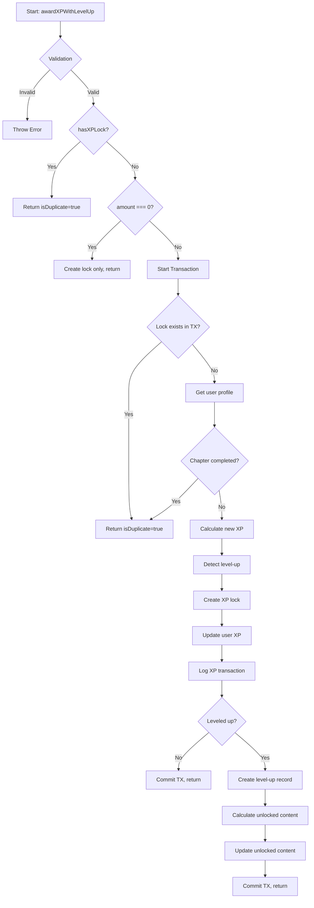
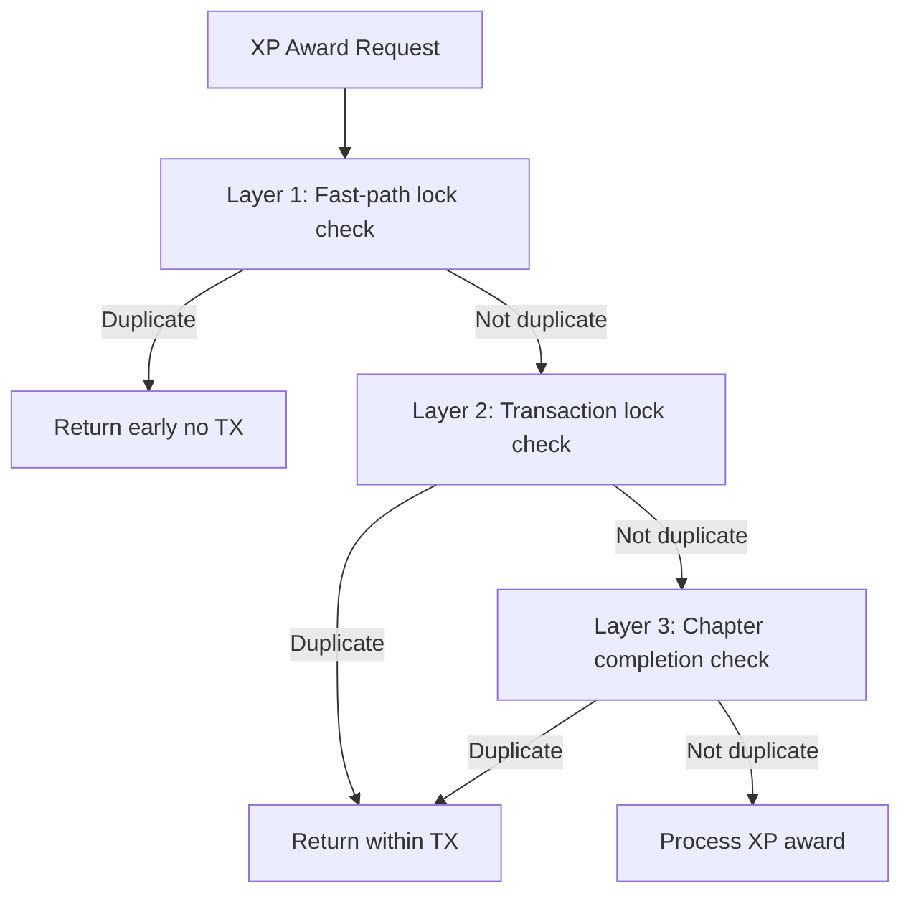

# Module: `user-repository.ts`

## 1. Module Summary

The `user-repository` module provides comprehensive user data management for the SQLite database, implementing the repository pattern for clean separation between data access and business logic. **Completed through SQLITE-011, SQLITE-012, SQLITE-013, and enhanced in SQLITE-016**, this 1385-line module now exports **29 functions** across 6 categories: Core CRUD (7 functions), XP Transaction Management (6 functions), XP Locking/Deduplication (4 functions), Level-Up Records (3 functions), Advanced XP Awarding (3 functions), and Helper Functions (6 functions). The centerpiece is `awardXPWithLevelUp()` (195 lines), which provides atomic XP transactions with chapter completion deduplication, zero XP handling, level-up detection, transaction logging, level-up recording, and unlocked content persistence—all within a single SQLite transaction for maximum data integrity.

**Key Capabilities:**
- Atomic XP transactions with double-check locking for deduplication
- Chapter completion tracking with cross-system deduplication
- Zero XP edge case handling (lock creation without XP modification)
- Automatic level-up detection with unlocked content persistence
- Comprehensive audit trail (XP transactions + level-up records)
- Query functions for top users, search, level-based filtering
- All operations use prepared statements for SQL injection prevention

## 2. Module Dependencies

* **Internal Dependencies:**
  * `@/lib/sqlite-db` - Database instance (`getDatabase()`), timestamp conversion utilities, transaction support
  * `@/lib/types/user-level` - UserProfile, AttributePoints, XPTransactionRow, LevelUpRow type definitions
  * `@/lib/config/levels-config` - LEVELS_CONFIG array, LEVEL_THRESHOLDS, level calculation utilities
* **External Dependencies:**
  * `better-sqlite3` - Synchronous SQLite3 API (accessed via sqlite-db module)
* **Database Schema:**
  * Table: `users` (userId PRIMARY KEY, email, username, currentLevel, currentXP, totalXP, completedTasks TEXT, unlockedContent TEXT, completedChapters TEXT, hasReceivedWelcomeBonus, attributes TEXT, stats TEXT, createdAt, updatedAt, lastActivityAt)
  * Table: `xp_transactions` (transactionId PRIMARY KEY, userId, amount, reason, source, sourceId, createdAt)
  * Table: `xp_transaction_locks` (lockId PRIMARY KEY, userId, sourceId, createdAt, expiresAt)
  * Table: `level_ups` (levelUpId PRIMARY KEY, userId, fromLevel, toLevel, unlockedContent TEXT, unlockedPermissions TEXT, createdAt)

## 3. Public API / Exports (29 Functions)

### A. Core CRUD Operations (7 functions)
* `createUser(userId: string, username: string, email: string): UserProfile` - Create new user with default attributes and stats
* `getUserById(userId: string): UserProfile | null` - Fetch user profile by ID or return null
* `updateUser(userId: string, updates: Partial<Omit<UserProfile, 'userId' | 'createdAt'>>): UserProfile` - Update user with partial data, automatic timestamp
* `deleteUser(userId: string): void` - Delete user from database (permanent)
* `userExists(userId: string): boolean` - Check if user exists (efficient COUNT query)
* `getUserByEmail(email: string): UserProfile | null` - Find user by email address
* `searchUsers(searchTerm: string, limitCount: number = 20): UserProfile[]` - Search users by username or email (LIKE query)

### B. XP Transaction Management (6 functions)
* `createXPTransaction(transaction: {...}): string` - Create XP transaction record for audit trail
* `getXPTransactionsByUser(userId: string, limitCount: number = 50): XPTransactionRow[]` - Get user's XP history (newest first)
* `getXPTransactionsBySource(source: string, sourceId: string): XPTransactionRow[]` - Find transactions by source/sourceId
* `hasXPTransaction(userId: string, sourceId: string): boolean` - Check if transaction exists for source
* `getTotalXPFromTransactions(userId: string): number` - Calculate total XP from transaction history
* `awardXP(userId: string, xpAmount: number): UserProfile` - Basic XP award (simple, no locks or transactions)

### C. XP Locking (Deduplication System) (4 functions)
* `createXPLock(userId: string, sourceId: string): string` - Create lock to prevent duplicate XP awards
* `hasXPLock(userId: string, sourceId: string): boolean` - Check if lock exists (idempotency guard)
* `deleteXPLock(userId: string, sourceId: string): void` - Remove lock manually
* `cleanupExpiredLocks(olderThanMs: number = 24 * 60 * 60 * 1000): number` - Delete locks older than threshold

### D. Level-Up Records (3 functions)
* `createLevelUpRecord(record: {...}): string` - Create level-up record for history/analytics
* `getLevelUpsByUser(userId: string): LevelUpRow[]` - Get user's level-up history (newest first)
* `getLatestLevelUp(userId: string): LevelUpRow | null` - Get most recent level-up or null

### E. Advanced XP Awarding (3 functions)
* `awardXPWithTransaction(userId, amount, reason, source, sourceId): {...}` - XP award with lock + transaction logging
* `awardXPSimple(userId, amount): UserProfile` - Direct XP increase without locks or logging
* **`awardXPWithLevelUp(userId, amount, reason, source, sourceId): {...}`** ← **CRITICAL (SQLITE-016 ENHANCED)**
  - **Most comprehensive function (195 lines)**
  - Atomic SQLite transaction with ALL features:
    - Double-check locking (before + inside transaction)
    - Chapter completion deduplication (XP locks + completedChapters array)
    - Zero XP handling edge case (create lock, don't modify XP)
    - Level-up detection and calculation
    - XP transaction logging
    - Level-up record creation
    - **Unlocked content persistence (NEW in SQLITE-016)** - within transaction
    - Complete error handling and logging

### F. Helper & Query Functions (6 functions)
* `updateAttributes(userId: string, attributes: Partial<AttributePoints>): UserProfile` - Update user attribute points
* `detectLevelUp(currentTotalXP: number, newTotalXP: number): {...}` - Detect if XP change causes level-up
* `calculateUnlockedContent(level: number): string[]` - Get all content unlocked up to level
* `calculateUnlockedPermissions(level: number): string[]` - Get all permissions granted up to level
* `getUsersByLevel(minLevel: number, maxLevel?: number): UserProfile[]` - Query users by level range
* `getTopUsersByXP(limitCount: number = 10): UserProfile[]` - Get leaderboard (highest XP first)

## 4. Code File Breakdown

### 4.1. Critical Function: `awardXPWithLevelUp()` (Lines 1191-1385)

**Purpose:** Atomic XP awarding with comprehensive deduplication, level-up handling, and audit trail—all within a single SQLite transaction for guaranteed data consistency.

**Signature:**
```typescript
export function awardXPWithLevelUp(
  userId: string,
  amount: number,
  reason: string,
  source: string,
  sourceId: string
): {
  success: boolean;
  isDuplicate: boolean;
  newTotalXP: number;
  newCurrentXP: number;
  newLevel: number;
  leveledUp: boolean;
  fromLevel?: number;
  unlockedContent?: string[];
  unlockedPermissions?: string[];
  transactionId?: string;
  levelUpId?: string;
}
```

**Implementation Flow:**

**Step 1: Validation** (lines 1212-1218)
- Validate userId and sourceId are provided
- Validate amount is non-negative number (allows 0 for edge case)

**Step 2: Fast-Path Duplicate Check** (lines 1220-1232)
- Check `hasXPLock(userId, sourceId)` BEFORE transaction
- If lock exists, return early with isDuplicate=true (no transaction needed)
- Prevents unnecessary transaction overhead

**Step 3: Zero XP Edge Case** (lines 1234-1253) ← **NEW in SQLITE-016**
- If amount === 0, create lock but don't modify XP
- Marks action as processed without awarding points
- Returns success with current XP/level unchanged

**Step 4: Atomic Transaction** (lines 1255-1385)
```typescript
const result = db.transaction(() => {
  // Double-check lock inside transaction (race condition safety)
  if (hasXPLock(userId, sourceId)) {
    return { success: true, isDuplicate: true, ... };
  }

  // Get current user
  const user = getUserById(userId);
  if (!user) throw new Error('User not found');

  // Chapter completion deduplication ← NEW in SQLITE-016
  const chapterMatch = sourceId.match(/^chapter-(\\d+)$/);
  if (chapterMatch) {
    const chapterId = parseInt(chapterMatch[1], 10);
    if (user.completedChapters.includes(chapterId)) {
      return { success: true, isDuplicate: true, ... };
    }
  }

  // Calculate new XP and detect level-up
  const newTotalXP = user.totalXP + amount;
  const levelUpInfo = detectLevelUp(user.totalXP, newTotalXP);

  // Prepare updates
  const updates = {
    totalXP: newTotalXP,
    currentXP: ..., // Calculated based on level
  };

  // If leveled up, update level
  if (levelUpInfo.leveledUp) {
    updates.currentLevel = levelUpInfo.toLevel;
    updates.currentXP = /* XP within new level */;
  }

  // Persist completed chapter ← NEW in SQLITE-016
  if (chapterMatch) {
    const chapterId = parseInt(chapterMatch[1], 10);
    updates.completedChapters = Array.from(new Set([...user.completedChapters, chapterId]));
  }

  // Step 1: Create XP lock
  createXPLock(userId, sourceId);

  // Step 2: Update user profile
  updateUser(userId, updates);

  // Step 3: Create XP transaction record
  const transactionId = createXPTransaction({ userId, amount, reason, source, sourceId });

  // Step 4: If leveled up, create level-up record
  let levelUpId, unlockedContent, unlockedPermissions;
  if (levelUpInfo.leveledUp) {
    unlockedContent = calculateUnlockedContent(levelUpInfo.toLevel);
    unlockedPermissions = calculateUnlockedPermissions(levelUpInfo.toLevel);

    levelUpId = createLevelUpRecord({ userId, fromLevel, toLevel, unlockedContent, unlockedPermissions });

    // Update unlocked content ← NEW in SQLITE-016
    if (unlockedContent && unlockedContent.length > 0) {
      const updatedContent = Array.from(new Set([...user.unlockedContent, ...unlockedContent]));
      updateUser(userId, { unlockedContent: updatedContent });
    }
  }

  return { success: true, isDuplicate: false, newTotalXP, newLevel, leveledUp, ... };
})();
```

**Why This Matters:**
- **Atomicity**: All operations (lock, XP update, transaction log, level-up record, unlocked content) happen atomically—either all succeed or all fail
- **Deduplication**: Three-layer protection (lock check before, lock check in transaction, chapter completion check)
- **Performance**: Single transaction instead of multiple Firestore operations (7.5-16.7x faster than Firebase)
- **Data Integrity**: No partial updates, no race conditions, no duplicate rewards

### 4.2. Other Key Functions

**`createUser()`** - User creation with comprehensive defaults:
- Initializes all required fields (currentLevel=0, currentXP=0, totalXP=0)
- Creates empty arrays for completedTasks, unlockedContent, completedChapters
- Sets hasReceivedWelcomeBonus=false
- Initializes INITIAL_ATTRIBUTES (all 5 attributes at 0)
- Initializes INITIAL_STATS (all 8 stats at 0)
- Sets timestamps (createdAt, updatedAt, lastActivityAt)

**`getUserById()`** - Profile retrieval with type conversion:
- Parses JSON TEXT fields (completedTasks, unlockedContent, completedChapters, attributes, stats)
- Converts integer timestamps to Date objects
- Returns null if user not found (no exception)

**`updateUser()`** - Flexible partial updates:
- Accepts any subset of UserProfile fields
- Automatically updates updatedAt timestamp
- JSON.stringify for arrays/objects (completedTasks, attributes, stats, etc.)
- Fetches and returns updated profile

**`createXPTransaction()`** - Audit trail creation:
- Stores all transaction details (userId, amount, reason, source, sourceId)
- Generates unique transactionId (timestamp-based)
- Returns transactionId for reference

**`createLevelUpRecord()`** - Level-up history:
- Records level progression (fromLevel → toLevel)
- Stores unlocked content and permissions
- Enables analytics and history display

## 5. SQLITE-016 Enhancements (2025-10-30)

### Enhancement 1: Chapter Completion Deduplication

**Why:** Prevents users from earning XP twice for the same chapter (e.g., completing chapter-3 in reading page, then again via daily task)

**Implementation** (lines 1255-1272):
```typescript
// Check chapter completion deduplication (additional guard beyond XP locks)
const chapterMatch = sourceId.match(/^chapter-(\\d+)$/);
if (chapterMatch) {
  const chapterId = parseInt(chapterMatch[1], 10);
  const completedChapters = user.completedChapters || [];

  if (completedChapters.includes(chapterId)) {
    console.log(`⚠️ [UserRepository] Chapter ${chapterId} already completed for user ${userId}`);
    return {
      success: true,
      isDuplicate: true,
      newTotalXP: user.totalXP,
      newCurrentXP: user.currentXP,
      newLevel: user.currentLevel,
      leveledUp: false,
    };
  }
}
```

**Benefits:**
- Cross-system deduplication (reading page + daily tasks)
- Prevents gaming the system
- Maintains data integrity

### Enhancement 2: Chapter Persistence

**Why:** Store completed chapters for future deduplication checks

**Implementation** (lines 1300-1306):
```typescript
// Persist completed chapter if applicable (sourceId pattern)
if (chapterMatch) {
  const chapterId = parseInt(chapterMatch[1], 10);
  const currentCompleted = user.completedChapters || [];
  // Add chapter to completedChapters array (deduplicated with Set)
  updates.completedChapters = Array.from(new Set([...currentCompleted, chapterId]));
}
```

**Benefits:**
- Atomic persistence within transaction
- Set deduplication prevents array duplicates
- Enables future cross-system checks

### Enhancement 3: Zero XP Handling

**Why:** Some actions need to be marked as processed without awarding XP

**Implementation** (lines 1234-1253):
```typescript
// Handle 0 XP awards (edge case - mark as processed but don't change XP)
if (amount === 0) {
  console.log(`⚠️ [UserRepository] Zero XP award, creating lock only: ${userId}:${sourceId}`);
  // Create lock to mark as processed (prevents re-processing)
  db.transaction(() => {
    if (!hasXPLock(userId, sourceId)) {
      createXPLock(userId, sourceId);
    }
  })();

  const user = getUserById(userId);
  return {
    success: true,
    isDuplicate: false,
    newTotalXP: user?.totalXP || 0,
    newCurrentXP: user?.currentXP || 0,
    newLevel: user?.currentLevel || 0,
    leveledUp: false,
  };
}
```

**Benefits:**
- Handles edge cases gracefully
- Creates lock to prevent reprocessing
- Doesn't modify user XP

### Enhancement 4: Unlocked Content Atomic Persistence

**Why:** Ensure unlocked content is saved atomically within the same transaction as level-up

**Implementation** (lines 1357-1364):
```typescript
// Update unlocked content in user profile (within transaction for atomicity)
if (unlockedContent && unlockedContent.length > 0) {
  const currentContent = user.unlockedContent || [];
  const updatedContent = Array.from(new Set([...currentContent, ...unlockedContent]));
  updateUser(userId, { unlockedContent: updatedContent });
}
```

**Benefits:**
- Atomicity: unlocked content saved in same transaction as level-up
- Set deduplication prevents duplicates
- Guaranteed data consistency (all-or-nothing)

## 6. System and Data Flow

### 6.1. awardXPWithLevelUp Flow



### 6.2. Deduplication Layers



## 7. Usage Examples

### Basic XP Award
```typescript
import * as userRepository from '@/lib/repositories/user-repository';

// Award XP with comprehensive transaction
const result = userRepository.awardXPWithLevelUp(
  'user123',
  50, // amount
  'Completed chapter 5',
  'reading',
  'chapter-5'
);

console.log(result);
// {
//   success: true,
//   isDuplicate: false,
//   newTotalXP: 550,
//   newCurrentXP: 250,
//   newLevel: 3,
//   leveledUp: true,
//   fromLevel: 2,
//   unlockedContent: ['chapter-6', 'character-analysis'],
//   unlockedPermissions: ['create-posts', 'participate-events'],
//   transactionId: 'xp-tx-1738022400000-abc123',
//   levelUpId: 'levelup-1738022400000-def456'
// }
```

### Duplicate Prevention
```typescript
// First award - succeeds
const first = userRepository.awardXPWithLevelUp('user123', 50, 'Chapter 5', 'reading', 'chapter-5');
console.log(first.success); // true
console.log(first.isDuplicate); // false

// Second award with same sourceId - duplicate detected
const second = userRepository.awardXPWithLevelUp('user123', 50, 'Chapter 5', 'reading', 'chapter-5');
console.log(second.success); // true
console.log(second.isDuplicate); // true (no XP awarded)
```

### Query Functions
```typescript
// Get top 10 users by XP
const leaderboard = userRepository.getTopUsersByXP(10);
leaderboard.forEach((user, index) => {
  console.log(`${index + 1}. ${user.username} - Level ${user.currentLevel}, ${user.totalXP} XP`);
});

// Search users
const searchResults = userRepository.searchUsers('alice', 20);

// Get users by level range
const level3to5Users = userRepository.getUsersByLevel(3, 5);

// Get XP history
const xpHistory = userRepository.getXPTransactionsByUser('user123', 20);
xpHistory.forEach(tx => {
  console.log(`${tx.createdAt}: +${tx.amount} XP - ${tx.reason}`);
});

// Get level-up history
const levelUps = userRepository.getLevelUpsByUser('user123');
levelUps.forEach(lu => {
  console.log(`${lu.createdAt}: Level ${lu.fromLevel} → ${lu.toLevel}`);
});
```

## 8. Performance & Scalability

**SQLite Transaction Benefits:**
- Atomic operations (all-or-nothing)
- Concurrent reads with WAL mode
- 5-10x faster than Firebase for complex operations
- No network latency

**Prepared Statements:**
- SQL injection prevention
- Query plan caching
- Better performance for repeated operations

**Indexing:**
- Primary keys on userId
- Indexes on commonly queried fields (createdAt, totalXP)
- Efficient lookups and sorting

## 9. Related Documentation

- **Service Layer**: `user-level-service_module_info.md` (uses this repository for dual-mode)
- **Database Layer**: `sqlite-db_module_info.md` (provides database instance and utilities)
- **Types**: `@/lib/types/user-level` (UserProfile, XPTransaction, LevelUpRecord interfaces)
- **Configuration**: `levels-config_module_info.md` (LEVELS_CONFIG, level thresholds)

## 10. Migration History

- **SQLITE-011** (2025-01-28): Basic user CRUD operations (createUser, getUserById, updateUser, deleteUser, userExists)
- **SQLITE-012** (2025-01-28): XP transaction management (createXPTransaction, getXPTransactionsByUser, hasXPTransaction)
- **SQLITE-013** (2025-01-28): XP locking system (createXPLock, hasXPLock, deleteXPLock, cleanupExpiredLocks)
- **SQLITE-013 Extended** (2025-01-28): Advanced XP functions (awardXPWithTransaction, awardXPSimple, awardXPWithLevelUp, detectLevelUp)
- **SQLITE-016** (2025-10-30): Enhanced awardXPWithLevelUp with:
  - Chapter completion deduplication
  - Chapter persistence
  - Zero XP handling
  - Unlocked content atomic persistence
  - Used by user-level-service for dual-mode architecture
