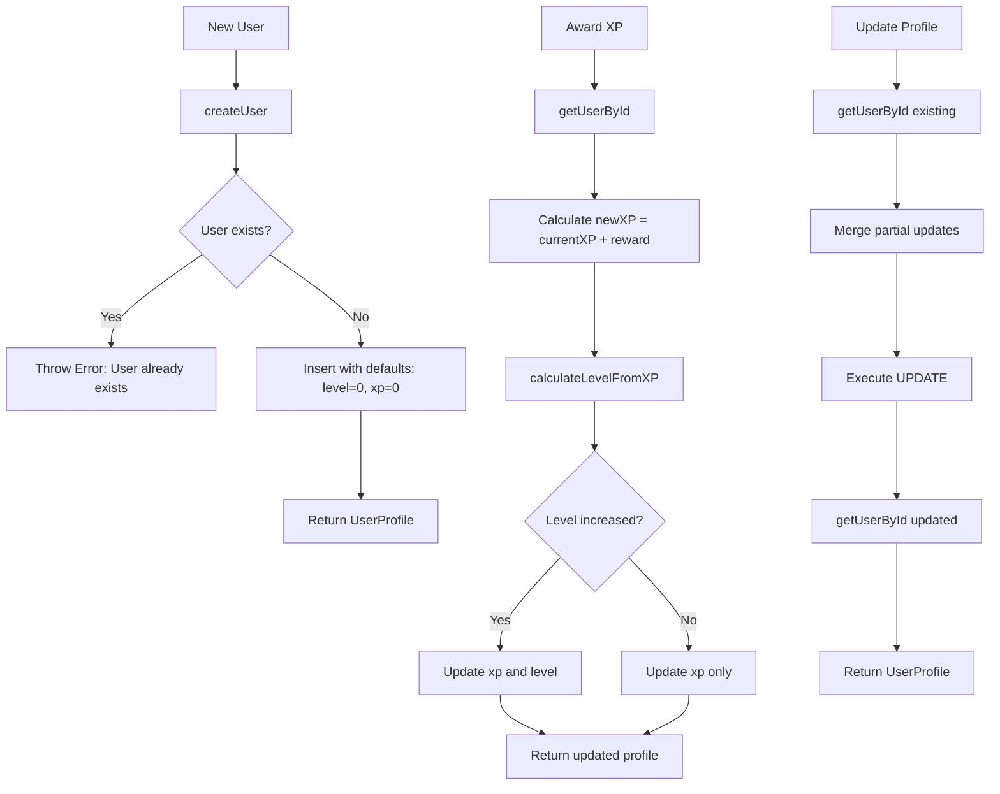
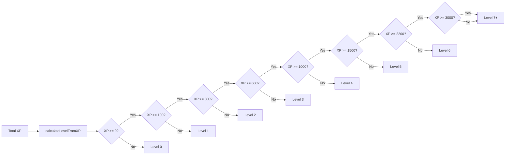

# Module: `user-repository.ts`

## 1. Module Summary

The `user-repository` module provides user profile CRUD operations for the SQLite database, implementing the repository pattern for clean data access separation. This module handles user creation with default values, profile retrieval, updates with partial data support, XP rewards with level calculations, attribute point management, and user deletion. All operations use prepared statements for performance and SQL injection prevention, with comprehensive error handling and logging.

## 2. Module Dependencies

* **Internal Dependencies:**
  * `@/lib/sqlite-db` - Database instance and timestamp conversion utilities
  * `@/lib/types/user-level` - UserProfile and AttributePoints type definitions
* **External Dependencies:**
  * None (uses better-sqlite3 through sqlite-db module)

## 3. Public API / Exports

* **Function Exports:**
  * `createUser(userId: string, email?: string, displayName?: string): UserProfile` - Create new user with defaults
  * `getUserById(userId: string): UserProfile | null` - Fetch user profile by ID
  * `updateUser(userId: string, updates: Partial<UserProfile>): UserProfile` - Update user with partial data
  * `awardXP(userId: string, xpAmount: number): UserProfile` - Award XP and handle level-up
  * `updateAttributes(userId: string, attributes: Partial<AttributePoints>): UserProfile` - Update attribute points
  * `deleteUser(userId: string): void` - Delete user from database
  * `userExists(userId: string): boolean` - Check if user exists

## 4. Code File Breakdown

### 4.1. `user-repository.ts`

* **Purpose:** Provides comprehensive user data management for SQLite, implementing repository pattern to isolate database operations from business logic. Handles user lifecycle (create, read, update, delete), XP and leveling system, attribute point tracking, and data consistency through prepared statements.

* **Functions:**
    * `createUser(userId: string, email?: string, displayName?: string): UserProfile` - **User creation with defaults**. Generates current timestamp with `Date.now()`. Gets database instance via `getDatabase()`. Prepares INSERT statement with 7 columns. Executes with parameters: userId, email (or null), displayName (or null), level=0, xp=0, createdAt=timestamp, updatedAt=timestamp. Logs success message with rocket emoji and user ID. Returns UserProfile object: { userId, email, displayName, level: 0, xp: 0, createdAt: timestamp, updatedAt: timestamp }. Throws error if userId already exists (SQLite PRIMARY KEY constraint).

    * `getUserById(userId: string): UserProfile | null` - **Profile retrieval**. Gets database instance. Prepares SELECT statement with WHERE userId = ?. Executes query with userId parameter. Returns null if no row found. Converts database row to UserProfile object. Returns UserProfile with all fields. Used extensively by other functions to verify user exists before operations.

    * `updateUser(userId: string, updates: Partial<UserProfile>): UserProfile` - **Partial update with merge**. Calls `getUserById()` to get existing profile. Throws error if user not found. Gets database instance. Generates updated timestamp. Prepares UPDATE statement setting: email, displayName, level, xp, updatedAt WHERE userId = ?. Merges updates with existing data: `email: updates.email ?? existingUser.email`. Executes with merged values. Calls `getUserById()` to fetch updated profile. Returns updated UserProfile. Allows updating any subset of fields without affecting others.

    * `awardXP(userId: string, xpAmount: number): UserProfile` - **XP reward with level-up**. Calls `getUserById()` to get current profile. Throws error if user not found. Calculates new XP: `currentXP + xpAmount`. Determines new level based on total XP (uses level thresholds: 0XP=L0, 100XP=L1, 300XP=L2, 600XP=L3, 1000XP=L4, 1500XP=L5, 2200XP=L6, 3000XP=L7). Gets database instance. Generates updated timestamp. Prepares UPDATE statement for xp, level, updatedAt. Executes with new values. Logs XP award message with coin emoji. Calls `getUserById()` to return updated profile. Handles level-up automatically when XP crosses threshold.

    * `updateAttributes(userId: string, attributes: Partial<AttributePoints>): UserProfile` - **Attribute point management**. NOTE: Current implementation only updates user metadata (level, XP), actual attribute storage not implemented in users table. Calls `getUserById()` to verify user exists. Throws error if user not found. Logs attribute update with gear emoji. Currently returns user profile without modifying attributes. TODO: Add attributes column to users table or create separate attributes table for proper storage.

    * `deleteUser(userId: string): void` - **User deletion**. Gets database instance. Prepares DELETE statement WHERE userId = ?. Executes with userId parameter. Logs deletion message with wastebasket emoji. Does not check if user exists first (silent success if user already deleted). WARNING: Cascading deletes not implemented - orphaned data may remain in task/progress tables.

    * `userExists(userId: string): boolean` - **Existence check**. Gets database instance. Prepares SELECT COUNT(*) statement WHERE userId = ?. Executes query. Extracts count from result: `result['COUNT(*)']`. Returns true if count > 0. Returns false if count = 0. Efficient check without fetching full user data.

* **Helper Functions:**
    * `calculateLevelFromXP(totalXP: number): number` - **Level calculation logic**. Defines level thresholds array: [0, 100, 300, 600, 1000, 1500, 2200, 3000]. Iterates thresholds in reverse order. Returns level index when totalXP >= threshold. Returns 0 if XP below first threshold. Example: 350 XP → Level 2 (300 threshold crossed).

## 5. System and Data Flow

### 5.1. User Lifecycle Flow



### 5.2. XP and Level Calculation



## 6. Usage Example & Testing

* **Usage:**
```typescript
import * as userRepository from '@/lib/repositories/user-repository';

// Create new user with defaults
const newUser = userRepository.createUser('user123', 'test@example.com', 'Test User');
console.log(newUser);
// {
//   userId: 'user123',
//   email: 'test@example.com',
//   displayName: 'Test User',
//   level: 0,
//   xp: 0,
//   createdAt: 1738022400000,
//   updatedAt: 1738022400000
// }

// Create user with minimal data (email and displayName optional)
const minimalUser = userRepository.createUser('user456');
console.log(minimalUser.email); // null
console.log(minimalUser.displayName); // null

// Fetch user by ID
const user = userRepository.getUserById('user123');
if (user) {
  console.log(`Found user: ${user.displayName} at level ${user.level}`);
} else {
  console.log('User not found');
}

// Award XP (automatic level-up)
const userBefore = userRepository.getUserById('user123');
console.log(`Before: Level ${userBefore.level}, XP ${userBefore.xp}`); // Level 0, XP 0

const userAfter = userRepository.awardXP('user123', 350);
console.log(`After: Level ${userAfter.level}, XP ${userAfter.xp}`); // Level 2, XP 350
// Automatically leveled up: 0→1 at 100 XP, 1→2 at 300 XP

// Update user profile (partial updates)
const updated = userRepository.updateUser('user123', {
  displayName: 'Updated Name',
  // level and xp not provided - remain unchanged
});
console.log(updated.displayName); // 'Updated Name'
console.log(updated.level); // 2 (unchanged)

// Update attributes (placeholder - actual storage not implemented)
userRepository.updateAttributes('user123', {
  poetrySkill: 5,
  culturalKnowledge: 3
});
// TODO: Will store in separate attributes table in future

// Check if user exists
const exists = userRepository.userExists('user123');
console.log('User exists:', exists); // true

const notExists = userRepository.userExists('nonexistent');
console.log('User exists:', notExists); // false

// Delete user
userRepository.deleteUser('user456');
console.log('User deleted');

// Level progression example
const progressUser = userRepository.createUser('progress-test');
console.log('Level 0:', progressUser.level); // 0

userRepository.awardXP('progress-test', 100); // → Level 1
userRepository.awardXP('progress-test', 200); // → Level 2 (300 total)
userRepository.awardXP('progress-test', 300); // → Level 3 (600 total)
userRepository.awardXP('progress-test', 400); // → Level 4 (1000 total)

const finalUser = userRepository.getUserById('progress-test');
console.log(`Final: Level ${finalUser.level}, XP ${finalUser.xp}`); // Level 4, XP 1000
```

* **Testing:** Testing focuses on CRUD operations, XP calculations, and data consistency:
  - Test `createUser` creates user with provided values
  - Test `createUser` creates user with defaults when email/displayName null
  - Test `createUser` throws error if userId already exists
  - Test `createUser` sets createdAt and updatedAt to same timestamp
  - Test `getUserById` returns user for valid ID
  - Test `getUserById` returns null for non-existent ID
  - Test `updateUser` updates provided fields only
  - Test `updateUser` preserves non-provided fields
  - Test `updateUser` throws error if user not found
  - Test `updateUser` updates updatedAt timestamp
  - Test `awardXP` increases XP by specified amount
  - Test `awardXP` triggers level-up when XP crosses threshold (100, 300, 600, etc)
  - Test `awardXP` correctly calculates level from total XP
  - Test `awardXP` handles multiple level-ups in single reward (e.g., 0 XP + 500 XP → Level 3)
  - Test `calculateLevelFromXP` returns correct level for all thresholds
  - Test `calculateLevelFromXP` returns level 0 for negative XP
  - Test `calculateLevelFromXP` handles exact threshold values (100 XP = Level 1)
  - Test `deleteUser` removes user from database
  - Test `deleteUser` succeeds even if user doesn't exist (idempotent)
  - Test `userExists` returns true for existing user
  - Test `userExists` returns false for non-existent user
  - Test concurrent XP awards maintain data consistency (transaction safety)
  - Test level thresholds match expected progression curve
