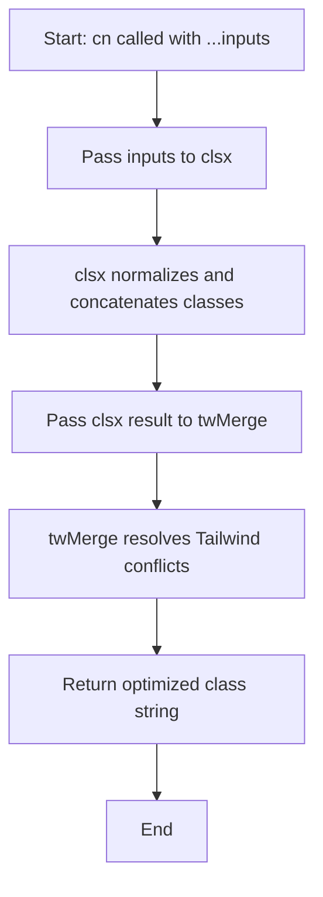
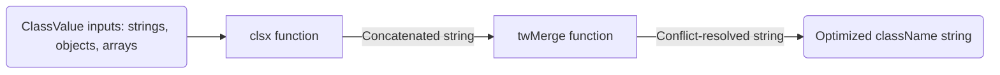

# Module: `utils.ts`

## 1. Module Summary

The `utils` module provides common utility functions for the Red Mansion platform, currently focused on CSS class name management. The primary export is the `cn` utility function, which intelligently merges Tailwind CSS class names while resolving conflicts. This utility is essential for maintaining consistent styling across the application, especially when combining base component classes with dynamic or conditional classes.

## 2. Module Dependencies

* **Internal Dependencies:** None.
* **External Dependencies:**
  * `clsx` - Handles conditional class names and various input types (strings, objects, arrays).
  * `tailwind-merge` - Intelligently merges Tailwind CSS classes and resolves conflicts (e.g., when multiple spacing classes are applied, only the last one is kept).

## 3. Public API / Exports

* `cn(...inputs: ClassValue[]): string` - Combines and optimizes multiple class name inputs, resolving Tailwind CSS conflicts.

## 4. Code File Breakdown

### 4.1. `utils.ts`

* **Purpose:** Provides the `cn` (class name) utility function that serves as the standard method for combining CSS classes throughout the application. This function is particularly valuable in React components where classes are dynamically constructed from base styles, prop-based variations, and conditional states. By using `tailwind-merge`, it ensures that conflicting Tailwind utility classes (like `px-2` and `px-4`) are properly resolved rather than both being applied (which could cause unexpected styling).
* **Functions:**
    * `cn(...inputs: ClassValue[]): string` - Accepts any number of `ClassValue` arguments (strings, objects, arrays, etc.) and returns a single optimized class string. The function first uses `clsx` to handle conditional logic and normalize inputs, then applies `tailwind-merge` to resolve Tailwind-specific class conflicts. Returns a space-separated string of class names with conflicts removed.
* **Key Classes / Constants / Variables:** None.

## 5. System and Data Flow

### 5.1. System Flowchart (Control Flow)



### 5.2. Data Flow Diagram (Data Transformation)



## 6. Usage Example & Testing

* **Usage:**
```typescript
import { cn } from '@/lib/utils';

// Basic usage - resolves px-2 and px-4 conflict
const classes = cn('px-2 py-1', 'px-4'); // Returns: 'py-1 px-4'

// Conditional classes
const buttonClass = cn(
  'px-4 py-2 rounded',
  isActive && 'bg-blue-500',
  isDisabled && 'opacity-50 cursor-not-allowed'
);

// In React component
<button className={cn('base-button-class', variant === 'primary' && 'bg-primary', className)}>
  Submit
</button>
```
* **Testing:** This utility is tested indirectly through component tests that rely on proper class name merging. Unit tests would verify:
  - Test case 1: Single string input → returns unchanged
  - Test case 2: Multiple strings → concatenates correctly
  - Test case 3: Conflicting Tailwind classes → keeps only last one (e.g., `cn('px-2', 'px-4')` → `'px-4'`)
  - Test case 4: Conditional objects → applies classes only when conditions are truthy
  - Test case 5: Arrays and nested structures → flattens and processes correctly
