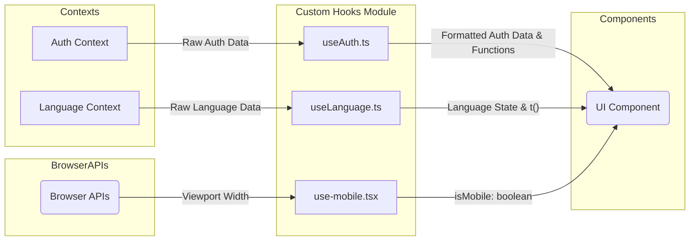

# Module: `Custom Hooks`

## 1. Module Summary

This module provides a collection of custom React hooks designed to encapsulate and reuse stateful logic across different components. These hooks simplify access to global contexts (like Authentication and Language) and provide common utility functions (like mobile detection), promoting cleaner component code and better separation of concerns.

## 2. Module Dependencies

* **Internal Dependencies:**
    * `@/context/AuthContext`: The React context for authentication.
    * `@/context/LanguageContext`: The React context for internationalization.
    * `@/lib/firebase`: Firebase configuration.
* **External Dependencies:**
    * `react`: Core library for building the UI.
    * `firebase/auth`: Firebase Authentication library.

## 3. Public API / Exports

* `useAuth()`: A hook that provides access to the authentication state and methods.
* `useLanguage()`: A hook that provides access to the language state and translation function.
* `useIsMobile()`: A hook that detects if the current viewport is of mobile size.

## 4. Code File Breakdown

### 4.1. `useAuth.ts`

* **Purpose:** This hook is the primary interface for components to interact with the authentication system. It abstracts the complexity of accessing the `AuthContext` and provides a clean API for getting the current user, checking loading states, and performing actions like logging in (with Google, email, or as a guest), signing up, and logging out. It also includes error handling and localized error messages.
* **Functions:**
    * `useAuth(): object` - The main hook function that returns the authentication state and action methods.
* **Key Classes / Constants / Variables:**
    * This file primarily exports the `useAuth` function, which internally uses `useContext` to connect to the `AuthContext`.

### 4.2. `useLanguage.ts`

* **Purpose:** This hook provides a simple and safe way for components to access the application's language state and translation capabilities. It connects to the `LanguageContext` and returns the current language, a function to set the language, and the translation function `t`. It includes an error check to ensure it is used within a `LanguageProvider`.
* **Functions:**
    * `useLanguage(): object` - The main hook function that returns the language state and translation function.
* **Key Classes / Constants / Variables:**
    * This file exports the `useLanguage` function.

### 4.3. `use-mobile.tsx`

* **Purpose:** This hook provides a boolean flag indicating whether the current browser viewport is considered "mobile" (less than 768px wide). It uses the browser's `matchMedia` API for efficient, performant detection of screen size changes. This allows components to easily render different layouts or enable different behaviors for mobile vs. desktop users.
* **Functions:**
    * `useIsMobile(): boolean` - The main hook function that returns `true` if the viewport is mobile-sized.
* **Key Classes / Constants / Variables:**
    * `MOBILE_BREAKPOINT`: A constant set to 768, defining the pixel width threshold for mobile detection.

## 5. System and Data Flow

### 5.1. System Flowchart (Control Flow)

```mermaid
flowchart TD
    subgraph UI Components
        A[Any Component]
    end

    subgraph Custom Hooks Module
        B[useAuth()]
        C[useLanguage()]
        D[useIsMobile()]
    end

    subgraph React Context Module
        E[AuthContext]
        F[LanguageContext]
    end

    subgraph Browser
        G[matchMedia API]
    end

    A -- Calls --> B;
    A -- Calls --> C;
    A -- Calls --> D;

    B -- useContext() --> E;
    C -- useContext() --> F;
    D -- useEffect() & useState() --> G;

    E -- Provides Auth State --> B;
    F -- Provides Language State --> C;
    G -- Provides Viewport State --> D;

    B -- Returns Auth State & Methods --> A;
    C -- Returns Language State & t() --> A;
    D -- Returns isMobile boolean --> A;
```

### 5.2. Data Flow Diagram (Data Transformation)



## 6. Usage Example & Testing

* **Usage:**
  ```typescript
  import { useAuth } from '@/hooks/useAuth';
  import { useLanguage } from '@/hooks/useLanguage';
  import { useIsMobile } from '@/hooks/use-mobile';

  function MyResponsiveComponent() {
    const { user } = useAuth();
    const { t } = useLanguage();
    const isMobile = useIsMobile();

    if (isMobile) {
      return <div>{t('hello')}, {user?.displayName}! (Mobile View)</div>;
    }
    return <div>{t('hello')}, {user?.displayName}! (Desktop View)</div>;
  }
  ```
* **Testing:** Custom hooks are tested in two main ways: 1) Directly, using a testing utility like `@testing-library/react-hooks` to render the hook and assert its return values. 2) Indirectly, by testing components that use the hook and mocking the context they depend on. For example, a component using `useAuth` can be tested by wrapping it in a mock `AuthProvider`.
