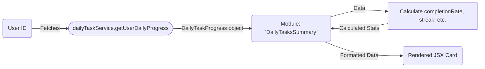

# Module: `DailyTasksSummary`

## 1. Module Summary

The `DailyTasksSummary` module is a dashboard component that provides users with a quick and informative overview of their daily task progress. It displays the number of completed tasks, the user's current streak, and provides a clear call-to-action to navigate to the main daily tasks page.

## 2. Module Dependencies

* **Internal Dependencies:**
    * `@/components/ui/card`: For the card-based layout.
    * `@/components/ui/button`: For the navigation button.
    * `@/components/ui/progress`: To show the task completion progress bar.
    * `@/components/ui/badge`: To display the user's streak.
    * `@/lib/daily-task-service`: To fetch the user's daily task progress.
    * `@/lib/types/daily-task`: For the `DailyTaskProgress` and `TaskStatus` types.
    * `@/hooks/useAuth`: To get the current authenticated user.
* **External Dependencies:**
    * `react`: For component creation, state, and effects.
    * `lucide-react`: For icons.
    * `next/link`: For client-side navigation.

## 3. Public API / Exports

* `DailyTasksSummary: React.FC`: The main component that renders the daily tasks summary card.

## 4. Code File Breakdown

### 4.1. `DailyTasksSummary.tsx`

* **Purpose:** This file contains the implementation of the `DailyTasksSummary` component, which fetches and displays the user's daily task progress.
* **Functions:**
    * `DailyTasksSummary(): JSX.Element`: The main React component. It fetches the user's daily progress on mount, calculates statistics like completion rate and streak, and renders the summary card with different states for loading, error, no tasks, and progress display.
* **Key Classes / Constants / Variables:**
    * `progress`: State variable holding the `DailyTaskProgress` object.
    * `isLoading`: State variable to manage the loading state.
    * `error`: State variable to hold any error messages.

## 5. System and Data Flow

### 5.1. System Flowchart (Control Flow)

```mermaid
flowchart TD
    A[Start: Render `DailyTasksSummary`] --> B{useAuth()};
    B -- User exists --> C[Fetch Daily Progress];
    C -- Loading --> D[Render Loading Spinner];
    C -- Error --> E[Render Error Message];
    C -- Success --> F{Progress data exists?};
    F -- No --> G[Render 'No Tasks' message];
    F -- Yes --> H[Calculate Stats & Render Summary Card];
    G --> I[End];
    H --> I;
```

### 5.2. Data Flow Diagram (Data Transformation)



## 6. Usage Example & Testing

* **Usage:**
  ```tsx
  import { DailyTasksSummary } from '@/components/daily-tasks/DailyTasksSummary';

  // On a dashboard page
  <DailyTasksSummary />
  ```
* **Testing:** Unit tests for this component would be located in `tests/components/daily-tasks/DailyTasksSummary.test.tsx`. Tests would cover the loading and error states, the display when no tasks are available, and the correct calculation and display of progress and streak.
