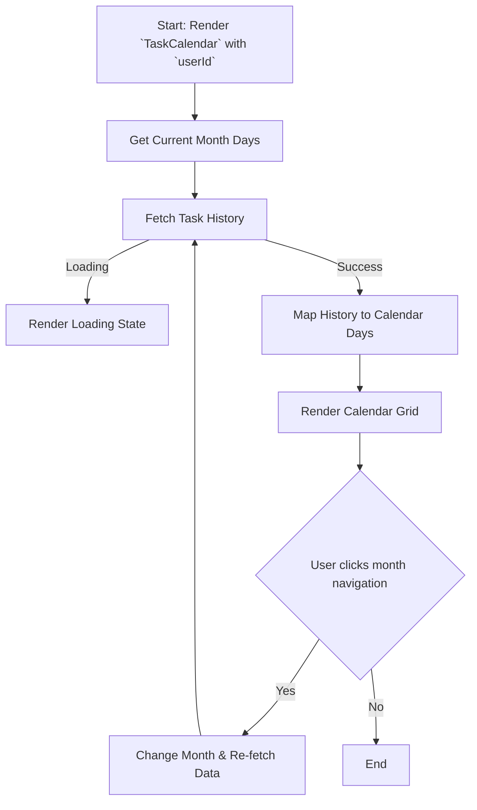

# Module: `TaskCalendar`

## 1. Module Summary

The `TaskCalendar` module displays a calendar view of the user's daily task completion history. It provides a visual representation of the user's consistency and allows them to see which days they completed all, some, or none of their tasks.

## 2. Module Dependencies

* **Internal Dependencies:**
    * `@/components/ui/card`: For the card layout.
    * `@/components/ui/button`: For month navigation buttons.
    * `@/lib/utils`: For the `cn` utility function.
    * `@/lib/daily-task-service`: To fetch the user's task history.
    * `@/lib/types/daily-task`: For the `TaskHistoryRecord` type.
* **External Dependencies:**
    * `react`: For component creation, state, and effects.
    * `lucide-react`: For icons.

## 3. Public API / Exports

* `TaskCalendar: React.FC<TaskCalendarProps>`: The main component that renders the task completion calendar.

## 4. Code File Breakdown

### 4.1. `TaskCalendar.tsx`

* **Purpose:** This file contains the implementation of the `TaskCalendar` component, which fetches and displays the user's task history in a calendar format.
* **Functions:**
    * `getMonthDays(year: number, month: number): DayData[]`: Generates an array of day objects for a given month, including padding for the previous and next months to fill the calendar grid.
    * `TaskCalendar(props: TaskCalendarProps): JSX.Element`: The main React component. It manages the currently displayed month, fetches task history, and renders the calendar grid with completion statuses.
    * `getStatusIndicator(day: DayData)`: Returns an icon indicating the completion status for a given day.
* **Key Classes / Constants / Variables:**
    * `TaskCalendarProps`: The interface for the component's props.
    * `DayData`: An interface representing a single day in the calendar grid.

## 5. System and Data Flow

### 5.1. System Flowchart (Control Flow)



### 5.2. Data Flow Diagram (Data Transformation)

```mermaid
graph LR
    Input(`userId` prop) -- User ID --> Service([dailyTaskService.getTaskHistory]);
    Service -- TaskHistoryRecord[] --> Mod(Module: `TaskCalendar`);
    Mod -- Year, Month --> Func[`getMonthDays()`];
    Func -- DayData[] --> Mod;
    Mod -- Merges History and DayData --> Output(Rendered JSX Calendar);
```

## 6. Usage Example & Testing

* **Usage:**
  ```tsx
  import { TaskCalendar } from '@/components/daily-tasks/TaskCalendar';

  // To display the calendar for a specific user
  <TaskCalendar userId="some-user-id" />
  ```
* **Testing:** Unit tests for this component would be in `tests/components/daily-tasks/TaskCalendar.test.tsx`. They would test the correct generation of the calendar grid, the mapping of task history to calendar days, and the month navigation functionality.
