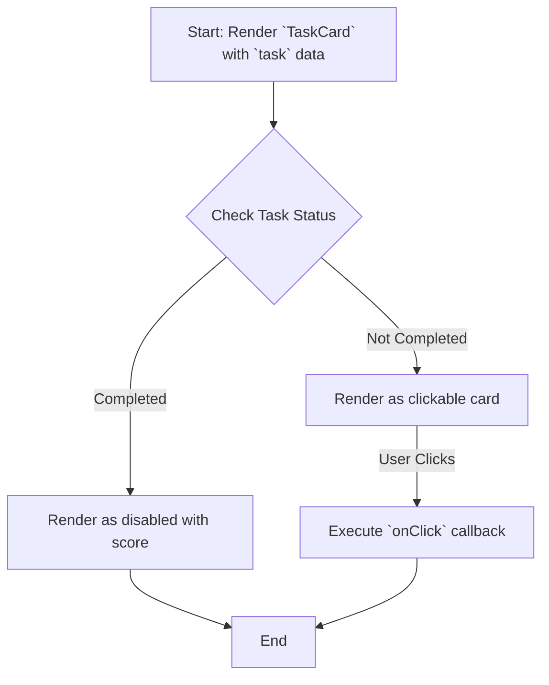

# Module: `TaskCard`

## 1. Module Summary

The `TaskCard` module is a component that renders an individual daily task as an interactive card. It displays all essential information about the task, such as its type, difficulty, rewards, and current status, and serves as the entry point for a user to start or view a task.

## 2. Module Dependencies

* **Internal Dependencies:**
    * `@/components/ui/card`: For the card layout.
    * `@/components/ui/badge`: For displaying task difficulty.
    * `@/lib/types/daily-task`: For task-related enums and types (`DailyTask`, `TaskStatus`, etc.).
    * `@/lib/utils`: For the `cn` utility function.
* **External Dependencies:**
    * `react`: For component creation.
    * `lucide-react`: For icons.

## 3. Public API / Exports

* `TaskCard: React.FC<TaskCardProps>`: The main component that renders a single task card.

## 4. Code File Breakdown

### 4.1. `TaskCard.tsx`

* **Purpose:** This file contains the implementation of the `TaskCard` component, which is responsible for visualizing a single daily task.
* **Functions:**
    * `getTaskTypeIcon(type: DailyTaskType)`: Returns an icon for a given task type.
    * `getTaskTypeName(type: DailyTaskType): string`: Returns a human-readable name for a task type.
    * `getDifficultyColor(difficulty: TaskDifficulty): string`: Returns a color class based on task difficulty.
    * `getDifficultyName(difficulty: TaskDifficulty): string`: Returns a human-readable name for a task difficulty.
    * `getStatusIndicator(status: TaskStatus)`: Returns a component displaying the current status of the task.
    * `getAttributeIcon(attributeName: string)`: Returns an icon for a given attribute.
    * `getAttributeName(attributeName: string): string`: Returns a human-readable name for an attribute.
    * `TaskCard(props: TaskCardProps): JSX.Element`: The main React component. It takes task data and status as props and renders the card with all its details and a click handler to open the task.
* **Key Classes / Constants / Variables:**
    * `TaskCardProps`: The interface for the component's props.

## 5. System and Data Flow

### 5.1. System Flowchart (Control Flow)



### 5.2. Data Flow Diagram (Data Transformation)

```mermaid
graph LR
    Input(`task` and `status` props) -- Task Data --> Mod(Module: `TaskCard`);
    Mod -- Task Type --> Func1[`getTaskTypeName()`];
    Func1 -- Name --> Mod;
    Mod -- Difficulty --> Func2[`getDifficultyName()`];
    Func2 -- Name --> Mod;
    Mod -- Status --> Func3[`getStatusIndicator()`];
    Func3 -- Indicator Component --> Mod;
    Mod -- Formatted Data --> Output(Rendered JSX Card);
```

## 6. Usage Example & Testing

* **Usage:**
  ```tsx
  import { TaskCard } from '@/components/daily-tasks/TaskCard';

  const myTask = { ... }; // A DailyTask object

  <TaskCard
    task={myTask}
    status={TaskStatus.NOT_STARTED}
    onClick={() => openTaskModal(myTask)}
  />
  ```
* **Testing:** Unit tests for this component would be in `tests/components/daily-tasks/TaskCard.test.tsx`. They would cover the different visual states based on task status, correct display of all task metadata, and ensuring the `onClick` handler is called appropriately.
