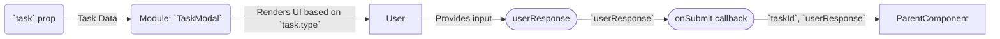

# Module: `TaskModal`

## 1. Module Summary

The `TaskModal` module provides a dialog interface for users to complete their daily tasks. It dynamically renders a specific UI for each task type, handles user input, validates submissions, and communicates with the parent component to process the submission.

## 2. Module Dependencies

* **Internal Dependencies:**
    * `@/components/ui/dialog`: For the modal structure.
    * `@/components/ui/button`: For action buttons.
    * `@/components/ui/textarea`: For user input.
    * `@/components/ui/label`: For form labels.
    * `@/components/ui/badge`: For displaying information.
    * `@/components/ui/alert`: For showing errors.
    * `@/lib/types/daily-task`: For the `DailyTask` and `DailyTaskType` types.
* **External Dependencies:**
    * `react`: For component creation and state management.
    * `lucide-react`: For icons.

## 3. Public API / Exports

* `TaskModal: React.FC<TaskModalProps>`: The main component that renders the task completion modal.

## 4. Code File Breakdown

### 4.1. `TaskModal.tsx`

* **Purpose:** This file contains the implementation of the `TaskModal` component, which provides the user interface for completing a specific daily task.
* **Functions:**
    * `TaskModal(props: TaskModalProps): JSX.Element`: The main React component. It manages the user's response, submission state, and errors. It renders a different form layout based on the task type.
    * `renderTaskContent()`: A helper function within the component that returns the appropriate JSX for the current task's type.
* **Key Classes / Constants / Variables:**
    * `TaskModalProps`: The interface for the component's props.
    * `userResponse`: State variable to hold the user's answer.
    * `isSubmitting`: State variable to manage the submission loading state.

## 5. System and Data Flow

### 5.1. System Flowchart (Control Flow)

```mermaid
flowchart TD
    A[Start: `TaskModal` opens with `task`] --> B{Render Task Content based on `task.type`};
    B --> C[User enters response];
    C --> D{User clicks "Submit"};
    D -- Invalid Input --> E[Show Validation Error];
    D -- Valid Input --> F[Set `isSubmitting` to true];
    F --> G[Execute `onSubmit` callback];
    G -- Success --> H[Close Modal & Reset State];
    G -- Error --> I[Show Submission Error];
    I --> F;
    E --> C;
    H --> J[End];
```

### 5.2. Data Flow Diagram (Data Transformation)



## 6. Usage Example & Testing

* **Usage:**
  ```tsx
  import { TaskModal } from '@/components/daily-tasks/TaskModal';

  const [isModalOpen, setModalOpen] = useState(false);
  const [selectedTask, setSelectedTask] = useState(null);

  <TaskModal
    task={selectedTask}
    open={isModalOpen}
    onClose={() => setModalOpen(false)}
    onSubmit={async (taskId, response) => {
      // Handle submission logic
    }}
  />
  ```
* **Testing:** Unit tests for this component would be located in `tests/components/daily-tasks/TaskModal.test.tsx`. They would test the rendering of each task type, input validation (e.g., word count), and the correct invocation of the `onSubmit` callback.
