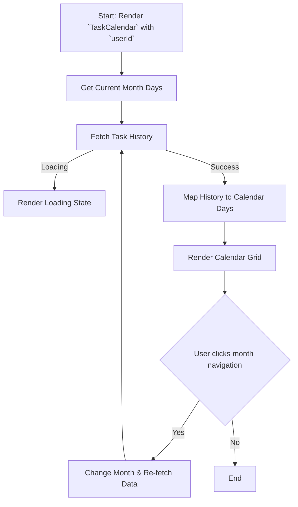
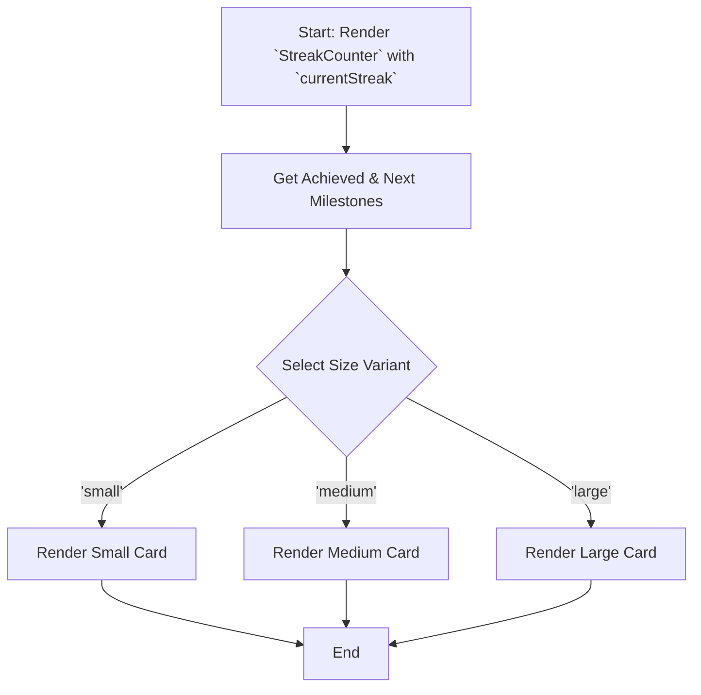

# Module: `TaskCalendar`

## 1. Module Summary

The `TaskCalendar` module displays a calendar view of the user's daily task completion history. It provides a visual representation of the user's consistency and allows them to see which days they completed all, some, or none of their tasks.

## 2. Module Dependencies

* **Internal Dependencies:**
    * `@/components/ui/card`: For the card layout.
    * `@/components/ui/button`: For month navigation buttons.
    * `@/lib/utils`: For the `cn` utility function.
    * `@/lib/daily-task-service`: To fetch the user's task history.
    * `@/lib/types/daily-task`: For the `TaskHistoryRecord` type.
* **External Dependencies:**
    * `react`: For component creation, state, and effects.
    * `lucide-react`: For icons.

## 3. Public API / Exports

* `TaskCalendar: React.FC<TaskCalendarProps>`: The main component that renders the task completion calendar.

## 4. Code File Breakdown

### 4.1. `TaskCalendar.tsx`

* **Purpose:** This file contains the implementation of the `TaskCalendar` component, which fetches and displays the user's task history in a calendar format.
* **Functions:**
    * `getMonthDays(year: number, month: number): DayData[]`: Generates an array of day objects for a given month, including padding for the previous and next months to fill the calendar grid.
    * `TaskCalendar(props: TaskCalendarProps): JSX.Element`: The main React component. It manages the currently displayed month, fetches task history, and renders the calendar grid with completion statuses.
    * `getStatusIndicator(day: DayData)`: Returns an icon indicating the completion status for a given day.
* **Key Classes / Constants / Variables:**
    * `TaskCalendarProps`: The interface for the component's props.
    * `DayData`: An interface representing a single day in the calendar grid.

## 5. System and Data Flow

### 5.1. System Flowchart (Control Flow)



### 5.2. Data Flow Diagram (Data Transformation)

```mermaid
graph LR
    Input(`userId` prop) -- User ID --> Service([dailyTaskService.getTaskHistory]);
    Service -- TaskHistoryRecord[] --> Mod(Module: `TaskCalendar`);
    Mod -- Year, Month --> Func[`getMonthDays()`];
    Func -- DayData[] --> Mod;
    Mod -- Merges History and DayData --> Output(Rendered JSX Calendar);
```

## 6. Usage Example & Testing

* **Usage:**
  ```tsx
  import { TaskCalendar } from '@/components/daily-tasks/TaskCalendar';

  // To display the calendar for a specific user
  <TaskCalendar userId="some-user-id" />
  ```
* **Testing:** Unit tests for this component would be in `tests/components/daily-tasks/TaskCalendar.test.tsx`. They would test the correct generation of the calendar grid, the mapping of task history to calendar days, and the month navigation functionality.


# Module: `StreakCounter`

## 1. Module Summary

The `StreakCounter` module is a visual component designed to display the user's current streak of consecutive daily task completions. It provides motivational feedback by showing the streak number, highlighting achieved milestones, and indicating the next upcoming milestone.

## 2. Module Dependencies

* **Internal Dependencies:**
    * `@/components/ui/card`: For the main card structure.
    * `@/components/ui/badge`: To display achieved milestones.
    * `@/lib/utils`: For the `cn` utility function.
* **External Dependencies:**
    * `react`: For component creation.
    * `lucide-react`: For icons (`Flame`, `Trophy`, `Award`).

## 3. Public API / Exports

* `StreakCounter: React.FC<StreakCounterProps>`: The main component that renders the streak counter.

## 4. Code File Breakdown

### 4.1. `StreakCounter.tsx`

* **Purpose:** This file contains the implementation of the `StreakCounter` component, which visualizes the user's daily task streak.
* **Functions:**
    * `getNextMilestone(currentStreak: number)`: Determines the next milestone the user is working towards.
    * `getAchievedMilestones(currentStreak: number)`: Returns a list of milestones the user has already achieved.
    * `StreakCounter(props: StreakCounterProps): JSX.Element`: The main React component. It takes the current streak as a prop and renders the counter with different sizes and milestone indicators.
* **Key Classes / Constants / Variables:**
    * `StreakCounterProps`: The interface for the component's props.
    * `MILESTONES`: A constant array defining the streak milestones (e.g., 7, 30, 100 days).

## 5. System and Data Flow

### 5.1. System Flowchart (Control Flow)



### 5.2. Data Flow Diagram (Data Transformation)

```mermaid
graph LR
    Input(`currentStreak` prop) -- Number --> Mod(Module: `StreakCounter`);
    Mod -- `currentStreak` --> Func1[`getNextMilestone()`];
    Func1 -- Next Milestone --> Mod;
    Mod -- `currentStreak` --> Func2[`getAchievedMilestones()`];
    Func2 -- Achieved Milestones --> Mod;
    Mod -- Formatted Data --> Output(Rendered JSX Card with streak info);
```

## 6. Usage Example & Testing

* **Usage:**
  ```tsx
  import { StreakCounter } from '@/components/daily-tasks/StreakCounter';

  // To display a medium-sized streak counter
  <StreakCounter currentStreak={15} size="medium" />
  ```
* **Testing:** Unit tests for this component would be located in `tests/components/daily-tasks/StreakCounter.test.tsx`. Tests would verify that the correct milestones are displayed for different streak numbers and that the size variants render correctly.

