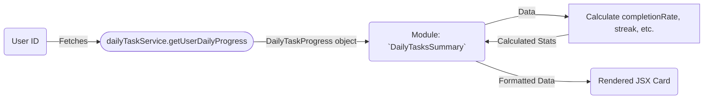
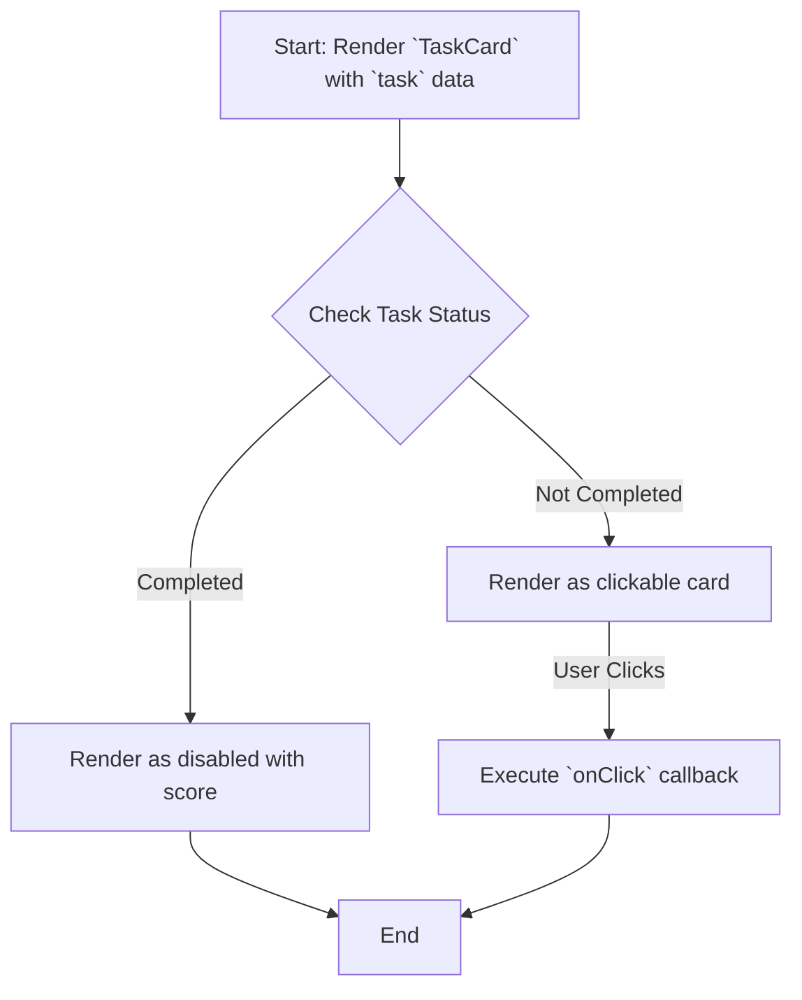

# Module: `DailyTasksSummary`

## 1. Module Summary

The `DailyTasksSummary` module is a dashboard component that provides users with a quick and informative overview of their daily task progress. It displays the number of completed tasks, the user's current streak, and provides a clear call-to-action to navigate to the main daily tasks page. **The component includes automatic task generation logic** - when no progress exists for today, it automatically calls `generateDailyTasks()` to create new tasks (excluding guest users).

## 2. Module Dependencies

* **Internal Dependencies:**
    * `@/components/ui/card`: For the card-based layout.
    * `@/components/ui/button`: For the navigation button.
    * `@/components/ui/progress`: To show the task completion progress bar.
    * `@/components/ui/badge`: To display the user's streak.
    * `@/lib/daily-task-client-service`: To fetch and generate user's daily task progress (uses API routes, not direct SQLite).
    * `@/lib/types/daily-task`: For the `DailyTaskProgress` and `TaskStatus` types.
    * `@/lib/constants`: For `GUEST_USER_ID` to identify guest users.
    * `@/hooks/useAuth`: To get the current authenticated user.
* **External Dependencies:**
    * `react`: For component creation, state, effects, useCallback, and useRef.
    * `lucide-react`: For icons.
    * `next/link`: For client-side navigation.

## 3. Public API / Exports

* `DailyTasksSummary: React.FC`: The main component that renders the daily tasks summary card.

## 4. Code File Breakdown

### 4.1. `DailyTasksSummary.tsx`

* **Purpose:** This file contains the implementation of the `DailyTasksSummary` component, which fetches and displays the user's daily task progress. It includes automatic task generation logic for new users on each day.
* **Functions:**
    * `DailyTasksSummary(): JSX.Element`: The main React component. It fetches the user's daily progress on mount, calculates statistics like completion rate and streak, and renders the summary card with different states for loading, error, no tasks, and progress display.
    * `loadProgress(): Promise<void>`: Internal async function wrapped with `useCallback` to prevent infinite re-renders. Handles the following flow:
      1. Fetches today's progress via `dailyTaskClientService.getUserDailyProgress()`
      2. **Auto-generation logic**: If progress is `null` AND user is NOT a guest (checked via `GUEST_USER_ID`) AND tasks haven't been auto-generated this session (tracked via `hasAutoGeneratedTasksRef`):
         - Sets `hasAutoGeneratedTasksRef.current = true` to prevent duplicate generation
         - Calls `dailyTaskClientService.generateDailyTasks()` to create new tasks
         - Handles ephemeral mode warnings (when persistence unavailable)
         - Refreshes progress after generation
      3. Sets error state if loading fails with Traditional Chinese error message
* **Key Classes / Constants / Variables:**
    * `progress`: State variable holding the `DailyTaskProgress` object.
    * `isLoading`: State variable to manage the loading state.
    * `error`: State variable to hold any error messages.
    * `hasAutoGeneratedTasksRef`: useRef to track if tasks have been auto-generated this session (prevents duplicate generation on re-renders).
* **Guest User Handling:**
    * Guest users (identified by `GUEST_USER_ID`) do NOT trigger auto-generation
    * This prevents generating tasks for anonymous/demo accounts

## 5. System and Data Flow

### 5.1. System Flowchart (Control Flow)

```mermaid
flowchart TD
    A[Start: Render DailyTasksSummary] --> B{useAuth()};
    B -- User exists --> C[loadProgress via useCallback];
    C --> D[Fetch Daily Progress via API];
    D -- Loading --> E[Render Loading Spinner];
    D -- Error --> F[Render Error Message];
    D -- Success --> G{Progress data exists?};
    G -- No --> H{Is Guest User?};
    H -- Yes --> I[Skip auto-generation];
    H -- No --> J{Already auto-generated?};
    J -- Yes --> I;
    J -- No --> K[Auto-generate tasks via API];
    K --> L[Refresh progress];
    L --> M{Progress now exists?};
    M -- Yes --> N[Calculate Stats & Render Summary Card];
    M -- No --> O[Render warning state];
    I --> O;
    G -- Yes --> N;
    N --> P[End];
    O --> P;
    E --> P;
    F --> P;
```

### 5.2. Data Flow Diagram (Data Transformation)



## 6. Usage Example & Testing

* **Usage:**
  ```tsx
  import { DailyTasksSummary } from '@/components/daily-tasks/DailyTasksSummary';

  // On a dashboard page
  <DailyTasksSummary />
  ```
* **Testing:** Unit tests for this component would be located in `tests/components/daily-tasks/DailyTasksSummary.test.tsx`. Tests would cover the loading and error states, the display when no tasks are available, and the correct calculation and display of progress and streak.


# Module: `TaskCard`

## 1. Module Summary

The `TaskCard` module is a component that renders an individual daily task as an interactive card. It displays all essential information about the task, such as its type, difficulty, rewards, and current status, and serves as the entry point for a user to start or view a task.

## 2. Module Dependencies

* **Internal Dependencies:**
    * `@/components/ui/card`: For the card layout.
    * `@/components/ui/badge`: For displaying task difficulty.
    * `@/lib/types/daily-task`: For task-related enums and types (`DailyTask`, `TaskStatus`, etc.).
    * `@/lib/utils`: For the `cn` utility function.
* **External Dependencies:**
    * `react`: For component creation.
    * `lucide-react`: For icons.

## 3. Public API / Exports

* `TaskCard: React.FC<TaskCardProps>`: The main component that renders a single task card.

## 4. Code File Breakdown

### 4.1. `TaskCard.tsx`

* **Purpose:** This file contains the implementation of the `TaskCard` component, which is responsible for visualizing a single daily task.
* **Functions:**
    * `getTaskTypeIcon(type: DailyTaskType)`: Returns an icon for a given task type.
    * `getTaskTypeName(type: DailyTaskType): string`: Returns a human-readable name for a task type.
    * `getDifficultyColor(difficulty: TaskDifficulty): string`: Returns a color class based on task difficulty.
    * `getDifficultyName(difficulty: TaskDifficulty): string`: Returns a human-readable name for a task difficulty.
    * `getStatusIndicator(status: TaskStatus)`: Returns a component displaying the current status of the task.
    * `getAttributeIcon(attributeName: string)`: Returns an icon for a given attribute.
    * `getAttributeName(attributeName: string): string`: Returns a human-readable name for an attribute.
    * `TaskCard(props: TaskCardProps): JSX.Element`: The main React component. It takes task data and status as props and renders the card with all its details and a click handler to open the task.
* **Key Classes / Constants / Variables:**
    * `TaskCardProps`: The interface for the component's props.

## 5. System and Data Flow

### 5.1. System Flowchart (Control Flow)



### 5.2. Data Flow Diagram (Data Transformation)

```mermaid
graph LR
    Input(`task` and `status` props) -- Task Data --> Mod(Module: `TaskCard`);
    Mod -- Task Type --> Func1[`getTaskTypeName()`];
    Func1 -- Name --> Mod;
    Mod -- Difficulty --> Func2[`getDifficultyName()`];
    Func2 -- Name --> Mod;
    Mod -- Status --> Func3[`getStatusIndicator()`];
    Func3 -- Indicator Component --> Mod;
    Mod -- Formatted Data --> Output(Rendered JSX Card);
```

## 6. Usage Example & Testing

* **Usage:**
  ```tsx
  import { TaskCard } from '@/components/daily-tasks/TaskCard';

  const myTask = { ... }; // A DailyTask object

  <TaskCard
    task={myTask}
    status={TaskStatus.NOT_STARTED}
    onClick={() => openTaskModal(myTask)}
  />
  ```
* **Testing:** Unit tests for this component would be in `tests/components/daily-tasks/TaskCard.test.tsx`. They would cover the different visual states based on task status, correct display of all task metadata, and ensuring the `onClick` handler is called appropriately.

---

**Document Version:** 2.0
**Last Updated:** 2025-11-30
**Changes in v2.0:**
- Updated DailyTasksSummary module to document auto-generation logic
- Added `loadProgress()` function documentation with useCallback optimization
- Added guest user handling via `GUEST_USER_ID`
- Added `hasAutoGeneratedTasksRef` documentation
- Updated flowchart to show auto-generation decision tree
- Updated dependencies to use `dailyTaskClientService` instead of direct `dailyTaskService`

