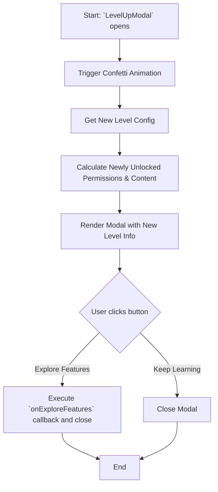

# Module: `LevelUpModal`

## 1. Module Summary

The `LevelUpModal` is a celebratory modal component that appears when a user levels up. It provides positive reinforcement by displaying the new level, and showcasing newly unlocked features and content, thereby motivating continued user engagement.

## 2. Module Dependencies

* **Internal Dependencies:**
    * `@/components/ui/dialog`: For the modal/dialog structure.
    * `@/components/ui/button`: For action buttons within the modal.
    * `@/components/ui/badge`: For displaying unlocked content.
    * `@/components/ui/separator`: For visual separation.
    * `@/hooks/useLanguage`: For internationalization.
    * `./LevelBadge`: To display the new level badge.
    * `@/lib/config/levels-config`: To get level-specific configurations.
    * `@/lib/types/user-level`: For the `LevelPermission` enum.
    * `@/lib/utils`: For the `cn` utility function.
    * `@/lib/translations`: For the `Language` type.
* **External Dependencies:**
    * `react`: For component creation, state, and effects.
    * `lucide-react`: For icons.

## 3. Public API / Exports

* `LevelUpModal(props: LevelUpModalProps)`: The main component for the level-up celebration modal.

## 4. Code File Breakdown

### 4.1. `LevelUpModal.tsx`

* **Purpose:** This file contains the implementation of the `LevelUpModal` component, including its animations, logic for determining newly unlocked features, and handling user interactions.
* **Functions:**
    * `getPermissionName(permission: LevelPermission, t: Function): string`: Translates a permission enum into a human-readable name.
    * `getExclusiveContentName(content: string, t: Function): string`: Translates an exclusive content identifier into a human-readable name.
    * `getNewlyUnlockedPermissions(fromLevel: number, toLevel: number): LevelPermission[]`: Determines which permissions are newly unlocked by comparing the old and new levels.
    * `ConfettiEffect(): JSX.Element`: A simple component to render a CSS-based confetti animation.
    * `LevelUpModal(props: LevelUpModalProps): JSX.Element`: The main component. It orchestrates the display of the modal, including the celebratory animations and the summary of new unlocks.
* **Key Classes / Constants / Variables:**
    * `LevelUpModalProps`: The interface for the component's props.

## 5. System and Data Flow

### 5.1. System Flowchart (Control Flow)



### 5.2. Data Flow Diagram (Data Transformation)

```mermaid
graph LR
    Input(`fromLevel`, `toLevel` props) -- Level Numbers --> Mod(Module: `LevelUpModal`);
    Mod -- Levels --> Func1[`getNewlyUnlockedPermissions()`];
    Func1 -- New Permissions --> Mod;
    Mod -- `toLevel` --> Func2[`getLevelConfig()`];
    Func2 -- New Level Config --> Mod;
    Mod -- Aggregated Data --> Output(Rendered JSX Modal with animations);
```

## 6. Usage Example & Testing

* **Usage:**
  ```tsx
  import { LevelUpModal } from '@/components/gamification/LevelUpModal';

  const [isModalOpen, setModalOpen] = useState(false);

  <LevelUpModal
    open={isModalOpen}
    onOpenChange={setModalOpen}
    fromLevel={2}
    toLevel={3}
  />
  ```
* **Testing:** Unit tests for this component would be in `tests/components/gamification/LevelUpModal.test.tsx`. They would verify that the correct new permissions and content are displayed, and that the `onExploreFeatures` callback is triggered correctly.
