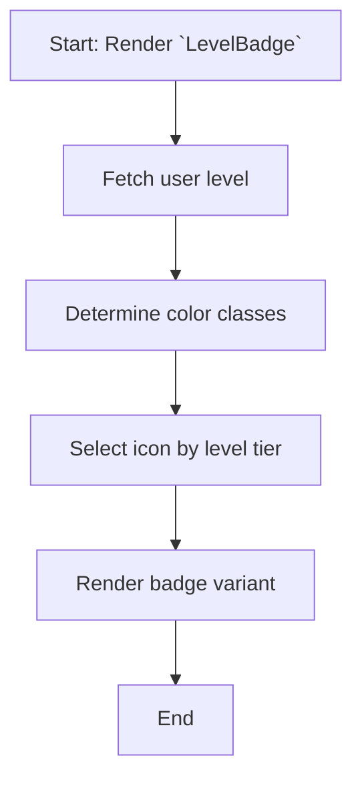

# Module: `LevelBadge`

## 1. Module Summary

The `LevelBadge` module provides a reusable React component to display a user's level within the gamification system. It is designed to be visually appealing and easily integrable into various parts of the application, offering different visual variants to suit different UI contexts.

## 2. Module Dependencies

* **Internal Dependencies:**
    * `@/components/ui/badge`: For rendering the badge UI element.
    * `@/hooks/useAuth`: To access the authenticated user's profile and level.
    * `@/hooks/useLanguage`: For internationalization of level titles.
    * `@/lib/config/levels-config`: To fetch level-specific configuration like titles.
    * `@/lib/utils`: For utility functions like `cn` for merging CSS classes.
* **External Dependencies:**
    * `react`: For component creation and lifecycle.
    * `lucide-react`: For icons (`Trophy`, `Star`, `Sparkles`).

## 3. Public API / Exports

* `LevelBadge(props: LevelBadgeProps)`: The main component function that renders the level badge.

## 4. Code File Breakdown

### 4.1. `LevelBadge.tsx`

* **Purpose:** This file contains the implementation of the `LevelBadge` component, including its variants, styling logic, and data fetching from the user's profile.
* **Functions:**
    * `getLevelColorClasses(level: number): object`: Returns a set of Tailwind CSS classes for styling the badge based on the user's level tier.
    * `getLevelIcon(level: number): Component`: Returns a Lucide icon component appropriate for the user's level tier.
    * `LevelBadge(props: LevelBadgeProps): JSX.Element`: The main component implementation which renders the badge.
* **Key Classes / Constants / Variables:**
    * `LevelBadgeProps`: The interface for the component's props.

## 5. System and Data Flow

### 5.1. System Flowchart (Control Flow)



### 5.2. Data Flow Diagram (Data Transformation)

```mermaid
graph LR
    Input(User Profile) -- Level --> Mod(Module: `LevelBadge`);
    Mod -- Level --> Func1[`getLevelColorClasses()`];
    Func1 -- Classes --> Mod;
    Mod -- Level --> Func2[`getLevelIcon()`];
    Func2 -- Icon --> Mod;
    Mod -- Render --> Output(Rendered Badge);
```

## 6. Usage Example & Testing

* **Usage:**
  ```tsx
  import { LevelBadge } from '@/components/gamification/LevelBadge';

  <LevelBadge variant="solid" />
  ```
* **Testing:** Unit tests would be in `tests/components/gamification/LevelBadge.test.tsx`. Tests should cover variant rendering and correct icon/color mapping per level tier.


# Module: `LevelProgressBar`

## 1. Module Summary

The `LevelProgressBar` module provides a visual representation of a user's progress towards the next level in the gamification system. It supports display variants and integrates with user profile data.

## 2. Module Dependencies

* **Internal Dependencies:**
    * `@/components/ui/progress`: For the base progress UI.
    * `@/hooks/useAuth`: To access user XP values.
    * `@/lib/utils`: For `cn` and format helpers.
* **External Dependencies:**
    * `react`: For component creation.

## 3. Public API / Exports

* `LevelProgressBar(props: LevelProgressBarProps)`

## 4. Code File Breakdown

### 4.1. `LevelProgressBar.tsx`

* **Purpose:** Implements a progress visualization for XP-to-next-level.
* **Functions:**
    * `calculateProgressPercentage(currentXP: number, nextLevelXP: number): number`
    * `getProgressColor(percentage: number): string`
    * `LevelProgressBar(props: LevelProgressBarProps): JSX.Element`
* **Key Classes / Constants / Variables:**
    * `LevelProgressBarProps`: Props interface.

## 5. System and Data Flow

### 5.1. System Flowchart (Control Flow)

```mermaid
flowchart TD
    A[Start: Render `LevelProgressBar`] --> B{useAuth()};
    B -- isLoading --> C[Render Loading Skeleton];
    B -- Has userProfile --> D[Get XP values];
    D --> E[Calculate Progress Percentage];
    E --> F[Get Progress Color];
    F --> G{Show Labels?};
    G -- Yes --> H[Render Labels and Progress Bar];
    G -- No --> I[Render Progress Bar Only];
    H --> J[End];
    I --> J;
```

### 5.2. Data Flow Diagram (Data Transformation)

```mermaid
graph LR
    Input(User Profile or XP props) -- XP Data --> Mod(Module: `LevelProgressBar`);
    Mod -- currentXP, nextLevelXP --> Func1[`calculateProgressPercentage()`];
    Func1 -- Percentage --> Mod;
    Mod -- Percentage --> Func2[`getProgressColor()`];
    Func2 -- Color Class --> Mod;
    Mod -- Formatted Data --> Output(Rendered JSX Progress Bar);
```

## 6. Usage Example & Testing

* **Usage:**
  ```tsx
  import { LevelProgressBar } from '@/components/gamification/LevelProgressBar';

  // To display a progress bar with XP labels
  <LevelProgressBar showLabels />
  ```
* **Testing:** Unit tests for this component would be located in `tests/components/gamification/LevelProgressBar.test.tsx`. The tests would cover correct percentage calculation, color changes, and the loading state.

