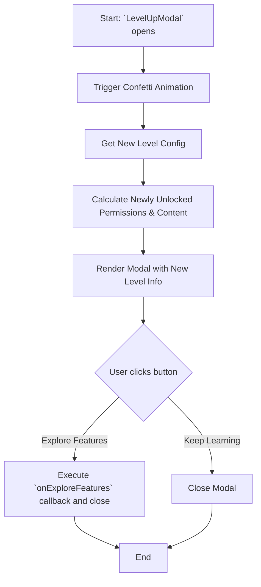

# Module: `LevelDisplay`

## 1. Module Summary

The `LevelDisplay` module provides a comprehensive card component that displays detailed information about a user's level and progress within the gamification system. It integrates other gamification components to present a unified view of the user's current status, rewards, and upcoming unlocks.

## 2. Module Dependencies

* **Internal Dependencies:**
    * `@/components/ui/card`: For the main card structure.
    * `@/components/ui/badge`: For displaying tags and rewards.
    * `@/components/ui/separator`: For visual separation of sections.
    * `@/hooks/useAuth`: To get the current user's profile and level information.
    * `@/hooks/useLanguage`: For internationalization.
    * `./LevelBadge`: To display the user's level in a badge format.
    * `./LevelProgressBar`: To show the user's XP progress.
    * `@/lib/config/levels-config`: To get detailed configuration for each level.
    * `@/lib/types/user-level`: For the `LevelPermission` enum.
    * `@/lib/utils`: For the `cn` utility function.
* **External Dependencies:**
    * `react`: For component creation.
    * `lucide-react`: For icons.

## 3. Public API / Exports

* `LevelDisplay(props: LevelDisplayProps)`: The main component for displaying the user's level information.

## 4. Code File Breakdown

### 4.1. `LevelDisplay.tsx`

* **Purpose:** This file defines the `LevelDisplay` component, which aggregates and displays all information related to a user's gamification level.
* **Functions:**
    * `getPermissionIcon(permission: LevelPermission): React.ElementType`: Returns an icon component based on the permission type.
    * `formatPermissionName(permission: LevelPermission): string`: Converts a permission enum value into a human-readable string.
    * `LevelDisplay(props: LevelDisplayProps): JSX.Element`: The main React component. It fetches user data, level configurations, and renders the detailed level card.
* **Key Classes / Constants / Variables:**
    * `LevelDisplayProps`: Interface for the component's props.

## 5. System and Data Flow

### 5.1. System Flowchart (Control Flow)

```mermaid
flowchart TD
    A[Start: Render `LevelDisplay`] --> B{useAuth()};
    B -- isLoading --> C[Render Loading Skeleton];
    B -- No userProfile --> D[Render 'Not Logged In' Card];
    B -- Has userProfile --> E[Get Level Configs];
    E --> F{Select Variant};
    F -- 'summary' --> G[Render Summary Card];
    F -- 'detailed' --> H[Render Detailed Card];
    G --> I[End];
    H --> I;
```

### 5.2. Data Flow Diagram (Data Transformation)

```mermaid
graph LR
    Input(User Profile) -- User Data --> Mod(Module: `LevelDisplay`);
    Mod -- User Level --> Service[`getLevelConfig()`];
    Service -- Level Config --> Mod;
    Mod -- XP --> SubComponent1([LevelProgressBar]);
    Mod -- Level --> SubComponent2([LevelBadge]);
    SubComponent1 -- Rendered Progress Bar --> Mod;
    SubComponent2 -- Rendered Badge --> Mod;
    Mod -- Aggregated Data --> Output(Rendered JSX Card);
```

## 6. Usage Example & Testing

* **Usage:**
  ```tsx
  import { LevelDisplay } from '@/components/gamification/LevelDisplay';

  // To display a detailed level card for the current user
  <LevelDisplay variant="detailed" showNextLevel />
  ```
* **Testing:** Unit tests for this component would be located in `tests/components/gamification/LevelDisplay.test.tsx`. These tests would cover the different variants, the loading state, and the display for a user who is not logged in.


# Module: `LevelUpModal`

## 1. Module Summary

The `LevelUpModal` is a celebratory modal component that appears when a user levels up. It provides positive reinforcement by displaying the new level, and showcasing newly unlocked features and content, thereby motivating continued user engagement.

## 2. Module Dependencies

* **Internal Dependencies:**
    * `@/components/ui/dialog`: For the modal/dialog structure.
    * `@/components/ui/button`: For action buttons within the modal.
    * `@/components/ui/badge`: For displaying unlocked content.
    * `@/components/ui/separator`: For visual separation.
    * `@/hooks/useLanguage`: For internationalization.
    * `./LevelBadge`: To display the new level badge.
    * `@/lib/config/levels-config`: To get level-specific configurations.
    * `@/lib/types/user-level`: For the `LevelPermission` enum.
    * `@/lib/utils`: For the `cn` utility function.
    * `@/lib/translations`: For the `Language` type.
* **External Dependencies:**
    * `react`: For component creation, state, and effects.
    * `lucide-react`: For icons.

## 3. Public API / Exports

* `LevelUpModal(props: LevelUpModalProps)`: The main component for the level-up celebration modal.

## 4. Code File Breakdown

### 4.1. `LevelUpModal.tsx`

* **Purpose:** This file contains the implementation of the `LevelUpModal` component, including its animations, logic for determining newly unlocked features, and handling user interactions.
* **Functions:**
    * `getPermissionName(permission: LevelPermission, t: Function): string`: Translates a permission enum into a human-readable name.
    * `getExclusiveContentName(content: string, t: Function): string`: Translates an exclusive content identifier into a human-readable name.
    * `getNewlyUnlockedPermissions(fromLevel: number, toLevel: number): LevelPermission[]`: Determines which permissions are newly unlocked by comparing the old and new levels.
    * `ConfettiEffect(): JSX.Element`: A simple component to render a CSS-based confetti animation.
    * `LevelUpModal(props: LevelUpModalProps): JSX.Element`: The main component. It orchestrates the display of the modal, including the celebratory animations and the summary of new unlocks.
* **Key Classes / Constants / Variables:**
    * `LevelUpModalProps`: The interface for the component's props.

## 5. System and Data Flow

### 5.1. System Flowchart (Control Flow)



### 5.2. Data Flow Diagram (Data Transformation)

```mermaid
graph LR
    Input(`fromLevel`, `toLevel` props) -- Level Numbers --> Mod(Module: `LevelUpModal`);
    Mod -- Levels --> Func1[`getNewlyUnlockedPermissions()`];
    Func1 -- New Permissions --> Mod;
    Mod -- `toLevel` --> Func2[`getLevelConfig()`];
    Func2 -- New Level Config --> Mod;
    Mod -- Aggregated Data --> Output(Rendered JSX Modal with animations);
```

## 6. Usage Example & Testing

* **Usage:**
  ```tsx
  import { LevelUpModal } from '@/components/gamification/LevelUpModal';

  const [isModalOpen, setModalOpen] = useState(false);

  <LevelUpModal
    open={isModalOpen}
    onOpenChange={setModalOpen}
    fromLevel={2}
    toLevel={3}
  />
  ```
* **Testing:** Unit tests for this component would be in `tests/components/gamification/LevelUpModal.test.tsx`. They would verify that the correct new permissions and content are displayed, and that the `onExploreFeatures` callback is triggered correctly.

---

**Document Version:** 1.1
**Last Updated:** 2025-11-30
**Notes:** Documentation verified accurate against current implementation. Minor version update to align with documentation audit cycle.

