# Module: `base-migrator.ts`

## 1. Module Summary

The `base-migrator` module provides an abstract migration framework for Firebase-to-SQLite data migrations with reusable utilities for batch processing, validation, error handling, and progress tracking. This abstract class (242 lines) implements common migration patterns: configurable batch processing (default 1000 records), dry-run mode for testing, verbose logging with timestamps, data validation hooks, integrity verification, and performance metrics (records/sec, success rate). Concrete migrators extend this class to implement entity-specific migration logic (validateRecord, migrate, getRecordCount) while inheriting robust error handling, statistics tracking, and Firebase timestamp normalization.

## 2. Module Dependencies

* **Internal Dependencies:**
  * `@/lib/sqlite-db` - Database instance provider (`getDatabase()`).
* **External Dependencies:**
  * `better-sqlite3` - SQLite database type (Database.Database).
* **Usage Pattern:**
  * Extended by concrete migrators: `migrate-highlights.ts`, `migrate-notes.ts`

## 3. Public API / Exports

* **Type Exports:**
  * `FirestoreTimestamp` - Union type for Firebase timestamp formats (toMillis(), seconds, _seconds, number, undefined).
  * `MigrationOptions` - Configuration interface (batchSize, dryRun, verbose, validateData).
  * `MigrationStats` - Statistics interface (totalRecords, successful, failed, skipped, startTime, endTime, duration).

* **Class Export:**
  * `BaseMigrator` (abstract class) - Base migration framework with protected methods and abstract contracts.

* **Utility Export:**
  * `migrationUtils` - Helper functions (generateId, sanitize, checksum).

## 4. Code File Breakdown

### 4.1. `base-migrator.ts` (242 lines)

* **Purpose:** Provides reusable migration infrastructure to eliminate code duplication across entity-specific migrators. Key architectural decisions: (1) **Abstract class pattern** - Forces subclasses to implement validateRecord/migrate/getRecordCount while providing common utilities; (2) **Configurable batch processing** - Prevents memory overflow for large datasets by processing in chunks (default 1000); (3) **Dry-run mode** - Allows testing migration logic without committing to SQLite; (4) **Firebase timestamp normalization** - Handles 4 different Firebase timestamp formats (toMillis(), seconds, _seconds, raw number); (5) **Statistics tracking** - Provides migration metrics for monitoring and debugging; (6) **Integrity verification** - Post-migration count validation ensures data completeness.

* **Abstract Class: BaseMigrator**

  **Protected Properties:**
  - `db: Database.Database` - SQLite database instance from getDatabase()
  - `options: Required<MigrationOptions>` - Merged configuration with defaults (batchSize: 1000, dryRun: false, verbose: false, validateData: true)
  - `stats: MigrationStats` - Real-time migration statistics updated during processing

  **Constructor:**
  - `constructor(options: MigrationOptions = {})` - Initializes DB connection, merges options with defaults, initializes stats with startTime. Example: `new HighlightMigrator({ batchSize: 500, verbose: true, dryRun: true })`.

  **Protected Methods (Available to Subclasses):**

  - `normalizeTimestamp(value: FirestoreTimestamp, fallback: number): number` - **Firebase timestamp normalization**. Handles 4 formats: (1) `toMillis()` method (Firestore admin SDK), (2) `seconds` field (Firestore web SDK v9), (3) `_seconds` field (Firestore web SDK v8), (4) raw number. Returns Unix milliseconds or fallback if null/undefined. Used to convert Firebase timestamps to SQLite INTEGER. Example: `normalizeTimestamp(firestoreDoc.createdAt, Date.now())`.

  - `log(message: string, level: 'info' | 'warn' | 'error' = 'info'): void` - **Timestamped logging**. Formats log with ISO timestamp and emoji prefix (ℹ️/⚠️/❌). Always logs regardless of verbose setting. Example: `[2023-12-21T01:30:56.789Z] ℹ️  Processing batch 1/10 (1000 records)...`.

  - `verbose(message: string): void` - **Conditional verbose logging**. Logs only if `options.verbose === true`. Used for detailed progress tracking without cluttering normal output. Example: `this.verbose('Validating record: highlight-123')`.

  - `processBatch<T>(records: T[], processor: (batch: T[]) => Promise<void>): Promise<void>` - **Batch processing engine**. Slices records array into chunks of `batchSize`. Logs batch progress (batch N/M). Executes processor function per batch. Updates `stats.successfulRecords` on success, `stats.failedRecords` on error. Throws on batch failure (stops migration). Example usage in concrete migrator:
    ```typescript
    await this.processBatch(firebaseHighlights, async (batch) => {
      batchCreateHighlights(batch.map(transformFirebaseToSQLite));
    });
    ```

  **Abstract Methods (Must Be Implemented by Subclasses):**

  - `abstract validateRecord(record: any): boolean` - Validates individual record before migration. Returns true if valid, false to skip record. Subclass implements entity-specific validation logic (required fields, data types, constraints). Example in HighlightMigrator: checks userId, chapterId, selectedText presence.

  - `abstract migrate(): Promise<MigrationStats>` - Executes full migration workflow. Typically: (1) Fetch data from Firebase, (2) Validate records, (3) Process in batches, (4) Update stats, (5) Return stats. Subclass implements entity-specific migration logic.

  - `abstract getRecordCount(): Promise<number>` - Returns current count of migrated records in SQLite. Used by `verifyIntegrity()` for post-migration validation. Example: `return getHighlightCount(userId)` from repository.

  **Public Methods (Available to External Callers):**

  - `getStats(): MigrationStats` - Returns current migration statistics with calculated endTime and duration. Called after migration completes. Returns object with all stats fields.

  - `printSummary(): void` - **Formatted summary output**. Prints 80-char bordered summary table with: Total Records, Successful count+percentage, Failed count, Skipped count, Duration in seconds, Records/sec throughput, Dry Run flag. Example output:
    ```
    ================================================================================
    Migration Summary
    ================================================================================
    Total Records:      1523
    Successful:         1520 (99.8%)
    Failed:             0
    Skipped:            3
    Duration:           5.42s
    Records/sec:        280.4
    Dry Run:            No
    ================================================================================
    ```

  - `verifyIntegrity(expectedCount: number): Promise<boolean>` - **Post-migration validation**. Calls abstract `getRecordCount()` to get actual SQLite count. Compares with expectedCount (from Firebase). Logs comparison and result. Returns true if match, false otherwise. Used to catch migration failures or data loss.

* **Exported Utilities: migrationUtils**

  - `generateId(prefix: string): string` - Generates unique migration ID. Format: `{prefix}-{timestamp}-{random9chars}`. Example: `generateId('highlight')` → `highlight-1703123456789-k3j8f9d2x`. Same pattern as repository ID generation.

  - `sanitize(value: any): string` - SQL string sanitization. Returns empty string for null/undefined. Escapes single quotes by doubling: `'` → `''`. Used for safe SQL string literals (though prepared statements are preferred). Example: `sanitize("O'Brien")` → `O''Brien`.

  - `checksum(data: any): string` - Data validation checksum. JSON.stringifies data, calculates 32-bit hash, returns hex string. Used for data integrity verification (before/after migration comparison). Example: `checksum({ id: '123', text: 'foo' })` → `a3f2c1b5`. Simple hash algorithm (not cryptographic).

## 5. System and Data Flow

### 5.1. Migration Lifecycle Flowchart

```mermaid
flowchart TD
    A[Instantiate Concrete Migrator] --> B[Constructor: Initialize DB, options, stats]
    B --> C[Call migrator.migrate]
    C --> D{Concrete migrate implementation}

    D --> E[Fetch Firebase Data]
    E --> F[Validate Records: validateRecord]
    F --> G{All valid?}
    G -->|Some invalid| H[stats.skippedRecords += N]
    G -->|All valid| I[processBatch: chunk records]

    H --> I
    I --> J{More batches?}
    J -->|Yes| K[Process batch with processor function]
    K --> L{Batch success?}
    L -->|Yes| M[stats.successfulRecords += batchSize]
    L -->|No| N[stats.failedRecords += batchSize]
    N --> O[Throw Error - Stop Migration]

    M --> J
    J -->|No| P[Return getStats]
    P --> Q[Call printSummary]
    Q --> R[Call verifyIntegrity]
    R --> S{Count match?}
    S -->|Yes| T[✅ Migration Complete]
    S -->|No| U[❌ Integrity Fail]
```



### 5.2. Batch Processing Flow


### 5.3. Firebase Timestamp Normalization Decision Tree


### 5.4. Dry Run vs. Production Mode


## 6. Usage Example & Testing

* **Usage (Extending BaseMigrator):**
```typescript
import { BaseMigrator, MigrationOptions, MigrationStats } from './base-migrator';
import { getHighlightCount, batchCreateHighlights } from '@/lib/repositories/highlight-repository';
import { collection, getDocs } from 'firebase/firestore';
import { db as firebaseDb } from '@/lib/firebase';

// ======================================
// Example: Highlight Migrator Implementation
// ======================================
class HighlightMigrator extends BaseMigrator {
  private userId: string;

  constructor(userId: string, options: MigrationOptions = {}) {
    super(options); // Calls BaseMigrator constructor
    this.userId = userId;
  }

  // Implement abstract method: validate individual record
  protected validateRecord(record: any): boolean {
    // Check required fields
    if (!record.userId || !record.chapterId || !record.selectedText) {
      this.verbose(`Skipping invalid record: missing required fields`);
      return false;
    }
    // Check data types
    if (typeof record.chapterId !== 'number') {
      this.verbose(`Skipping invalid record: chapterId not a number`);
      return false;
    }
    return true;
  }

  // Implement abstract method: get SQLite record count
  protected async getRecordCount(): Promise<number> {
    return getHighlightCount(this.userId);
  }

  // Implement abstract method: execute migration
  public async migrate(): Promise<MigrationStats> {
    this.log(`🚀 Starting highlight migration for user: ${this.userId}`);

    // Step 1: Fetch Firebase data
    this.log(`📥 Fetching highlights from Firebase...`);
    const highlightsRef = collection(firebaseDb, 'highlights');
    const snapshot = await getDocs(highlightsRef);

    const firebaseHighlights = snapshot.docs
      .map(doc => ({
        id: doc.id,
        ...doc.data(),
        // Normalize timestamp using inherited method
        createdAt: this.normalizeTimestamp(doc.data().createdAt, Date.now())
      }))
      .filter(h => h.userId === this.userId);

    this.stats.totalRecords = firebaseHighlights.length;
    this.log(`Found ${firebaseHighlights.length} highlights`);

    // Step 2: Validate records
    if (this.options.validateData) {
      this.log(`✅ Validating records...`);
      const validHighlights = firebaseHighlights.filter(h => {
        const isValid = this.validateRecord(h);
        if (!isValid) {
          this.stats.skippedRecords++;
        }
        return isValid;
      });

      this.log(`Valid: ${validHighlights.length}, Skipped: ${this.stats.skippedRecords}`);

      // Step 3: Batch process using inherited method
      if (!this.options.dryRun && validHighlights.length > 0) {
        await this.processBatch(validHighlights, async (batch) => {
          // Transform and insert batch
          const transformed = batch.map(h => ({
            userId: h.userId,
            chapterId: h.chapterId,
            selectedText: h.selectedText
          }));

          batchCreateHighlights(transformed);
          this.verbose(`Batch inserted: ${batch.length} highlights`);
        });
      } else {
        this.log(`Dry run mode: skipping SQLite writes`);
        this.stats.successfulRecords = validHighlights.length;
      }
    }

    this.log(`✅ Migration complete`);
    return this.getStats();
  }
}

// ======================================
// Usage: Run Migration with Options
// ======================================

// Dry run mode (test without writing to SQLite)
const dryRunMigrator = new HighlightMigrator('user123', {
  batchSize: 500,
  dryRun: true,
  verbose: true,
  validateData: true
});

const dryRunStats = await dryRunMigrator.migrate();
dryRunMigrator.printSummary();
// Output:
// [2023-12-21T01:30:56.789Z] ℹ️  🚀 Starting highlight migration for user: user123
// [2023-12-21T01:30:57.123Z] ℹ️  📥 Fetching highlights from Firebase...
// [2023-12-21T01:30:58.456Z] ℹ️  Found 1523 highlights
// [2023-12-21T01:30:58.789Z] ℹ️  ✅ Validating records...
// [2023-12-21T01:30:59.012Z] ℹ️  Valid: 1520, Skipped: 3
// [2023-12-21T01:30:59.234Z] ℹ️  Dry run mode: skipping SQLite writes
// [2023-12-21T01:30:59.345Z] ℹ️  ✅ Migration complete
//
// ================================================================================
// Migration Summary
// ================================================================================
// Total Records:      1523
// Successful:         1520 (99.8%)
// Failed:             0
// Skipped:            3
// Duration:           2.56s
// Records/sec:        593.8
// Dry Run:            Yes
// ================================================================================

// Production migration (actual SQLite writes)
const prodMigrator = new HighlightMigrator('user123', {
  batchSize: 1000,
  dryRun: false, // WRITE TO SQLITE
  verbose: false,
  validateData: true
});

const prodStats = await prodMigrator.migrate();
prodMigrator.printSummary();

// Verify data integrity
const integrityOk = await prodMigrator.verifyIntegrity(1520); // Expected successful count
if (!integrityOk) {
  console.error('❌ Migration integrity check failed!');
  process.exit(1);
}

console.log('✅ Migration completed successfully with integrity verified');

// ======================================
// Using Migration Utilities
// ======================================
import { migrationUtils } from './base-migrator';

// Generate unique ID
const id = migrationUtils.generateId('highlight');
console.log(id); // highlight-1703123456789-k3j8f9d2x

// Sanitize string for SQL (though prepared statements preferred)
const unsafe = "O'Brien's notes";
const safe = migrationUtils.sanitize(unsafe);
console.log(safe); // O''Brien''s notes

// Calculate checksum for validation
const before = { id: '123', text: 'original' };
const checksumBefore = migrationUtils.checksum(before);

// ... perform migration ...

const after = { id: '123', text: 'original' };
const checksumAfter = migrationUtils.checksum(after);

if (checksumBefore === checksumAfter) {
  console.log('✅ Data integrity verified');
} else {
  console.error('❌ Data corruption detected');
}
```

* **Testing Strategy:**

  **Framework Testing (Base Class Functionality):**
  - Test `normalizeTimestamp` handles all 4 Firebase timestamp formats correctly
  - Test `normalizeTimestamp` returns fallback for null/undefined
  - Test `log` formats messages with correct timestamp and emoji
  - Test `verbose` only logs when verbose=true, silent when verbose=false
  - Test `processBatch` splits records into correct batch sizes
  - Test `processBatch` updates successfulRecords count on batch success
  - Test `processBatch` updates failedRecords count on batch error
  - Test `processBatch` throws error and stops on batch failure
  - Test `getStats` calculates duration correctly (endTime - startTime)
  - Test `printSummary` formats output with correct percentages and records/sec
  - Test `verifyIntegrity` returns true when counts match
  - Test `verifyIntegrity` returns false when counts mismatch
  - Test `migrationUtils.generateId` creates unique IDs with correct format
  - Test `migrationUtils.sanitize` escapes single quotes correctly
  - Test `migrationUtils.checksum` generates consistent hash for same data

  **Subclass Testing (Concrete Migrator Implementation):**
  - Test constructor initializes with custom options
  - Test constructor merges options with defaults correctly
  - Test validateRecord returns true for valid records
  - Test validateRecord returns false for invalid records (missing fields)
  - Test validateRecord increments skippedRecords count
  - Test migrate fetches correct count from Firebase
  - Test migrate filters records by userId correctly
  - Test migrate handles empty Firebase collection (0 records)
  - Test migrate in dry-run mode doesn't write to SQLite
  - Test migrate in production mode writes to SQLite correctly
  - Test migrate updates all stats fields (total, successful, failed, skipped)
  - Test getRecordCount returns correct SQLite count

  **Integration Testing (End-to-End):**
  - Test full migration with small dataset (10 records)
  - Test full migration with large dataset (1000+ records)
  - Test migration with validation failures (some invalid records)
  - Test migration with batch errors (simulate SQLite error)
  - Test integrity verification catches count mismatches
  - Test dry-run doesn't modify SQLite database
  - Test production run successfully migrates all valid records
  - Test multiple migrations are idempotent (no duplicates)
  - Test migration performance (records/sec within acceptable range)
