# Module: `migrate-highlights.ts`

## 1. Module Summary

The `migrate-highlights` module provides executable migration script for transferring all highlight records from Firebase Firestore to SQLite database using the BaseMigrator framework. This concrete migrator (213 lines) implements highlight-specific validation (userId string check, chapterId ≥ 1, selectedText non-empty), transformation (Firestore → SQLite format stripping unnecessary fields), batch processing (default 500 records/batch), and integrity verification (count matching). Supports CLI flags for dry-run testing, verbose logging, and validation control, making it production-ready for one-time or incremental migrations.

## 2. Module Dependencies

* **Internal Dependencies:**
  * `./base-migrator` - Abstract migration framework (BaseMigrator, MigrationOptions, MigrationStats).
  * `@/lib/firebase` - Firebase Firestore instance (`db`).
  * `@/lib/repositories/highlight-repository` - SQLite insert function (`batchCreateHighlights`).
* **External Dependencies:**
  * `firebase/firestore` - Firestore operations (collection, getDocs).
* **Execution Environment:**
  * Node.js with tsx runtime (TypeScript execution).
  * NPM scripts: `migrate:highlights`, `migrate:highlights:dry`, `migrate:highlights:verbose`.

## 3. Public API / Exports

* **Class Export:**
  * `HighlightsMigrator extends BaseMigrator` - Concrete migrator with highlight-specific logic.

* **Interfaces (Internal):**
  * `FirestoreHighlight` - Source format (id, userId, chapterId, selectedText, createdAt as Firestore Timestamp).
  * `SQLiteHighlight` - Target format (userId, chapterId, selectedText - no id, no createdAt).

* **NPM Scripts (Command-Line Interface):**
  * `npm run migrate:highlights` - Production migration (writes to SQLite).
  * `npm run migrate:highlights -- --dry-run` - Test mode (no SQLite writes).
  * `npm run migrate:highlights -- --verbose` - Detailed logging.
  * `npm run migrate:highlights -- --no-validate` - Skip validation (dangerous).

## 4. Code File Breakdown

### 4.1. `migrate-highlights.ts` (213 lines)

* **Purpose:** One-time or incremental migration of highlight data from Firebase to SQLite during Phase 2 database transition. Designed for safe, validated, monitorable data transfer with rollback capability (via dry-run testing). Key architectural decisions: (1) **Batch size 500** - Smaller than notes (1000) due to simpler data structure, prioritizes transaction safety over speed; (2) **No timestamp migration** - SQLite repository auto-generates new timestamps, preserving relative order but not exact Firebase timestamps; (3) **Additive migration** - Warns about existing records but doesn't clear, allowing incremental migrations (risk of duplicates); (4) **Validation-first approach** - Validates 100% of records before any writes, preventing partial migrations.

* **Class: HighlightsMigrator extends BaseMigrator**

  **Private Properties:**
  - `highlights: SQLiteHighlight[]` - Temporary storage for transformed highlights (currently unused, could be removed).

  **Protected Methods (Implementing Abstract Contract):**

  - `validateRecord(record: FirestoreHighlight): boolean` - **Highlight-specific validation**. Checks 3 requirements: (1) userId: must exist and be string type, (2) chapterId: must be number type AND ≥ 1 (chapter 0 invalid), (3) selectedText: must exist and be string type (non-empty implicitly required since empty string is truthy but would be invalid highlight). Logs warning with record.id for each validation failure. Returns false to skip record. Used to filter out corrupt/incomplete Firebase data before SQLite insert.

  - `getRecordCount(): Promise<number>` - **SQLite count query**. Executes `SELECT COUNT(*) as count FROM highlights` directly on db instance. Returns total count of highlights in SQLite (all users, all chapters). Used by verifyIntegrity() to validate migration success. Simple implementation (no userId filter).

  **Private Methods (Internal Helpers):**

  - `fetchFirestoreHighlights(): Promise<FirestoreHighlight[]>` - **Firebase fetch operation**. Gets collection reference to 'highlights', executes getDocs() to retrieve all documents. Maps query snapshot to FirestoreHighlight array including doc.id. Logs fetched count. Returns complete dataset (no pagination - suitable for datasets <10k records). Note: For very large datasets (>10k), would need pagination using startAfter().

  - `transformHighlight(firestoreHighlight: FirestoreHighlight): SQLiteHighlight` - **Data structure transformation**. Strips fields not needed in SQLite: (1) Removes `id` - SQLite repository generates new IDs, (2) Removes `createdAt` - SQLite repository generates new timestamps. Returns minimal object with only 3 required fields. Simple transformation (no data type conversion needed for these fields).

  **Public Methods (Main Execution):**

  - `migrate(): Promise<MigrationStats>` - **Main migration workflow**. Executes 7-step migration process:

    **Step 1: Fetch** - Calls fetchFirestoreHighlights(). Sets stats.totalRecords. Early return if 0 records (nothing to migrate).

    **Step 2: Validate & Transform** - Iterates all Firestore highlights. For each: (1) Calls validateRecord() if validateData enabled, (2) Increments skippedRecords if invalid, (3) Calls transformHighlight() if valid, (4) Collects in validHighlights array. Logs validation summary (valid count, skipped count).

    **Step 3: Dry Run Check** - If dryRun flag: logs warning, logs "would migrate" count, sets stats.successfulRecords = validHighlights.length (simulates success), returns early (no SQLite operations).

    **Step 4: Existing Data Check** - Calls getRecordCount() to check SQLite. If > 0: logs warning about existing records, logs "may cause duplicates" notice. Does NOT clear existing data (additive migration design). Stores existingCount for integrity verification.

    **Step 5: Batch Insert** - Calls inherited processBatch() with validHighlights array and batch processor lambda. Batch processor calls batchCreateHighlights(batch) from repository. Batch size from options (default 500). Updates stats.successfulRecords automatically via processBatch().

    **Step 6: Verify Final Count** - Calls getRecordCount() again. Logs final SQLite count for user confirmation.

    **Step 7: Integrity Check** - Calculates expectedCount = existingCount + validHighlights.length. Calls inherited verifyIntegrity(expectedCount). Logs integrity result.

    Returns getStats(). Catches errors: logs error, re-throws to caller. Finally: always calls printSummary() for user feedback (even on error).

* **Main Execution Function**

  - `main(): async function` - **CLI entry point**. Parses command-line arguments from process.argv. Constructs MigrationOptions: (1) batchSize: hardcoded 500, (2) dryRun: true if --dry-run flag present, (3) verbose: true if --verbose OR -v flag present, (4) validateData: true unless --no-validate flag present (defaults to safe). Instantiates HighlightsMigrator with options. Calls migrate() with try-catch. Exits process with code 0 (success) or 1 (failure). Process exit ensures script completion (no hanging connections).

* **Module Execution Guard**

  - `if (require.main === module)` - Checks if file is executed directly (not imported). Calls main() if true. Allows script to be both executable (npm run) and importable (for testing). Example: `tsx migrate-highlights.ts` runs migration, `import { HighlightsMigrator } from './migrate-highlights'` allows testing.

## 5. System and Data Flow

### 5.1. End-to-End Migration Flow

```mermaid
flowchart TD
    Start[npm run migrate:highlights] --> ParseArgs[Parse CLI Arguments<br/>--dry-run, --verbose, --no-validate]
    ParseArgs --> Instantiate[new HighlightsMigrator options]
    Instantiate --> MigrateCall[Call migrator.migrate]

    MigrateCall --> Step1[Step 1: Fetch Firebase<br/>getDocs 'highlights' collection]
    Step1 --> CheckEmpty{Empty?}
    CheckEmpty -->|Yes| EarlyReturn[Log: Nothing to migrate<br/>Return stats]
    CheckEmpty -->|No| Step2[Step 2: Validate & Transform<br/>Loop all records]

    Step2 --> ValidateLoop{For each record}
    ValidateLoop --> ValidateCheck{validateRecord?}
    ValidateCheck -->|Invalid| Skip[stats.skippedRecords++]
    ValidateCheck -->|Valid| Transform[transformHighlight<br/>Strip id & createdAt]

    Skip --> ValidateLoop
    Transform --> Collect[Collect in validHighlights]
    Collect --> ValidateLoop

    ValidateLoop -->|Done| Step3{Step 3: Dry Run?}
    Step3 -->|Yes| DryLog[Log: Would migrate N records<br/>stats.successful = N]
    DryLog --> ReturnEarly[Return stats<br/>No SQLite writes]

    Step3 -->|No| Step4[Step 4: Check Existing<br/>SELECT COUNT FROM highlights]
    Step4 --> Warn{Count > 0?}
    Warn -->|Yes| WarnLog[Log: Warning duplicates possible]
    Warn -->|No| OK[OK to proceed]

    WarnLog --> Step5[Step 5: Batch Insert<br/>processBatch 500 records/batch]
    OK --> Step5

    Step5 --> BatchLoop{More batches?}
    BatchLoop -->|Yes| InsertBatch[batchCreateHighlights batch]
    InsertBatch --> BatchLoop
    BatchLoop -->|No| Step6[Step 6: Verify Count<br/>SELECT COUNT again]

    Step6 --> Step7[Step 7: Integrity Check<br/>expected vs actual]
    Step7 --> CheckMatch{Counts match?}
    CheckMatch -->|Yes| Success[✅ Success<br/>printSummary]
    CheckMatch -->|No| Fail[❌ Integrity Fail<br/>printSummary]

    Success --> Exit0[process.exit 0]
    Fail --> Exit1[process.exit 1]
    EarlyReturn --> Exit0
    ReturnEarly --> Exit0
```



### 5.2. Data Transformation Flow (Firestore → SQLite)


### 5.3. CLI Flags Decision Tree

```mermaid
flowchart TD
    CLI[npm run migrate:highlights FLAGS] --> Check1{--dry-run?}
    Check1 -->|Yes| DryMode[dryRun: true<br/>No SQLite writes]
    Check1 -->|No| ProdMode[dryRun: false<br/>Write to SQLite]

    DryMode --> Check2{--verbose or -v?}
    ProdMode --> Check2

    Check2 -->|Yes| VerboseOn[verbose: true<br/>Detailed logs]
    Check2 -->|No| VerboseOff[verbose: false<br/>Normal logs]

    VerboseOn --> Check3{--no-validate?}
    VerboseOff --> Check3

    Check3 -->|Yes| NoValidate[validateData: false<br/>⚠️  Skip validation]
    Check3 -->|No| Validate[validateData: true<br/>Validate all records]

    NoValidate --> Execute[Execute Migration]
    Validate --> Execute

    Execute --> Result{Success?}
    Result -->|Yes| Exit0[exit 0]
    Result -->|No| Exit1[exit 1]

    style NoValidate fill:#FFB6C1
    style Exit0 fill:#90EE90
    style Exit1 fill:#FFB6C1
```



### 5.4. Batch Processing with Error Handling


## 6. Usage Example & Testing

* **Usage (Command-Line Execution):**

```bash
# ======================================
# Production Migration (Actual SQLite Write)
# ======================================
npm run migrate:highlights

# Output:
# ================================================================================
# 🚀 Starting Highlights Migration: Firebase → SQLite
# ================================================================================
# [2023-12-21T01:30:56.789Z] ℹ️  📥 Fetching highlights from Firestore...
# [2023-12-21T01:30:58.123Z] ℹ️  ✅ Fetched 1523 highlights from Firestore
# [2023-12-21T01:30:58.456Z] ℹ️  🔍 Validating and transforming records...
# [2023-12-21T01:30:59.789Z] ℹ️  ✅ Validated 1520 highlights (skipped 3)
# [2023-12-21T01:30:59.890Z] ⚠️  Found 0 existing highlights in SQLite
# [2023-12-21T01:31:00.012Z] ℹ️  📝 Inserting highlights into SQLite...
# [2023-12-21T01:31:00.234Z] ℹ️  Processing batch 1/4 (500 records)...
# [2023-12-21T01:31:00.567Z] ℹ️  Processing batch 2/4 (500 records)...
# [2023-12-21T01:31:00.890Z] ℹ️  Processing batch 3/4 (500 records)...
# [2023-12-21T01:31:01.123Z] ℹ️  Processing batch 4/4 (20 records)...
# [2023-12-21T01:31:01.345Z] ℹ️  ✅ Migration completed. SQLite now contains 1520 highlights
# [2023-12-21T01:31:01.456Z] ℹ️  📊 Integrity Check:
# [2023-12-21T01:31:01.567Z] ℹ️  Expected records: 1520
# [2023-12-21T01:31:01.678Z] ℹ️  Actual records:   1520
# [2023-12-21T01:31:01.789Z] ℹ️  ✅ Integrity check passed
#
# ================================================================================
# Migration Summary
# ================================================================================
# Total Records:      1523
# Successful:         1520 (99.8%)
# Failed:             0
# Skipped:            3
# Duration:           4.89s
# Records/sec:        310.8
# Dry Run:            No
# ================================================================================

# ======================================
# Dry Run Mode (Test Without Writing)
# ======================================
npm run migrate:highlights -- --dry-run

# Output:
# ================================================================================
# 🚀 Starting Highlights Migration: Firebase → SQLite
# ================================================================================
# [2023-12-21T01:35:00.123Z] ℹ️  📥 Fetching highlights from Firestore...
# [2023-12-21T01:35:01.456Z] ℹ️  ✅ Fetched 1523 highlights from Firestore
# [2023-12-21T01:35:01.789Z] ℹ️  🔍 Validating and transforming records...
# [2023-12-21T01:35:02.012Z] ℹ️  ✅ Validated 1520 highlights (skipped 3)
# [2023-12-21T01:35:02.123Z] ⚠️  🔍 DRY RUN MODE - No data will be written to SQLite
# [2023-12-21T01:35:02.234Z] ⚠️  Would migrate 1520 highlights
#
# ================================================================================
# Migration Summary
# ================================================================================
# Total Records:      1523
# Successful:         1520 (99.8%)
# Failed:             0
# Skipped:            3
# Duration:           2.11s
# Records/sec:        720.4
# Dry Run:            Yes
# ================================================================================

# ======================================
# Verbose Mode (Detailed Logging)
# ======================================
npm run migrate:highlights -- --verbose

# Additional output includes:
# [2023-12-21T01:40:00.123Z] ℹ️  Batch inserted: 500 highlights
# [2023-12-21T01:40:00.456Z] ℹ️  Batch inserted: 500 highlights
# ... detailed per-batch logs ...

# ======================================
# Combined Flags
# ======================================
npm run migrate:highlights -- --dry-run --verbose
npm run migrate:highlights -- --verbose --no-validate  # ⚠️  DANGEROUS

# ======================================
# Error Scenarios
# ======================================

# No Firebase data:
# ⚠️  No highlights found in Firestore. Nothing to migrate.
# exit 0

# Batch failure (e.g., SQLite error):
# ❌ Batch 2 failed: SQLITE_CONSTRAINT: UNIQUE constraint failed: highlights.id
# ❌ Migration failed: SQLITE_CONSTRAINT: UNIQUE constraint failed: highlights.id
# exit 1

# Integrity check failure:
# ❌ Integrity check failed: count mismatch
# Expected records: 1520
# Actual records:   1400
# exit 1 (though migration completed, indicates data loss)
```

* **Testing Strategy:**

  **Unit Testing (HighlightsMigrator Class):**
  - Test validateRecord returns true for valid highlight (all fields present, correct types)
  - Test validateRecord returns false for missing userId
  - Test validateRecord returns false for non-string userId
  - Test validateRecord returns false for missing chapterId
  - Test validateRecord returns false for non-number chapterId
  - Test validateRecord returns false for chapterId < 1 (chapter 0 invalid)
  - Test validateRecord returns false for missing selectedText
  - Test validateRecord returns false for non-string selectedText
  - Test transformHighlight strips id field correctly
  - Test transformHighlight strips createdAt field correctly
  - Test transformHighlight preserves userId, chapterId, selectedText
  - Test getRecordCount returns correct SQLite count
  - Test getRecordCount with empty database returns 0
  - Test fetchFirestoreHighlights returns all Firestore highlights
  - Test fetchFirestoreHighlights maps doc.id correctly
  - Test fetchFirestoreHighlights handles empty collection (0 records)

  **Integration Testing (Full Migration Flow):**
  - Test migrate with empty Firebase collection (early return, 0 records)
  - Test migrate with small dataset (10 highlights) completes successfully
  - Test migrate with large dataset (1000+ highlights) completes successfully
  - Test migrate with some invalid records (validation skips, logs warnings)
  - Test migrate in dry-run mode doesn't write to SQLite
  - Test migrate in production mode writes to SQLite correctly
  - Test migrate with existing SQLite data (warns, adds records)
  - Test migrate updates all stats fields (total, successful, skipped)
  - Test migrate calls printSummary after completion
  - Test migrate calls verifyIntegrity with correct expected count
  - Test migrate with batch error (stops migration, throws error)
  - Test migrate calculates records/sec correctly
  - Test migrate handles Firebase connection errors gracefully

  **CLI Testing (Command-Line Arguments):**
  - Test --dry-run flag enables dryRun option
  - Test --verbose flag enables verbose option
  - Test -v flag enables verbose option (short form)
  - Test --no-validate flag disables validation
  - Test multiple flags combined work correctly
  - Test invalid flags are ignored (doesn't break execution)
  - Test process exits with code 0 on success
  - Test process exits with code 1 on error

  **Regression Testing (Data Integrity):**
  - Test migrated highlights match Firebase highlights (userId, chapterId, selectedText)
  - Test SQLite count matches expected count (Firebase valid count)
  - Test no duplicate highlights created (if idempotent design added)
  - Test special characters in selectedText preserved (quotes, unicode)
  - Test very long selectedText (>1000 chars) migrated correctly
  - Test batch boundaries don't cause data corruption (records 499-501)
  - Test last batch (partial batch) inserts correctly (e.g., 23 records)

  **Performance Testing:**
  - Test migration of 1000 highlights completes in < 10 seconds
  - Test migration of 10000 highlights completes in < 60 seconds
  - Test batch processing overhead is minimal (< 10% vs single transaction)
  - Test dry-run is faster than production (no SQLite I/O)
  - Test verbose mode doesn't significantly slow migration (< 20% overhead)
