# Module: `migrate-notes.ts`

> **⚠️ DEPRECATION NOTICE (2025-11-30):**
> This migration script has been moved to `scripts/obsolete-migrations/migrate-notes.ts`. The Firebase-to-SQLite migration has been completed and these scripts are preserved for historical reference only. The modern database approach uses **Turso libSQL async client** directly. **Do not use for new migrations.**

## 1. Module Summary

The `migrate-notes` module provides executable migration script for transferring all note records from Firebase Firestore to SQLite database with comprehensive feature preservation validation. This concrete migrator (309 lines) extends BaseMigrator with note-specific validation (userId, chapterId, selectedText, note content, tags array check, isPublic boolean check), transformation with defaults (tags→[], isPublic→false), feature statistics tracking (tags usage %, public notes %, typed notes %, avg word count), and post-migration feature verification queries (ensuring tags/visibility/types preserved correctly in SQLite). Supports same CLI flags as highlight migration (dry-run, verbose, no-validate) with batch processing (default 500 records).

## 2. Module Dependencies

* **Internal Dependencies:**
  * `./base-migrator` - Abstract migration framework (BaseMigrator, MigrationOptions, MigrationStats).
  * `@/lib/firebase` - Firebase Firestore instance (`db`).
  * `@/lib/repositories/note-repository` - SQLite insert function (`batchCreateNotes`).
* **External Dependencies:**
  * `firebase/firestore` - Firestore operations (collection, getDocs).
* **Execution Environment:**
  * Node.js with tsx runtime (TypeScript execution).
  * NPM scripts: `migrate:notes`, `migrate:notes:dry`, `migrate:notes:verbose`.

## 3. Public API / Exports

* **Class Export:**
  * `NotesMigrator extends BaseMigrator` - Concrete migrator with note-specific logic and feature tracking.

* **Interfaces (Internal):**
  * `FirestoreNote` - Source format (id, userId, chapterId, selectedText, note, createdAt, lastModified, tags?, isPublic?, wordCount?, noteType?).
  * `SQLiteNote` - Target format (userId, chapterId, selectedText, note, tags?, isPublic?, wordCount?, noteType? - no id, no timestamps).

* **NPM Scripts (Command-Line Interface):**
  * `npm run migrate:notes` - Production migration (writes to SQLite).
  * `npm run migrate:notes -- --dry-run` - Test mode (no SQLite writes).
  * `npm run migrate:notes -- --verbose` - Detailed logging.
  * `npm run migrate:notes -- --no-validate` - Skip validation (dangerous).

## 4. Code File Breakdown

### 4.1. `migrate-notes.ts` (309 lines)

* **Purpose:** One-time or incremental migration of note data from Firebase to SQLite with feature preservation guarantees. More complex than highlight migration due to: (1) **Optional fields** - tags, isPublic, wordCount, noteType may be missing in Firebase; (2) **Default values** - Must apply defaults (tags→[], isPublic→false) to maintain data consistency; (3) **Feature tracking** - Calculates statistics on tags usage, public sharing, note typing, word counts for migration validation; (4) **Feature verification** - Post-migration queries verify tags/visibility/types preserved correctly in SQLite (not just count matching).

* **Class: NotesMigrator extends BaseMigrator**

  **Private Properties:**
  - `notes: SQLiteNote[]` - Temporary storage for transformed notes (currently unused, could be removed or used for pre-validation).

  **Protected Methods (Implementing Abstract Contract):**

  - `validateRecord(record: FirestoreNote): boolean` - **Comprehensive note validation**. Checks 6 requirements: (1) userId: must exist and be string, (2) chapterId: must be number AND ≥ 1, (3) selectedText: must exist and be string (non-empty), (4) note: must exist and be string (note content required), (5) tags (if present): must be Array type (not string or object), (6) isPublic (if present): must be boolean type (not string '0'/'1'). Logs warning with record.id for each validation failure. Returns false to skip record. More thorough than highlight validation due to optional fields with strict type requirements.

  - `getRecordCount(): Promise<number>` - **SQLite count query**. Executes `SELECT COUNT(*) as count FROM notes`. Returns total count of notes in SQLite (all users, all chapters). Simple implementation matching highlight migrator.

  **Private Methods (Internal Helpers):**

  - `fetchFirestoreNotes(): Promise<FirestoreNote[]>` - **Firebase fetch with explicit field mapping**. Gets collection reference to 'notes', executes getDocs(). Maps each doc to FirestoreNote with **explicit field assignment** (not spread operator) to ensure type safety: userId, chapterId, selectedText, note, createdAt, lastModified, tags, isPublic, wordCount, noteType. Logs fetched count. Returns complete dataset. Note: More explicit than highlight fetcher to handle optional fields correctly.

  - `transformNote(firestoreNote: FirestoreNote): SQLiteNote` - **Data structure transformation with defaults**. Strips fields: (1) Removes `id` - SQLite repository generates new IDs, (2) Removes `createdAt` and `lastModified` - SQLite repository generates new timestamps. **Applies defaults**: (1) `tags: firestoreNote.tags || []` - empty array if missing (SQLite expects JSON array, not null), (2) `isPublic: firestoreNote.isPublic || false` - defaults to private if missing (safer default). Preserves optional fields: wordCount, noteType (can be undefined). Returns SQLiteNote object ready for batch insert.

  - `getFeatureStats(notes: FirestoreNote[]): object` - **Feature usage statistics calculation**. Analyzes Firebase notes to calculate 4 metrics: (1) **withTags**: Count of notes with tags array AND length > 0, (2) **public**: Count of notes with isPublic = true, (3) **typed**: Count of notes with noteType field defined (not null/undefined), (4) **avgWordCount**: Sum of all wordCounts / total notes (rounded). Used for: (1) Migration progress reporting (show what features are being migrated), (2) Post-migration validation (verify SQLite counts match Firebase), (3) User insights (understand data composition before migration). Returns object with 4 numeric fields.

  **Public Methods (Main Execution):**

  - `migrate(): Promise<MigrationStats>` - **Main migration workflow with 8 steps** (2 more than highlight migration):

    **Step 1: Fetch** - Calls fetchFirestoreNotes(). Sets stats.totalRecords. Early return if 0 records.

    **Step 1.5: Feature Statistics** - Calls getFeatureStats(firestoreNotes). Logs formatted table showing: Notes with tags (count + %), Public notes (count + %), Typed notes (count + %), Avg word count (number). Provides visibility into data composition before migration starts.

    **Step 2: Validate & Transform** - Iterates all Firestore notes. For each: (1) Calls validateRecord() if validateData enabled, (2) Increments skippedRecords if invalid, (3) Calls transformNote() if valid (applies defaults), (4) Collects in validNotes array. Logs validation summary.

    **Step 3: Dry Run Check** - If dryRun flag: logs warning, logs "would migrate" count, sets stats.successfulRecords, returns early (no SQLite operations).

    **Step 4: Existing Data Check** - Calls getRecordCount(). If > 0: logs warning, logs "duplicates may occur". Stores existingCount for integrity calculation.

    **Step 5: Batch Insert** - Calls inherited processBatch() with validNotes and batchCreateNotes(). Batch size 500 (same as highlights). Updates stats.successfulRecords.

    **Step 6: Verify Final Count** - Calls getRecordCount(). Logs final SQLite count.

    **Step 7: Feature Preservation Verification** - **Unique to note migration**. Executes 3 SQLite verification queries: (1) `SELECT COUNT(*) WHERE isPublic = 1` → public note count, (2) `SELECT COUNT(*) WHERE tags != '[]'` → tagged note count (non-empty tags JSON), (3) `SELECT COUNT(*) WHERE noteType IS NOT NULL` → typed note count. Logs comparison with expected counts from featureStats. Helps catch feature corruption (e.g., tags lost during JSON serialization, isPublic boolean conversion failed).

    **Step 8: Integrity Check** - Calculates expectedCount = existingCount + validNotes.length. Calls inherited verifyIntegrity(expectedCount). Logs integrity result.

    Returns getStats(). Catches errors: logs, re-throws. Finally: always calls printSummary().

* **Main Execution Function & Module Guard**

  - Same pattern as highlight migrator: main() parses CLI args, constructs options (batchSize: 500, dryRun, verbose, validateData), instantiates NotesMigrator, calls migrate(), handles errors, exits with 0/1 code. Module guard allows both execution and import.

## 5. System and Data Flow

### 5.1. End-to-End Migration Flow with Feature Tracking

```mermaid
flowchart TD
    Start[npm run migrate:notes] --> ParseArgs[Parse CLI Arguments]
    ParseArgs --> Instantiate[new NotesMigrator options]
    Instantiate --> Step1[Step 1: Fetch Firebase<br/>getDocs 'notes' collection]

    Step1 --> CheckEmpty{Empty?}
    CheckEmpty -->|Yes| EarlyReturn[Return: Nothing to migrate]

    CheckEmpty -->|No| StatsCalc[Step 1.5: Calculate Feature Stats<br/>withTags, public, typed, avgWordCount]
    StatsCalc --> LogStats[Log Feature Statistics Table<br/>Tags: 42%, Public: 15%, Typed: 30%, Avg: 45 words]

    LogStats --> Step2[Step 2: Validate & Transform<br/>validateRecord + transformNote]
    Step2 --> ValidateLoop{For each note}

    ValidateLoop --> ValidateCheck{Valid?}
    ValidateCheck -->|Invalid| Skip[stats.skippedRecords++]
    ValidateCheck -->|Valid| Transform[transformNote<br/>Apply defaults: tags→[], isPublic→false]

    Skip --> ValidateLoop
    Transform --> Collect[Collect in validNotes]
    Collect --> ValidateLoop

    ValidateLoop -->|Done| Step3{Step 3: Dry Run?}
    Step3 -->|Yes| DryReturn[Return: Would migrate N notes]

    Step3 -->|No| Step4[Step 4: Check Existing Count]
    Step4 --> Step5[Step 5: Batch Insert<br/>batchCreateNotes 500/batch]

    Step5 --> Step6[Step 6: Verify Final Count]
    Step6 --> Step7[Step 7: Feature Verification<br/>Query public/tagged/typed counts]

    Step7 --> CompareFeatures[Compare SQLite vs Firebase stats]
    CompareFeatures --> Step8[Step 8: Integrity Check<br/>Count match?]

    Step8 --> CheckMatch{Match?}
    CheckMatch -->|Yes| Success[✅ Success]
    CheckMatch -->|No| Fail[❌ Integrity Fail]

    Success --> Summary[printSummary<br/>With feature preservation report]
    Fail --> Summary
    Summary --> Exit

    style LogStats fill:#FFD700
    style CompareFeatures fill:#FFD700
```

### 5.2. Feature Preservation Validation Flow

```mermaid
flowchart TD
    Firebase[(Firebase Notes<br/>1000 total)] --> Analyze[getFeatureStats]

    Analyze --> FirebaseStats[Firebase Stats:<br/>420 with tags 42%<br/>150 public 15%<br/>300 typed 30%]

    FirebaseStats --> Migrate[Run Migration]
    Migrate --> SQLite[(SQLite notes table<br/>1000 migrated)]

    SQLite --> Query1[SELECT COUNT WHERE isPublic=1]
    SQLite --> Query2[SELECT COUNT WHERE tags != '[]']
    SQLite --> Query3[SELECT COUNT WHERE noteType IS NOT NULL]

    Query1 --> Count1[Public: 150]
    Query2 --> Count2[Tagged: 420]
    Query3 --> Count3[Typed: 300]

    Count1 --> Compare[Compare Counts]
    Count2 --> Compare
    Count3 --> Compare
    FirebaseStats --> Compare

    Compare --> Match{All match?}
    Match -->|Yes| FeatureOK[✅ Feature Preservation Verified]
    Match -->|No| FeatureFail[❌ Feature Loss Detected<br/>Investigate JSON/boolean conversion]

    style FirebaseStats fill:#87CEEB
    style FeatureOK fill:#90EE90
    style FeatureFail fill:#FFB6C1
```

### 5.3. Data Transformation with Defaults

```mermaid
graph LR
    Firebase[FirestoreNote:<br/>tags: undefined<br/>isPublic: undefined<br/>wordCount: undefined<br/>noteType: undefined] --> Transform[transformNote]

    Transform --> Defaults[Apply Defaults:<br/>tags → []<br/>isPublic → false]

    Defaults --> Optional[Preserve Optional:<br/>wordCount → undefined<br/>noteType → undefined]

    Optional --> SQLite[SQLiteNote:<br/>tags: []<br/>isPublic: false<br/>wordCount: undefined<br/>noteType: undefined]

    SQLite --> Repo[note-repository]
    Repo --> Serialize[JSON.stringify tags → '[]'<br/>isPublic boolean → 0]

    Serialize --> DB[(SQLite DB:<br/>tags TEXT: '[]'<br/>isPublic INTEGER: 0<br/>wordCount INTEGER: NULL<br/>noteType TEXT: NULL)]

    style Defaults fill:#FFD700
    style DB fill:#90EE90
```

### 5.4. Validation Decision Tree (Complex Rules)

```mermaid
flowchart TD
    Record[FirestoreNote] --> Check1{userId exists<br/>and is string?}
    Check1 -->|No| Invalid1[Invalid: userId missing/wrong type]

    Check1 -->|Yes| Check2{chapterId exists<br/>and is number ≥ 1?}
    Check2 -->|No| Invalid2[Invalid: chapterId missing/wrong type/< 1]

    Check2 -->|Yes| Check3{selectedText exists<br/>and is string?}
    Check3 -->|No| Invalid3[Invalid: selectedText missing/wrong type]

    Check3 -->|Yes| Check4{note exists<br/>and is string?}
    Check4 -->|No| Invalid4[Invalid: note content missing/wrong type]

    Check4 -->|Yes| Check5{tags defined?}
    Check5 -->|No| Check6
    Check5 -->|Yes| Check5a{tags is Array?}
    Check5a -->|No| Invalid5[Invalid: tags not array<br/>e.g., string or object]
    Check5a -->|Yes| Check6{isPublic defined?}

    Check6 -->|No| Valid[✅ Valid Record]
    Check6 -->|Yes| Check6a{isPublic is boolean?}
    Check6a -->|No| Invalid6[Invalid: isPublic not boolean<br/>e.g., string '0'/'1']
    Check6a -->|Yes| Valid

    Invalid1 --> Skip[stats.skippedRecords++]
    Invalid2 --> Skip
    Invalid3 --> Skip
    Invalid4 --> Skip
    Invalid5 --> Skip
    Invalid6 --> Skip

    Valid --> Transform[transformNote]
    Skip --> End[Continue to next record]

    style Valid fill:#90EE90
    style Skip fill:#FFB6C1
```



## 6. Usage Example & Testing

* **Usage (Command-Line Execution with Feature Tracking):**

```bash
# ======================================
# Production Migration with Feature Stats
# ======================================
npm run migrate:notes

# Output:
# ================================================================================
# 🚀 Starting Notes Migration: Firebase → SQLite
# ================================================================================
# [2023-12-21T02:00:00.123Z] ℹ️  📥 Fetching notes from Firestore...
# [2023-12-21T02:00:02.456Z] ℹ️  ✅ Fetched 1250 notes from Firestore
#
# 📊 Note Feature Statistics:
#    Notes with tags:     525 (42.0%)
#    Public notes:        188 (15.0%)
#    Typed notes:         375 (30.0%)
#    Avg. word count:     45 words
#
# [2023-12-21T02:00:02.789Z] ℹ️  🔍 Validating and transforming records...
# [2023-12-21T02:00:04.012Z] ℹ️  ✅ Validated 1245 notes (skipped 5)
# [2023-12-21T02:00:04.123Z] ⚠️  Found 0 existing notes in SQLite
# [2023-12-21T02:00:04.234Z] ℹ️  📝 Inserting notes into SQLite...
# [2023-12-21T02:00:04.567Z] ℹ️  Processing batch 1/3 (500 records)...
# [2023-12-21T02:00:05.890Z] ℹ️  Processing batch 2/3 (500 records)...
# [2023-12-21T02:00:07.123Z] ℹ️  Processing batch 3/3 (245 records)...
# [2023-12-21T02:00:08.456Z] ℹ️  ✅ Migration completed. SQLite now contains 1245 notes
#
# 🔍 Verifying feature preservation...
#    Public notes in SQLite:  188 (expected ~188)
#    Tagged notes in SQLite:  525 (expected ~525)
#    Typed notes in SQLite:   375 (expected ~375)
#
# [2023-12-21T02:00:08.789Z] ℹ️  📊 Integrity Check:
# [2023-12-21T02:00:08.890Z] ℹ️  Expected records: 1245
# [2023-12-21T02:00:08.991Z] ℹ️  Actual records:   1245
# [2023-12-21T02:00:09.092Z] ℹ️  ✅ Integrity check passed
#
# ================================================================================
# Migration Summary
# ================================================================================
# Total Records:      1250
# Successful:         1245 (99.6%)
# Failed:             0
# Skipped:            5
# Duration:           8.97s
# Records/sec:        138.8
# Dry Run:            No
# ================================================================================

# ======================================
# Feature Preservation Validation Example
# ======================================

# Scenario: Some public flags lost during migration
# SQLite query returns: Public notes in SQLite: 150 (expected ~188)
# Action: Investigate boolean conversion in transformNote/batchCreateNotes
# Possible cause: isPublic stored as string '0'/'1' instead of boolean

# Scenario: Tags lost during migration
# SQLite query returns: Tagged notes in SQLite: 0 (expected ~525)
# Action: Check JSON.stringify in note-repository batchCreateNotes
# Possible cause: tags not serialized to JSON, stored as '[object Object]'

# ======================================
# Dry Run Mode (Test Transformation Logic)
# ======================================
npm run migrate:notes -- --dry-run

# Output shows feature stats but skips SQLite writes:
# 📊 Note Feature Statistics:
#    Notes with tags:     525 (42.0%)
#    Public notes:        188 (15.0%)
#    Typed notes:         375 (30.0%)
#    Avg. word count:     45 words
# ...
# ⚠️  🔍 DRY RUN MODE - No data will be written to SQLite
# ⚠️  Would migrate 1245 notes
# (No feature verification in dry-run - nothing to verify)

# ======================================
# Error Scenarios
# ======================================

# Invalid tags format (string instead of array):
# ⚠️  Invalid tags format in note: note-abc123
# stats.skippedRecords++

# Invalid isPublic (string '0' instead of boolean):
# ⚠️  Invalid isPublic value in note: note-def456
# stats.skippedRecords++

# Missing note content:
# ⚠️  Invalid note content in note: note-ghi789
# stats.skippedRecords++

# Feature preservation mismatch:
# 🔍 Verifying feature preservation...
#    Public notes in SQLite:  150 (expected ~188)  ⚠️  MISMATCH
#    Tagged notes in SQLite:  525 (expected ~525)  ✅ OK
#    Typed notes in SQLite:   375 (expected ~375)  ✅ OK
# (Migration completes but user should investigate public note discrepancy)
```

* **Testing Strategy:**

  **Unit Testing (NotesMigrator Class):**
  - Test validateRecord returns true for valid note (all required fields, correct types)
  - Test validateRecord returns false for missing userId
  - Test validateRecord returns false for non-string userId
  - Test validateRecord returns false for missing/invalid chapterId
  - Test validateRecord returns false for missing/invalid selectedText
  - Test validateRecord returns false for missing/invalid note content
  - Test validateRecord returns false for tags as string (should be array)
  - Test validateRecord returns false for tags as object (should be array)
  - Test validateRecord returns true for missing tags (optional field)
  - Test validateRecord returns false for isPublic as string '0' (should be boolean)
  - Test validateRecord returns true for missing isPublic (optional field)
  - Test transformNote strips id and timestamps
  - Test transformNote applies tags default: undefined → []
  - Test transformNote applies isPublic default: undefined → false
  - Test transformNote preserves wordCount if present
  - Test transformNote preserves noteType if present
  - Test getFeatureStats calculates withTags count correctly
  - Test getFeatureStats calculates public count correctly
  - Test getFeatureStats calculates typed count correctly
  - Test getFeatureStats calculates avgWordCount correctly
  - Test getFeatureStats handles empty array (0 records)
  - Test getRecordCount returns correct SQLite count

  **Integration Testing (Full Migration with Feature Verification):**
  - Test migrate with notes containing all features (tags, public, typed, wordCount)
  - Test migrate with notes missing optional fields (applies defaults)
  - Test migrate feature stats match SQLite verification queries
  - Test migrate with some public notes (verifies count preserved)
  - Test migrate with some tagged notes (verifies JSON serialization)
  - Test migrate with some typed notes (verifies noteType preservation)
  - Test migrate calculates avg word count correctly
  - Test migrate in dry-run shows stats but doesn't verify (nothing to verify)
  - Test migrate with existing SQLite notes (warns, adds to count)

  **Feature Preservation Testing (Critical for Notes):**
  - Test tags array → JSON string → array roundtrip preserves all tags
  - Test tags with special characters (quotes, unicode) preserved
  - Test empty tags array [] → '[]' → [] preserves emptiness
  - Test isPublic true → 1 → true preserves boolean value
  - Test isPublic false → 0 → false preserves boolean value
  - Test isPublic undefined → false (default) → 0 correct
  - Test wordCount preserves exact number
  - Test wordCount undefined → NULL → undefined correct
  - Test noteType string preserved correctly
  - Test noteType null/undefined → NULL preserved

  **Regression Testing (Data Integrity):**
  - Test migrated notes match Firebase notes (all fields)
  - Test SQLite count matches expected (Firebase valid count)
  - Test public note count matches Firebase count
  - Test tagged note count matches Firebase count
  - Test typed note count matches Firebase count
  - Test avg word count within 1% of Firebase avg
  - Test feature verification catches tag loss (tags → '[]' for all)
  - Test feature verification catches public flag loss (isPublic → false for all)
  - Test feature verification catches noteType loss (noteType → NULL for all)

  **Performance Testing:**
  - Test migration of 1000 notes completes in < 15 seconds (slower than highlights due to complexity)
  - Test batch processing with large notes (1000+ word content) performs adequately
  - Test feature statistics calculation doesn't significantly slow migration (< 5% overhead)
  - Test feature verification queries complete in < 1 second total

---

**Document Version:** 2.0
**Last Updated:** 2025-11-30
**Changes in v2.0:**
- Added DEPRECATION NOTICE - script moved to `scripts/obsolete-migrations/`
- Documented that modern approach uses Turso libSQL async client directly
- File path updated to reflect `/obsolete-migrations/` location
