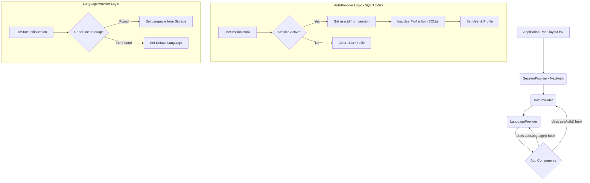
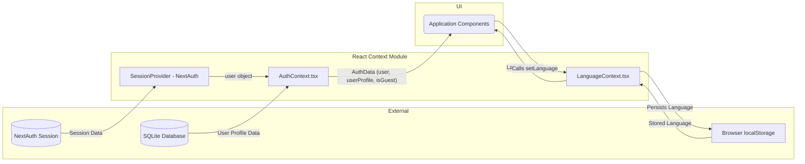

# Module: `React Context`

## 1. Module Summary

This module provides global state management for the application using React's Context API. It is responsible for managing and distributing application-wide state for user authentication and language preferences, making this data accessible to any component in the tree without prop drilling.

## 2. Module Dependencies

* **Internal Dependencies:**
    * `@/components/ui/skeleton`: UI component for loading states.
    * `@/lib/types/user-level`: TypeScript types for user profiles.
    * `@/lib/user-level-service`: Service for user profile management.
    * `@/lib/translations`: Internationalization configuration and functions.
* **External Dependencies:**
    * `react`: Core library for building the UI.
    * `next-auth/react`: NextAuth.js authentication library for React (Phase 4 - SQLITE-022).

## 3. Public API / Exports

* `AuthContext`: A React context that provides authentication state (`user`, `userProfile`, `isLoading`).
* `AuthProvider`: A component that provides the `AuthContext` to its children.
* `LanguageContext`: A React context that provides language state (`language`, `setLanguage`, `t`).
* `LanguageProvider`: A component that provides the `LanguageContext` to its children.

## 4. Code File Breakdown

### 4.1. `AuthContext.tsx`

* **Purpose:** This file implements the authentication context and provider for the application (Phase 4 - SQLITE-022). It manages the user's session state by interfacing with NextAuth.js authentication, fetches and provides the user's profile data from SQLite (including level, XP, and guest status), and handles the initial loading state. This provider is intended to wrap the entire application to provide universal access to authentication status. Replaces Firebase Authentication with NextAuth.js + SQLite integration.
* **Functions:**
    * `AuthProvider({ children }: AuthProviderProps)`: The main provider component that manages and provides the authentication state.
* **Key Classes / Constants / Variables:**
    * `AuthContext`: The React Context object created to hold and transmit authentication data.

### 4.2. `LanguageContext.tsx`

* **Purpose:** This file implements the context and provider for managing the application's internationalization (i18n) state. It allows users to switch between Traditional Chinese, Simplified Chinese, and English, persists the selection in `localStorage`, and provides a translation function `t` to the entire component tree. This setup ensures that all UI text can be dynamically updated when the language is changed.
* **Functions:**
    * `LanguageProvider({ children }: LanguageProviderProps)`: The main provider component that manages and provides the language state and translation function.
* **Key Classes / Constants / Variables:**
    * `LanguageContext`: The React Context object created to hold and transmit language preferences and the translation function.

## 5. System and Data Flow

### 5.1. System Flowchart (Control Flow) - Phase 4 SQLITE-022



### 5.2. Data Flow Diagram (Data Transformation) - Phase 4 SQLITE-022



## 6. Usage Example & Testing

* **Usage:**
  ```typescript
  // In a component
  import { useAuth } from '@/hooks/useAuth';
  import { useLanguage } from '@/hooks/useLanguage';

  function UserProfileDisplay() {
    const { user, userProfile } = useAuth();
    const { t } = useLanguage();

    // NextAuth user properties: user.id, user.name, user.email, user.image
    // SQLite user profile: userProfile.currentLevel, userProfile.totalXP, userProfile.isGuest
    return <h1>{t('welcome')}, {user?.name}!</h1>;
  }
  ```
* **Testing:** This module is primarily tested through integration tests that wrap components with the `AuthProvider` and `LanguageProvider`. Tests in files like `login-functionality.test.tsx` verify that components react correctly to changes in authentication state. Similarly, UI tests can assert that text content changes when the language is switched.

---

## 7. Changelog

### 2025-10-30 - SQLITE-023: UI Components NextAuth Migration
**Changes:**
- All components consuming `AuthContext` via `useAuth()` hook updated to use NextAuth properties
- Property mapping applied across 8 UI files:
  - `user.uid` → `user.id` (54 instances)
  - `user.displayName` → `user.name` (12 instances)
  - `user.isAnonymous` → `userProfile?.isGuest` (5 instances)
- **Impact:** AuthContext now provides dual data sources:
  - `user` object: NextAuth session data (id, name, email, image)
  - `userProfile` object: SQLite user data (currentLevel, totalXP, isGuest)
- **Architecture:** Components must destructure both `user` and `userProfile` from `useAuth()`
- **Verification:** 0 Firebase user properties remaining in UI layer
- **Documentation:** SQLITE-023_COMPLETION_SUMMARY.md created

### 2025-10-30 - SQLITE-022: AuthContext NextAuth Migration
**Changes:**
- `AuthContext.tsx` refactored to use NextAuth.js instead of Firebase Authentication
- Replaced Firebase `onAuthStateChanged` with NextAuth `useSession` hook
- User profile data now loaded from SQLite via `userLevelService.loadUserProfile()`
- AuthContext now provides: `{ user, userProfile, isLoading, refreshUserProfile }`
- **Session Management:** JWT-based stateless sessions with dynamic expiration
  - Default: 24 hours
  - Remember Me: 30 days
- **Guest Users:** Supported via custom `createGuestUser` credential provider
- **Impact:** All components using `useAuth()` must access `userProfile` for SQLite data (level, XP, guest status)
- **Breaking Changes:** Removed Firebase authentication methods from context (signInWithGoogle, signInAsGuest, etc.)
- **Migration Path:** Authentication methods moved to dedicated pages calling NextAuth `signIn()` directly

### Earlier
- Initial implementation with Firebase Authentication
- Language context implemented with localStorage persistence
- Support for Traditional Chinese, Simplified Chinese, and English
