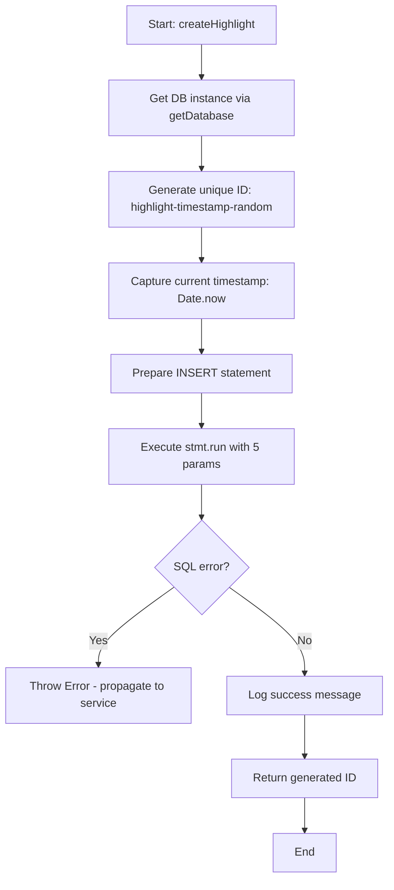
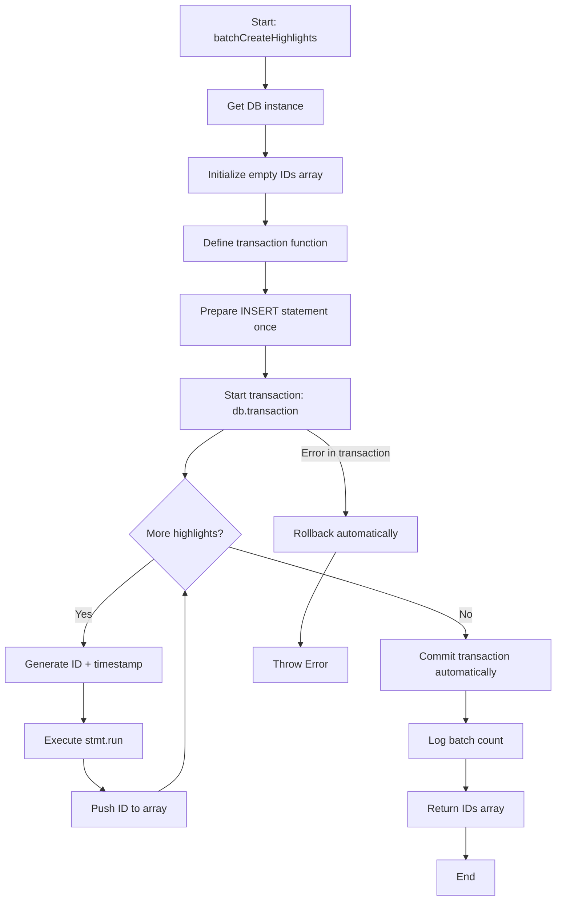
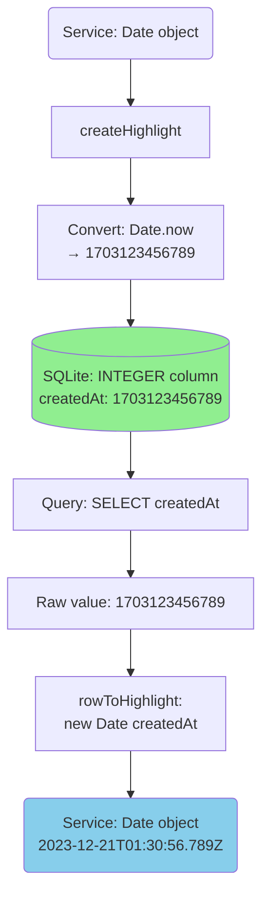

# Module: `highlight-repository.ts`

## 1. Module Summary

The `highlight-repository` module provides SQLite data access layer for highlight CRUD operations in the Red Mansion reading application. This repository implements 8 synchronous functions for creating, querying, and deleting highlights with transaction-based batch operations, replacing Firebase Firestore for server-side highlight persistence. The module handles timestamp conversions (Date ↔ Unix milliseconds), ID generation (highlight-{timestamp}-{random}), and indexed queries for optimal performance (~5-10ms per operation vs ~50-200ms for Firestore).

## 2. Module Dependencies

* **Internal Dependencies:**
  * `@/lib/sqlite-db` - Database instance provider (`getDatabase()`), timestamp utilities (`toUnixTimestamp`, `fromUnixTimestamp`).
* **External Dependencies:**
  * `better-sqlite3` - Synchronous SQLite3 API (accessed via sqlite-db module).
* **Database Schema:**
  * Table: `highlights` (columns: id TEXT PRIMARY KEY, userId TEXT, chapterId INTEGER, selectedText TEXT, createdAt INTEGER)
  * Indexes: `idx_highlights_user_chapter` on (userId, chapterId), `idx_highlights_user` on (userId)

## 3. Public API / Exports

* **Type Exports:**
  * `Highlight` - Interface matching service layer (id, userId, chapterId, selectedText, createdAt as Date).
* **Function Exports:**
  * `createHighlight(highlight: Omit<Highlight, 'id' | 'createdAt'>): string` - Create single highlight, returns generated ID.
  * `getHighlightsByUserAndChapter(userId: string, chapterId: number): Highlight[]` - Query highlights by user+chapter with ORDER BY createdAt DESC.
  * `getHighlightById(highlightId: string): Highlight | null` - Get single highlight by ID or null if not found.
  * `getHighlightsByUser(userId: string): Highlight[]` - Get all user highlights across all chapters, sorted newest first.
  * `deleteHighlight(highlightId: string): void` - Delete single highlight by ID.
  * `deleteHighlightsByUserAndChapter(userId: string, chapterId: number): number` - Batch delete, returns count of deleted rows.
  * `batchCreateHighlights(highlights: Array<Omit<Highlight, 'id' | 'createdAt'>>): string[]` - Transaction-based batch insert, returns array of generated IDs.
  * `getHighlightCount(userId: string, chapterId?: number): number` - Count highlights with optional chapter filter.

## 4. Code File Breakdown

### 4.1. `highlight-repository.ts` (262 lines)

* **Purpose:** Provides pure data access layer for highlights with no business logic, focusing on efficient SQLite operations. The repository pattern separates database concerns from service logic, enabling easier testing (in-memory SQLite for tests), database migration, and performance optimization. Key design decisions: (1) **Synchronous operations** - SQLite's synchronous API simplifies code vs async Firebase, no callback hell; (2) **ID generation at repository level** - `highlight-{timestamp}-{random}` format ensures uniqueness and sortability; (3) **Timestamp storage as Unix milliseconds** - Stores integers for efficient indexing and range queries; (4) **Transaction-wrapped batch operations** - Ensures atomicity for multi-record inserts; (5) **Query optimization** - Uses indexed columns (userId, chapterId) and ORDER BY with DESC for recent-first retrieval.

* **Interfaces:**
    * `Highlight: interface` - Public interface matching service layer. 5 fields: `id` (optional string), `userId` (string), `chapterId` (number), `selectedText` (string), `createdAt` (JavaScript Date). Used as return type for all query functions.
    * `HighlightRow: interface` - Internal database row representation. 5 fields: `id` (string), `userId` (string), `chapterId` (number), `selectedText` (string), `createdAt` (number as Unix milliseconds). Used for type-safe prepared statement results.

* **Utility Functions:**
    * `rowToHighlight(row: HighlightRow): Highlight` - **Row transformation**. Converts database row to public Highlight interface. Maps all fields directly except `createdAt`: converts Unix milliseconds to `new Date(row.createdAt)`. Used by all query functions to maintain type boundary between DB layer and service layer.
    * `generateHighlightId(): string` - **ID generation**. Creates unique highlight ID with format: `highlight-{timestamp}-{random9chars}`. Uses `Date.now()` for timestamp uniqueness + `Math.random().toString(36).substr(2, 9)` for collision resistance. Example: `highlight-1703123456789-k3j8f9d2x`. Sortable by creation time due to timestamp prefix.

* **CRUD Functions:**
    * `createHighlight(highlight: Omit<Highlight, 'id' | 'createdAt'>): string` - **Single highlight creation**. Generates ID via `generateHighlightId()`, captures current timestamp with `Date.now()`. Prepares INSERT statement with 5 columns (id, userId, chapterId, selectedText, createdAt). Executes synchronously with `stmt.run()`. Logs success message with ID, userId, and chapterId. Returns generated ID string. No validation - assumes service layer validated inputs. Transaction not needed for single insert (SQLite autocommit).

    * `getHighlightsByUserAndChapter(userId: string, chapterId: number): Highlight[]` - **Chapter-specific highlights query**. Prepares SELECT with WHERE clause on userId and chapterId (uses composite index `idx_highlights_user_chapter`). Orders by `createdAt DESC` to show newest highlights first. Executes with `stmt.all()` returning array of HighlightRow. Maps rows to Highlight via `rowToHighlight()`. Returns empty array if no matches. Performance: ~5ms with index, includes timestamp conversion overhead.

    * `getHighlightById(highlightId: string): Highlight | null` - **Single highlight lookup**. Prepares SELECT with WHERE id = ? (uses PRIMARY KEY index). Executes with `stmt.get()` returning single HighlightRow or undefined. Returns null if not found (idiomatic null pattern for "not exists"). Returns transformed Highlight via `rowToHighlight()` if found. Used for verification and detail views.

    * `getHighlightsByUser(userId: string): Highlight[]` - **Cross-chapter user highlights**. Prepares SELECT with WHERE userId = ? (uses index `idx_highlights_user`). Orders by `createdAt DESC` for chronological display. Returns all user highlights regardless of chapter. Used for user dashboard and migration scenarios. Similar performance to getHighlightsByUserAndChapter but may return larger result sets.

    * `deleteHighlight(highlightId: string): void` - **Single highlight deletion**. Prepares DELETE with WHERE id = ?. Executes with `stmt.run()`. Logs success message with highlightId. Returns void - silent success (no error means success). Does not throw if ID doesn't exist (SQL DELETE is idempotent). Used by service layer for user-initiated deletions.

    * `deleteHighlightsByUserAndChapter(userId: string, chapterId: number): number` - **Batch deletion by user+chapter**. Prepares DELETE with WHERE userId = ? AND chapterId = ?. Executes with `stmt.run()`, captures `result.changes` (number of rows deleted). Logs count of deleted highlights. Returns changes count for verification. Used for "clear all highlights in chapter" feature or migration cleanup. Efficient bulk operation vs individual deletes.

    * `batchCreateHighlights(highlights: Array<Omit<Highlight, 'id' | 'createdAt'>>): string[]` - **Transaction-wrapped batch insert**. Creates transaction with `db.transaction()` for atomicity (all-or-nothing). Prepares single INSERT statement outside loop (statement reuse). Iterates highlights array: generates ID, captures timestamp, executes `stmt.run()`, collects IDs. Commits transaction automatically when function returns. Logs total count of created highlights. Returns array of generated IDs in insertion order. Performance: ~100 highlights in ~10-20ms (transaction overhead + batch execution). Used for Firebase→SQLite migration.

    * `getHighlightCount(userId: string, chapterId?: number): number` - **Conditional count query**. Branches on `chapterId` presence: (1) If provided, prepares `SELECT COUNT(*) WHERE userId = ? AND chapterId = ?` (2) If undefined, prepares `SELECT COUNT(*) WHERE userId = ?`. Executes with appropriate params array. Extracts `count` field from result object. Returns integer count. Used for analytics, pagination, and "empty state" detection. More efficient than loading full result set and checking length.

## 5. System and Data Flow

### 5.1. System Flowchart - createHighlight (Single Insert Flow)



### 5.2. System Flowchart - batchCreateHighlights (Transaction Flow)



### 5.3. Data Flow Diagram - Query Path (GET operations)

```mermaid
graph TD
    ServiceCall(Service calls: getHighlightsByUserAndChapter) --> RepoFunc[Repository Function]
    RepoFunc --> DB[getDatabase]
    DB --> PrepareStmt[Prepare SELECT statement<br/>with WHERE + ORDER BY]
    PrepareStmt --> Execute[Execute stmt.all or stmt.get]

    Execute --> RawRows[(SQLite Database<br/>highlights table)]
    RawRows --> HighlightRows[HighlightRow[] with<br/>Unix timestamp integers]

    HighlightRows --> Transform{Map each row}
    Transform --> Convert[rowToHighlight:<br/>createdAt number → Date]
    Convert --> HighlightObj[Highlight object<br/>with Date type]

    HighlightObj --> ResultArray[Highlight[] array]
    ResultArray --> ServiceReturn[Return to Service Layer]

    style RawRows fill:#90EE90
    style ServiceReturn fill:#87CEEB
```

### 5.4. Data Flow - ID Generation Strategy

```mermaid
graph LR
    Call(createHighlight called) --> GenID[generateHighlightId]
    GenID --> Timestamp[Date.now:<br/>1703123456789]
    GenID --> Random[Math.random:<br/>k3j8f9d2x]

    Timestamp --> Concat[Concatenate:<br/>highlight-{ts}-{rand}]
    Random --> Concat

    Concat --> UniqueID[highlight-1703123456789-k3j8f9d2x]
    UniqueID --> Properties[ID Properties:<br/>✓ Unique timestamp<br/>✓ Collision-resistant random<br/>✓ Sortable by creation time<br/>✓ Human-readable prefix]

    Properties --> Store[(Store as TEXT PRIMARY KEY)]

    style UniqueID fill:#FFD700
    style Store fill:#90EE90
```

### 5.5. Data Flow - Timestamp Conversion (createdAt handling)



## 6. Usage Example & Testing

* **Usage:**
```typescript
import {
  createHighlight,
  getHighlightsByUserAndChapter,
  getHighlightById,
  getHighlightsByUser,
  deleteHighlight,
  deleteHighlightsByUserAndChapter,
  batchCreateHighlights,
  getHighlightCount,
  type Highlight
} from '@/lib/repositories/highlight-repository';

// ======================================
// CREATE Operations
// ======================================

// Single highlight creation (synchronous)
const highlightId = createHighlight({
  userId: 'user123',
  chapterId: 5,
  selectedText: '質本潔來還潔去，強於污淖陷渠溝'
});
// Logs: "✅ [HighlightRepository] Created highlight: highlight-1703123456789-k3j8f9d2x (user: user123, chapter: 5)"
console.log(`Created highlight: ${highlightId}`);

// Batch creation with transaction (e.g., migration scenario)
const highlights = [
  { userId: 'user123', chapterId: 1, selectedText: '甄士隱夢幻識通靈' },
  { userId: 'user123', chapterId: 1, selectedText: '賈雨村風塵懷閨秀' },
  { userId: 'user123', chapterId: 2, selectedText: '賈夫人仙逝揚州城' }
];
const createdIds = batchCreateHighlights(highlights);
// Logs: "✅ [HighlightRepository] Batch created 3 highlights"
console.log(`Batch created ${createdIds.length} highlights`);

// ======================================
// READ Operations (Query + Filtering)
// ======================================

// Get highlights for specific user and chapter (most common query)
// Uses composite index idx_highlights_user_chapter for fast lookup (~5ms)
const chapterHighlights = getHighlightsByUserAndChapter('user123', 5);
console.log(`Found ${chapterHighlights.length} highlights for chapter 5`);
chapterHighlights.forEach(h => {
  console.log(`- ${h.selectedText} (${h.createdAt.toISOString()})`);
});

// Get single highlight by ID (detail view or verification)
const highlight = getHighlightById('highlight-1703123456789-k3j8f9d2x');
if (highlight) {
  console.log(`Highlight found: ${highlight.selectedText}`);
} else {
  console.log('Highlight not found (deleted or invalid ID)');
}

// Get all user highlights across all chapters (dashboard view)
// Uses index idx_highlights_user, sorted newest first
const allUserHighlights = getHighlightsByUser('user123');
console.log(`Total highlights: ${allUserHighlights.length}`);
console.log(`Most recent: ${allUserHighlights[0]?.selectedText}`);

// Count highlights (analytics or empty state detection)
const totalCount = getHighlightCount('user123'); // All chapters
const chapterCount = getHighlightCount('user123', 5); // Specific chapter
console.log(`Total: ${totalCount}, Chapter 5: ${chapterCount}`);

// ======================================
// DELETE Operations
// ======================================

// Delete single highlight (user removes underline)
deleteHighlight('highlight-1703123456789-k3j8f9d2x');
// Logs: "✅ [HighlightRepository] Deleted highlight: highlight-1703123456789-k3j8f9d2x"

// Batch delete all highlights for user+chapter (clear chapter highlights)
const deletedCount = deleteHighlightsByUserAndChapter('user123', 5);
// Logs: "✅ [HighlightRepository] Deleted 12 highlights for user user123, chapter 5"
console.log(`Cleared ${deletedCount} highlights from chapter 5`);
```

* **Testing:** Testing strategy covers CRUD operations, edge cases, and transaction integrity (see tests/lib/repositories/highlight-repository.test.ts for full suite):

  **CREATE Tests:**
  - Test `createHighlight` generates unique ID in correct format (highlight-{timestamp}-{random})
  - Test `createHighlight` stores userId, chapterId, selectedText correctly
  - Test `createHighlight` auto-generates createdAt timestamp
  - Test `createHighlight` with empty selectedText (edge case)
  - Test `createHighlight` with very long selectedText (1000+ chars)
  - Test `batchCreateHighlights` creates multiple highlights atomically
  - Test `batchCreateHighlights` with empty array returns empty IDs array
  - Test `batchCreateHighlights` transaction rollback on error (all-or-nothing)
  - Test `batchCreateHighlights` maintains order in returned IDs array

  **READ Tests:**
  - Test `getHighlightsByUserAndChapter` filters by both userId and chapterId correctly
  - Test `getHighlightsByUserAndChapter` returns empty array when no matches
  - Test `getHighlightsByUserAndChapter` sorts by createdAt DESC (newest first)
  - Test `getHighlightsByUserAndChapter` converts createdAt to Date object
  - Test `getHighlightById` returns correct highlight when exists
  - Test `getHighlightById` returns null when ID not found
  - Test `getHighlightsByUser` returns all user highlights across chapters
  - Test `getHighlightsByUser` sorted newest first across all chapters
  - Test `getHighlightCount` returns correct count for user (all chapters)
  - Test `getHighlightCount` returns correct count for user+chapter combination
  - Test `getHighlightCount` returns 0 when no highlights exist

  **DELETE Tests:**
  - Test `deleteHighlight` removes highlight by ID
  - Test `deleteHighlight` is idempotent (no error if ID doesn't exist)
  - Test `deleteHighlightsByUserAndChapter` deletes all matching highlights
  - Test `deleteHighlightsByUserAndChapter` returns correct changes count
  - Test `deleteHighlightsByUserAndChapter` returns 0 when no matches

  **Data Integrity Tests:**
  - Test multiple users' highlights are isolated (no cross-user contamination)
  - Test highlights for different chapters are properly isolated
  - Test createdAt timestamp accuracy (within 1 second of creation time)
  - Test ID uniqueness across concurrent creates (no collisions)
  - Test special characters in selectedText (quotes, newlines, unicode)
  - Test very large chapterId values (integer boundary testing)

  **Performance Tests:**
  - Test single create completes in < 10ms
  - Test query by user+chapter completes in < 5ms (indexed)
  - Test batch create of 100 highlights completes in < 50ms (transaction)
  - Test count query is faster than loading full result set

  **In-Memory Testing Pattern:**
  - All tests use in-memory SQLite database (`:memory:`) for isolation
  - Each test creates fresh database with schema via migrations
  - No test dependencies or shared state between tests
  - Tests run in parallel without conflicts
  - Teardown happens automatically (memory-only, no cleanup needed)
