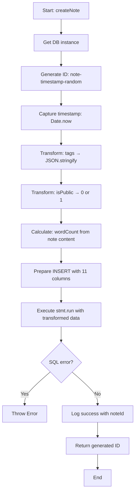
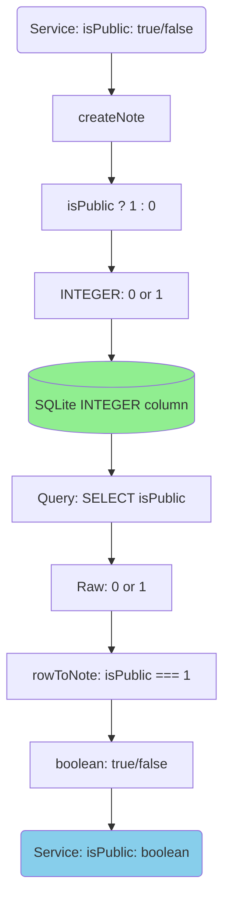
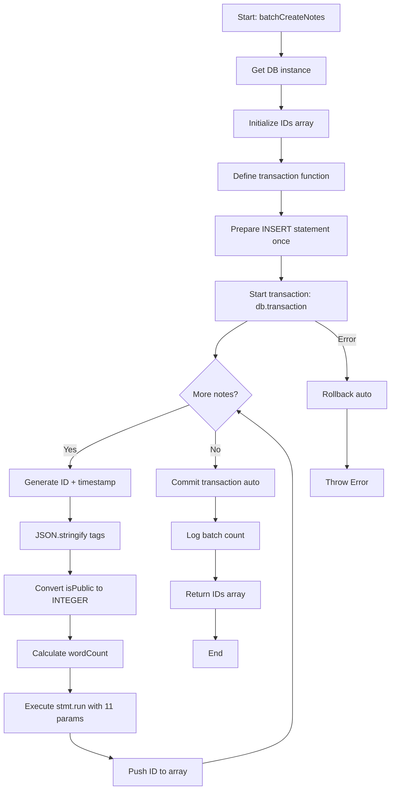
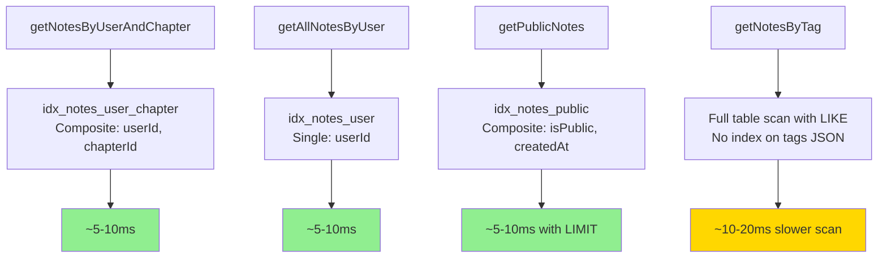

# Module: `note-repository.ts`

## 1. Module Summary

The `note-repository` module provides comprehensive SQLite data access layer for note CRUD operations with advanced features: tag management (JSON serialization), visibility control (public/private), automatic word count calculation, and full-text search capabilities. This repository implements 14 synchronous functions including transaction-based batch operations, tag filtering, and community note queries, replacing Firebase Firestore for server-side note persistence (~470 lines, ~10x performance improvement over Firebase). Handles complex data transformations (tags array ↔ JSON string, boolean ↔ INTEGER, Date ↔ Unix milliseconds) transparently at the repository boundary.

## 2. Module Dependencies

* **Internal Dependencies:**
  * `@/lib/sqlite-db` - Database instance provider (`getDatabase()`), timestamp utilities (`toUnixTimestamp`, `fromUnixTimestamp`).
* **External Dependencies:**
  * `better-sqlite3` - Synchronous SQLite3 API (accessed via sqlite-db module).
* **Database Schema:**
  * Table: `notes` (11 columns: id TEXT PRIMARY KEY, userId TEXT, chapterId INTEGER, selectedText TEXT, note TEXT, createdAt INTEGER, lastModified INTEGER, tags TEXT, isPublic INTEGER, wordCount INTEGER, noteType TEXT)
  * Indexes: `idx_notes_user_chapter` on (userId, chapterId), `idx_notes_user` on (userId), `idx_notes_public` on (isPublic, createdAt)

## 3. Public API / Exports

* **Type Exports:**
  * `Note` - Interface matching service layer (10 fields including optional tags, isPublic, wordCount, lastModified, noteType).

* **Function Exports (14 total):**

  **CREATE/UPDATE Operations:**
  * `createNote(note: Omit<Note, 'id' | 'createdAt'>): string` - Create note with auto-calculated fields (wordCount, timestamps, JSON tags).
  * `updateNoteContent(noteId: string, content: string): void` - Update note content, recalculate wordCount, update lastModified.
  * `updateNoteVisibility(noteId: string, isPublic: boolean): void` - Toggle public/private visibility.
  * `updateNoteTags(noteId: string, tags: string[]): void` - Update tags with JSON serialization.
  * `updateNoteType(noteId: string, noteType: string | null): void` - Update note type categorization.

  **READ/QUERY Operations:**
  * `getNotesByUserAndChapter(userId: string, chapterId: number): Note[]` - Query notes by user+chapter, sorted newest first.
  * `getAllNotesByUser(userId: string): Note[]` - Get all user notes across chapters, sorted newest first.
  * `getNoteById(noteId: string): Note | null` - Get single note by ID or null.
  * `getPublicNotes(limit?: number): Note[]` - Get public notes with LIMIT (community feed).
  * `getNotesByTag(userId: string, tag: string): Note[]` - Filter user notes by tag using JSON LIKE search.
  * `getNoteCount(userId: string, chapterId?: number): number` - Count notes with optional chapter filter.

  **DELETE Operations:**
  * `deleteNote(noteId: string): void` - Delete single note by ID.
  * `deleteNotesByUserAndChapter(userId: string, chapterId: number): number` - Batch delete, returns count.

  **BATCH Operations:**
  * `batchCreateNotes(notes: Array<Omit<Note, 'id' | 'createdAt'>>): string[]` - Transaction-based batch insert with JSON serialization.

## 4. Code File Breakdown

### 4.1. `note-repository.ts` (441 lines)

* **Purpose:** Provides feature-rich data access layer for notes with complex data transformations and scholarly annotation features. Unlike highlight-repository (simple text marking), note-repository handles structured metadata (tags, visibility, word count, note types), enabling advanced query patterns for collaborative learning. Key design decisions: (1) **JSON tag storage** - Stores string arrays as JSON TEXT for SQLite compatibility, deserializes on read; (2) **Boolean-to-INTEGER mapping** - SQLite lacks native boolean, uses 0/1 for isPublic with conversion in rowToNote; (3) **Automatic word count** - Calculates on every create/update for analytics without service layer overhead; (4) **Dual timestamp tracking** - createdAt immutable, lastModified updates on edit/tag/visibility changes; (5) **Tag search strategy** - Uses LIKE '%"tag"%' for JSON array search (simpler than json_each, sufficient for our use case); (6) **Public note indexing** - Composite index on (isPublic, createdAt) optimizes community feed queries.

* **Interfaces:**
    * `Note: interface` - Public interface matching service layer. 10 fields: `id` (optional string), `userId` (string), `chapterId` (number), `selectedText` (string), `note` (content string), `createdAt` (Date), optional: `tags` (string[]), `isPublic` (boolean), `wordCount` (number), `lastModified` (Date), `noteType` (string for categorization).

    * `NoteRow: interface` - Internal database row representation. 11 fields matching SQLite schema: `id, userId, chapterId, selectedText, note` (all direct mappings), `createdAt, lastModified` (number as Unix ms), `tags` (string | null for JSON), `isPublic` (number 0/1), `wordCount` (number), `noteType` (string | null). Type-safe prepared statement results.

* **Utility Functions:**
    * `calculateWordCount(text: string): number` - **Word count calculation**. Algorithm: trim whitespace, split by regex `/\s+/` (one or more whitespace), filter out empty strings, return array length. Handles multiple spaces, newlines, tabs consistently. Used in createNote and updateNoteContent. Example: "  hello   world  \n  test  " → 3 words.

    * `rowToNote(row: NoteRow): Note` - **Row transformation with complex conversions**. Maps all simple fields directly. Performs 5 transformations: (1) `createdAt: new Date(row.createdAt)` - Unix ms to Date, (2) `lastModified: new Date(row.lastModified)` - Unix ms to Date, (3) `tags: row.tags ? JSON.parse(row.tags) : []` - JSON string to array with fallback, (4) `isPublic: row.isPublic === 1` - INTEGER to boolean, (5) `noteType: row.noteType || undefined` - null to undefined for optional field. Returns fully transformed Note object ready for service layer.

    * `generateNoteId(): string` - **ID generation**. Format: `note-{timestamp}-{random9chars}`. Uses `Date.now()` + `Math.random().toString(36).substr(2, 9)`. Example: `note-1703123456789-p7k2m9x5q`. Sortable by creation time, collision-resistant.

* **CREATE/UPDATE Functions:**
    * `createNote(note: Omit<Note, 'id' | 'createdAt'>): string` - **Complex note creation with 5 auto-calculated fields**. Generates ID via generateNoteId(), captures timestamp with Date.now(). Prepares INSERT with 11 columns. Performs transformations before insert: (1) tags: `JSON.stringify(note.tags || [])` - serialize array to JSON or default to "[]", (2) isPublic: `note.isPublic ? 1 : 0` - boolean to INTEGER, (3) wordCount: `calculateWordCount(note.note)` - auto-calculate from content, (4) createdAt and lastModified: both set to now (immutable creation time), (5) noteType: `note.noteType || null` - handle optional field. Executes stmt.run() with 11 parameters. Logs success. Returns generated ID. Used by notes-service.saveNote().

    * `updateNoteContent(noteId: string, content: string): void` - **Content update with word count recalculation**. Prepares UPDATE for 3 fields: note, wordCount, lastModified. Calculates new word count via `calculateWordCount(content)`. Updates lastModified to Date.now() (tracks edit history). Does NOT update createdAt (preserves original). Executes stmt.run(). Logs noteId. Used when user edits note content. Performance: ~2-5ms including word count calculation.

    * `updateNoteVisibility(noteId: string, isPublic: boolean): void` - **Visibility toggle**. Prepares UPDATE for 2 fields: isPublic, lastModified. Converts boolean to INTEGER: `isPublic ? 1 : 0`. Updates lastModified to Date.now(). Executes stmt.run(). Logs noteId and new visibility state. Used for sharing notes with community or making them private. Affects getPublicNotes query results.

    * `updateNoteTags(noteId: string, tags: string[]): void` - **Tag update with JSON serialization**. Prepares UPDATE for 2 fields: tags, lastModified. Serializes tags array: `JSON.stringify(tags)` - handles empty array, single tag, multiple tags. Updates lastModified to Date.now(). Executes stmt.run(). Logs noteId and tag count. Example: ['角色', '場景'] → '["角色","場景"]' stored in TEXT column. Affects getNotesByTag query results.

    * `updateNoteType(noteId: string, noteType: string | null): void` - **Note type categorization**. Prepares UPDATE for 2 fields: noteType, lastModified. Allows null for untyped notes. Updates lastModified to Date.now(). Executes stmt.run(). Logs noteId and new type. Used for categorizing notes as: general, vocabulary, character, theme, question. Enables future filtering by note type.

* **READ/QUERY Functions:**
    * `getNotesByUserAndChapter(userId: string, chapterId: number): Note[]` - **Chapter-specific notes query**. Prepares SELECT with WHERE userId = ? AND chapterId = ? (uses composite index idx_notes_user_chapter). Orders by createdAt DESC (newest first). Executes stmt.all() returning NoteRow[]. Maps rows via rowToNote() performing all 5 transformations (timestamps, tags JSON, isPublic boolean). Returns Note[] array. Performance: ~5-10ms with index including JSON deserialization overhead.

    * `getAllNotesByUser(userId: string): Note[]` - **Cross-chapter user notes**. Prepares SELECT with WHERE userId = ? (uses index idx_notes_user). Orders by createdAt DESC. Returns all user notes regardless of chapter for dashboard view. Executes stmt.all(). Maps via rowToNote(). Performance similar to getNotesByUserAndChapter but may return larger result sets.

    * `getNoteById(noteId: string): Note | null` - **Single note lookup**. Prepares SELECT with WHERE id = ? (PRIMARY KEY lookup). Executes stmt.get() returning single NoteRow or undefined. Returns null if not found (idiomatic pattern). Returns transformed Note via rowToNote() if found. Used for note detail views and verification.

    * `getPublicNotes(limit: number = 50): Note[]` - **Community feed query**. Prepares SELECT with WHERE isPublic = 1 (uses index idx_notes_public). Orders by createdAt DESC. **LIMIT ?** at query level (efficient vs post-processing). Default limit 50. Executes stmt.all(limit). Maps via rowToNote(). Returns up to limit public notes from all users. Used in community tab for collaborative learning. Performance advantage: LIMIT in SQL vs JavaScript .slice().

    * `getNotesByTag(userId: string, tag: string): Note[]` - **Tag filtering with JSON search**. Uses LIKE pattern matching: `tags LIKE '%"${tag}"%'`. Searches for exact tag match within JSON array string. Example: tag="角色" matches '["角色","場景"]' but not '["角色分析"]' (due to quotes). Filters by userId to isolate user's notes. Orders by createdAt DESC. Executes stmt.all(). Maps via rowToNote(). Returns filtered notes. Note: LIKE approach is simpler than json_each but requires exact tag match (case-sensitive). Performance: Slower than indexed queries (~10-20ms) due to LIKE scan.

    * `getNoteCount(userId: string, chapterId?: number): number` - **Conditional count query**. Branches on chapterId presence: (1) If provided: `SELECT COUNT(*) WHERE userId = ? AND chapterId = ?`, (2) If undefined: `SELECT COUNT(*) WHERE userId = ?`. Executes with appropriate params. Extracts count field from result object. Returns integer. Used for analytics, pagination, empty state detection. More efficient than loading full result set.

* **DELETE Functions:**
    * `deleteNote(noteId: string): void` - **Single note deletion**. Prepares DELETE WHERE id = ?. Executes stmt.run(). Logs noteId. Idempotent (no error if ID doesn't exist). Permanent deletion - no soft delete or archive. Used by service layer for user-initiated deletions.

    * `deleteNotesByUserAndChapter(userId: string, chapterId: number): number` - **Batch deletion**. Prepares DELETE WHERE userId = ? AND chapterId = ?. Executes stmt.run(). Captures result.changes (affected rows). Logs count of deleted notes. Returns changes count for verification. Used for "clear all notes in chapter" feature or cleanup operations.

* **BATCH Operations:**
    * `batchCreateNotes(notes: Array<Omit<Note, 'id' | 'createdAt'>>): string[]` - **Transaction-wrapped batch insert with complex transformations**. Creates transaction with db.transaction() for atomicity. Prepares single INSERT statement with 11 columns (reused in loop). Iterates notes array: For each note: (1) Generate ID via generateNoteId(), (2) Capture timestamp, (3) Serialize tags to JSON, (4) Convert isPublic to INTEGER, (5) Calculate word count, (6) Handle optional noteType, (7) Execute stmt.run() with 11 params, (8) Collect ID in array. Commits transaction automatically. Logs total count. Returns IDs array in insertion order. Performance: ~100 notes in ~50-100ms (includes JSON serialization overhead). Used for Firebase→SQLite migration (migrate-notes.ts).

## 5. System and Data Flow

### 5.1. System Flowchart - createNote (Complex Insert with Transformations)



### 5.2. Data Transformation Flow - tags (Array ↔ JSON String)

```mermaid
graph LR
    ServiceInput(Service: tags: ['角色', '場景']) --> CreateNote[createNote]
    CreateNote --> Serialize[JSON.stringify]
    Serialize --> JSONString['["角色","場景"]']
    JSONString --> Store[(SQLite TEXT column)]

    Store --> Query[Query: SELECT tags]
    Query --> RawJSON['["角色","場景"]']
    RawJSON --> Deserialize[rowToNote: JSON.parse]
    Deserialize --> Array(['角色', '場景'])
    Array --> ServiceOutput(Service: tags: string[])

    style Store fill:#90EE90
    style ServiceOutput fill:#87CEEB
```

### 5.3. Data Transformation Flow - isPublic (Boolean ↔ INTEGER)



### 5.4. System Flowchart - batchCreateNotes (Transaction with Multi-Transform)



### 5.5. Query Optimization - Index Usage Patterns



## 6. Usage Example & Testing

* **Usage:**
```typescript
import {
  createNote,
  updateNoteContent,
  getNotesByUserAndChapter,
  getAllNotesByUser,
  getNoteById,
  deleteNote,
  updateNoteVisibility,
  getPublicNotes,
  updateNoteTags,
  deleteNotesByUserAndChapter,
  batchCreateNotes,
  getNoteCount,
  getNotesByTag,
  updateNoteType,
  type Note
} from '@/lib/repositories/note-repository';

// ======================================
// CREATE - Complex note with metadata
// ======================================
const noteId = createNote({
  userId: 'user123',
  chapterId: 3,
  selectedText: '黛玉方進入房時，只見兩個人攙著一位鬢髮如銀的老母迎上來',
  note: '這段描寫了林黛玉初見賈母的場景，展現了賈府的威嚴和禮儀。',
  tags: ['角色初登場', '場景描寫', '賈母'],
  isPublic: false,
  noteType: 'character'
});
// Internal transformations:
// - tags → '["角色初登場","場景描寫","賈母"]' (JSON string)
// - isPublic: false → 0 (INTEGER)
// - wordCount → auto-calculated: 14 words
// - createdAt, lastModified → Unix timestamp (same value)
// Logs: "✅ [NoteRepository] Created note: note-1703123456789-p7k2m9x5q (user: user123, chapter: 3)"

// ======================================
// UPDATE - Various metadata updates
// ======================================

// Update content (recalculates word count, updates lastModified)
updateNoteContent(noteId, '補充：這段也暗示了林黛玉的敏感性格，以及她對環境的高度敏銳觀察力。');
// New wordCount: 21, lastModified updated, createdAt unchanged

// Toggle visibility (community sharing)
updateNoteVisibility(noteId, true); // Make public
// Stored as: isPublic: 1

// Update tags (JSON serialization)
updateNoteTags(noteId, ['角色初登場', '場景描寫', '賈母', '林黛玉']);
// Stored as: '["角色初登場","場景描寫","賈母","林黛玉"]'

// Update note type categorization
updateNoteType(noteId, 'theme'); // Changed from 'character' to 'theme'

// ======================================
// READ - Query patterns with transformations
// ======================================

// Get notes for specific chapter (most common query)
const chapterNotes = getNotesByUserAndChapter('user123', 3);
// Returns: Note[] with all transformations applied:
// - tags: string[] (parsed from JSON)
// - isPublic: boolean (converted from INTEGER)
// - createdAt, lastModified: Date objects
chapterNotes.forEach(n => {
  console.log(`Note: ${n.note}`);
  console.log(`Tags: ${n.tags?.join(', ')}`); // ✓ Array access
  console.log(`Public: ${n.isPublic ? 'Yes' : 'No'}`); // ✓ Boolean logic
  console.log(`Words: ${n.wordCount}, Type: ${n.noteType}`);
  console.log(`Created: ${n.createdAt.toISOString()}`); // ✓ Date methods
});

// Get all user notes for dashboard (cross-chapter)
const allNotes = getAllNotesByUser('user123');
console.log(`Total notes: ${allNotes.length}`);
console.log(`Most recent: ${allNotes[0]?.note}`); // Sorted newest first

// Get single note by ID
const note = getNoteById(noteId);
if (note) {
  console.log(`Found: ${note.note} (${note.tags?.length} tags)`);
}

// Get public notes (community feed with LIMIT in SQL)
const publicNotes = getPublicNotes(20); // Efficient: LIMIT 20 in query
publicNotes.forEach(n => {
  console.log(`${n.userId}: ${n.note}`);
  console.log(`Tags: ${n.tags?.join(', ')}`); // Array already deserialized
});

// Filter notes by tag (JSON LIKE search)
const notesWithTag = getNotesByTag('user123', '角色初登場');
console.log(`Found ${notesWithTag.length} notes with tag '角色初登場'`);

// Count notes (analytics)
const totalCount = getNoteCount('user123'); // All chapters
const chapterCount = getNoteCount('user123', 3); // Specific chapter
console.log(`Total: ${totalCount}, Chapter 3: ${chapterCount}`);

// ======================================
// DELETE Operations
// ======================================

// Delete single note
deleteNote(noteId);

// Batch delete all notes in chapter
const deletedCount = deleteNotesByUserAndChapter('user123', 3);
console.log(`Cleared ${deletedCount} notes from chapter 3`);

// ======================================
// BATCH - Transaction-based insert (migration)
// ======================================
const notesToMigrate = [
  {
    userId: 'user123',
    chapterId: 1,
    selectedText: '甄士隱夢幻識通靈',
    note: '第一回開篇引子',
    tags: ['開場', '甄士隱'],
    isPublic: false,
    noteType: 'general'
  },
  {
    userId: 'user123',
    chapterId: 1,
    selectedText: '賈雨村風塵懷閨秀',
    note: '賈雨村出場',
    tags: ['角色登場', '賈雨村'],
    isPublic: true,
    noteType: 'character'
  }
];

const createdIds = batchCreateNotes(notesToMigrate);
// All transformations applied in transaction:
// - 2 IDs generated
// - tags serialized to JSON
// - isPublic converted to INTEGER
// - wordCounts calculated (4 and 4)
// - createdAt/lastModified timestamps set
// Transaction ensures: all succeed or all rollback
console.log(`Migrated ${createdIds.length} notes atomically`);
```

* **Testing:** Comprehensive testing strategy covering CRUD, transformations, transactions, and edge cases (see tests/lib/repositories/note-repository.test.ts for 50+ tests):

  **CREATE Tests:**
  - Test `createNote` generates unique ID in correct format (note-{timestamp}-{random})
  - Test `createNote` auto-calculates wordCount correctly (trim + split + filter)
  - Test `createNote` serializes tags to JSON: ['a', 'b'] → '["a","b"]'
  - Test `createNote` converts isPublic boolean to INTEGER: true→1, false→0
  - Test `createNote` sets createdAt and lastModified to same initial value
  - Test `createNote` handles missing optional fields (tags→[], isPublic→0, noteType→null)
  - Test `createNote` with empty note content (wordCount=0)
  - Test `createNote` with very long note (1000+ words, wordCount accuracy)
  - Test `createNote` with special chars in selectedText (quotes, newlines, unicode)
  - Test `batchCreateNotes` creates multiple notes atomically
  - Test `batchCreateNotes` transaction rollback on error (all-or-nothing)
  - Test `batchCreateNotes` with empty array returns empty IDs
  - Test `batchCreateNotes` maintains insertion order in returned IDs

  **UPDATE Tests:**
  - Test `updateNoteContent` recalculates wordCount on content change
  - Test `updateNoteContent` updates lastModified but not createdAt
  - Test `updateNoteContent` with empty string sets wordCount=0
  - Test `updateNoteVisibility` converts boolean→INTEGER correctly
  - Test `updateNoteVisibility` updates lastModified
  - Test `updateNoteTags` serializes tags array to JSON correctly
  - Test `updateNoteTags` handles empty array → '[]'
  - Test `updateNoteTags` handles single tag → '["tag"]'
  - Test `updateNoteTags` handles multiple tags with unicode
  - Test `updateNoteTags` updates lastModified
  - Test `updateNoteType` updates noteType and lastModified
  - Test `updateNoteType` allows null (untyped notes)

  **READ Tests - Query Correctness:**
  - Test `getNotesByUserAndChapter` filters by userId AND chapterId correctly
  - Test `getNotesByUserAndChapter` returns empty array when no matches
  - Test `getNotesByUserAndChapter` sorts by createdAt DESC (newest first)
  - Test `getNotesByUserAndChapter` deserializes tags JSON→array correctly
  - Test `getNotesByUserAndChapter` converts isPublic INTEGER→boolean
  - Test `getNotesByUserAndChapter` converts timestamps to Date objects
  - Test `getAllNotesByUser` returns all user notes across all chapters
  - Test `getAllNotesByUser` sorted newest first
  - Test `getNoteById` returns correct note when exists
  - Test `getNoteById` returns null when ID not found
  - Test `getPublicNotes` only returns notes with isPublic=1
  - Test `getPublicNotes` respects LIMIT parameter
  - Test `getPublicNotes` default limit=50 works
  - Test `getPublicNotes` sorted newest first
  - Test `getNotesByTag` filters by exact tag match
  - Test `getNotesByTag` case-sensitive tag search
  - Test `getNotesByTag` returns empty array when tag not found
  - Test `getNotesByTag` handles unicode tags correctly
  - Test `getNoteCount` returns correct count for user (all chapters)
  - Test `getNoteCount` returns correct count for user+chapter
  - Test `getNoteCount` returns 0 when no notes exist

  **DELETE Tests:**
  - Test `deleteNote` removes note by ID
  - Test `deleteNote` is idempotent (no error if ID doesn't exist)
  - Test `deleteNotesByUserAndChapter` deletes all matching notes
  - Test `deleteNotesByUserAndChapter` returns correct changes count
  - Test `deleteNotesByUserAndChapter` returns 0 when no matches

  **Data Integrity & Transformation Tests:**
  - Test rowToNote preserves all field data correctly
  - Test JSON tag roundtrip: array→JSON→array maintains data
  - Test boolean roundtrip: true/false→0/1→true/false correct
  - Test timestamp roundtrip: Date→Unix ms→Date within 1ms accuracy
  - Test wordCount calculation matches service layer calculateWordCount
  - Test multiple spaces/newlines handled in wordCount (trim + regex split)
  - Test unicode text wordCount (Chinese, Japanese, special chars)
  - Test special characters in all text fields (quotes, backslashes, newlines)
  - Test very large chapterId values (integer boundary)
  - Test empty tags array → '[]' → [] roundtrip
  - Test single tag array → '["tag"]' → ["tag"] roundtrip

  **Isolation & Boundary Tests:**
  - Test multiple users' notes isolated (no cross-user contamination)
  - Test notes for different chapters properly isolated
  - Test public/private notes filtered correctly
  - Test createdAt never changes after updates (immutability)
  - Test lastModified updates on all edit operations
  - Test ID uniqueness across concurrent creates

  **Performance Tests:**
  - Test single create completes in < 10ms
  - Test query by user+chapter completes in < 5ms (indexed)
  - Test getPublicNotes with LIMIT faster than without (query-level vs post-process)
  - Test batch create of 100 notes in < 100ms (transaction overhead)
  - Test getNotesByTag performance (LIKE scan) < 20ms for 1000 notes
  - Test count query faster than loading full result set

  **In-Memory Testing Pattern:**
  - All tests use in-memory SQLite (`:memory:`) for isolation
  - Each test creates fresh database with schema
  - No test dependencies or shared state
  - Tests run in parallel without conflicts
  - Automatic cleanup (memory-only)
