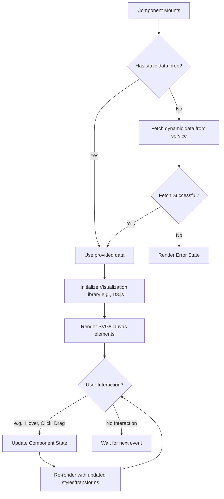
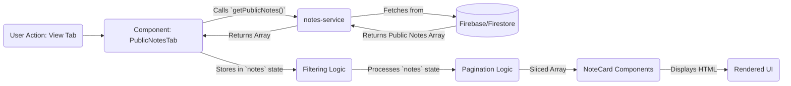

# Module: `Specialized Feature Components`

## 1. Module Summary

This module comprises a collection of high-level, feature-specific React components that form the core interactive elements of the application. These components are responsible for complex UI presentations, data visualization, and user interaction patterns, such as knowledge graphs, interactive note-taking, and themed navigation systems. They encapsulate significant client-side logic and are designed to be composed into the main application pages.

## 2. Module Dependencies

* **Internal Dependencies:**
    * `@/components/ui/*`: For primitive UI elements like buttons, cards, and badges.
    * `@/hooks/useAuth`: To access user authentication state.
    * `@/hooks/useLanguage`: For internationalization and translation.
    * `@/lib/notes-service`: For fetching and managing user notes.
    * `@/lib/knowledgeGraphUtils`: For loading and processing graph data.
    * `@/lib/utils`: For utility functions.
* **External Dependencies:**
    * `react`: For component creation, state management, and hooks.
    * `next/image`: For optimized image rendering.
    * `d3`: For data visualization, specifically the force-directed graph layout.
    * `lucide-react`: For icons.

## 3. Public API / Exports

This module exports a series of specialized React components, each serving a distinct feature:

*   `CharacterGarden`: Renders an interactive, garden-themed character navigation system.
*   `ChunkErrorBoundary`: A React Error Boundary to gracefully handle dynamic import loading errors.
*   `ClientOnly`: A wrapper component to ensure its children only render on the client-side.
*   `HorizontalScrollContainer`: Provides a container with smooth, momentum-based horizontal scrolling.
*   `HydrationDebugger`: A development-only tool for diagnosing server-client hydration mismatches.
*   `KnowledgeGraphViewer`: An interactive D3.js-powered force-directed graph for visualizing relationships.
*   `MuseumContentCard`: A themed card component for displaying content in a museum-exhibit style.
*   `NoteCard`: Displays a single user note with controls for editing, deleting, and sharing.
*   `NoteFilters`: Provides a UI for filtering a list of notes by various criteria.
*   `NoteStats`: Displays aggregate statistics based on a collection of notes.
*   `ParallaxSection`: A container that applies parallax scrolling effects to its children.
*   `PublicNotesTab`: A component that fetches and displays publicly shared notes from the community.
*   `SimulatedKnowledgeGraph`: Displays a static image representation of a knowledge graph with a fallback.
*   `UserProfile`: Renders a user's profile information.
*   `WindowFrameNavigation`: A navigation component that presents items within stylized window frames.

## 4. Code File Breakdown

### 4.1. `CharacterGarden.tsx`

*   **Purpose:** This component creates an interactive character navigation system using a traditional Chinese garden aesthetic. It visually represents characters and their relationships as elements in a garden, providing an immersive way to explore the novel's cast. The component handles dynamic positioning, seasonal themes, and relationship highlighting.
*   **Functions:**
    *   `CharacterGarden(props: CharacterGardenProps): React.FC`: The main component that renders the interactive garden, including characters and their connections.
*   **Key Classes / Constants / Variables:**
    *   `Character`: An interface defining the data structure for a single character, including their name, image, relationships, and position in the garden.
    *   `CharacterGardenProps`: An interface for the component's props, allowing customization of characters, dimensions, and interaction handlers.

### 4.2. `ChunkErrorBoundary.tsx`

*   **Purpose:** This is a React Error Boundary specifically designed to catch and handle errors related to dynamic imports (chunk loading failures). It prevents the entire application from crashing due to network issues or build problems. It provides a user-friendly fallback UI with options to retry or reload the page.
*   **Props:**
    *   `maxRetries?: number`: Maximum number of automatic retry attempts (default: 3)
    *   `enableAutoRetry?: boolean`: Whether to automatically retry failed chunk loads (default: true)
    *   `onError?: (error: Error, errorInfo: React.ErrorInfo) => void`: Callback fired when an error is caught
*   **Functions:**
    *   `getDerivedStateFromError(error: Error): Partial<ChunkErrorBoundaryState>`: A static lifecycle method that updates the component's state when an error is thrown by a child component.
    *   `componentDidCatch(error: Error, errorInfo: React.ErrorInfo)`: A lifecycle method that logs the error and can trigger side effects, like reporting the error to a logging service. Also calls `onError` callback if provided.
    *   `handleRetry()`: A method to reset the error state and attempt to re-render the child components.
*   **Key Classes / Constants / Variables:**
    *   `ChunkErrorBoundary`: The class-based component that implements the error boundary logic.

### 4.3. `ClientOnly.tsx`

*   **Purpose:** This utility component solves server-side rendering (SSR) hydration mismatch errors. It ensures that its children are only rendered on the client after the initial mount. This is crucial for components that rely on browser-specific APIs like `window` or `localStorage`.
*   **Implementation:** Uses `useSyncExternalStore` from React for safe hydration handling. This is the recommended approach as of React 18 for coordinating state between server and client renders.
*   **Functions:**
    *   `ClientOnly({ children, fallback }: ClientOnlyProps): JSX.Element`: A functional component that delays the rendering of its children until the component has mounted on the client.
*   **Key Classes / Constants / Variables:**
    *   Uses `useSyncExternalStore` with a server snapshot of `false` and client snapshot of `true` to safely track client-side rendering state without hydration mismatches.

### 4.4. `HorizontalScrollContainer.tsx`

*   **Purpose:** This component provides a panoramic, horizontal scrolling experience with smooth, momentum-based physics. It is designed to support a traditional right-to-left reading flow, mimicking classical Chinese scrolls. It includes features like parallax effects and keyboard navigation to create an immersive and accessible interface.
*   **Props:**
    *   `onScroll?: (scrollPosition: number, scrollPercentage: number) => void`: Callback fired on scroll events, providing current position and percentage scrolled
*   **Functions:**
    *   `HorizontalScrollContainer(props: HorizontalScrollContainerProps): React.FC`: The main component that wraps content to provide the horizontal scrolling behavior.
*   **Key Classes / Constants / Variables:**
    *   `MomentumState`: An interface defining the state object for the momentum physics simulation, including velocity and position.

### 4.5. `HydrationDebugger.tsx`

*   **Purpose:** This is a debugging tool intended for use only in the development environment. It helps developers diagnose and fix hydration errors by monitoring the DOM for unexpected changes that occur between the server render and the client hydration. It specifically looks for common issues like `className` modifications by third-party scripts.
*   **Functions:**
    *   `HydrationDebugger(): null`: A component that renders nothing but sets up DOM observers and logging in a `useEffect` hook.
*   **Key Classes / Constants / Variables:**
    *   `MutationObserver`: The browser API used to watch for changes to the `<html>` element's attributes.

### 4.6. `KnowledgeGraphViewer.tsx`

*   **Purpose:** This component renders a dynamic, interactive knowledge graph to visualize the complex relationships between characters, locations, and events in the novel. It uses the D3.js library to handle the physics simulation and rendering. The component allows for zooming, panning, and node interaction to explore the data.
*   **Layout Algorithm:** **Radial Group Layout (径向分组布局)**
    *   Nodes are organized into concentric rings based on their `group` property (1-5)
    *   **Ring 1 (Core):** 神話人物/神器 (女媧、頑石、石頭記) - innermost
    *   **Ring 2:** 神仙 (僧、道)
    *   **Ring 3:** 世俗人物 (甄士隱、賈雨村等)
    *   **Ring 4:** 地點 (青埂峰、姑蘇城等)
    *   **Ring 5 (Outer):** 事件/概念 (補天、好了歌等)
    *   Uses `forceRadial` as primary force with 80% strength for ring structure
    *   Angular distribution via `forceX` and `forceY` spreads nodes evenly within each ring
*   **Control UI Buttons:**
    *   **Play/Pause**: Toggle the force simulation animation on/off
    *   **Zoom In/Out**: Adjust the graph zoom level
    *   **Search**: Text input to find and highlight specific nodes by name
    *   **Reset View**: Return to initial zoom and pan position
*   **Functions:**
    *   `KnowledgeGraphViewer(props: KnowledgeGraphViewerProps): React.FC`: The main component that sets up the D3 simulation and renders the SVG-based graph.
    *   `getGroupRadius(group: number): number`: Internal function that calculates the radius for each group ring based on viewport dimensions.
*   **Key Classes / Constants / Variables:**
    *   `KnowledgeGraphNode`: An interface for the data structure of a single node (e.g., a character) in the graph.
    *   `KnowledgeGraphLink`: An interface for the data structure of a link (a relationship) between two nodes.
    *   `d3.forceSimulation`: The core D3.js function used to create and manage the graph's physics.
    *   `d3.forceRadial`: Primary force for organizing nodes into concentric rings by group.

### 4.7. `MuseumContentCard.tsx`

*   **Purpose:** This component is designed to present content in an elegant, visually appealing card that mimics the style of a museum exhibit plaque. It is used to display various types of information, such as character summaries, chapter analyses, or poems. It includes sophisticated hover effects and supports different content variants.
*   **Functions:**
    *   `MuseumContentCard(props: MuseumContentCardProps): React.FC`: The component that renders the themed content card.
*   **Key Classes / Constants / Variables:**
    *   `MuseumContentCardProps`: An interface for the component's props, allowing for extensive customization of content, appearance, and interactivity.

### 4.8. `NoteCard.tsx`

*   **Purpose:** This component displays a single user-created note. It is a key part of the note-taking feature, providing functionality for users to view, edit, tag, share, and delete their notes. It operates in two modes: a fully interactive mode for the note's owner and a read-only mode for public viewing.
*   **Functions:**
    *   `NoteCard(props: NoteCardProps): JSX.Element`: The component that renders the note and handles all user interactions, using callbacks to propagate changes to the parent component.
*   **Key Classes / Constants / Variables:**
    *   `Note`: An interface defining the data structure for a note object.
    *   `isEditing`: A local state variable to toggle the inline editing UI.

### 4.9. `NoteFilters.tsx`

*   **Purpose:** This component provides a user interface for filtering and sorting a list of notes. It allows users to narrow down their notes by full-text search, chapter, date range, and tags. It is designed to be a controlled component, receiving the full list of notes and reporting the filtered list back to its parent.
*   **Functions:**
    *   `NoteFilters({ notes, onFilterChange }: NoteFiltersProps): JSX.Element`: The component that renders the filter controls and applies the filtering logic.
*   **Key Classes / Constants / Variables:**
    *   `useMemo`: This React hook is used extensively to optimize performance by memoizing the results of expensive calculations (like extracting unique tags and filtering the notes), preventing them from re-running on every render.

### 4.10. `NoteStats.tsx`

*   **Purpose:** This component functions as a dashboard widget that displays high-level statistics about a user's note-taking activity. It calculates and shows metrics like the total number of notes, chapters covered, and total word count. This provides users with a quick, visual summary of their engagement and progress.
*   **Functions:**
    *   `NoteStats({ notes }: NoteStatsProps): JSX.Element`: A pure component that takes an array of notes and renders the calculated statistics in a grid of cards.
*   **Key Classes / Constants / Variables:**
    *   `stats`: An array of configuration objects that defines the metrics to be displayed, including their labels, icons, and colors.

### 4.11. `ParallaxSection.tsx`

*   **Purpose:** This component is a container that creates a parallax scrolling effect for its children. It allows different layers of content to move at different speeds as the user scrolls, creating a sense of depth. It is used to build immersive, visually engaging sections, particularly on the landing page.
*   **Props:**
    *   `onScrollProgress?: (progress: number) => void`: Callback fired during scroll, providing a 0-1 progress value indicating how far through the section the user has scrolled
*   **Functions:**
    *   `ParallaxSection(props: ParallaxSectionProps): React.FC`: The main container component that sets up the scroll event listeners and applies the parallax transforms.
    *   `ParallaxLayer(props: ParallaxLayerProps): React.FC`: A child component used to define an individual layer within the `ParallaxSection`, with its own specific speed.
*   **Key Classes / Constants / Variables:**
    *   `requestAnimationFrame`: The browser API used to ensure smooth, performance-optimized animations that are synced with the browser's repaint cycle.

### 4.12. `PublicNotesTab.tsx`

*   **Purpose:** This component provides the user interface for the "Community Notes" feature. It fetches a list of all publicly shared notes from the backend and displays them in a paginated, filterable grid. It is designed for content discovery, allowing users to learn from the insights of other readers.
*   **Functions:**
    *   `PublicNotesTab(): JSX.Element`: The component that manages fetching, filtering, and displaying the public notes.
*   **Key Classes / Constants / Variables:**
    *   `getPublicNotes`: The service function imported from `notes-service` to fetch the data from Firebase.
    *   `NOTES_PER_PAGE`: A constant that defines the number of notes to display per page in the pagination system.

### 4.13. `SimulatedKnowledgeGraph.tsx`

*   **Purpose:** This component serves as a simpler, static alternative to the dynamic `KnowledgeGraphViewer`. It displays a pre-rendered image of a knowledge graph. Its primary role is to provide a visual representation when a dynamic graph is not needed or as a graceful fallback if the image fails to load.
*   **Functions:**
    *   `SimulatedKnowledgeGraph(props): JSX.Element`: The component that renders the `next/image` and handles the error state.
*   **Key Classes / Constants / Variables:**
    *   `imageError`: A local state variable used to track whether the image has failed to load, triggering the display of the fallback content.

### 4.14. `UserProfile.tsx`

*   **Purpose:** This component is responsible for displaying information about the currently authenticated user. It shows the user's name, email, and avatar, along with the authentication method they used (e.g., Google). It comes in several variants for use in different contexts, such as a full profile page or a compact display in a navigation bar.
*   **Functions:**
    *   `UserProfile(props: UserProfileProps): JSX.Element`: The component that fetches user data from the `useAuth` hook and renders it according to the specified variant.
*   **Key Classes / Constants / Variables:**
    *   `useAuth`: The custom hook that provides the user object and authentication status.

### 4.15. `WindowFrameNavigation.tsx`

*   **Purpose:** This component provides a unique and artistic navigation experience inspired by the "borrowed scenery" (借景) concept from traditional Chinese gardens. It presents navigation items or content previews within geometric frames (like circles or hexagons) that act as "windows" into the content. It uses CSS `clip-path` to create the frame shapes.
*   **Functions:**
    *   `WindowFrameNavigation(props: WindowFrameNavigationProps): React.FC`: The component that renders the grid of window frames and handles hover effects.
*   **Key Classes / Constants / Variables:**
    *   `WindowFrameShape`: A TypeScript type defining the available shapes for the frames (e.g., `circular`, `hexagonal`).
    *   `getClipPath`: An internal helper function that returns the correct CSS `clip-path` value for a given shape.

## 5. System and Data Flow

### 5.1. System Flowchart (Control Flow)

This flowchart represents a typical control flow for an interactive component in this module, such as the `KnowledgeGraphViewer`.



### 5.2. Data Flow Diagram (Data Transformation)

This diagram illustrates the data flow for a component that fetches and displays data, like `PublicNotesTab`.



## 6. Usage Example & Testing

*   **Usage:** These components are imported and used within the application's pages to build features. For example, to use the `NoteCard` and `NoteFilters` on a notes page:
    ```typescript
    // In /src/app/(main)/notes/page.tsx
    import { NoteCard } from '@/components/NoteCard';
    import { NoteFilters } from '@/components/NoteFilters';

    // ... fetch notes, then render
    <NoteFilters notes={allNotes} onFilterChange={setFilteredNotes} />
    {filteredNotes.map(note => <NoteCard key={note.id} note={note} />)}
    ```
*   **Testing:** Components in this module are primarily tested via integration tests using React Testing Library and Jest. Tests are located in the `/tests/components/` directory and focus on rendering the components with mock data, simulating user interactions (clicks, text input), and asserting that the UI updates as expected. Visual regression testing can also be used to catch unintended styling changes.

---

**Document Version:** 1.2
**Last Updated:** 2025-12-09
**Changes in v1.2:**
- **KnowledgeGraphViewer:** Implemented Radial Group Layout (径向分组布局) for organized node distribution
  - Nodes now arranged in 5 concentric rings by group property
  - Added `forceRadial` as primary layout force with 80% strength
  - Angular distribution using `forceX`/`forceY` for even spacing within rings
  - Documented `getGroupRadius()` function for ring radius calculation

**Changes in v1.1:**
- Updated ClientOnly.tsx to document `useSyncExternalStore` usage (React 18 best practice)
- Added ChunkErrorBoundary props: `maxRetries`, `enableAutoRetry`, `onError`
- Added HorizontalScrollContainer `onScroll` callback prop
- Added KnowledgeGraphViewer control UI documentation (Play/Pause, Zoom, Search, Reset)
- Added ParallaxSection `onScrollProgress` callback prop

