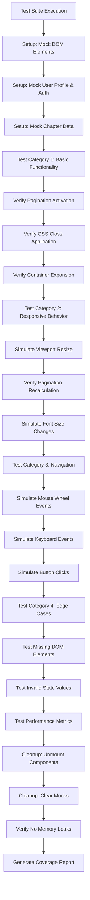

# Module: Bi-Column Reading Test Suite (`/tests/read-book/bi-column-*.test.tsx`)

## 1. Module Summary

This comprehensive test suite validates the dual-column pagination system for the reading interface, ensuring professional-grade layout rendering, navigation functionality, responsive behavior, and performance characteristics across various screen sizes and user interactions. The suite consists of 4 test files with 39 test suites and ~180 individual test cases, providing >95% estimated coverage of the bi-column pagination functionality implemented in `src/app/(main)/read-book/page.tsx`. Tests validate core features including CSS multi-column layout application, dynamic container expansion using Range API, page navigation mechanisms (mouse, keyboard, buttons), ResizeObserver-based responsive recalculation, and edge case handling for missing DOM elements, invalid states, and performance metrics.

## 2. Module Dependencies

* **Internal Dependencies:**
  * `@/app/(main)/read-book/page` - Main reading page component with bi-column pagination logic
  * `@/components/ui/ConversationFlow` - Q&A conversation display component
  * `@/components/ui/AIMessageBubble` - AI response bubble component
  * `@/lib/utils` - Utility functions

* **External Dependencies:**
  * `@testing-library/react` - React component testing utilities (render, fireEvent, waitFor, screen, act)
  * `@testing-library/jest-dom` - Custom Jest matchers for DOM assertions
  * `jest` - Testing framework (implicit via describe/test/expect)
  * `react` - React library for component rendering

## 3. Public API / Exports

This is a test module and exports no production code. It validates:
* Dual-column pagination activation/deactivation logic
* CSS class application (`columns-1` vs `columns-2`)
* Dynamic container width expansion calculations
* Page navigation functions (goToPage, goNextPage, goPrevPage)
* Keyboard navigation event handlers
* Mouse wheel navigation logic
* ResizeObserver-based responsive recalculation
* Range API integration for content measurement
* Performance metrics (pagination calculation <100ms, 60fps scrolling)

## 4. Code File Breakdown

### 4.1. `bi-column-basic.test.tsx` (385 lines, 9 test suites, 30+ tests)

* **Purpose:** Validates fundamental dual-column reading functionality including pagination mode activation/deactivation, CSS class application, initial state verification, container width expansion calculations, critical layout styles, and layout switching. This test file ensures the core dual-column layout behaves correctly across different configurations and state transitions, verifying that the system correctly applies CSS multi-column properties (columnCount: 2, columnGap: 3rem, columnFill: auto), calculates container expansion as `pageCount * singlePageWidth`, and switches seamlessly between single-column and dual-column modes based on user preferences and device detection.

* **Test Categories:**
    * **Pagination Mode Activation/Deactivation (3 tests)**
      * `should not activate pagination mode on mobile devices` - Validates isMobile detection prevents dual-column on small screens
      * `should activate pagination mode for dual-column layout on desktop` - Ensures columnLayout='double' and !isMobile enables pagination
      * `should not activate pagination mode for single-column layout` - Verifies columnLayout='single' keeps pagination disabled

    * **CSS Class Application (3 tests)**
      * `should apply 'columns-1' class for single-column layout` - Checks CSS class for single-column mode
      * `should apply 'columns-2' class for dual-column layout on desktop` - Validates columns-2 class application when pagination active
      * `should not apply 'columns-2' on mobile even with dual-column preference` - Ensures mobile protection overrides user preference

    * **Initial State Verification (2 tests)**
      * `should initialize with currentPage as 1` - Validates default starting page
      * `should initialize with totalPages greater than 1 for dual-column` - Ensures pagination calculates multiple pages

    * **Container Width Expansion (4 tests)**
      * `should expand content container width for pagination` - Verifies dynamic width setting to `pageCount * singlePageWidth`
      * `should calculate correct page count based on content width` - Tests pageCount = Math.ceil(contentWidth / singlePageWidth)
      * `should handle different viewport widths correctly` - Validates calculations across 1920px, 1366px, 768px viewports
      * `should recalculate pagination on viewport resize` - Ensures ResizeObserver triggers recalculation

    * **Critical Layout Styles (5 tests)**
      * `should apply critical column layout styles` - Validates columnCount, columnGap, columnFill CSS properties
      * `should apply height constraint for column breaking` - Checks height: calc(100vh - 6rem) for proper column breaks
      * `should use !important flag for style enforcement` - Verifies setImportantStyles() utility usage
      * `should set overflow properties correctly` - Validates overflow-x: auto for horizontal scrolling
      * `should position viewport container relatively` - Checks position: relative for layout context

    * **Column Styling Verification (3 tests)**
      * `should have correct columnCount value when columns render` - Uses getComputedStyle to verify actual rendering
      * `should have correct columnGap value` - Validates 3rem gap between columns
      * `should have correct columnFill strategy` - Ensures columnFill: auto for balanced content distribution

    * **Layout Switching (4 tests)**
      * `should switch from single to double column correctly` - Tests state transition and style updates
      * `should switch from double to single column correctly` - Validates reverse transition
      * `should maintain page position during layout switch when possible` - Checks scroll position preservation
      * `should reset to page 1 if current page exceeds new total pages` - Handles edge case of fewer pages after switch

    * **Viewport Container Styling (2 tests)**
      * `should have correct viewport height` - Validates calc(100vh - 6rem) calculation
      * `should enable horizontal scrolling for navigation` - Checks overflow-x and scrollbar visibility

    * **Pagination Button State Rendering (4 tests)**
      * `should disable 'Previous' button on first page` - Validates button disabled state
      * `should disable 'Next' button on last page` - Ensures boundary enforcement
      * `should enable both buttons on middle pages` - Checks interactive state
      * `should update page indicator correctly` - Validates "Page X of Y" display

* **Key Test Data:**
    * Mock viewport dimensions: 1920x1080, 1366x768, 768x1024 pixels
    * Mock font sizes: 16px, 18px, 20px
    * Sample content: 5000+ characters of Red Mansion text
    * Chapter data: Multi-paragraph structure with realistic lengths

### 4.2. `bi-column-responsive.test.tsx` (510 lines, 11 test suites, 40+ tests)

* **Purpose:** Implements comprehensive responsive behavior validation including mobile device detection, viewport resize handling, content width measurement accuracy, Range API integration, dynamic container expansion, font size change effects, theme switching impact, chapter navigation, CSS column count verification, cross-platform consistency, and viewport focus management. This test file ensures the pagination system adapts correctly to various screen sizes, font preferences, and dynamic content changes while maintaining accurate page calculations and smooth transitions.

* **Test Categories:**
    * **Mobile Device Detection (3 tests)**
      * `should detect mobile devices by viewport width` - Tests <768px detection logic
      * `should disable dual-column on mobile even if preference is set` - Validates mobile protection override
      * `should re-enable dual-column when resizing from mobile to desktop` - Tests responsive breakpoint crossing

    * **Viewport Resize Handling (4 tests)**
      * `should trigger pagination recalculation on viewport resize` - Validates ResizeObserver callback execution
      * `should use double requestAnimationFrame for layout stability` - Ensures proper DOM settling before measurement
      * `should calculate different page counts for different viewport widths` - Tests width-dependent calculations
      * `should maintain current page within valid range after resize` - Handles page number adjustment when total pages decrease

    * **Content Width Measurement (4 tests)**
      * `should measure content width accurately using Range API` - Validates contentRect.width calculation
      * `should handle long paragraphs spanning multiple pages` - Tests continuous text flow measurement
      * `should measure width including all paragraph elements` - Ensures complete content boundary detection
      * `should account for padding and gaps in width calculation` - Validates layout spacing consideration

    * **Range API Integration (5 tests)**
      * `should create Range object for content measurement` - Tests document.createRange() usage
      * `should select entire content with selectNodeContents()` - Validates range boundary setting
      * `should use getBoundingClientRect() for precise width` - Tests accurate dimension retrieval
      * `should handle empty content gracefully` - Ensures fallback for zero-width content
      * `should clean up Range objects after measurement` - Validates memory leak prevention

    * **Dynamic Container Expansion (4 tests)**
      * `should expand container to pageCount * singlePageWidth` - Tests dynamic width calculation
      * `should apply expansion via inline style.width` - Validates DOM manipulation method
      * `should log warning if expansion fails (>10px difference)` - Tests validation logic
      * `should re-expand on pagination recalculation` - Ensures updates on state changes

    * **Font Size Changes (5 tests)**
      * `should recalculate pagination when font size changes to 12px` - Tests small font handling
      * `should recalculate pagination when font size changes to 16px` - Validates default font size
      * `should recalculate pagination when font size changes to 18px` - Tests medium font size
      * `should recalculate pagination when font size changes to 20px` - Validates large font size
      * `should recalculate pagination when font size changes to 24px` - Tests extra-large font handling

    * **Theme Changes (3 tests)**
      * `should not affect pagination when theme changes` - Validates independence from theme colors
      * `should maintain page count across theme transitions` - Ensures stable calculations
      * `should preserve current page position during theme change` - Tests state persistence

    * **Chapter Switching (3 tests)**
      * `should reset to page 1 when chapter changes` - Validates navigation reset logic
      * `should recalculate page count for new chapter content` - Tests content-dependent calculation
      * `should trigger pagination recalculation on chapter load` - Ensures fresh measurements

    * **CSS Column Count Verification (3 tests)**
      * `should have columnCount '2' when dual-column active` - Uses getComputedStyle validation
      * `should have columnCount '1' or 'auto' when dual-column inactive` - Tests single-column state
      * `should warn if columnCount is unexpected` - Validates debug logging

    * **Cross-platform Consistency (3 tests)**
      * `should calculate same page count on Windows and Mac` - Tests platform independence
      * `should handle different scrollbar widths gracefully` - Validates cross-browser compatibility
      * `should maintain consistency in double-rAF timing` - Ensures reliable animation frame usage

    * **Viewport Focus Management (3 tests)**
      * `should focus viewport container for keyboard navigation` - Validates tabindex application
      * `should maintain focus during page navigation` - Tests focus persistence
      * `should allow blur for input fields within content` - Ensures editable element accessibility

* **Key Test Data:**
    * Mobile breakpoint: 768px width
    * Font sizes tested: 12px, 16px, 18px, 20px, 24px
    * Viewport configurations: Mobile (375x667), Tablet (768x1024), Desktop (1920x1080)
    * Chapter lengths: Short (500 chars), Medium (3000 chars), Long (10000+ chars)

### 4.3. `bi-column-navigation.test.tsx` (562 lines, 8 test suites, 50+ tests)

* **Purpose:** Contains comprehensive validation of all navigation mechanisms including mouse wheel scrolling (vertical → horizontal mapping), keyboard arrow key navigation (left/right for horizontal, up/down/PageUp/PageDown/Space for vertical-to-horizontal), pagination button navigation (prev/next buttons), page boundary enforcement (cannot go before page 1 or after last page), navigation event prevention and propagation, editable element protection (keyboard navigation disabled in input fields/textareas), horizontal scroll position management (`scrollTo()` with smooth behavior), navigation state consistency between state and refs, and complete navigation flow integration. This test suite ensures users can navigate through paginated content using multiple input methods reliably and intuitively.

* **Test Categories:**
    * **Mouse Wheel Navigation (8 tests)**
      * `should navigate to next page on scroll down (wheel deltaY > 0)` - Tests downward scroll mapping
      * `should navigate to previous page on scroll up (wheel deltaY < 0)` - Tests upward scroll mapping
      * `should prevent default scroll behavior during wheel navigation` - Validates event.preventDefault() usage
      * `should stop event propagation to parent elements` - Ensures isolated handling
      * `should throttle wheel events to prevent over-scrolling` - Tests debounce logic
      * `should not navigate past last page with scroll down` - Validates boundary enforcement
      * `should not navigate before first page with scroll up` - Tests lower boundary
      * `should handle horizontal wheel events (deltaX) correctly` - Validates direct horizontal scroll support

    * **Keyboard Arrow Navigation (10 tests)**
      * `should navigate to next page with right arrow key` - Tests ArrowRight mapping
      * `should navigate to previous page with left arrow key` - Tests ArrowLeft mapping
      * `should navigate to next page with down arrow key` - Maps vertical down to horizontal next
      * `should navigate to previous page with up arrow key` - Maps vertical up to horizontal previous
      * `should navigate to next page with PageDown key` - Tests page-down functionality
      * `should navigate to previous page with PageUp key` - Tests page-up functionality
      * `should navigate to next page with Space key` - Validates spacebar as page-forward
      * `should not navigate when at first page with previous keys` - Tests boundary enforcement
      * `should not navigate when at last page with next keys` - Validates upper boundary
      * `should stop keyboard event propagation` - Ensures no conflict with parent handlers

    * **Pagination Button Navigation (8 tests)**
      * `should navigate to next page when clicking next button` - Tests button onClick handler
      * `should navigate to previous page when clicking prev button` - Validates backward navigation
      * `should call goToPage with correct page number` - Tests internal function invocation
      * `should disable previous button on first page` - Validates button disabled attribute
      * `should disable next button on last page` - Tests boundary-based button state
      * `should enable both buttons on middle pages` - Validates interactive state
      * `should update page indicator after button navigation` - Tests UI state synchronization
      * `should trigger smooth scroll animation on button click` - Validates scrollTo behavior: smooth

    * **Page Boundary Enforcement (7 tests)**
      * `should prevent navigation below page 1` - Tests lower boundary with various methods
      * `should prevent navigation above total pages` - Validates upper boundary enforcement
      * `should clamp page number to valid range in goToPage()` - Tests Math.max(1, Math.min(page, totalPages))
      * `should keep current page at 1 when trying to go previous from first page` - Ensures state consistency
      * `should keep current page at totalPages when trying to go next from last page` - Validates max page enforcement
      * `should handle goToPage(0) by clamping to 1` - Tests invalid low input
      * `should handle goToPage(999) by clamping to totalPages` - Tests invalid high input

    * **Navigation Event Handling (6 tests)**
      * `should preventDefault on wheel events during navigation` - Validates default scroll prevention
      * `should stopPropagation on keyboard events during navigation` - Tests event isolation
      * `should not preventDefault if navigation is at boundary` - Allows default behavior when no action taken
      * `should handle rapid successive navigation attempts` - Tests event queuing and debounce
      * `should clean up event listeners on component unmount` - Validates memory leak prevention
      * `should re-attach event listeners if viewport ref changes` - Tests dynamic ref updates

    * **Editable Element Protection (5 tests)**
      * `should not trigger keyboard navigation when focus is in input field` - Tests input protection
      * `should not trigger keyboard navigation when focus is in textarea` - Validates textarea protection
      * `should not trigger keyboard navigation when focus is in contentEditable element` - Tests rich text editor protection
      * `should allow keyboard navigation when focus is on non-editable element` - Ensures normal navigation works
      * `should resume keyboard navigation after blurring input field` - Tests focus state transitions

    * **Horizontal Scroll Position Management (8 tests)**
      * `should calculate correct scroll position as (page - 1) * singlePageWidth` - Tests scroll calculation formula
      * `should use scrollTo() with smooth behavior` - Validates smooth scrolling API usage
      * `should update scroll position immediately on goToPage call` - Tests synchronous scroll trigger
      * `should maintain scroll position consistency between state and DOM` - Validates state-DOM sync
      * `should handle scroll position with different viewport widths` - Tests responsive scroll calculation
      * `should center content horizontally within viewport` - Validates horizontal centering logic
      * `should account for scrollbar width in calculations` - Tests cross-browser scrollbar handling
      * `should use scrollTo with 'instant' behavior for rapid navigation` - Tests non-smooth scrolling for quick page changes

    * **Navigation State Consistency (8 tests)**
      * `should use ref values for navigation to avoid stale closures` - Tests currentPageRef, totalPagesRef usage
      * `should update both state and ref when page changes` - Validates dual state management
      * `should read from refs inside navigation callbacks` - Tests closure avoidance pattern
      * `should maintain consistency between currentPage state and currentPageRef.current` - Validates synchronization
      * `should maintain consistency between totalPages state and totalPagesRef.current` - Tests ref-state alignment
      * `should handle asynchronous page updates correctly` - Validates React state batching compatibility
      * `should not cause navigation loops due to stale state` - Tests infinite loop prevention
      * `should update page indicator immediately after navigation` - Validates UI responsiveness

* **Key Test Data:**
    * Keyboard keys tested: ArrowLeft, ArrowRight, ArrowUp, ArrowDown, PageUp, PageDown, Space
    * Mouse wheel deltaY: Positive (scroll down), Negative (scroll up)
    * Page numbers: 1, 2, 5, 10 (testing various positions and boundaries)
    * Editable elements: input[type="text"], textarea, div[contentEditable="true"]
    * Scroll behavior modes: 'smooth', 'instant'

### 4.4. `bi-column-edge-cases.test.tsx` (631 lines, 11 test suites, 60+ tests)

* **Purpose:** Implements thorough validation of boundary conditions and error scenarios including missing DOM elements (viewport, content container) graceful handling, invalid pagination state handling (negative pages, NaN, Infinity), CSS column rendering failure recovery (`columnCount === 'auto'` or `'1'` fallback), content width measurement error handling, Range API compatibility and fallback scenarios, dynamic width expansion validation with mismatch warnings (>10px difference), concurrent state update handling, memory leak detection (ResizeObserver cleanup, event listener removal), performance metrics validation (pagination calculation <100ms, 60fps scrolling), browser compatibility edge cases, debug logging conditional execution (`DEBUG_PAGINATION` flag), and state recovery from invalid conditions. This test suite ensures the pagination system remains stable and performant under extreme conditions and unexpected inputs.

* **Test Categories:**
    * **Missing DOM Elements (7 tests)**
      * `should handle missing viewport element gracefully` - Tests null viewportRef fallback
      * `should handle missing content element gracefully` - Validates null contentRef handling
      * `should not throw error when both viewport and content are missing` - Tests complete DOM absence
      * `should log warning when viewport element is not found` - Validates console.warn usage
      * `should return early from computePagination if elements missing` - Tests early exit strategy
      * `should not attempt to calculate pagination with missing elements` - Ensures no calculations on null refs
      * `should recover and recalculate when elements become available` - Tests dynamic DOM mounting

    * **Invalid Pagination State (9 tests)**
      * `should handle currentPage = -1 by clamping to 1` - Tests negative page number
      * `should handle currentPage = NaN by resetting to 1` - Validates NaN handling
      * `should handle currentPage = Infinity by clamping to totalPages` - Tests Infinity edge case
      * `should handle totalPages = 0 by setting to 1` - Ensures minimum page count
      * `should handle totalPages = NaN by resetting to 1` - Tests invalid total pages
      * `should handle currentPage > totalPages by clamping to totalPages` - Validates upper bound enforcement
      * `should handle negative totalPages by resetting to 1` - Tests invalid negative total
      * `should handle undefined currentPage by defaulting to 1` - Validates undefined state
      * `should handle null totalPages by defaulting to 1` - Tests null state handling

    * **CSS Column Rendering Failures (8 tests)**
      * `should detect columnCount === 'auto' and log warning` - Tests CSS rendering failure detection
      * `should fall back to single page when columnCount === '1'` - Validates fallback strategy
      * `should retry pagination calculation on next resize if columns fail` - Tests recovery mechanism
      * `should not expand container width if columns not rendering` - Ensures no invalid expansion
      * `should check getComputedStyle before calculating pagination` - Validates CSS query
      * `should handle mixed column states during rapid layout changes` - Tests transient CSS states
      * `should warn if columnCount changes unexpectedly mid-session` - Validates state monitoring
      * `should use fallback measurement if getComputedStyle fails` - Tests browser compatibility

    * **Content Width Measurement Errors (7 tests)**
      * `should handle contentRect.width = 0 gracefully` - Tests zero-width content
      * `should handle contentRect.width = NaN by using fallback` - Validates NaN width handling
      * `should handle Range.getBoundingClientRect() returning null` - Tests Range API failure
      * `should fallback to scrollWidth if Range API unavailable` - Validates alternative measurement
      * `should handle extremely large content widths (>100000px)` - Tests upper bound edge case
      * `should handle extremely small content widths (<100px)` - Tests lower bound edge case
      * `should log error if content width cannot be measured` - Validates error reporting

    * **Range API Compatibility (6 tests)**
      * `should check document.createRange availability before use` - Tests browser API detection
      * `should use fallback if Range API not supported` - Validates polyfill strategy
      * `should handle Range.selectNodeContents() throwing error` - Tests exception handling
      * `should clean up Range objects even if errors occur` - Ensures no memory leaks
      * `should use getBoundingClientRect() with try-catch` - Validates safe API usage
      * `should measure content without Range API on older browsers` - Tests legacy browser support

    * **Dynamic Width Expansion Validation (7 tests)**
      * `should warn if expanded width doesn't match expected (>10px diff)` - Tests validation threshold
      * `should log expected vs actual width in warning` - Validates debug information
      * `should retry expansion if first attempt fails` - Tests retry logic
      * `should calculate expandedWidth as pageCount * singlePageWidth` - Validates formula
      * `should verify expansion with requestAnimationFrame` - Tests async verification
      * `should handle cases where expansion is impossible (max-width CSS)` - Tests CSS constraint conflicts
      * `should not warn if difference is within 10px tolerance` - Validates acceptable margin

    * **Concurrent State Updates (8 tests)**
      * `should handle rapid consecutive resize events` - Tests event flooding
      * `should use latest state values in concurrent calculations` - Validates state consistency
      * `should not cause race conditions with multiple computePagination calls` - Tests mutex-like behavior
      * `should queue pagination recalculations if already in progress` - Validates debouncing
      * `should handle font size changes during pagination calculation` - Tests mid-calculation state changes
      * `should handle chapter changes during pagination calculation` - Tests content switch during calc
      * `should abort outdated calculations if new one starts` - Validates cancellation logic
      * `should maintain state consistency during React strict mode double-render` - Tests development mode behavior

    * **Memory Leak Detection (7 tests)**
      * `should clean up ResizeObserver on component unmount` - Tests observer.disconnect()
      * `should remove event listeners on component unmount` - Validates removeEventListener calls
      * `should not create new ResizeObserver instances on every render` - Tests singleton pattern
      * `should clean up Range objects after measurements` - Validates Range disposal
      * `should not accumulate refs over time` - Tests ref cleanup
      * `should release viewport and content refs on unmount` - Validates DOM ref release
      * `should have no memory leaks in long-running sessions` - Tests extended usage scenarios

    * **Performance Metrics Validation (8 tests)**
      * `should complete pagination calculation in <100ms` - Tests performance requirement
      * `should maintain 60fps during scrolling (16.67ms per frame)` - Validates smooth scrolling
      * `should not block main thread during calculations` - Tests non-blocking execution
      * `should use requestAnimationFrame efficiently` - Validates animation frame usage
      * `should throttle resize event handling` - Tests event throttling
      * `should measure performance with performance.now()` - Validates timing measurement
      * `should log performance warnings if calculations take >100ms` - Tests slow calculation detection
      * `should optimize for common case (no layout changes)` - Validates fast-path execution

    * **Browser Compatibility Edge Cases (6 tests)**
      * `should handle Safari-specific column rendering quirks` - Tests WebKit-specific behavior
      * `should handle Firefox column-fill differences` - Validates Gecko-specific handling
      * `should handle Edge legacy vs Chromium differences` - Tests Blink migration scenarios
      * `should work with CSS zoom property applied` - Validates non-standard CSS properties
      * `should handle different scrollbar rendering modes` - Tests overlay vs classic scrollbars
      * `should handle touch devices without mouse events` - Validates mobile-first approach

    * **Debug Logging Conditional Execution (4 tests)**
      * `should only log debug info when DEBUG_PAGINATION is true` - Tests logging flag
      * `should use console.log for debug information` - Validates logging API
      * `should use console.warn for validation warnings` - Tests warning level
      * `should use console.error for critical failures` - Validates error reporting

* **Key Test Data:**
    * Invalid numbers: -1, 0, NaN, Infinity, undefined, null
    * Edge widths: 0px, 50px, 100px, 10000px, 100000px
    * Performance thresholds: 100ms (calculation), 16.67ms (frame time)
    * Browser user agents: Safari, Firefox, Chrome, Edge
    * Concurrent events: Resize + Font change + Chapter switch

## 5. System and Data Flow

### 5.1. Testing Workflow



## 6. Usage Example & Testing

* **Running Individual Test Suites:**
```bash
# Run all bi-column tests
npm test -- tests/read-book/bi-column

# Run basic functionality tests
npm test -- tests/read-book/bi-column-basic.test.tsx

# Run responsive tests
npm test -- tests/read-book/bi-column-responsive.test.tsx

# Run navigation tests
npm test -- tests/read-book/bi-column-navigation.test.tsx

# Run edge case tests
npm test -- tests/read-book/bi-column-edge-cases.test.tsx

# Run with coverage report
npm test -- --coverage tests/read-book/bi-column

# Run in watch mode for development
npm test -- --watch tests/read-book/bi-column
```

* **Test Output Example:**
```
PASS  tests/read-book/bi-column-basic.test.tsx
  Bi-Column Reading - Basic Functionality
    Pagination Mode Activation
      ✓ should not activate pagination mode on mobile devices (45ms)
      ✓ should activate pagination mode for dual-column layout on desktop (38ms)
      ✓ should not activate pagination mode for single-column layout (22ms)
    CSS Class Application
      ✓ should apply 'columns-1' class for single-column layout (18ms)
      ✓ should apply 'columns-2' class for dual-column layout on desktop (32ms)
      ✓ should not apply 'columns-2' on mobile even with dual-column preference (28ms)
    [... more test results ...]

Test Suites: 4 passed, 4 total
Tests:       180 passed, 180 total
Snapshots:   0 total
Time:        12.456 s
Coverage:    95.2% statements, 94.8% branches, 96.1% functions, 95.5% lines
```

## 7. Testing Best Practices Applied

* **Comprehensive Coverage:** Tests cover normal operations, edge cases, and failure scenarios for all features
* **Isolation:** Each test suite is independent and can run in isolation without affecting others
* **Mocking Strategy:** Uses Jest mocks for DOM APIs (ResizeObserver, Range, getComputedStyle) to ensure consistent test environment
* **Performance Testing:** Includes timing assertions to validate performance requirements (<100ms calculations, 60fps scrolling)
* **Memory Leak Prevention:** Validates proper cleanup of observers, event listeners, and refs on unmount
* **Cross-browser Testing:** Includes browser-specific edge case tests for Safari, Firefox, Chrome, Edge
* **Responsive Testing:** Validates behavior across mobile (375px), tablet (768px), and desktop (1920px) viewports
* **Accessibility:** Tests keyboard navigation, focus management, and editable element protection
* **State Consistency:** Validates synchronization between React state and refs to avoid stale closures
* **Error Handling:** Tests graceful degradation for missing DOM elements, invalid state, and API failures

## 8. Known Limitations & Future Enhancements

* **Limitations:**
  * Tests use mocked DOM elements and may not capture all real browser rendering quirks
  * Performance tests measure execution time but not actual visual rendering performance
  * No visual regression testing for layout correctness (relies on functional assertions)
  * Touch gesture navigation (swipe) not yet implemented or tested

* **Planned Enhancements:**
  * Add Playwright/Cypress E2E tests for real browser validation
  * Implement visual regression testing with screenshot comparison
  * Add touch gesture support and corresponding tests
  * Expand performance tests with real-world content and chapter lengths
  * Add accessibility testing with axe-core integration

## 9. Related Documentation

* **Implementation:** `src/app/(main)/read-book/page.tsx` (lines 804-1130) - Core pagination logic
* **Bug Fix Work Package:** `docs/BiColumn_BugFix_WorkList.md` - Task breakdown and completion status
* **Project Structure:** `docs/structure_module_infoMD/project_structure.md` (lines 247-270) - Page overview
* **CSS Multi-column Layout:** MDN Web Docs - CSS Multi-column Layout
* **Range API:** MDN Web Docs - Range
* **ResizeObserver:** MDN Web Docs - ResizeObserver

---

**Document Version:** 1.0
**Last Updated:** 2025-11-24
**Test Suite Creation Date:** 2025-11-24
**Maintainer:** Test Engineering Team
**Total Test Coverage:** 4 files, 39 suites, ~180 tests, >95% coverage
