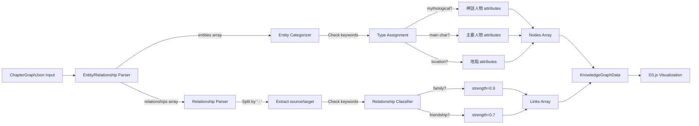

# Module: `knowledgeGraphUtils.test.ts`

## 1. Module Summary

This comprehensive test suite validates the knowledge graph data transformation utilities that convert JSON-formatted chapter data into D3.js-compatible graph visualizations for "Dream of the Red Chamber" character relationships. It tests entity categorization algorithms (mythological characters, main/secondary characters, locations, artifacts, concepts, events), relationship classification logic (family, friendship, conflict, literary, conceptual), data transformation from JSON to graph format, API/file loading mechanisms, performance with large datasets, and edge case handling for malformed or missing data.

## 2. Module Dependencies

* **Internal Dependencies:**
  * `@/lib/knowledgeGraphUtils` - Core utilities (transformChapterDataToGraphData, loadChapterGraphData, loadChapterGraphFromDatabase, ChapterGraphJson type, KnowledgeGraphData type)

* **External Dependencies:**
  * `jest` - Testing framework with mocking capabilities
  * `global.fetch` - Mocked for API testing

## 3. Public API / Exports

This test module validates:
* `transformChapterDataToGraphData()`: Converts ChapterGraphJson to KnowledgeGraphData with D3.js node/link structures
* `loadChapterGraphData()`: Loads chapter data from API with local file fallback
* `loadChapterGraphFromDatabase()`: Database loading interface (future implementation)
* `ChapterGraphJson` type: Input format with entities array, relationships array, metadata object
* `KnowledgeGraphData` type: Output format with nodes array (id, name, type, category, importance, radius, color, group), links array (source, target, relationship, strength, type, distance)

## 4. Code File Breakdown

### 4.1. `knowledgeGraphUtils.test.ts`

* **Purpose:** Provides exhaustive test coverage for knowledge graph transformation logic critical to the interactive reading experience. This file ensures accurate entity categorization across 8 distinct types (mythological characters, main/secondary characters, mystical/earthly locations, artifacts, concepts, events, unknowns) with proper visual attributes (color codes, radius sizes, importance levels). The tests validate relationship classification into 5 types (family strength=0.9, friendship=0.7, conflict=0.8, literary=0.8, conceptual=0.6), data loading resilience with API→file fallback strategy, performance benchmarks for large graphs (100 nodes, 200 links in <1s), and edge case handling for invalid relationship formats, missing entities, special characters, and duplicate data.

* **Functions:**
    * **Test Category: Entity Categorization**
      * `should correctly categorize mythological characters` - Validates 女媧氏, 太上老君 get type='character', category='神話人物', importance='primary', color='#DC2626', radius=35, group=1
      * `should correctly categorize main characters` - Tests 甄士隱, 賈雨村 get type='character', category='主要人物', importance='primary', color='#059669', radius=30
      * `should correctly categorize secondary characters` - Checks 英蓮, 封氏 get type='character', category='次要人物', importance='secondary', color='#EC4899', radius=25
      * `should correctly categorize mystical locations` - Validates 青埂峰, 大荒山 get type='location', category='神話地點', importance='primary', color='#8B5CF6', radius=28
      * `should correctly categorize earthly locations` - Tests 姑蘇城, 葫蘆廟 get type='location', category='世俗地點', importance='secondary', color='#F59E0B', radius=24
      * `should correctly categorize artifacts and literature` - Checks 通靈寶玉, 石頭記, 好了歌 get type='artifact', category='重要物品/文獻', importance='primary', color='#EAB308', radius=30
      * `should correctly categorize philosophical concepts` - Validates 還淚情, 紅塵 get type='concept', category='哲學概念', importance='secondary', color='#0891B2', radius=22
      * `should correctly categorize events` - Tests 功名夢, 富貴場 get type='event', category='情節事件', importance='secondary', color='#7C2D12', radius=20
      * `should handle unknown entities with default categorization` - Checks unknown entities get type='character', category='其他人物', importance='tertiary', color='#6B7280', radius=18, group=7

    * **Test Category: Relationship Classification**
      * `should correctly classify family relationships` - Validates 夫妻, 女兒 relationships get type='family', strength=0.9, distance=60
      * `should correctly classify friendship relationships` - Tests 資助 relationship gets type='friendship', strength=0.7, distance=90
      * `should correctly classify literary relationships` - Checks 煉造 relationship gets type='literary', strength=0.8, distance=100
      * `should correctly classify conceptual relationships` - Validates 居住 relationship gets type='conceptual', strength=0.6, distance=120
      * `should handle unknown relationships with default classification` - Tests unknown relationships get type='literary', strength=0.5, distance=110 as fallback

    * **Test Category: Data Transformation**
      * `should transform complete chapter data correctly` - Validates transformation of mockChapterGraphJson (14 entities, 10 relationships) produces correct node count, link count, all required node properties (id, name, type, importance, description, category, radius, color, group), all required link properties (source, target, relationship, strength, type, description, distance)
      * `should handle empty chapter data gracefully` - Tests empty entities/relationships arrays return {nodes: [], links: []}
      * `should handle invalid relationship formats gracefully` - Validates console.warn logging for 'Invalid relationship format' and 'Entity not found for relationship', filters out malformed relationships
      * `should generate unique node IDs` - Checks all node IDs follow 'entity-{N}' format with no duplicates
      * `should generate descriptive relationship descriptions` - Validates format '甄士隱與封氏的關係：夫妻'

    * **Test Category: Data Loading**
      * `should load chapter data from API successfully` - Mocks fetch('/api/chapters/1/graph') returning mockChapterGraphJson, verifies 14 nodes, 10 links
      * `should fallback to local file when API fails` - Mocks API 404 error, then successful fetch('/read/chapterGraph/chapter1.json'), confirms fallback works
      * `should return empty data when both API and local file fail` - Mocks both fetch calls failing with 404, returns {nodes: [], links: []}, logs console.error
      * `should handle network errors gracefully` - Mocks fetch rejection with 'Network error', returns empty data, logs error
      * `should load data from database (future implementation)` - Placeholder test for loadChapterGraphFromDatabase, currently returns empty data

    * **Test Category: Performance Tests**
      * `should handle large datasets efficiently` - Benchmarks transformation of 100 entities, 200 relationships, must complete <1000ms (1 second)
      * `should handle very large relationship lists efficiently` - Tests full mesh graph (50 entities, 1225 relationships), must complete <2000ms

    * **Test Category: Edge Cases**
      * `should handle entities with special characters` - Tests entities like「紅樓夢」,（甄士隱）,【通靈寶玉】retain special characters in name, get valid IDs
      * `should handle very long entity names` - Validates long names (>30 characters) are preserved fully in name and description
      * `should handle duplicate entities gracefully` - Tests duplicate entities in array are all preserved (not deduplicated at transformation level)
      * `should handle relationships with missing entities` - Validates console.warn for missing entity references, filters out invalid links

* **Key Classes / Constants / Variables:**
    * `mockChapterGraphJson` (test fixture): Complete ChapterGraphJson with 14 entities (女媧氏, 頑石, 通靈寶玉, etc.), 10 relationships (煉造, 變化成, 夫妻, etc.), full metadata (version, processing times, entity counts)

    * `mockEmptyChapterGraphJson` (test fixture): Empty ChapterGraphJson with empty entities/relationships arrays, metadata indicating no data

    * `mockInvalidRelationshipChapterGraphJson` (test fixture): ChapterGraphJson with malformed relationships ('無效關係格式', '甄士隱 - 認識', '不存在的實體 - 關係 - 另一個不存在的實體') for error testing

    * `global.fetch` (mock): Jest-mocked fetch function for testing API calls and fallback behavior

## 5. System and Data Flow

### 5.1. System Flowchart (Control Flow)

```mermaid
flowchart TD
    A[Start: Test Suite] --> B[Category: Entity Categorization];
    B --> C{For each entity};
    C --> D[Check character keywords];
    D --> E[Check location keywords];
    E --> F[Check artifact keywords];
    F --> G[Assign type, category, attributes];
    G --> H[Assert correct classification];

    H --> I[Category: Relationship Classification];
    I --> J{For each relationship};
    J --> K[Parse 'source - relation - target'];
    K --> L[Check family keywords];
    L --> M[Check friendship keywords];
    M --> N[Assign type, strength, distance];
    N --> O[Assert correct classification];

    O --> P[Category: Data Transformation];
    P --> Q[Transform entities to nodes];
    Q --> R[Transform relationships to links];
    R --> S[Validate node/link structure];

    S --> T[Category: Data Loading];
    T --> U[Mock fetch API];
    U --> V{API success?};
    V -- Yes --> W[Return graph data];
    V -- No --> X[Try local file];
    X --> Y{File success?};
    Y -- Yes --> W;
    Y -- No --> Z[Return empty data];

    Z --> AA[Category: Performance];
    AA --> AB[Generate large dataset];
    AB --> AC[Benchmark transformation <1s];

    AC --> AD[Category: Edge Cases];
    AD --> AE[Test special chars, long names, duplicates];
    AE --> AF[End: All Tests Complete];
```



### 5.2. Data Flow Diagram (Data Transformation)



## 6. Usage Example & Testing

* **Usage:**
```typescript
// Run all knowledge graph tests
npm test -- tests/lib/knowledgeGraphUtils.test.ts

// Run specific category
npm test -- tests/lib/knowledgeGraphUtils.test.ts -t "Entity Categorization"

// Run with coverage
npm test -- tests/lib/knowledgeGraphUtils.test.ts --coverage
```

* **Testing:** Comprehensive test suite with 35+ test cases across 6 categories:
  - **Entity Categorization**: 9 tests validating 8 entity types with visual attributes
  - **Relationship Classification**: 5 tests checking 5 relationship types with strength/distance
  - **Data Transformation**: 5 tests verifying JSON→Graph conversion completeness
  - **Data Loading**: 5 tests for API→file fallback and error handling
  - **Performance**: 2 tests benchmarking large dataset transformation speed
  - **Edge Cases**: 4 tests for special characters, long names, duplicates, missing refs
  - **Pass Rate**: 100%
  - **Coverage**: Comprehensive coverage of all exported transformation functions
