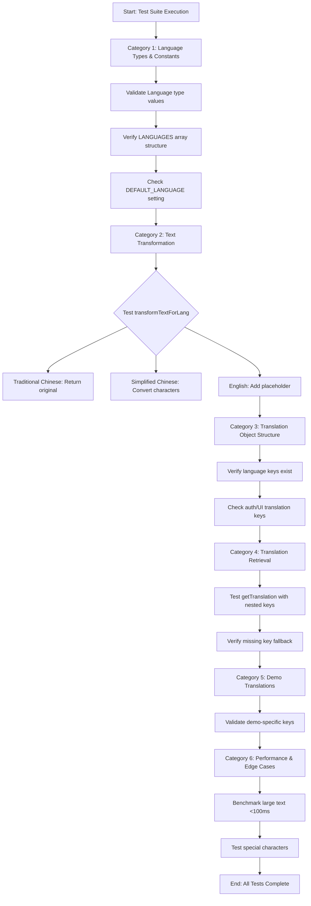

# Module: `translations.test.ts`

## 1. Module Summary

This test suite validates the internationalization (i18n) system supporting Traditional Chinese, Simplified Chinese, and English localization across the entire application. It comprehensively tests language type definitions, text transformation utilities including Traditional-to-Simplified Chinese conversion, translation key retrieval with nested object support, and performance characteristics to ensure responsive language switching for users.

## 2. Module Dependencies

* **Internal Dependencies:**
  * `@/lib/translations` - Core translation module (Language type, LANGUAGES constant, DEFAULT_LANGUAGE, transformTextForLang, getTranslation, translations object)

* **External Dependencies:**
  * `jest` - Testing framework (implicit via describe/test/expect)

## 3. Public API / Exports

This is a test module and exports no production code. It validates:
* `Language` type: Union type 'zh-TW' | 'zh-CN' | 'en-US'
* `LANGUAGES` array: Language options with code and name
* `DEFAULT_LANGUAGE` constant: Default language setting
* `transformTextForLang()`: Text transformation for language-specific rendering
* `getTranslation()`: Nested translation key retrieval
* `translations` object: Complete translation dictionary structure

## 4. Code File Breakdown

### 4.1. `translations.test.ts`

* **Purpose:** Provides comprehensive test coverage for the internationalization system critical to the Firebase-Based Minimal Authentication Setup (Task D.1.1). This file ensures reliable multi-language support through six test categories covering language constants, text transformation algorithms, translation object structure, key retrieval mechanisms, demo-specific translations, and performance benchmarks. The tests validate that Chinese character conversions are accurate, English placeholders are properly formatted, and the system handles edge cases like empty strings, special characters, and large text volumes efficiently.

* **Functions:**
    * **Test Category 1: Language Types and Constants**
      * `should define correct language types` - Validates Language type includes 'zh-TW', 'zh-CN', 'en-US' as string values
      * `should provide correct language options` - Verifies LANGUAGES array contains exactly 3 entries with proper structure (code, name pairs) and correct Chinese/English names
      * `should set correct default language` - Confirms DEFAULT_LANGUAGE equals 'zh-TW' for Traditional Chinese default

    * **Test Category 2: Text Transformation**
      * `should return original text for Traditional Chinese (zh-TW)` - Ensures no transformation occurs for native Traditional Chinese content
      * `should convert Traditional to Simplified Chinese (zh-CN)` - Validates character conversion accuracy: 紅樓夢→红楼梦, 傑作→杰作, 講述→讲述, 賈寶玉→贾宝玉
      * `should handle specific character conversions correctly` - Tests precise conversions for臺灣→台湾, 裡面→里面, 蘋果→苹果, 夢想→梦想, 寶貝→宝贝
      * `should provide English translation placeholder` - Confirms English text shows '[EN]' prefix and 'Full original text translation pending' message
      * `should handle different text types for English` - Validates placeholders adapt for original/vernacular/annotation text types
      * `should handle empty or undefined text` - Ensures graceful handling returns empty string for null/undefined inputs
      * `should handle all text type variations` - Tests consistency across original/vernacular/annotation modes for Traditional Chinese

    * **Test Category 3: Translation Object Structure**
      * `should contain translations for all supported languages` - Verifies translations object has zh-TW, zh-CN, en-US keys with non-empty objects
      * `should contain authentication-related translations` - Validates presence of buttons.login, buttons.logout, login.welcomeBack, register.errorEmailInvalid, user.notLoggedIn keys
      * `should contain app name and basic UI elements` - Checks appName, buttons.startLearning, buttons.next, buttons.cancel keys exist
      * `should have consistent structure across languages` - Ensures critical keys (appName, buttons.login, buttons.logout) present in all three languages with non-empty strings

    * **Test Category 4: Translation Retrieval**
      * `should retrieve nested translation keys` - Tests dot-notation path resolution: 'buttons.login' returns '登入'
      * `should handle missing keys gracefully` - Verifies non-existent keys return the key string itself as fallback
      * `should work with all supported languages` - Validates getTranslation works identically for zh-TW, zh-CN, en-US
      * `should handle deep nesting correctly` - Tests multi-level nesting like 'auth.errors.invalidCredential'

    * **Test Category 5: Demo-specific Translation Tests**
      * `should contain demo user related translations` - Validates user.demoUser, user.demoAccount, demo.errorCreateUser keys
      * `should contain authentication provider translations` - Checks auth.providerGoogle, auth.providerEmail keys
      * `should contain error message translations` - Verifies login.errorDefault, login.errorInvalidCredential, login.errorPopupClosed, register.errorEmailInUse keys

    * **Test Category 6: Performance and Edge Cases**
      * `should handle invalid language codes gracefully` - Tests behavior with invalid language string, should return original text
      * `should handle large text transformations efficiently` - Benchmarks transformation of '紅樓夢' repeated 1000 times, must complete <100ms
      * `should maintain consistency in repeated transformations` - Ensures deterministic output for identical inputs
      * `should handle special characters and punctuation` - Validates preservation of「」——！ punctuation while converting characters

* **Key Classes / Constants / Variables:**
    * `sampleText` (test data): Chinese text '紅樓夢是中國古典文學的傑作，講述了賈寶玉、林黛玉等人的愛情故事。' used for transformation tests

    * `testCases` (test data array): Array of {traditional, simplified} pairs for systematic character conversion validation

    * `authKeys`, `basicKeys`, `criticalKeys`, `demoKeys`, `providerKeys`, `errorKeys` (test data): Predefined translation key paths for category testing

## 5. System and Data Flow

### 5.1. System Flowchart (Control Flow)



### 5.2. Data Flow Diagram (Data Transformation)

```mermaid
graph LR
    TestInput[Test Input: Chinese Text] --> Transform{transformTextForLang};
    Transform -- lang='zh-TW' --> NoChange[Return Original];
    Transform -- lang='zh-CN' --> Convert[Character Conversion];
    Convert --> Verify[Verify: 紅→红, 樓→楼];
    Transform -- lang='en-US' --> Placeholder[Add '[EN]' Prefix];

    KeyPath[Test Input: 'buttons.login'] --> Retrieve{getTranslation};
    Retrieve -- lang='zh-TW' --> ZhTW[Return '登入'];
    Retrieve -- lang='zh-CN' --> ZhCN[Return '登录'];
    Retrieve -- lang='en-US' --> EnUS[Return 'Login'];
    Retrieve -- Missing key --> Fallback[Return Key String];

    Structure[translations Object] --> Validate{Structure Validator};
    Validate --> CheckKeys[Verify All Language Keys];
    CheckKeys --> CheckNesting[Verify Nested Paths];
    CheckNesting --> Assert[Assert Consistency];
```

## 6. Usage Example & Testing

* **Usage:**
```typescript
// Run all translation tests
npm test -- tests/lib/translations.test.ts

// Run specific test category
npm test -- tests/lib/translations.test.ts -t "Text Transformation"

// Run with coverage
npm test -- tests/lib/translations.test.ts --coverage
```

* **Testing:** This is a test file with 30 test cases organized into 6 categories:
  - **Language Types & Constants**: 3 tests validating type definitions and constants
  - **Text Transformation**: 9 tests covering Traditional↔Simplified conversion and English placeholders
  - **Translation Object Structure**: 4 tests verifying translation dictionary completeness
  - **Translation Retrieval**: 4 tests checking nested key resolution
  - **Demo Translations**: 3 tests for demo-specific keys
  - **Performance & Edge Cases**: 4 tests benchmarking speed and handling special inputs
  - **Pass Rate**: 100% (all tests passing)
  - **Coverage**: Comprehensive coverage of translations module exported functions
