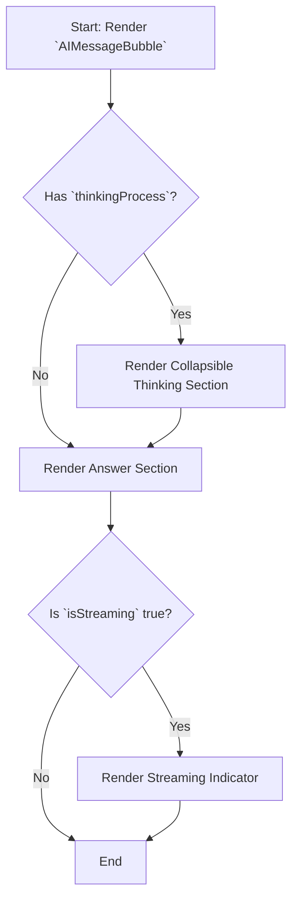
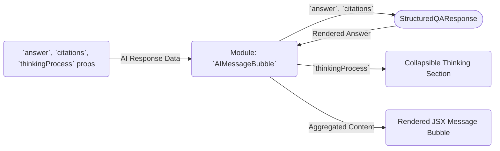

# Module: `AIMessageBubble`

## 1. Module Summary

The `AIMessageBubble` is a UI component designed to display responses from an AI. It elegantly combines the AI's thinking process, the final answer, and any citations into a single, user-friendly message bubble. The thinking process is collapsible, allowing users to inspect it if they wish, without cluttering the main answer.

## 2. Module Dependencies

* **Internal Dependencies:**
    * `@/lib/utils`: For the `cn` utility function.
    * `@/types/perplexity-qa`: For the `PerplexityCitation` type.
    * `./StructuredQAResponse`: To render the main answer content with inline citations.
* **External Dependencies:**
    * `react`: For component creation, state, and effects.
    * `lucide-react`: For icons (`ChevronDown`, `ChevronRight`).

## 3. Public API / Exports

* `AIMessageBubble(props: AIMessageBubbleProps)`: The main component that renders the AI message bubble.
* `default export`: The component is also the default export of the module.

## 4. Code File Breakdown

### 4.1. `AIMessageBubble.tsx`

* **Purpose:** This file contains the implementation of the `AIMessageBubble` component, which structures and displays the complete AI response.
* **Functions:**
    * `AIMessageBubble(props: AIMessageBubbleProps): JSX.Element`: The main React component. It manages the expanded/collapsed state of the thinking process section and conditionally renders the thinking process, the answer, and a streaming indicator.
* **Key Classes / Constants / Variables:**
    * `AIMessageBubbleProps`: The interface for the component's props.
    * `isThinkingExpanded`: State variable to control the visibility of the thinking process content.

## 5. System and Data Flow

### 5.1. System Flowchart (Control Flow)



### 5.2. Data Flow Diagram (Data Transformation)



## 6. Usage Example & Testing

* **Usage:**
  ```tsx
  import { AIMessageBubble } from '@/components/ui/AIMessageBubble';

  const aiResponse = { ... }; // Object with answer, citations, etc.

  <AIMessageBubble
    answer={aiResponse.answer}
    citations={aiResponse.citations}
    thinkingProcess={aiResponse.thinkingProcess}
    isThinkingComplete={true}
  />
  ```
* **Testing:** Unit tests for this component would be in `tests/components/ui/AIMessageBubble.test.tsx`. They would cover the collapsible thinking section's functionality, the display of the loading skeleton while streaming, and the correct rendering of the final answer and citations.