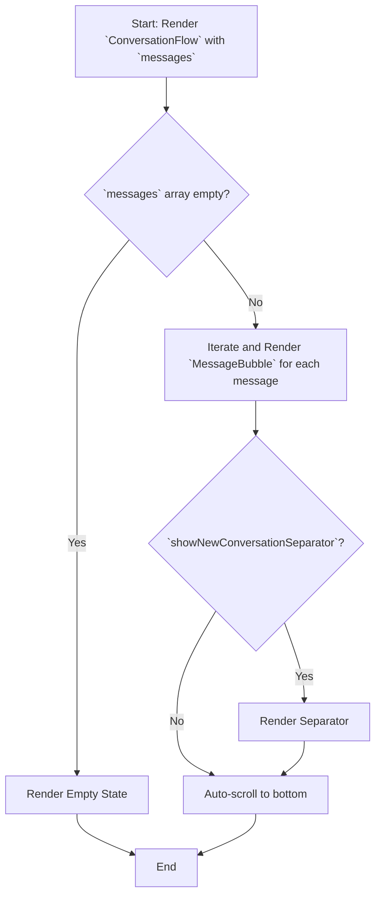
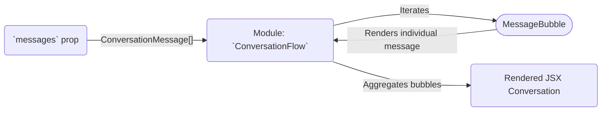

# Module: `ConversationFlow`

## 1. Module Summary

The `ConversationFlow` module provides a complete, messaging-app-style UI for displaying a conversation between a user and an AI. It handles the rendering of different message types (user, AI, system), displays avatars and timestamps, and provides features like automatic scrolling and a "new conversation" separator.

## 2. Module Dependencies

* **Internal Dependencies:**
    * `@/lib/utils`: For the `cn` utility function.
    * `@/types/perplexity-qa`: For the `PerplexityCitation` type.
* **External Dependencies:**
    * `react`: For component creation, refs, and effects.
    * `date-fns`: For formatting timestamps.
    * `lucide-react`: For icons.

## 3. Public API / Exports

* `ConversationFlow(props: ConversationFlowProps)`: The main component that renders the conversation.
* `createConversationMessage(...)`: A utility function for creating new `ConversationMessage` objects.
* `ConversationMessage`: The interface for a single message object.
* `MessageRole`: A type for the role of the message sender (`user`, `ai`, or `system`).

## 4. Code File Breakdown

### 4.1. `ConversationFlow.tsx`

* **Purpose:** This file contains all the components and logic required to render a full conversation thread.
* **Functions:**
    * `formatMessageTime(date: Date): string`: Formats a date into a `HH:mm` string.
    * `formatFullMessageTime(date: Date): string`: Formats a date into a `yyyy/MM/dd HH:mm:ss` string.
    * `getAvatarConfig(role: MessageRole)`: Returns the icon, color, and label for a given message role.
    * `MessageAvatar(props: MessageAvatarProps)`: A component that renders the avatar for a user or AI.
    * `MessageBubble(props: MessageBubbleProps)`: A component that renders a single message bubble, handling different styles for user, AI, and system messages.
    * `NewConversationSeparator(props: NewConversationSeparatorProps)`: A component that renders the "--開啟新對話--" separator.
    * `ConversationFlow(props: ConversationFlowProps)`: The main component that orchestrates the rendering of the entire message list and handles auto-scrolling.
    * `createConversationMessage(...)`: A factory function to easily create new message objects with default values.
* **Key Classes / Constants / Variables:**
    * `ConversationFlowProps`: The interface for the main component's props.
    * `ConversationMessage`: The core interface for a message.

## 5. System and Data Flow

### 5.1. System Flowchart (Control Flow)



### 5.2. Data Flow Diagram (Data Transformation)



## 6. Usage Example & Testing

* **Usage:**
  ```tsx
  import { ConversationFlow, createConversationMessage } from '@/components/ui/ConversationFlow';

  const [messages, setMessages] = useState([]);

  // Add a new user message
  const newUserMessage = createConversationMessage('user', 'Hello, AI!');
  setMessages([...messages, newUserMessage]);

  <ConversationFlow messages={messages} />
  ```
* **Testing:** Unit tests for this component would be in `tests/components/ui/ConversationFlow.test.tsx`. They would cover the rendering of different message roles, the empty state, the auto-scroll behavior, and the functionality of the `createConversationMessage` utility.
