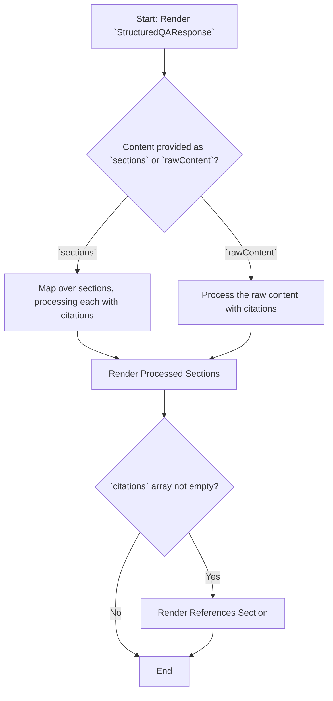

# Module: `StructuredQAResponse`

## 1. Module Summary

The `StructuredQAResponse` component is designed to professionally display answers from a Q&A system, particularly those from the Perplexity AI. It formats the response into numbered sections, integrates clickable inline citations, and provides a dedicated, easy-to-read references section at the end.

## 2. Module Dependencies

* **Internal Dependencies:**
    * `@/types/perplexity-qa`: For the `PerplexityCitation` type.
    * `@/lib/utils`: For the `cn` utility function.
* **External Dependencies:**
    * `react`: For component creation and the `useMemo` hook.
    * `react-markdown`: For rendering Markdown content.
    * `lucide-react`: For the `ExternalLink` icon.

## 3. Public API / Exports

* `StructuredQAResponse(props: StructuredQAResponseProps)`: The main component for rendering the structured response.
* `processContentWithCitations(...)`: An exported utility function that takes a string and injects clickable citation components.
* `StructuredSection`: The interface for a single structured section of the answer.

## 4. Code File Breakdown

### 4.1. `StructuredQAResponse.tsx`

* **Purpose:** This file contains the logic for parsing and rendering a structured AI response with inline citations.
* **Functions:**
    * `processContentWithCitations(content: string, ...)`: A function that splits a string by citation markers (e.g., `[1]`) and replaces them with interactive `<sup>` tags.
    * `CitationReference(props: CitationReferenceProps)`: A component that renders a single item in the "References" list.
    * `StructuredQAResponse(props: StructuredQAResponseProps)`: The main component. It uses `useMemo` to process the raw content or sections into a renderable format with citations and then displays the content and the reference list.
* **Key Classes / Constants / Variables:**
    * `StructuredQAResponseProps`: The interface for the main component's props.
    * `StructuredSection`: An interface defining the shape of a thematic section.

## 5. System and Data Flow

### 5.1. System Flowchart (Control Flow)



### 5.2. Data Flow Diagram (Data Transformation)

```mermaid
graph LR
    Input(`rawContent` and `citations` props) -- Raw Data --> Mod(Module: `StructuredQAResponse`);
    Mod -- `rawContent` --> Func[`processContentWithCitations()`];
    Func -- React Nodes with clickable citations --> Mod;
    Mod -- `citations` --> SubComponent([CitationReference]);
    SubComponent -- Rendered reference items --> Mod;
    Mod -- Aggregated Content --> Output(Rendered JSX with formatted answer and references);
```

## 6. Usage Example & Testing

* **Usage:**
  ```tsx
  import { StructuredQAResponse } from '@/components/ui/StructuredQAResponse';

  const responseData = { ... }; // Object with sections and citations

  <StructuredQAResponse
    sections={responseData.sections}
    citations={responseData.citations}
    onCitationClick={(id) => console.log(`Clicked citation ${id}`)}
  />
  ```
* **Testing:** Unit tests for this component would be in `tests/components/ui/StructuredQAResponse.test.tsx`. They would focus on the `processContentWithCitations` function to ensure correct parsing and rendering of citations, and verify that the `onCitationClick` callback is triggered correctly.
