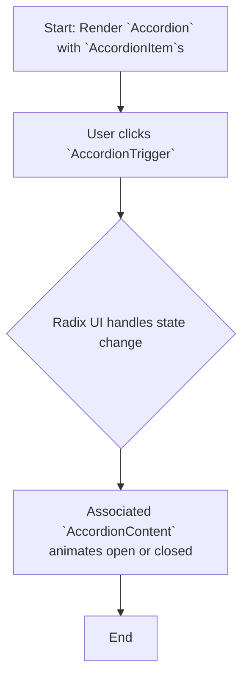

# Module: `accordion`

## 1. Module Summary

The `accordion` module provides a vertically stacking set of interactive headings that each reveal a section of related content. This component is a wrapper around the `Accordion` primitive from Radix UI, styled with Tailwind CSS to match the application's design system.

## 2. Module Dependencies

* **Internal Dependencies:**
    * `@/lib/utils`: For the `cn` utility function.
* **External Dependencies:**
    * `react`: For component creation and forwarding refs.
    * `@radix-ui/react-accordion`: The underlying headless component.
    * `lucide-react`: For the `ChevronDown` icon.

## 3. Public API / Exports

* `Accordion`: The root container for the accordion component.
* `AccordionItem`: A wrapper for each individual item within the accordion.
* `AccordionTrigger`: The button that toggles the display of an `AccordionContent` section.
* `AccordionContent`: The container for the content that is revealed when an `AccordionItem` is opened.

## 4. Code File Breakdown

### 4.1. `accordion.tsx`

* **Purpose:** This file exports the four styled components that make up the accordion, built upon the Radix UI `Accordion` primitive.
* **Functions:**
    * `Accordion`: The main `AccordionPrimitive.Root` component.
    * `AccordionItem`: A `React.forwardRef` component that wraps `AccordionPrimitive.Item`.
    * `AccordionTrigger`: A `React.forwardRef` component that wraps `AccordionPrimitive.Trigger` and includes a `ChevronDown` icon.
    * `AccordionContent`: A `React.forwardRef` component that wraps `AccordionPrimitive.Content` and provides the animation for opening and closing.

## 5. System and Data Flow

### 5.1. System Flowchart (Control Flow)



### 5.2. Data Flow Diagram (Data Transformation)

This component is primarily for UI presentation and does not perform complex data transformations. The data is the `children` props passed to the components.


## 6. Usage Example & Testing

* **Usage:**
  ```tsx
  import { Accordion, AccordionItem, AccordionTrigger, AccordionContent } from "@/components/ui/accordion";

  <Accordion type="single" collapsible>
    <AccordionItem value="item-1">
      <AccordionTrigger>Is it accessible?</AccordionTrigger>
      <AccordionContent>
        Yes. It adheres to the WAI-ARIA design pattern.
      </AccordionContent>
    </AccordionItem>
  </Accordion>
  ```
* **Testing:** As a presentational component wrapping a trusted library (Radix), testing would focus on ensuring that the custom styling is applied correctly and that it renders without errors. Snapshot testing would be appropriate here, with tests located in `tests/components/ui/accordion.test.tsx`.
