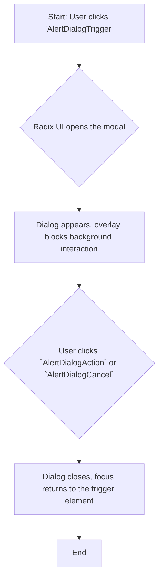
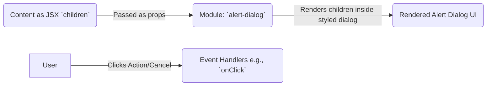

# Module: `alert-dialog`

## 1. Module Summary

The `alert-dialog` module provides a modal dialog that interrupts the user with important information, such as a confirmation request for a destructive action. It is built on top of the Radix UI `AlertDialog` primitive and styled with Tailwind CSS to ensure it blocks interaction with the rest of the application until a choice is made.

## 2. Module Dependencies

* **Internal Dependencies:**
    * `@/lib/utils`: For the `cn` utility function.
    * `@/components/ui/button`: For styling the action and cancel buttons.
* **External Dependencies:**
    * `react`: For component creation and forwarding refs.
    * `@radix-ui/react-alert-dialog`: The underlying headless component.

## 3. Public API / Exports

* `AlertDialog`: The root container for the alert dialog.
* `AlertDialogTrigger`: The element that opens the dialog.
* `AlertDialogContent`: The main content of the dialog, which appears in a portal.
* `AlertDialogHeader`: A container for the dialog's title and description.
* `AlertDialogFooter`: A container for the dialog's action and cancel buttons.
* `AlertDialogTitle`: The title of the dialog.
* `AlertDialogDescription`: The description or message within the dialog.
* `AlertDialogAction`: The button that performs the primary action (e.g., "Continue").
* `AlertDialogCancel`: The button that cancels the action and closes the dialog.

## 4. Code File Breakdown

### 4.1. `alert-dialog.tsx`

* **Purpose:** This file exports the set of styled components that constitute the alert dialog, built upon the Radix UI `AlertDialog` primitive.
* **Functions:** This file is composed of multiple `React.forwardRef` components, each wrapping a corresponding part of the `AlertDialogPrimitive` (e.g., `AlertDialog`, `AlertDialogTrigger`, `AlertDialogContent`, etc.) and applying custom styles.

## 5. System and Data Flow

### 5.1. System Flowchart (Control Flow)



### 5.2. Data Flow Diagram (Data Transformation)

This component is for UI presentation and user confirmation; it does not transform data. It primarily receives `children` and event handlers (like `onClick`) as props.



## 6. Usage Example & Testing

* **Usage:**
  ```tsx
  import {
    AlertDialog,
    AlertDialogAction,
    AlertDialogCancel,
    AlertDialogContent,
    AlertDialogDescription,
    AlertDialogFooter,
    AlertDialogHeader,
    AlertDialogTitle,
    AlertDialogTrigger,
  } from "@/components/ui/alert-dialog"

  <AlertDialog>
    <AlertDialogTrigger>Show Dialog</AlertDialogTrigger>
    <AlertDialogContent>
      <AlertDialogHeader>
        <AlertDialogTitle>Are you sure?</AlertDialogTitle>
        <AlertDialogDescription>
          This action cannot be undone.
        </AlertDialogDescription>
      </AlertDialogHeader>
      <AlertDialogFooter>
        <AlertDialogCancel>Cancel</AlertDialogCancel>
        <AlertDialogAction>Continue</AlertDialogAction>
      </AlertDialogFooter>
    </AlertDialogContent>
  </AlertDialog>
  ```
* **Testing:** Testing would focus on ensuring the dialog opens and closes correctly and that the `onCancel` and `onAction` handlers are called when the respective buttons are clicked. This would be done with interaction tests in `tests/components/ui/alert-dialog.test.tsx`.
