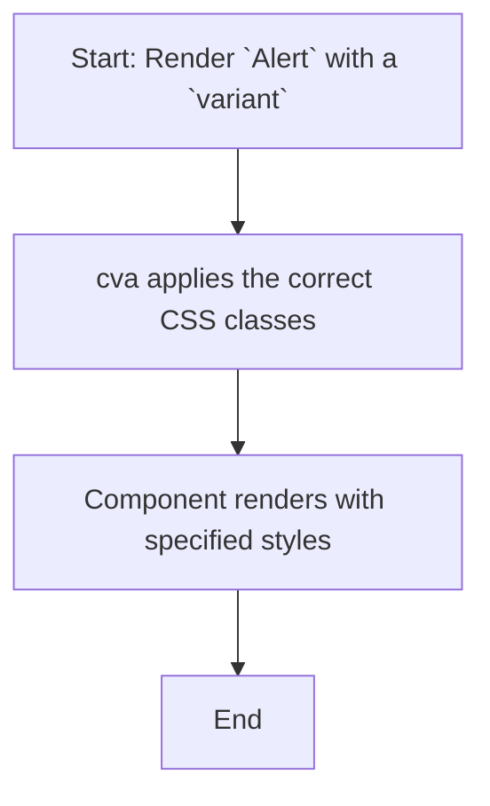

# Module: `alert`

## 1. Module Summary

The `alert` module provides a styled alert component to display important messages to the user. It supports different variants, such as a default style and a "destructive" style for error messages, and is designed to be used with an icon, a title, and a description.

## 2. Module Dependencies

* **Internal Dependencies:**
    * `@/lib/utils`: For the `cn` utility function.
* **External Dependencies:**
    * `react`: For component creation and forwarding refs.
    * `class-variance-authority`: For creating variants of the alert component.

## 3. Public API / Exports

* `Alert`: The main container for the alert message.
* `AlertTitle`: A component for the title of the alert.
* `AlertDescription`: A component for the body content of the alert.

## 4. Code File Breakdown

### 4.1. `alert.tsx`

* **Purpose:** This file defines and exports the `Alert`, `AlertTitle`, and `AlertDescription` components.
* **Functions:**
    * `Alert`: A `React.forwardRef` component that renders a `div` with alert styles, determined by `class-variance-authority`.
    * `AlertTitle`: A `React.forwardRef` component that renders an `h5` element for the alert title.
    * `AlertDescription`: A `React.forwardRef` component that renders a `div` for the alert's main content.
* **Key Classes / Constants / Variables:**
    * `alertVariants`: A `cva` object that defines the different style variants for the `Alert` component (`default` and `destructive`).

## 5. System and Data Flow

### 5.1. System Flowchart (Control Flow)

This is a presentational component, so its control flow is minimal.



### 5.2. Data Flow Diagram (Data Transformation)

This component does not transform data; it only displays the content passed to it as `children`.


## 6. Usage Example & Testing

* **Usage:**
  ```tsx
  import { Alert, AlertDescription, AlertTitle } from "@/components/ui/alert"
  import { AlertCircle } from "lucide-react"

  <Alert variant="destructive">
    <AlertCircle className="h-4 w-4" />
    <AlertTitle>Error</AlertTitle>
    <AlertDescription>
      Your session has expired. Please log in again.
    </AlertDescription>
  </Alert>
  ```
* **Testing:** Testing for this component would involve snapshot tests to ensure the correct classes are applied for each variant. These tests would be located in `tests/components/ui/alert.test.tsx`.
