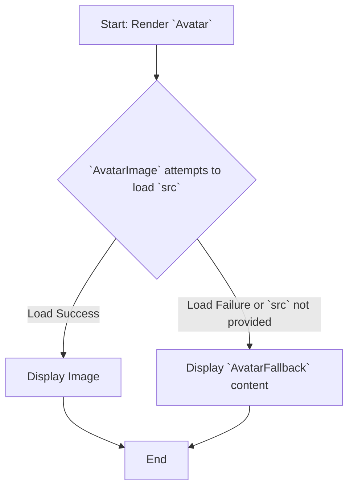
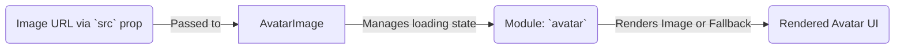

# Module: `avatar`

## 1. Module Summary

The `avatar` module provides components to display a user's avatar image. It gracefully handles the loading of the image and provides a fallback (e.g., with the user's initials) if the image fails to load or is not available.

## 2. Module Dependencies

* **Internal Dependencies:**
    * `@/lib/utils`: For the `cn` utility function.
* **External Dependencies:**
    * `react`: For component creation and forwarding refs.
    * `@radix-ui/react-avatar`: The underlying headless component for handling the image loading and fallback logic.

## 3. Public API / Exports

* `Avatar`: The root container for the avatar.
* `AvatarImage`: The component that displays the image.
* `AvatarFallback`: The component that is displayed as a fallback until the image loads or if the image fails to load.

## 4. Code File Breakdown

### 4.1. `avatar.tsx`

* **Purpose:** This file exports the styled components for displaying an avatar, built upon the Radix UI `Avatar` primitive.
* **Functions:**
    * `Avatar`: A `React.forwardRef` component wrapping `AvatarPrimitive.Root`.
    * `AvatarImage`: A `React.forwardRef` component wrapping `AvatarPrimitive.Image`.
    * `AvatarFallback`: A `React.forwardRef` component wrapping `AvatarPrimitive.Fallback`.

## 5. System and Data Flow

### 5.1. System Flowchart (Control Flow)



### 5.2. Data Flow Diagram (Data Transformation)

This component primarily deals with component state (image loading) rather than data transformation.



## 6. Usage Example & Testing

* **Usage:**
  ```tsx
  import { Avatar, AvatarFallback, AvatarImage } from "@/components/ui/avatar"

  <Avatar>
    <AvatarImage src="https://github.com/shadcn.png" />
    <AvatarFallback>CN</AvatarFallback>
  </Avatar>
  ```
* **Testing:** Testing for this component in `tests/components/ui/avatar.test.tsx` would involve checking that the `AvatarImage` is rendered when a valid source is provided and that the `AvatarFallback` is rendered when the image source is invalid or during the loading state.
