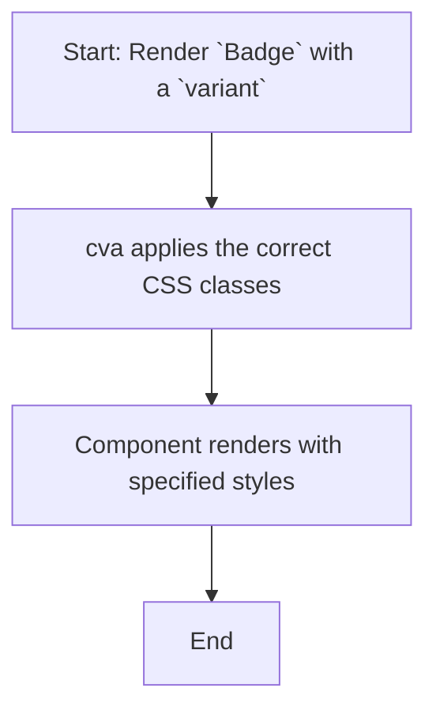

# Module: `badge`

## 1. Module Summary

The `badge` module provides a simple, styled badge component used for displaying statuses, counts, or labels. It comes with several visual variants (`default`, `secondary`, `destructive`, `outline`) to suit different semantic purposes.

## 2. Module Dependencies

* **Internal Dependencies:**
    * `@/lib/utils`: For the `cn` utility function.
* **External Dependencies:**
    * `react`: For component creation.
    * `class-variance-authority`: For creating the different style variants of the badge.

## 3. Public API / Exports

* `Badge(props: BadgeProps)`: The main component that renders the badge.
* `badgeVariants`: The `cva` object that defines the style variants, which can be used to apply badge styles to other components.
* `BadgeProps`: The interface for the component's props.

## 4. Code File Breakdown

### 4.1. `badge.tsx`

* **Purpose:** This file defines and exports the `Badge` component and its style variants.
* **Functions:**
    * `Badge(props: BadgeProps): JSX.Element`: A functional component that renders a `div` with the appropriate badge styles based on the `variant` prop.
* **Key Classes / Constants / Variables:**
    * `badgeVariants`: A `cva` object that defines the CSS classes for each badge variant.

## 5. System and Data Flow

### 5.1. System Flowchart (Control Flow)

This is a presentational component.



### 5.2. Data Flow Diagram (Data Transformation)

This component only displays the `children` passed to it.


## 6. Usage Example & Testing

* **Usage:**
  ```tsx
  import { Badge } from "@/components/ui/badge";

  <Badge variant="destructive">Urgent</Badge>
  ```
* **Testing:** Snapshot testing in `tests/components/ui/badge.test.tsx` would be used to verify that the correct styles are applied for each variant of the badge.
