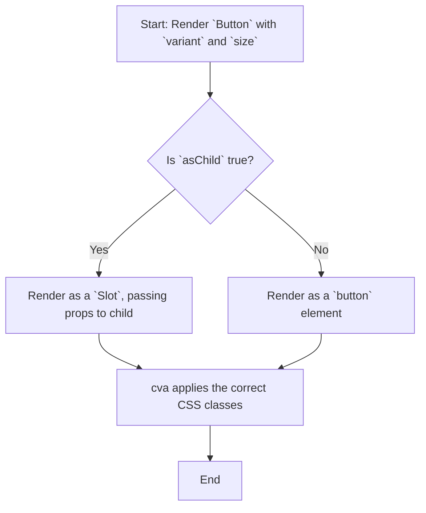
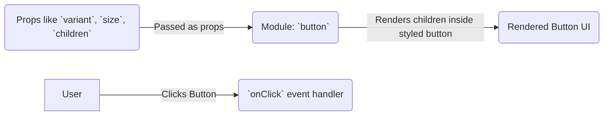

# Module: `button`

## 1. Module Summary

The `button` module provides a highly reusable and stylable button component. It includes multiple variants for different visual treatments (e.g., `default`, `destructive`, `outline`) and sizes (`sm`, `default`, `lg`, `icon`). The component can also be rendered as a different element (like a link) using the `asChild` prop.

## 2. Module Dependencies

* **Internal Dependencies:**
    * `@/lib/utils`: For the `cn` utility function.
* **External Dependencies:**
    * `react`: For component creation and forwarding refs.
    * `@radix-ui/react-slot`: To allow the button to wrap a child component.
    * `class-variance-authority`: For creating the different style and size variants.

## 3. Public API / Exports

* `Button(props: ButtonProps)`: The main component that renders the button.
* `buttonVariants`: The `cva` object that defines the style and size variants, which can be used to apply button styles to other components.
* `ButtonProps`: The interface for the component's props.

## 4. Code File Breakdown

### 4.1. `button.tsx`

* **Purpose:** This file defines and exports the `Button` component and its style variants.
* **Functions:**
    * `Button(props: ButtonProps): JSX.Element`: A `React.forwardRef` component that renders either a standard `button` element or a `Slot` if `asChild` is true. It applies the correct styles based on the `variant` and `size` props.
* **Key Classes / Constants / Variables:**
    * `buttonVariants`: A `cva` object that defines the CSS classes for all combinations of button variants and sizes.

## 5. System and Data Flow

### 5.1. System Flowchart (Control Flow)

This is a presentational component.



### 5.2. Data Flow Diagram (Data Transformation)

This component does not transform data; it primarily responds to user interaction events like `onClick`.



## 6. Usage Example & Testing

* **Usage:**
  ```tsx
  import { Button } from "@/components/ui/button";

  <Button variant="destructive" size="lg">Delete</Button>
  ```
* **Testing:** Testing in `tests/components/ui/button.test.tsx` would involve rendering the button with different variants and sizes to ensure the correct classes are applied (snapshot testing). It would also include interaction tests to verify that the `onClick` handler is called when the button is clicked.
