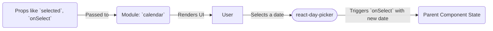

# Module: `calendar`

## 1. Module Summary

The `calendar` module provides a styled, interactive calendar component for date selection. It is a wrapper around the popular `react-day-picker` library, customized with Tailwind CSS to integrate seamlessly with the application's design system, including styles for selected days, ranges, and navigation.

## 2. Module Dependencies

* **Internal Dependencies:**
    * `@/lib/utils`: For the `cn` utility function.
    * `@/components/ui/button`: For styling the navigation buttons.
* **External Dependencies:**
    * `react`: For component creation.
    * `lucide-react`: For the `ChevronLeft` and `ChevronRight` icons.
    * `react-day-picker`: The underlying library that provides the calendar functionality.

## 3. Public API / Exports

* `Calendar(props: CalendarProps)`: The main component that renders the calendar.
* `CalendarProps`: The type definition for the component's props, which extends the props of `react-day-picker`.

## 4. Code File Breakdown

### 4.1. `calendar.tsx`

* **Purpose:** This file exports a styled `Calendar` component based on `react-day-picker`.
* **Functions:**
    * `Calendar(props: CalendarProps): JSX.Element`: A functional component that renders the `DayPicker` component with a large set of custom `classNames` to apply the application's theme. It also replaces the default navigation icons with `lucide-react` icons.

## 5. System and Data Flow

### 5.1. System Flowchart (Control Flow)

This component's logic is largely handled by the `react-day-picker` library.

```mermaid
flowchart TD
    A[Start: Render `Calendar`] --> B[User interacts with the calendar (e.g., clicks a date, navigates months)];
    B --> C{`react-day-picker` handles the state update};
    C --> D[The `onSelect` callback is triggered with the new date];
    D --> E[Component re-renders with the new date selected];
    E --> F[End];
```

### 5.2. Data Flow Diagram (Data Transformation)

This component's primary data is the selected date or date range.



## 6. Usage Example & Testing

* **Usage:**
  ```tsx
  import { Calendar } from "@/components/ui/calendar";
  import { useState } from "react";

  const [date, setDate] = useState<Date | undefined>(new Date());

  <Calendar
    mode="single"
    selected={date}
    onSelect={setDate}
    className="rounded-md border"
  />
  ```
* **Testing:** Testing for this component in `tests/components/ui/calendar.test.tsx` would involve verifying that it renders without crashing and that the `onSelect` callback is fired when a date is clicked. Given that it's a wrapper around a third-party library, testing the internal logic of date selection is not necessary.
