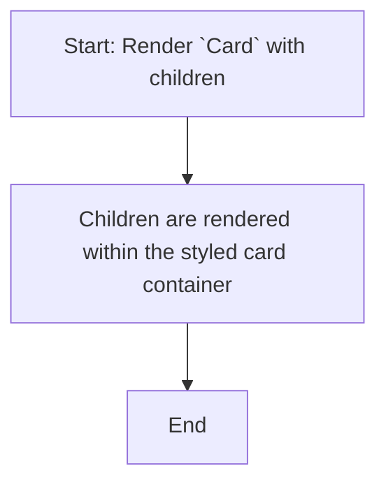
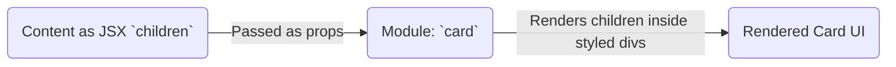

# Module: `card`

## 1. Module Summary

The `card` module provides a set of components to build a styled card element. It is a fundamental layout component used to group related information in a visually distinct container with a header, title, description, content, and footer.

## 2. Module Dependencies

* **Internal Dependencies:**
    * `@/lib/utils`: For the `cn` utility function.
* **External Dependencies:**
    * `react`: For component creation and forwarding refs.

## 3. Public API / Exports

* `Card`: The main container for the card.
* `CardHeader`: A container for the card's header section.
* `CardTitle`: A component for the title of the card.
* `CardDescription`: A component for the description or subtitle of the card.
* `CardContent`: A container for the main content of the card.
* `CardFooter`: A container for the card's footer section.

## 4. Code File Breakdown

### 4.1. `card.tsx`

* **Purpose:** This file exports the set of styled `div` components that make up a card.
* **Functions:** This file is composed of several `React.forwardRef` components (`Card`, `CardHeader`, `CardTitle`, etc.), each rendering a `div` with specific Tailwind CSS classes to create the card structure and style.

## 5. System and Data Flow

### 5.1. System Flowchart (Control Flow)

This is a presentational component.



### 5.2. Data Flow Diagram (Data Transformation)

This component does not transform data; it is a layout tool for displaying the `children` passed to it.



## 6. Usage Example & Testing

* **Usage:**
  ```tsx
  import {
    Card,
    CardContent,
    CardDescription,
    CardFooter,
    CardHeader,
    CardTitle,
  } from "@/components/ui/card"

  <Card>
    <CardHeader>
      <CardTitle>Card Title</CardTitle>
      <CardDescription>Card Description</CardDescription>
    </CardHeader>
    <CardContent>
      <p>Card Content</p>
    </CardContent>
    <CardFooter>
      <p>Card Footer</p>
    </CardFooter>
  </Card>
  ```
* **Testing:** As a pure presentational component, testing in `tests/components/ui/card.test.tsx` would involve snapshot tests to ensure the structure and classes are rendered correctly.
