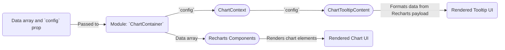

# Module: `chart`

## 1. Module Summary

The `chart` module provides a powerful and flexible charting library built on top of `Recharts`. It offers a set of components to easily create responsive, themed charts with custom tooltips and legends, all while integrating smoothly with the application's design system and color scheme (including dark mode).

## 2. Module Dependencies

* **Internal Dependencies:**
    * `@/lib/utils`: For the `cn` utility function.
* **External Dependencies:**
    * `react`: For component creation, context, and hooks.
    * `recharts`: The underlying charting library.

## 3. Public API / Exports

* `ChartContainer`: The main wrapper that provides context and styling for the chart.
* `ChartTooltip`: The `Tooltip` component from `Recharts`.
* `ChartTooltipContent`: A highly customizable tooltip content component.
* `ChartLegend`: The `Legend` component from `Recharts`.
* `ChartLegendContent`: A customizable legend content component.
* `ChartStyle`: An internal component that injects dynamic CSS for theming.
* `ChartConfig`: The type definition for the chart's configuration object.

## 4. Code File Breakdown

### 4.1. `chart.tsx`

* **Purpose:** This file exports a suite of components for building charts with `Recharts`, providing a consistent styling and theming layer.
* **Functions:**
    * `useChart()`: A custom hook to access the chart configuration from the `ChartContext`.
    * `ChartContainer`: The main component that sets up the chart context and responsive container.
    * `ChartStyle`: A component that dynamically generates and injects a `<style>` tag to apply theme colors to the chart via CSS variables.
    * `ChartTooltipContent`: A component that renders the content inside a tooltip, with options for custom formatting, labels, and indicators.
    * `ChartLegendContent`: A component that renders the content of the chart legend, allowing for custom icons and labels.
    * `getPayloadConfigFromPayload(...)`: A helper function to retrieve the correct configuration for a data item from the chart's config object.
* **Key Classes / Constants / Variables:**
    * `ChartConfig`: The type for the configuration object that defines labels, icons, and colors for different data keys in the chart.
    * `ChartContext`: A React context to provide the `ChartConfig` to all child components.

## 5. System and Data Flow

### 5.1. System Flowchart (Control Flow)

```mermaid
flowchart TD
    A[Start: Render `ChartContainer` with `config`] --> B[Provide `config` to `ChartContext`];
    B --> C[Render `ChartStyle` to inject CSS variables];
    C --> D[Render `ResponsiveContainer` from Recharts];
    D --> E[Recharts renders the chart (e.g., BarChart, LineChart)];
    E -- Hover over chart --> F[Render `ChartTooltip` with `ChartTooltipContent`];
    F --> G[End];
```

### 5.2. Data Flow Diagram (Data Transformation)



## 6. Usage Example & Testing

* **Usage:**
  ```tsx
  import { Bar, BarChart, CartesianGrid, XAxis } from "recharts"
  import {
    ChartContainer,
    ChartTooltip,
    ChartTooltipContent,
  } from "@/components/ui/chart"

  const chartData = [ ... ];
  const chartConfig = { ... };

  <ChartContainer config={chartConfig} className="min-h-[200px] w-full">
    <BarChart accessibilityLayer data={chartData}>
      <CartesianGrid vertical={false} />
      <XAxis dataKey="month" />
      <ChartTooltip content={<ChartTooltipContent />} />
      <Bar dataKey="desktop" fill="var(--color-desktop)" radius={4} />
    </BarChart>
  </ChartContainer>
  ```
* **Testing:** Testing for this component in `tests/components/ui/chart.test.tsx` would be complex. It would likely focus on ensuring the `ChartContainer` provides the context correctly and that the `ChartTooltipContent` and `ChartLegendContent` render correctly given a sample payload and configuration. Snapshot tests of the rendered HTML and the generated CSS from `ChartStyle` would be valuable.
